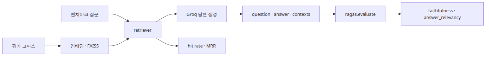
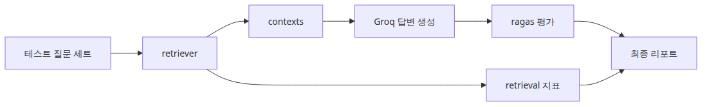
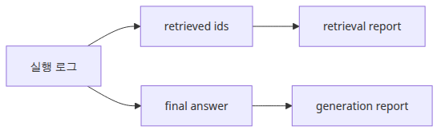
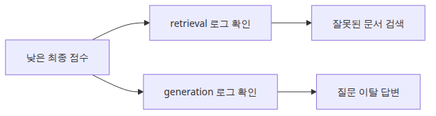
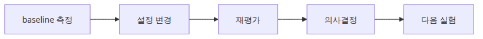

# RAG 벤치마크 완성

## 이 글에서 답할 질문



- 데이터셋 → 검색 → 생성 → 평가를 어떻게 **하나의 실행 파일**로 묶을까요?
- retrieval 지표와 RAGAS 점수를 한 리포트로 합칠 때 어떤 구분이 필요한가요?
- 최종 파이프라인 벤치마크에서 가장 먼저 고정해야 할 실험 조건은 무엇인가요?
- 벤치마크 결과를 CI에 어떻게 붙여 회귀를 막을 수 있나요?

> 완성된 RAG 벤치마크는 **하나의 점수가 아닙니다**. retrieval과 generation을 나눠서 같은 실험 조건 아래 반복 실행하는 **재현 가능한 파이프라인**입니다.

## 왜 중요한가

지금까지 만든 도구를 흩어진 채로 두면 의사결정에 도움이 되지 않습니다. 매번 사람이 손으로 돌리는 측정은 결국 안 돌리게 됩니다. 그러면 RAG 시스템의 품질은 다시 "최근 답변 인상"에 의존합니다.

벤치마크를 한 실행 파일로 묶고 결과를 표준화된 리포트로 출력하면 다음이 가능해집니다.

- **PR 회귀 감지**: 변경 전/후 점수를 자동 비교
- **모델/인프라 의사결정**: 임베딩, vector DB, LLM 후보를 동일 조건에서 비교
- **운영 모니터링**: 야간 작업으로 점수 추이를 그래프화
- **재현성**: 6개월 뒤에도 같은 명령으로 같은 결과를 얻을 수 있음

이 글에서 만들 파이프라인은 작지만, 위 네 가지를 모두 떠받치는 골격입니다.

## Mental Model

완성된 벤치마크는 단일 함수입니다.

```
run_benchmark(config) ──►  report
   │
   ├─ Phase 1: build retriever (corpus + embedding + index)
   ├─ Phase 2: run queries → collect (ranked_ids, latency, contexts)
   ├─ Phase 3: generate answers via LLM
   ├─ Phase 4: compute retrieval metrics (hit, MRR, latency)
   ├─ Phase 5: compute generation metrics (faithfulness, answer_relevancy)
   └─ Phase 6: emit report (JSON + per-question log)
```

`config`에 모든 변수(임베딩 모델, top-k, LLM 모델, dataset 경로)를 명시합니다. 같은 config면 같은 결과가 나와야 합니다.

## 핵심 개념

| 항목 | 의미 |
| --- | --- |
| Run config | 한 번의 벤치마크 실행에 필요한 모든 파라미터 (dict 또는 YAML) |
| Run id | 실행을 식별하는 unique id (timestamp + git sha) |
| Report | 두 부분으로 구성: aggregate metrics + per-question log |
| Baseline | 비교 기준이 되는 이전 run (대개 main 브랜치 최근 run) |
| Regression | baseline 대비 지표가 임계치 이상 떨어진 상황 |

리포트를 두 부분(요약 + 상세 로그)으로 분리하는 것이 중요합니다. 요약만 있으면 디버깅이 안 되고, 상세만 있으면 빠른 비교가 안 됩니다.

## Before vs. After

**Before**: PR 작성자가 수동으로 노트북을 열어 hit rate를 체크합니다. 어떤 PR은 체크하고 어떤 PR은 잊습니다. 한 달 뒤 품질이 떨어졌다는 사실을 발견하지만, 어느 PR이 원인인지 알 수 없습니다.

**After**: 모든 PR이 `python3 run_benchmark.py --config configs/ci.yaml`을 자동 실행하고, baseline과 비교한 한 줄 리포트를 코멘트로 남깁니다.

```
                  baseline  this PR  delta
hit_rate@3        0.94      0.96    +0.02 ✓
MRR               0.78      0.81    +0.03 ✓
faithfulness      0.91      0.84    -0.07 ✗
answer_relevancy  0.85      0.86    +0.01 ✓
avg_latency_ms    62.1      63.4    +1.3
```

faithfulness가 0.07 떨어졌으면 자동으로 차단됩니다. 사람이 잊을 수 없습니다.

## 단계별 실습

### 1단계 — Run config 정의

```python
# configs/ci.yaml
corpus_path: "data/corpus.jsonl"
gold_set_path: "data/gold.jsonl"
embedding_model: "sentence-transformers/all-MiniLM-L6-v2"
index_type: "IndexFlatIP"
top_k: 3
llm_model: "llama-3.1-8b-instant"
ragas_metrics: ["faithfulness", "answer_relevancy"]
```

### 2단계 — 통합 함수 작성



실행 코드는 `rag-benchmark-101/ko/06-benchmark-complete/main.py`에 있습니다. `GROQ_API_KEY`가 필요합니다.

```bash
cd /root/Github/rag-benchmark-101/ko/06-benchmark-complete
export GROQ_API_KEY=...
python3 main.py
```

```python
def run_benchmark(config):
    retriever = build_retriever(config)
    rows, retrieval_metrics = [], []

    for case in load_gold_set(config["gold_set_path"]):
        t0 = time.perf_counter()
        docs = retriever.invoke(case["question"])
        latency_ms = (time.perf_counter() - t0) * 1000

        ranked = [d.metadata["id"] for d in docs]
        contexts = [d.page_content for d in docs]
        retrieval_metrics.append({
            "hit": hit_rate(ranked, case["gold"]),
            "rr": reciprocal_rank(ranked, case["gold"]),
            "latency_ms": latency_ms,
        })

        answer = generate_answer(case["question"], contexts, config)
        rows.append({
            "question": case["question"],
            "contexts": contexts,
            "answer": answer,
            "ranked_ids": ranked,
        })

    ragas_scores = run_ragas(rows, config)
    return assemble_report(retrieval_metrics, ragas_scores, rows, config)
```

### 3단계 — 리포트 분리



```python
def assemble_report(retrieval_metrics, ragas_scores, rows, config):
    return {
        "run_id": f"{datetime.utcnow():%Y%m%dT%H%M%S}-{git_sha()[:7]}",
        "config": config,
        "retrieval": {
            "hit_rate@k": mean([m["hit"] for m in retrieval_metrics]),
            "MRR": mean([m["rr"] for m in retrieval_metrics]),
            "avg_latency_ms": mean([m["latency_ms"] for m in retrieval_metrics]),
            "p95_latency_ms": percentile([m["latency_ms"] for m in retrieval_metrics], 95),
        },
        "generation": {
            "faithfulness": ragas_scores["faithfulness"],
            "answer_relevancy": ragas_scores["answer_relevancy"],
        },
        "per_question": rows,
    }
```

### 4단계 — Baseline 비교

```python
def compare(report, baseline):
    deltas = {}
    for layer in ["retrieval", "generation"]:
        for k, v in report[layer].items():
            base = baseline[layer].get(k)
            if isinstance(v, (int, float)) and isinstance(base, (int, float)):
                deltas[f"{layer}.{k}"] = v - base
    return deltas
```

### 5단계 — CI 게이트



```python
THRESHOLDS = {
    "retrieval.hit_rate@k": -0.02,
    "generation.faithfulness": -0.03,
}

def gate(deltas):
    failed = [k for k, t in THRESHOLDS.items() if deltas.get(k, 0) < t]
    if failed:
        sys.exit(f"Regression in: {failed}")
```

## 자주 하는 실수

- **단일 점수로 통합** — 가중 평균 하나만 보면 어느 레이어가 떨어졌는지 알 수 없습니다. retrieval과 generation을 분리해 유지합니다.
- **per-question 로그 미저장** — 점수만 남기면 "왜 떨어졌는가"를 추적할 수 없습니다. 항상 질문별 로그를 함께 저장합니다.
- **Baseline 자동 갱신** — main에 머지될 때마다 baseline을 자동 갱신하면, 점진적 회귀가 누적됩니다. 명시적으로 release 시점에만 갱신합니다.
- **고정되지 않은 config** — temperature, seed, top-k가 노트북마다 다르면 결과 비교가 무의미합니다. config 파일에 모든 변수를 적습니다.
- **외부 LLM에 의존하면서 retry/timeout 무시** — Groq, OpenAI는 가끔 502/timeout이 납니다. retry 로직과 caching이 없으면 CI가 flaky해집니다.

## 실무 적용



- **Run id에 git sha 포함**: 결과와 코드 버전을 1:1로 묶을 수 있습니다.
- **Cost tracking**: LLM 토큰 사용량과 추정 USD 비용도 리포트에 함께 기록합니다.
- **Parallel runs**: dataset이 커지면 chunk로 나눠 병렬 실행하고 결과를 합칩니다. RAGAS의 `max_workers`와 별도로 외부 병렬화가 더 안전합니다.
- **Caching**: 같은 (question, context) 쌍은 답변을 재사용합니다. CI 비용이 크게 줄어듭니다.
- **Dashboard**: 결과 JSON을 시계열 DB(예: PostgreSQL + Grafana)에 적재해 30/60/90일 추세를 봅니다.
- **Threshold 튜닝**: 처음에는 경고로 시작해 1~2주 안정화 후 차단으로 승격합니다.

## 체크리스트

- [ ] retrieval(검색)과 generation(생성)을 같은 실행에서 측정한다.
- [ ] 두 레이어의 점수를 분리된 key로 저장한다.
- [ ] Run config에 임베딩 모델, top-k, LLM 모델, dataset 경로를 모두 명시한다.
- [ ] Run id에 timestamp + git sha를 포함한다.
- [ ] aggregate report와 per-question log를 함께 저장한다.
- [ ] CI에서 baseline과 비교해 임계치 위반 시 차단한다.
- [ ] retry와 timeout이 LLM 호출에 적용되어 있다.

## 연습 문제

1. 위 함수를 확장해 두 가지 임베딩 모델, 두 가지 LLM의 4개 조합을 한 실행으로 비교하도록 만들어 보세요.
2. Run id에 git sha를 포함시키고, 같은 sha로 두 번 돌렸을 때 결과가 동일한지 확인해 보세요. 동일하지 않다면 어떤 비결정성(non-determinism)이 남아 있는 걸까요?
3. CI threshold를 데이터셋 크기와 연동해 동적으로 계산해 보세요(예: 표본 50개면 ±0.05 허용, 500개면 ±0.02 허용).

## 정리 · 시리즈 마무리

이 시리즈에서 6개의 글을 거치며 다음을 만들었습니다.

| 글 | 도구 |
| --- | --- |
| 1 | hit rate / MRR / nDCG의 손계산 직관 |
| 2 | 단일 retriever 위에서 retrieval 측정 루프 |
| 3 | 임베딩 모델 비교 함수 (one-variable-at-a-time) |
| 4 | flat vs IVF 비교 + recall/latency trade-off |
| 5 | RAGAS로 faithfulness / answer_relevancy 측정 |
| 6 | 검색·생성·평가를 묶은 통합 벤치마크 + CI 게이트 |

핵심 정신은 **하나로 통합된 숫자가 아니라, 같은 실험 조건 아래 반복 가능한 측정**입니다. RAG 시스템에서 점수가 흔들릴 때 어느 레이어를 손봐야 할지 망설이지 않게 되는 것이 이 시리즈의 목표였습니다.

다음 단계로는 longer corpus(10만+), hybrid retriever(BM25 + 벡터), reranker, multi-turn conversation 평가가 자연스러운 확장 주제입니다.

<!-- toc:begin -->
## 시리즈 목차

- [RAG 평가 지표 이해](./01-evaluation-metrics.md)
- [검색 성능 측정](./02-retrieval-benchmarking.md)
- [임베딩 모델 비교](./03-embedding-comparison.md)
- [VectorDB 선택 기준](./04-vectordb-selection.md)
- [종단 간 RAG 파이프라인 평가](./05-e2e-evaluation.md)
- **RAG 벤치마크 완성 (현재 글)**

<!-- toc:end -->

---

## 참고 자료

- [RAGAS documentation](https://docs.ragas.io/)
- [LangChain retrieval overview](https://python.langchain.com/docs/concepts/retrieval/)
- [FAISS documentation](https://faiss.ai/)
- [GitHub Actions](https://docs.github.com/en/actions)

Tags: RAG, VectorDB, Benchmarking, LLM
