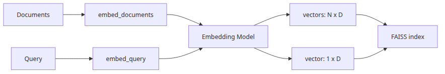
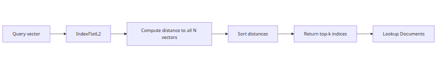
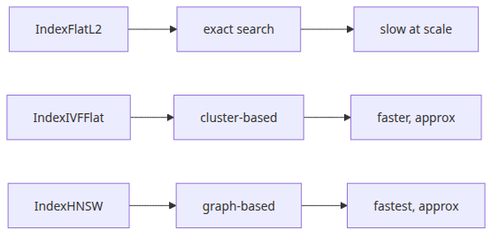
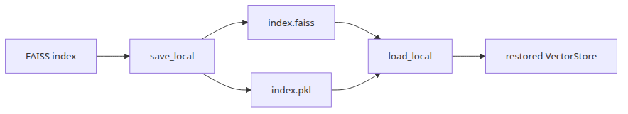

# Embeddings and the Vector Index — Inside FAISS IndexFlatL2

<!-- a-grade-intro:begin -->
## Questions this post answers

- Why should `embed_documents()` and `embed_query()` stay conceptually separate?
- What distance does `IndexFlatL2` actually compute?
- Where does the system map vector ids back to source documents?
- When is exact flat search still the right baseline?

> Embeddings turn chunks into coordinates, and the vector index turns coordinate distance into retrieval rank.


<!-- a-grade-intro:end -->

> RAG Deep Dive series (2/6)

<!-- a-grade-example:begin -->
## Minimal runnable example

Example file: `/root/Github/rag-deep-dive/en/02-embeddings-and-vector-index/main.py`

```bash
export GROQ_API_KEY=... && python main.py
```

```python
import faiss
import numpy as np
from langchain_community.embeddings import HuggingFaceEmbeddings

DOCS = [
    "The worker retries a failed message three times before dead-lettering.",
    "The dead-letter queue keeps the original payload for later inspection.",
    "HTTP 429 means the caller exceeded the per-minute quota.",
    "Operators inspect the exception chain before replaying the message.",
]
QUERY = "Why did the system stop retrying the message?"

def main() -> None:
    embeddings = HuggingFaceEmbeddings(
        model_name="sentence-transformers/all-MiniLM-L6-v2"
    )
    doc_vectors = np.array(embeddings.embed_documents(DOCS), dtype="float32")
    query_vector = np.array([embeddings.embed_query(QUERY)], dtype="float32")

    index = faiss.IndexFlatL2(doc_vectors.shape[1])
    index.add(doc_vectors)

    distances, indices = index.search(query_vector, k=3)
    for rank, (doc_index, distance) in enumerate(
        zip(indices[0], distances[0]), start=1
    ):
        print(f"rank={rank} distance={float(distance):.4f}")
        print(DOCS[int(doc_index)])
        print("-" * 60)

if __name__ == "__main__":
    main()
```

~~~
Output
rank=1 distance=0.8672
Operators inspect the exception chain before replaying the message.
------------------------------------------------------------
rank=2 distance=0.8806
The worker retries a failed message three times before dead-lettering.
------------------------------------------------------------
rank=3 distance=1.2581
The dead-letter queue keeps the original payload for later inspection.
------------------------------------------------------------
~~~

### What to notice in this code

- The script embeds text with HuggingFace, converts it to `float32`, and feeds it directly into `IndexFlatL2`.
- FAISS knows vectors and integer row ids, not your original documents.
- Returned results are ranked by smaller L2 distance.

### Where engineers get confused

- Teams often say “cosine” while the implementation is actually L2 or inner product.
- Distance values are easy to misread if normalization assumptions are unstated.
- The index is a ranking rule, not neutral storage.

## Checklist

- [ ] I kept document and query embedding paths conceptually separate.
- [ ] I verified whether the backend returns distance or similarity.
- [ ] I understood how vector ids map back to source content.
- [ ] I established an exact-search baseline before tuning approximate search.
<!-- a-grade-example:end -->

## Source Version

LangChain code citations in this post are pinned to [`langchain-ai/langchain @ langchain==0.2.17`](https://github.com/langchain-ai/langchain/tree/langchain==0.2.17), and FAISS C++ code citations are pinned to [`facebookresearch/faiss @ c72ef8a`](https://github.com/facebookresearch/faiss/tree/c72ef8a).

Episode 1 argued that chunking is the first failure point in RAG. Episode 2 picks up exactly where that left off. The vector index is not a neutral store. It takes the chunk boundaries we created earlier and turns them into geometry. If a heading and its explanation were preserved in one chunk, they become one vector neighborhood. If an exception clause was split away from the rule it qualifies, that severed boundary is now frozen into the retrieval space. The index does not heal those cuts. It operationalizes them.

That is why embeddings and indexing have to be read together. A production retrieval path is not “embedding model first, then some database.” It is an embedding function, a distance metric, an index structure, and a mapping layer that turns integer search results back into LangChain `Document` objects. This post follows that full path in source. We will look at how `OpenAIEmbeddings` calls `embed_documents()` and `embed_query()`, what `FAISS IndexFlatL2` actually computes inside `IndexFlat::search()`, how `FAISS.from_documents()` wires vectors back to documents, when `IndexFlatIP` and `IndexIVFFlat` become the better fit, and why persistence in LangChain is also a trust-boundary problem.

---

## 1. How `OpenAIEmbeddings` works and why query/document paths are separate

In LangChain 0.2.17, the familiar `OpenAIEmbeddings` class lives in `langchain_community.embeddings.openai`. One source-level detail matters immediately: the class is already deprecated in favor of `langchain_openai.OpenAIEmbeddings`. It is still a useful baseline because a lot of existing tutorials and pipelines in this release line still follow this code path.



If you read the source closely, the implementation difference between `embed_documents()` and `embed_query()` is almost nonexistent. `embed_documents()` calls `_get_len_safe_embeddings(texts, engine=engine)`. `embed_query()` simply returns `self.embed_documents([text])[0]`. So in this pinned implementation, both flows converge on the same machinery.

That does **not** mean they are conceptually interchangeable. The interface is split on purpose because retrieval models do not always treat documents and queries the same way. In asymmetric retrieval setups, document embeddings are optimized to preserve broad evidence, while query embeddings are optimized to point sharply toward the relevant region of the space. Some providers implement that by routing to different projections, by injecting different instructions, or by using different tuning objectives for query and document representations. That is why LangChain keeps `embed_query()` and `embed_documents()` distinct even when a specific provider implementation happens to delegate one to the other.

This is the practical lesson: in 0.2.17 `OpenAIEmbeddings`, query and document embedding share the same code path, but you should not bake that assumption into your application architecture. If you later switch to a provider or model family with stronger query/document asymmetry, collapsing those two entry points will quietly distort retrieval quality.

The more interesting source function is `_get_len_safe_embeddings()`. That method tokenizes input text, splits any overlong text into pieces under `embedding_ctx_length`, embeds those pieces in batches, and then averages the partial embeddings with token-count weights. Finally, it L2-normalizes the result with `average / np.linalg.norm(average)`. So even before FAISS sees a vector, the LangChain wrapper has already made a representational choice: a long chunk is not stored as one raw model output, but as a weighted average of sub-embeddings collapsed back into one normalized vector.

At the API layer, the request shape is straightforward. `embed_with_retry()` calls `embeddings.client.create(**kwargs)`, and in the OpenAI v1 path `_invocation_params` carries only `model` plus any `model_kwargs`. Auth, timeout, and related transport settings are configured earlier on the `openai.OpenAI(...)` client object during environment validation rather than packed into this dict. In practice the call shape looks like this:

```python
from langchain_community.embeddings import HuggingFaceEmbeddings

def build_embeddings() -> HuggingFaceEmbeddings:
    return HuggingFaceEmbeddings(model_name="sentence-transformers/all-MiniLM-L6-v2")

def demo() -> None:
    embeddings = build_embeddings()

    doc_vectors = embeddings.embed_documents(
        [
            "The payment worker retries a failed task three times.",
            "The dead-letter queue stores the original payload for inspection.",
        ]
    )
    query_vector = embeddings.embed_query("Why did the worker dead-letter the message?")

    print(len(doc_vectors), len(doc_vectors[0]))
    print(len(query_vector))

if __name__ == "__main__":
    demo()
```

~~~
Output
2 384
384
~~~

The baseline for the rest of this post is simple. The embedding step is already shaping the geometry. Chunk boundaries matter, long inputs may be averaged, and the query/document split is semantically meaningful even when one concrete implementation collapses it.

---

## 2. What FAISS `IndexFlatL2` actually computes

`IndexFlatL2` is often described as the simplest FAISS index. That is true, but incomplete. What makes it simple is not just that it is brute-force. It is that it computes the exact L2 comparison against every stored vector and then picks the smallest `k` results. No pruning, no quantization, no approximation.



In `faiss/IndexFlat.cpp`, `IndexFlat::search()` is very direct. If `metric_type == METRIC_INNER_PRODUCT`, it calls `knn_inner_product(...)`. If `metric_type == METRIC_L2`, it calls `knn_L2sqr(...)`. That second call is the important part for `IndexFlatL2`: FAISS is comparing vectors by **squared** Euclidean distance.

For a query vector `q` and a stored vector `x`, the score is:

`||q - x||^2 = Σ_i (q_i - x_i)^2`

Lower is better. Because the index examines all stored vectors, the result is exact nearest-neighbor retrieval. That exactness is valuable. It gives you a clean baseline when you are trying to separate embedding quality problems from approximate-index problems.

The cost is the classic one: `O(n·d)` per query, where `n` is the number of stored vectors and `d` is the embedding dimension. If you have 100,000 chunks and 1,536-dimensional embeddings, that can still be perfectly practical, especially for offline evaluation or internal knowledge bases with moderate query volume. If you have millions of vectors and latency-sensitive online traffic, the same property becomes expensive fast because every query still touches the full corpus.

This is also where metric semantics matter. Many teams say they are using cosine similarity while the actual implementation is either `IndexFlatIP` on normalized vectors or `IndexFlatL2` on normalized vectors. Those are not identical formulas, but after normalization they can induce closely related rankings. The point is not that one is universally right. The point is that the index is not “just storage.” It is the ranking rule.

This small example shows the mechanical behavior.

```python
import numpy as np
import faiss

def main() -> None:
    dim = 4
    xb = np.array(
        [
            [0.1, 0.0, 0.0, 0.0],
            [0.0, 0.2, 0.0, 0.0],
            [0.0, 0.0, 0.3, 0.0],
            [0.9, 0.9, 0.9, 0.9],
        ],
        dtype="float32",
    )
    xq = np.array([[0.05, 0.0, 0.0, 0.0]], dtype="float32")

    index = faiss.IndexFlatL2(dim)
    index.add(xb)

    distances, labels = index.search(xq, k=2)
    print("distances:", distances.tolist())
    print("labels:", labels.tolist())

if __name__ == "__main__":
    main()
```

~~~
Output
distances: [[0.002500000176951289, 0.042500004172325134]]
labels: [[0, 1]]
~~~

Use `IndexFlatL2` when you want exactness and a trustworthy baseline. Stop treating it as neutral infrastructure. It encodes a very specific notion of closeness and pays for it with linear scan cost.

---

## 3. How `FAISS.from_documents()` maps search results back to `Document` objects

At the API level, `FAISS.from_documents()` feels like one convenience call. Under the hood, the path is important. `VectorStore.from_documents()` in `langchain_core.vectorstores.base` extracts `page_content` and `metadata` from each `Document` and delegates to `from_texts()`. In `langchain_community.vectorstores.faiss`, `FAISS.from_texts()` embeds those texts with `embedding.embed_documents(texts)` and then passes everything into the internal `__from()` constructor.


The actual design has three separate layers.

1. FAISS stores dense vectors and returns integer row ids.
2. The LangChain `docstore` stores `id -> Document`.
3. `index_to_docstore_id` stores `faiss_row_id -> docstore_id`.

That middle layer is the reason similarity search returns a real `Document` rather than a naked vector id. In `similarity_search_with_score_by_vector()`, LangChain first calls `self.index.search(...)`. Then for each returned integer `i`, it looks up `self.index_to_docstore_id[i]`, uses that to fetch the original `Document` from `self.docstore`, and only then returns the reconstructed result.

This mapping explains why `docstore` matters. FAISS itself does not know what a LangChain `Document` is. It also does not know your metadata schema. The vector index is one subsystem; document reconstruction is another. If the vector store returns the right ids but `index_to_docstore_id` is stale or corrupted, retrieval can succeed numerically and still fail at the application layer.

One more source-level detail is easy to miss: `VectorStore.from_documents()` does not preserve `Document.id` as the FAISS-side key. Unless you explicitly pass `ids=...`, `FAISS.__add()` generates fresh UUID strings and uses those as docstore ids.

The source also reveals the default storage choices. `__from()` constructs `IndexFlatIP` if the distance strategy is max inner product, otherwise it defaults to `IndexFlatL2`. The default `docstore` is `InMemoryDocstore()`, and the default `index_to_docstore_id` is an empty dict. In `__add()`, LangChain converts embeddings into a `float32` NumPy array, optionally normalizes it, calls `self.index.add(vector)`, then inserts the paired `Document` objects into the docstore and builds a contiguous integer-to-id mapping.

This is a realistic example of the full call path.

```python
from langchain_core.documents import Document
from langchain_community.vectorstores import FAISS
from langchain_community.embeddings import HuggingFaceEmbeddings

def build_vector_store() -> FAISS:
    docs = [
        Document(
            page_content="The payment worker retries failed jobs three times before dead-lettering.",
            metadata={"source": "runbook.md", "section": "worker"},
        ),
        Document(
            page_content="The API gateway returns HTTP 429 when the caller exceeds the per-minute quota.",
            metadata={"source": "api.md", "section": "rate-limit"},
        ),
    ]

    embeddings = HuggingFaceEmbeddings(model_name="sentence-transformers/all-MiniLM-L6-v2")
    return FAISS.from_documents(docs, embeddings)

def main() -> None:
    vector_store = build_vector_store()
    print(type(vector_store.docstore).__name__)
    print(vector_store.index.ntotal)
    print(vector_store.index_to_docstore_id)

if __name__ == "__main__":
    main()
```

~~~
Output
InMemoryDocstore
2
{0: 'b2edbe39-2ff8-4d74-98b4-8745e43e2e2a', 1: '52b2a2a8-82ec-4544-bbc8-bdc6bef5fe88'}
~~~

The main operational takeaway is that retrieval bugs can happen in any of these layers. A bad score is not the same as a bad reconstruction, and a bad reconstruction is not the same as a bad metadata filter path.

---

## 4. When to use `IndexFlatIP`, `IndexFlatL2`, or `IndexIVFFlat`

The first FAISS choice is usually the metric. `IndexFlatL2` minimizes squared Euclidean distance. `IndexFlatIP` maximizes inner product. Both are flat indexes, which means both are exact. The difference is not speed class but similarity definition.



If your vectors are L2-normalized, inner product often becomes the easiest route to cosine-style retrieval. That is why many production setups use normalized embeddings plus `IndexFlatIP`. If you are working with Euclidean structure directly, `IndexFlatL2` is the more literal choice.

`IndexIVFFlat` is the more significant architectural shift. It is not exact search. It partitions the space into `nlist` coarse cells, assigns vectors to those inverted lists, and then searches only a subset of them at query time. The key runtime knob is `nprobe`. In `faiss/IndexIVF.cpp`, search computes `cur_nprobe = std::min(nlist, params ? params->nprobe : this->nprobe)`. That is the number of lists it will open for the current query.

Small `nprobe` means less work and lower latency, but also a higher chance that the true nearest neighbor lives in a list you never looked at. Larger `nprobe` pushes recall up and latency with it. That makes `nprobe` one of the most important practical tuning knobs in approximate retrieval.

My rule of thumb is simple.

- start with `IndexFlatL2` or `IndexFlatIP` when the corpus is still small enough to scan exactly or when you are establishing a clean evaluation baseline
- choose between `L2` and `IP` based on your metric semantics and normalization strategy, not by habit
- move to `IndexIVFFlat` only when exact search latency is the actual bottleneck
- once you move, treat `nprobe` as an operating parameter and measure recall/latency together

This example compares exact flat search and approximate IVF search for the same retrieval task: both indexes use the same normalized vectors and the same inner-product metric, so the only moving parts are approximation and `nprobe`.

```python
import numpy as np
import faiss

def build_indexes(vectors: np.ndarray) -> tuple[faiss.IndexFlatIP, faiss.IndexIVFFlat]:
    dim = vectors.shape[1]
    normalized = vectors.copy()
    faiss.normalize_L2(normalized)

    flat_ip = faiss.IndexFlatIP(dim)
    flat_ip.add(normalized)

    quantizer = faiss.IndexFlatIP(dim)
    ivf = faiss.IndexIVFFlat(quantizer, dim, 16, faiss.METRIC_INNER_PRODUCT)
    ivf.train(normalized)
    ivf.add(normalized)
    return flat_ip, ivf

def main() -> None:
    rng = np.random.default_rng(7)
    vectors = rng.random((2000, 64), dtype=np.float32)
    query = rng.random((1, 64), dtype=np.float32)

    flat_ip, ivf = build_indexes(vectors)

    normalized_query = query.copy()
    faiss.normalize_L2(normalized_query)
    flat_scores, flat_ids = flat_ip.search(normalized_query, 5)
    ivf.nprobe = 1
    ivf_scores_low, ivf_ids_low = ivf.search(normalized_query, 5)
    ivf.nprobe = 8
    ivf_scores_high, ivf_ids_high = ivf.search(normalized_query, 5)

    print("flat ip ids:", flat_ids[0].tolist())
    print("flat ip scores:", flat_scores[0].tolist())
    print("ivf nprobe=1 ids:", ivf_ids_low[0].tolist())
    print("ivf nprobe=1 scores:", ivf_scores_low[0].tolist())
    print("ivf nprobe=8 ids:", ivf_ids_high[0].tolist())
    print("ivf nprobe=8 scores:", ivf_scores_high[0].tolist())

if __name__ == "__main__":
    main()
```

~~~
Output
flat ip ids: [1218, 1405, 770, 1745, 727]
flat ip scores: [0.8739232420921326, 0.8601306676864624, 0.8484551906585693, 0.8482962846755981, 0.8418495655059814]
ivf nprobe=1 ids: [1218, 1405, 770, 1361, 756]
ivf nprobe=1 scores: [0.8739232420921326, 0.8601306676864624, 0.8484551906585693, 0.8389736413955688, 0.8291006088256836]
ivf nprobe=8 ids: [1218, 1405, 770, 727, 1377]
ivf nprobe=8 scores: [0.8739232420921326, 0.8601306676864624, 0.8484551906585693, 0.8418495655059814, 0.8412026166915894]
~~~

For many teams, exact flat search remains the right choice longer than expected. Use IVF when the scale truly demands it, not because approximate indexes sound more advanced.

---

## 5. Persistence: what `save_local()` and `load_local()` really store

LangChain's FAISS wrapper persists state through `save_local()` and restores it through `load_local()`. The implementation is important because it stores two different layers in two different formats. `save_local()` writes the FAISS index with `faiss.write_index(...)` into an `.faiss` file, then pickles `(self.docstore, self.index_to_docstore_id)` into a `.pkl` file.



The split exists for a good reason. The FAISS index is a C++ object and is not stored as a Python pickle. The LangChain-side reconstruction state is Python-native, so it is stored separately. That means:

- `.faiss` contains the actual vector index data structure and stored vectors
- `.pkl` contains the `docstore` plus `index_to_docstore_id`

The security-sensitive part is the second file. In 0.2.x, `load_local()` requires `allow_dangerous_deserialization=True` before it will unpickle that state. The source explains why in plain terms: pickle files can be modified to execute arbitrary code when deserialized. So the flag exists to force you to acknowledge that loading a saved vector store is not just reading data. It can be equivalent to executing code from an artifact.

That is not an academic warning. Many teams mentally classify retrieval artifacts as harmless data blobs. In this storage scheme, part of the artifact is a Python pickle. If you load an untrusted `.pkl` in a dev box, CI runner, or production job, you have widened your attack surface.

This is the normal trusted-path example.

```python
from pathlib import Path

from langchain_community.embeddings import HuggingFaceEmbeddings
from langchain_community.vectorstores import FAISS
from langchain_core.documents import Document

def main() -> None:
    docs = [
        Document(page_content="Rotate secrets every 90 days.", metadata={"source": "policy.md"}),
        Document(page_content="Retry HTTP 429 with exponential backoff.", metadata={"source": "api.md"}),
    ]
    embeddings = HuggingFaceEmbeddings(model_name="sentence-transformers/all-MiniLM-L6-v2")
    store = FAISS.from_documents(docs, embeddings)

    target = Path("artifacts/faiss-demo")
    store.save_local(str(target), index_name="knowledge")

    restored = FAISS.load_local(
        str(target),
        embeddings,
        index_name="knowledge",
        # trusted artifact only
        allow_dangerous_deserialization=True,
    )
    result = restored.similarity_search("How often should secrets be rotated?", k=1)
    print(result[0].page_content)

if __name__ == "__main__":
    main()
```

~~~
Output
Rotate secrets every 90 days.
~~~

The lesson is bigger than persistence. A retrieval system is not only math and latency. It also has artifact boundaries, trust assumptions, and operational risks.

---

## The baseline to carry into episode 3

This episode established the geometry layer of the pipeline. `OpenAIEmbeddings` may currently route `embed_query()` through `embed_documents()`, but LangChain still models them as distinct interfaces because retrieval systems may be asymmetric. `IndexFlatL2` is exact search over squared L2 distance, which makes it a strong baseline and an expensive one at scale. `FAISS.from_documents()` hides a three-layer reconstruction path made of FAISS row ids, a LangChain docstore, and `index_to_docstore_id`. `IndexIVFFlat` introduces approximation and turns `nprobe` into a real operating knob. And persistence is split between `.faiss` and `.pkl`, with the latter carrying explicit deserialization risk.

That baseline matters because the next layer is not just “top-k retrieval.” The retriever decides how many candidates to pull, whether to diversify them, and how those vector scores are turned into context. In episode 3, we will stay on the same foundation and follow it into `VectorStoreRetriever` and MMR.

<!-- toc:begin -->
## In this series

- [Document Loading and Chunking — Inside LangChain TextSplitter](./01-document-loading-and-chunking.md)
- **Embeddings and the Vector Index — Inside FAISS IndexFlatL2 (current)**
- Retriever Design — VectorStoreRetriever and MMR (upcoming)
- Prompt Construction and Context Injection — Inside PromptTemplate (upcoming)
- Assembling the RAG Chain — RetrievalQA vs LCEL (upcoming)
- Evaluation and Quality Gates — RAGAS Metrics and Faithfulness (upcoming)

<!-- toc:end -->

---

## References

- [LangChain `OpenAIEmbeddings` source](https://github.com/langchain-ai/langchain/blob/langchain==0.2.17/libs/community/langchain_community/embeddings/openai.py)
- [LangChain FAISS vector store source](https://github.com/langchain-ai/langchain/blob/langchain==0.2.17/libs/community/langchain_community/vectorstores/faiss.py)
- [LangChain `VectorStore.from_documents` base source](https://github.com/langchain-ai/langchain/blob/langchain==0.2.17/libs/core/langchain_core/vectorstores/base.py)
- [FAISS `IndexFlat.cpp`](https://github.com/facebookresearch/faiss/blob/c72ef8a/faiss/IndexFlat.cpp)
- [FAISS `IndexIVF.cpp`](https://github.com/facebookresearch/faiss/blob/c72ef8a/faiss/IndexIVF.cpp)
- [FAISS `IndexFlat.h`](https://github.com/facebookresearch/faiss/blob/c72ef8a/faiss/IndexFlat.h)

Tags: RAG, LangChain, Vector Search, LLM
