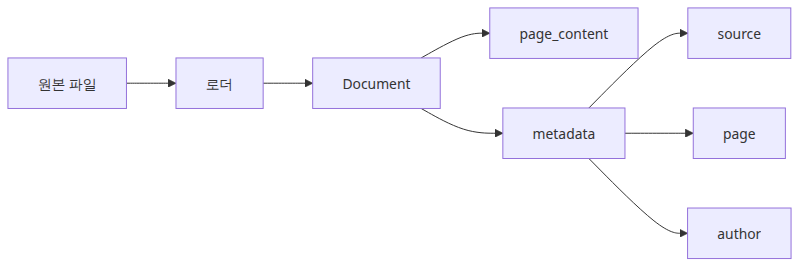
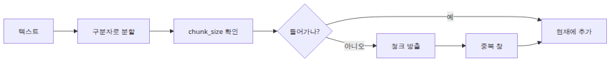
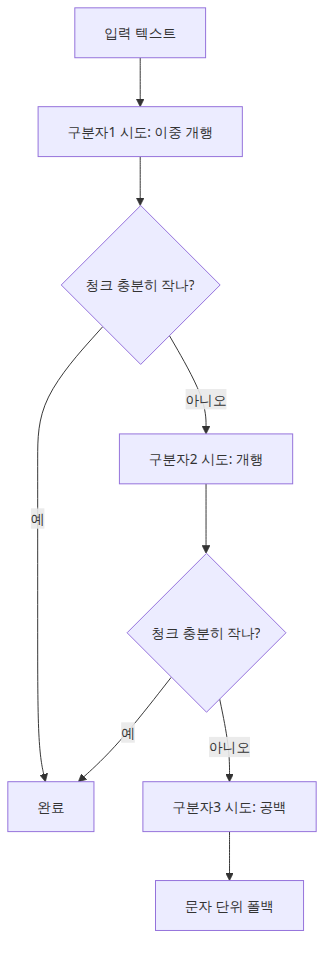
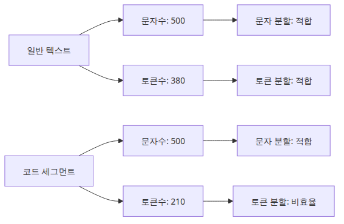
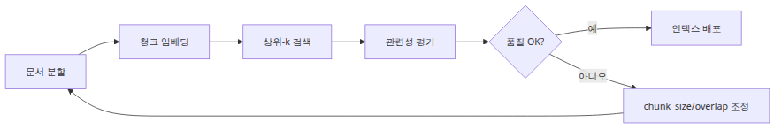

# 문서 로딩과 청크 전략 — LangChain TextSplitter 내부

> RAG Deep Dive 시리즈 (1/6)

## 소스 버전

이 글의 모든 코드 인용은 [`langchain-ai/langchain @ v0.2.17`](https://github.com/langchain-ai/langchain/tree/langchain==0.2.17) 기준입니다.

RAG 파이프라인이 실패할 때 많은 팀이 제일 먼저 의심하는 곳은 인덱스나 retriever입니다. 하지만 실제 운영에서 더 자주 먼저 무너지는 지점은 그 앞단입니다. 문서를 어떤 단위로 읽고, 어떤 경계에서 자르고, 어떤 메타데이터를 남겼는가가 틀어지면 뒤의 모든 단계가 그 왜곡을 충실하게 확대합니다. 벡터 인덱스는 이미 잘못 잘린 조각을 저장할 뿐이고, retriever는 그중 가장 가까운 조각을 성실하게 가져올 뿐입니다. 질문에 대한 답이 문서에 있었는데도 못 찾는 경우를 추적해 보면, 원인은 “검색을 못 했다”보다 “애초에 답이 들어 있던 문맥을 우리가 잘라서 잃어버렸다”인 경우가 훨씬 많습니다.

이번 글은 그 실패 지점을 LangChain 소스 수준에서 확인합니다. 범위는 `langchain_community.document_loaders`의 로더들, `langchain_text_splitters`의 `CharacterTextSplitter`, `RecursiveCharacterTextSplitter`, `TokenTextSplitter`입니다. 특히 `TextSplitter`의 기본 병합 로직인 `_merge_splits()`가 왜 `chunk_overlap`을 생각보다 다르게 느끼게 만드는지, `RecursiveCharacterTextSplitter`가 왜 기본 선택으로 굳어졌는지, 문자 수와 토큰 수의 차이가 언제 실제 장애로 이어지는지를 차례로 보겠습니다.

---

## 청킹은 왜 RAG의 첫 번째 실패 지점인가

RAG에서 검색 품질은 임베딩 모델 하나로 결정되지 않습니다. 더 앞에서 이미 두 가지 결정이 내려집니다. 첫째, 로더가 무엇을 한 덩어리의 `Document`로 만들었는가입니다. 둘째, splitter가 그 덩어리를 어떤 경계에서 다시 나눴는가입니다. 이 두 단계가 잘못되면 retriever는 “질문과 가장 가까운 벡터”를 찾아도 사용자가 원하는 문맥 전체를 못 가져옵니다.

예를 들어 계약서 PDF에서 면책 조항이 한 페이지 끝과 다음 페이지 시작에 걸쳐 있다고 해보겠습니다. 로더가 페이지별 문서를 만들고 splitter가 페이지 내부에서만 잘랐다면, 실제로 의미 단위는 둘로 찢어집니다. FAQ 문서에서는 제목과 답변 본문이 다른 청크로 떨어질 수 있습니다. 소스 코드는 함수 시그니처와 예외 처리 블록이 분리되면 검색은 되더라도 답변에 필요한 조건 문맥이 사라집니다. 이런 문제는 retriever 튜닝으로 뒤늦게 복구하기 어렵습니다. 없는 문맥은 다시 검색할 수 없기 때문입니다.

이 글의 관점은 단순합니다. **chunking은 저장 최적화가 아니라 의미 보존 문제**입니다. 이제 그 보존이 실제 코드에서 어떻게 구현되는지부터 보겠습니다.

---

## 1. 문서 로더는 무엇을 읽고 무엇을 남기는가

LangChain에서 로더의 첫 책임은 파일을 읽는 일이고, 두 번째 책임은 그 결과를 `Document(page_content=..., metadata=...)` 형태로 만드는 일입니다. 이 두 번째가 중요합니다. 이후 splitter와 vector store는 대부분 이 `Document`의 `page_content`와 `metadata`를 그대로 이어받기 때문입니다. `langchain_core.documents.base.Document`는 텍스트와 메타데이터를 함께 갖는 아주 얇은 컨테이너인데, 바로 그 단순함 때문에 로더가 무엇을 넣어 두느냐가 전체 파이프라인에 오래 남습니다.



가장 단순한 `TextLoader`부터 보면 동작이 명확합니다. [`text.py`](https://github.com/langchain-ai/langchain/blob/langchain==0.2.17/libs/community/langchain_community/document_loaders/text.py)에서 `TextLoader.lazy_load()`는 파일을 `open()`으로 읽고, 성공하면 `metadata = {"source": str(self.file_path)}`를 만들어 단 하나의 `Document`를 yield 합니다. 자동 인코딩 감지는 `autodetect_encoding=True`일 때만 일어나고, 지정한 인코딩으로 실패하면 `detect_file_encodings()`가 돌려준 후보들을 다시 시도합니다. 다만 0.2.17 구현은 후보를 모두 소진했을 때 실패를 깔끔하게 예외로 표면화하지 못합니다. `text`가 빈 문자열인 채로 끝나도 그대로 `Document`를 yield 할 수 있어서, 이 구간은 소스 수준의 작은 quirk로 보는 편이 정확합니다. 즉 텍스트 파일 로딩 단계에서 붙는 기본 메타데이터는 사실상 `source` 하나입니다. 파일 경로가 곧 추적 키가 되는 셈입니다.

`PDFMinerLoader`는 같은 “로더” 계층이지만 경계가 조금 다릅니다. [`pdf.py`](https://github.com/langchain-ai/langchain/blob/langchain==0.2.17/libs/community/langchain_community/document_loaders/pdf.py)에서 `PDFMinerLoader`는 실제 파싱을 `PDFMinerParser`에 위임합니다. 핵심은 [`parsers/pdf.py`](https://github.com/langchain-ai/langchain/blob/langchain==0.2.17/libs/community/langchain_community/document_loaders/parsers/pdf.py)의 `PDFMinerParser.lazy_parse()`입니다. `concatenate_pages=True`면 전체 PDF를 하나의 텍스트로 합쳐 `metadata={"source": blob.source}`만 붙입니다. 반대로 `concatenate_pages=False`면 페이지마다 `metadata={"source": blob.source, "page": str(i)}`가 붙은 `Document`가 나옵니다. 같은 PDF라도 이 설정 하나로 이후 청킹의 시작점이 완전히 달라집니다. 전자는 장 단위 문맥 보존에 유리하고, 후자는 페이지 번호 추적과 인용에는 유리합니다.

`UnstructuredFileLoader`는 더 강한 선택지를 줍니다. 다만 먼저 짚고 갈 점이 있습니다. 0.2.17 소스에서 이 클래스는 `@deprecated(since="0.2.8", removal="1.0", alternative_import="langchain_unstructured.UnstructuredLoader")`가 붙은 호환성 shim입니다. 새 코드라면 `langchain_unstructured.UnstructuredLoader`를 쓰는 편이 맞습니다. 그래도 내부 동작을 이해하는 데는 여전히 유효해서 여기서는 소스 구현을 그대로 읽겠습니다. [`unstructured.py`](https://github.com/langchain-ai/langchain/blob/langchain==0.2.17/libs/community/langchain_community/document_loaders/unstructured.py)의 `UnstructuredBaseLoader.lazy_load()`를 보면 `mode="single"`, `mode="elements"`, `mode="paged"`가 갈립니다. `single`은 요소들을 `"\n\n".join()`으로 묶어 한 개 `Document`를 만들고, `elements`는 각 element마다 `metadata`에 `element.metadata.to_dict()`, `category`, `element_id`까지 붙일 수 있습니다. `paged`는 페이지 번호 기준으로 다시 합칩니다. 다만 `mode="paged"`는 0.2.17에서 이미 deprecation warning을 내며, 권장 대체는 `chunking_strategy="by_page"`입니다. 이 차이는 실무에서 아주 큽니다. 규정 문서처럼 제목, 본문, 표, 목록이 섞인 자료에서는 `elements` 모드가 섹션 경계를 더 잘 살려 주지만, 반대로 chunk 수가 급증하고 노이즈 메타데이터가 많아질 수 있습니다.

아래 예시는 세 로더를 같은 수집 파이프라인에서 어떻게 다르게 쓰는지 보여 줍니다.

```python
from pathlib import Path

# deprecated since langchain 0.2.8 — use langchain_unstructured.UnstructuredLoader instead
from langchain_community.document_loaders import (
    PDFMinerLoader,
    TextLoader,
    UnstructuredFileLoader,
)

def load_corpus(base_dir: Path):
    docs = []

    docs.extend(
        TextLoader(
            base_dir / "announcements" / "release-note.txt",
            encoding="utf-8",
            autodetect_encoding=True,
        ).load()
    )

    docs.extend(
        PDFMinerLoader(
            str(base_dir / "manuals" / "oncall-runbook.pdf"),
            concatenate_pages=False,
        ).load()
    )

    docs.extend(
        UnstructuredFileLoader(
            str(base_dir / "policies" / "security-policy.docx"),
            mode="elements",
            strategy="fast",
        ).load()
    )

    for doc in docs[:5]:
        print(doc.metadata)

    return docs

if __name__ == "__main__":
    corpus = load_corpus(Path("sample_data"))
    print(f"loaded documents: {len(corpus)}")
```

운영 관점에서 이 섹션의 핵심은 하나입니다. **splitter를 바꾸기 전에 로더가 만든 기본 문서 단위를 먼저 봐야 합니다.** `chunk_size`를 아무리 조절해도, 로더가 이미 제목과 본문을 분리했거나 페이지 경계를 고정해 버렸다면 그 위에서 얻는 청크의 성질도 제한됩니다.

---

## 2. `TextSplitter` 내부에서 실제 청크가 만들어지는 방식

많은 설명이 `CharacterTextSplitter`를 “구분자로 자른다” 수준에서 멈추지만, 실제로 중요한 부분은 자른 뒤 다시 합치는 병합 단계입니다. [`character.py`](https://github.com/langchain-ai/langchain/blob/langchain==0.2.17/libs/text-splitters/langchain_text_splitters/character.py)의 `CharacterTextSplitter.split_text()`는 먼저 `_split_text_with_regex()`로 원문을 작은 조각들로 나눈 다음, 최종 결과는 `TextSplitter._merge_splits()`에 맡깁니다. 이 함수가 `chunk_size`, `chunk_overlap`, `length_function`의 상호작용을 결정합니다.



기본 생성자는 [`base.py`](https://github.com/langchain-ai/langchain/blob/langchain==0.2.17/libs/text-splitters/langchain_text_splitters/base.py)에 있습니다.

- `chunk_size=4000`
- `chunk_overlap=200`
- `length_function=len`
- `keep_separator=False`
- `add_start_index=False`

여기서 흔히 놓치는 점이 두 가지입니다. 첫째, `chunk_overlap`은 “청크마다 정확히 200자를 겹치게 한다”는 뜻이 아닙니다. `_merge_splits()`는 `splits`를 순서대로 `current_doc`에 쌓다가 다음 조각 `d`를 넣으면 `chunk_size`를 넘는 순간 현재 묶음을 하나의 chunk로 확정합니다. 그 다음 `while total > self._chunk_overlap or (...)` 루프를 돌며 앞쪽 조각을 pop 해서 겹침 목표에 가까운 슬라이딩 윈도를 만듭니다. 겹침이 조각 단위로 계산되기 때문에 실제 overlap 길이는 구분자 구조에 따라 들쭉날쭉합니다.

둘째, `length_function`은 단순 측정 함수가 아니라 병합 알고리즘의 법칙 자체를 바꿉니다. 기본값 `len`은 문자 수를 셉니다. 그런데 같은 1000문자라도 영어 설명문과 한국어 코드 혼합 로그, JSON payload는 토큰 수가 크게 다를 수 있습니다. 문자 수 기준으로 안전해 보여도 실제 모델 컨텍스트에서는 터질 수 있습니다. 반대로 토큰 기준 길이 함수를 쓰면 줄바꿈이나 공백의 비용까지 모델 관점에서 반영됩니다.

`create_documents()`도 같이 봐야 합니다. `add_start_index=True`면 각 chunk를 만들 때 `text.find(chunk, max(0, offset))`로 시작 위치를 찾아 `metadata["start_index"]`에 저장합니다. 즉 청킹 후 원문 재매핑이 필요하면 이 옵션이 유용합니다. 다만 overlap이 있고 같은 문장이 반복되면 `find()`가 예상보다 앞선 동일 문자열을 잡을 수 있어, 절대 좌표를 로그 근거로 삼을 때는 검증이 필요합니다.

다음 코드는 세 파라미터가 실제 결과를 어떻게 바꾸는지 확인하는 최소 예시입니다.

```python
from langchain_text_splitters import CharacterTextSplitter

text = """Incident summary

The payment worker retries a failed task three times.
If all retries fail, the message moves to the dead-letter queue.
Operators must inspect the original payload and the exception chain.
"""

splitter = CharacterTextSplitter(
    separator="\n",
    chunk_size=80,
    chunk_overlap=20,
    length_function=len,
    add_start_index=True,
)

documents = splitter.create_documents([text], metadatas=[{"source": "runbook"}])

for index, doc in enumerate(documents, start=1):
    print(f"chunk {index}")
    print(doc.metadata)
    print(doc.page_content)
    print("-" * 40)
```

이 예시를 직접 돌려 보면 overlap이 항상 정확히 20문자가 아니라, 줄 단위 조각을 얼마나 오래 유지했는지에 따라 바뀌는 것을 확인할 수 있습니다. 실무에서 “왜 overlap을 100으로 줬는데 체감상 거의 안 겹치지?”라는 질문이 나오는 이유가 여기 있습니다. LangChain은 문자 스트림을 잘라 붙이는 것이 아니라, **먼저 쪼갠 조각들을 다시 묶는 방식**으로 overlap을 구현합니다.

---

## 3. `RecursiveCharacterTextSplitter`가 기본 선택이 된 이유

`RecursiveCharacterTextSplitter`가 널리 쓰이는 이유는 정교해서가 아니라, 실패 방식이 비교적 온건하기 때문입니다. [`character.py`](https://github.com/langchain-ai/langchain/blob/langchain==0.2.17/libs/text-splitters/langchain_text_splitters/character.py)의 생성자를 보면 기본 `separators`는 `[
"\n\n", "\n", " ", ""]`입니다. 문단, 줄, 공백, 마지막으로 문자 단위까지 단계적으로 후퇴합니다. 긴 문서를 일단 의미 있는 큰 경계부터 보존하려고 시도하고, 안 되면 점점 더 거친 절단으로 내려가는 구조입니다.



핵심 메서드인 `_split_text()`를 읽어 보면 동작이 꽤 직관적입니다.

1. 현재 텍스트에 실제로 등장하는 첫 번째 separator를 찾습니다.
2. 그 separator로 `_split_text_with_regex()`를 돌립니다.
3. 각 조각 `s`가 `chunk_size`보다 작으면 `_good_splits`에 모읍니다.
4. 큰 조각이 나오면 지금까지 모은 `_good_splits`를 `_merge_splits()`로 확정합니다.
5. 아직도 큰 조각이면 남은 `new_separators`로 재귀 호출합니다.
6. 더 내려갈 separator가 없으면 큰 조각을 그대로 반환합니다.

이 구현이 주는 장점은 “문단 경계가 있으면 최대한 문단을 살리고, 그게 안 될 때만 줄 단위로 내려간다”는 보수적 전략입니다. 예를 들어 API 가이드 문서처럼 섹션 간 빈 줄이 잘 들어간 텍스트라면 첫 단계 `"\n\n"`에서 대부분이 해결됩니다. 로그 파일처럼 빈 줄이 없고 줄바꿈만 있는 텍스트는 두 번째 단계 `"\n"`로 내려갑니다. 한국어 계약서 PDF를 OCR한 결과처럼 줄바꿈과 공백이 불규칙하면 결국 마지막 `""`까지 가서 문자 단위로 나뉠 수 있습니다.

또 하나 중요한 기본값이 `keep_separator=True`라는 점입니다. `CharacterTextSplitter`와 달리 재귀 splitter는 구분자를 보존하는 쪽이 기본입니다. 문단 경계나 줄바꿈이 chunk의 앞이나 뒤에 남으므로, 제목과 본문 사이의 문맥 신호가 덜 사라집니다. 실무에서 이 차이는 검색 후 답변 품질에 생각보다 크게 작용합니다. 특히 markdown 문서나 정책 문서에서는 줄바꿈 하나가 의미 경계를 대신하기 때문입니다.

아래 예시는 markdown 문서를 재귀 splitter로 나눌 때의 전형적인 형태입니다.

```python
from langchain_text_splitters import RecursiveCharacterTextSplitter

markdown_text = """# Service policy

## Password reset
Users can reset passwords from the account settings page.
The reset link expires after 15 minutes.

## API rate limit
The public API allows 120 requests per minute per API key.
Burst requests above the limit receive HTTP 429 responses.
"""

splitter = RecursiveCharacterTextSplitter(
    chunk_size=120,
    chunk_overlap=30,
)

chunks = splitter.split_text(markdown_text)

for index, chunk in enumerate(chunks, start=1):
    print(f"chunk {index}\n{chunk}\n")
```

여기서 기대해야 할 것은 “완벽한 의미 단위”가 아니라 “대부분의 자연스러운 경계가 보존되는 기본값”입니다. 그래서 `RecursiveCharacterTextSplitter`는 범용 기본 선택으로 좋지만, 문서 형식이 더 구조적이라면 그대로 멈추면 안 됩니다. 코드, HTML, JSON, 법률 문서처럼 경계가 명확한 자료는 언어별 separator 집합이나 도메인별 전처리를 추가하는 편이 낫습니다.

---

## 4. 토큰 기준 분할이 필요한 순간

문자 수와 토큰 수는 다릅니다. 이 문장은 초급 설명에서는 당연하게 들리지만, 실제 장애는 늘 여기서 납니다. LLM의 컨텍스트 윈도는 토큰 기준인데, 많은 파이프라인은 여전히 문자 기준 splitter로 ingest를 끝냅니다. 그러면 인덱싱 때는 멀쩡해 보여도, 검색 후 여러 chunk를 프롬프트에 조립하는 단계에서 토큰 예산이 갑자기 넘칩니다.



LangChain의 `TokenTextSplitter`는 이 문제를 정면으로 다룹니다. [`base.py`](https://github.com/langchain-ai/langchain/blob/langchain==0.2.17/libs/text-splitters/langchain_text_splitters/base.py)에서 `TokenTextSplitter.split_text()`는 내부 `_encode()`로 문자열을 토큰 ID 리스트로 바꾼 뒤, `Tokenizer(chunk_overlap=self._chunk_overlap, tokens_per_chunk=self._chunk_size, ...)`를 만들고 `split_text_on_tokens()`를 호출합니다. 이 함수는 `start_idx += tokenizer.tokens_per_chunk - tokenizer.chunk_overlap` 방식으로 고정 폭 슬라이딩 윈도를 이동합니다. 여기서는 overlap이 조각 단위가 아니라 토큰 단위로 직접 적용됩니다.

즉 `TokenTextSplitter`는 `CharacterTextSplitter`보다 예측 가능성이 높습니다. 대신 대가도 있습니다. 토큰 경계는 문단이나 문장 경계와 무관합니다. 텍스트 의미를 더 잘 보존해 주는 것은 아니고, 모델 한도 안에 맞춘다는 보장을 더 강하게 줍니다. 그래서 실무에서는 둘 중 하나만 고집하기보다, 구조 보존이 중요한 전처리 단계에서는 재귀 문자 분할을 쓰고, 프롬프트 직전 리패킹 단계에서는 토큰 예산 점검을 따로 거는 식이 더 안전합니다.

다음 예시는 같은 모델 인코더를 써서 문자 기준과 토큰 기준을 비교합니다.

```python
import tiktoken
from langchain_text_splitters import CharacterTextSplitter, TokenTextSplitter

text = "고객 ID 18423의 결제 실패 원인은 HTTP 429 응답이 아니라, 백오프 없이 재시도한 내부 배치 작업이었습니다."

encoding = tiktoken.get_encoding("cl100k_base")

char_splitter = CharacterTextSplitter(
    separator=" ",
    chunk_size=30,
    chunk_overlap=5,
)
token_splitter = TokenTextSplitter(
    encoding_name="cl100k_base",
    chunk_size=18,
    chunk_overlap=4,
)

char_chunks = char_splitter.split_text(text)
token_chunks = token_splitter.split_text(text)

print("character-based")
for chunk in char_chunks:
    print(len(chunk), len(encoding.encode(chunk)), chunk)

print("token-based")
for chunk in token_chunks:
    print(len(chunk), len(encoding.encode(chunk)), chunk)
```

한국어, 숫자, 영문 식별자, 구두점이 섞인 운영 로그나 에러 리포트에서는 이 차이가 더 벌어집니다. 문자 500자면 충분할 거라고 가정했는데 토큰 900개가 나오는 식입니다. 질문당 여러 chunk를 합치는 multi-context RAG에서는 이 편차가 누적됩니다. `top_k=6`을 유지하고 싶다면 ingest 단계의 chunk 크기부터 토큰 예산과 맞춰야 합니다.

---

## 5. 실무에서는 chunk 크기를 어떻게 고를까

정답 숫자는 없습니다. 대신 틀린 접근은 분명합니다. 문서 종류가 다른데도 모든 코퍼스에 `chunk_size=1000, chunk_overlap=200`을 일괄 적용하는 방식입니다. 제품 매뉴얼, 법률 계약서, 장애 대응 런북, 소스 코드는 모두 의미 단위가 다릅니다. 좋은 chunk 크기는 모델 한도보다 먼저 **질문이 요구하는 증거 단위**에 맞아야 합니다.



실무에서는 보통 세 축을 같이 봅니다.

첫째, 한 chunk가 답변 근거로 자급자족할 수 있는가입니다. 제품 정책 FAQ라면 질문 하나에 답하는 데 필요한 정의와 예외가 한 조각 안에 함께 있어야 합니다. 둘째, retriever가 너무 넓은 chunk 때문에 비슷한 주제를 모두 같은 벡터로 뭉개지 않는가입니다. 셋째, overlap이 실제로 문맥 보존에 기여하는가입니다. overlap 비율은 간단히 `chunk_overlap / chunk_size`로 시작할 수 있지만, 더 중요한 것은 생성된 청크에서 **인접 chunk 간 중복 토큰 비율**을 재는 일입니다. 설정은 20퍼센트 overlap인데 실제 결과는 줄 경계 때문에 5퍼센트밖에 안 겹칠 수 있습니다.

제가 자주 쓰는 출발점은 다음과 같습니다.

- 문서형 가이드, 정책 문서: 재귀 문자 분할, 500~900 토큰 목표, overlap 10~20%
- API 레퍼런스, 코드 설명: 헤더나 함수 경계를 먼저 살리고, 필요하면 더 작은 200~400 토큰 목표
- 로그, OCR 텍스트, 줄바꿈이 더러운 자료: 로더 전처리로 구조를 먼저 복원한 뒤 분할

그리고 반드시 측정합니다. 샘플 질문 세트를 잡고, 각 질문의 정답 근거가 몇 개 chunk에 걸쳐 있는지 세어 보면 chunk 전략의 감이 빨리 옵니다. 한 답변 근거가 늘 세 개 이상 chunk에 걸쳐 있으면 너무 잘게 자른 경우가 많고, 반대로 검색된 chunk 하나가 늘 주변 잡음을 많이 품고 있으면 너무 크게 자른 경우가 많습니다.

아래 코드는 overlap 비율과 토큰 길이 분포를 함께 보는 간단한 점검 스크립트입니다.

```python
from statistics import mean

import tiktoken
from langchain_text_splitters import RecursiveCharacterTextSplitter

def measure_chunks(texts):
    chunk_size = 700
    chunk_overlap = 120
    splitter = RecursiveCharacterTextSplitter(
        chunk_size=chunk_size,
        chunk_overlap=chunk_overlap,
    )
    encoding = tiktoken.get_encoding("cl100k_base")

    chunks = []
    for text in texts:
        chunks.extend(splitter.split_text(text))

    token_lengths = [len(encoding.encode(chunk)) for chunk in chunks]
    overlap_ratio = chunk_overlap / chunk_size

    print(f"chunks: {len(chunks)}")
    print(f"configured overlap ratio: {overlap_ratio:.2f}")
    print(f"avg tokens per chunk: {mean(token_lengths):.1f}")
    print(f"max tokens per chunk: {max(token_lengths)}")
    print(f"min tokens per chunk: {min(token_lengths)}")

if __name__ == "__main__":
    documents = [
        "Service owners must rotate secrets every 90 days. Emergency exceptions require security approval.",
        "API clients that exceed the quota receive HTTP 429 and should retry with exponential backoff.",
    ]
    measure_chunks(documents)
```

이 스크립트만으로 품질을 다 알 수는 없습니다. 그래도 설정 숫자를 감으로 고르는 단계에서 한 걸음 나아갑니다. chunk 전략은 결국 retrieval 실험으로 닫혀야 합니다. 다만 실험 전에 소스 코드를 읽어 두면 왜 특정 설정이 그렇게 동작했는지 설명할 수 있게 됩니다. 그것이 운영에서 중요합니다. 튜닝은 우연히 맞출 수 있어도, 재현 가능한 개선은 내부 동작을 이해해야만 가능합니다.

---

## 이번 화에서 남겨 둘 기준선

RAG 파이프라인의 앞단은 생각보다 단순한 코드로 이루어져 있습니다. `TextLoader`는 파일 경로를 `source`에 담아 한 개 문서를 만들지만, 자동 인코딩 감지 경로에는 실패가 깔끔히 드러나지 않는 0.2.17의 quirk가 있습니다. `PDFMinerLoader`는 페이지 결합 여부에 따라 문서 경계를 바꾸고, deprecated 호환성 shim인 `UnstructuredFileLoader`는 element 수준 메타데이터까지 올려 보낼 수 있습니다. 그 위에서 `CharacterTextSplitter`와 `RecursiveCharacterTextSplitter`는 먼저 자르고 나중에 병합하는 방식으로 chunk를 만들고, `TokenTextSplitter`는 모델 토큰 기준으로 그 창을 다시 정의합니다.

이 기준선을 잡아 두면 다음 화의 임베딩과 인덱스 논의가 훨씬 선명해집니다. 벡터 인덱스는 결코 중립적인 저장소가 아닙니다. 로더와 splitter가 만든 문서 단위를 그대로 기하학으로 바꾸는 장치입니다. 2화에서는 그 기하학이 실제로 어떻게 검색 동작으로 이어지는지, FAISS의 `IndexFlatL2`를 기준으로 이어서 보겠습니다.

<!-- toc:begin -->
## 시리즈 목차

- **문서 로딩과 청크 전략 — LangChain TextSplitter 내부 (현재 글)**
- 임베딩과 벡터 인덱스 — FAISS IndexFlatL2 동작 원리 (예정)
- Retriever 설계 — VectorStoreRetriever와 MMR (예정)
- 프롬프트 구성과 컨텍스트 주입 — PromptTemplate 내부 (예정)
- RAG Chain 조립 — RetrievalQA vs LCEL (예정)
- 평가와 품질 게이트 — RAGAS 메트릭과 Faithfulness (예정)

<!-- toc:end -->

---

## 참고 자료

- [LangChain `TextSplitter` base source](https://github.com/langchain-ai/langchain/blob/langchain==0.2.17/libs/text-splitters/langchain_text_splitters/base.py)
- [LangChain `CharacterTextSplitter` and `RecursiveCharacterTextSplitter` source](https://github.com/langchain-ai/langchain/blob/langchain==0.2.17/libs/text-splitters/langchain_text_splitters/character.py)
- [LangChain `TextLoader` source](https://github.com/langchain-ai/langchain/blob/langchain==0.2.17/libs/community/langchain_community/document_loaders/text.py)
- [LangChain PDF loader source](https://github.com/langchain-ai/langchain/blob/langchain==0.2.17/libs/community/langchain_community/document_loaders/pdf.py)
- [LangChain PDF parser source](https://github.com/langchain-ai/langchain/blob/langchain==0.2.17/libs/community/langchain_community/document_loaders/parsers/pdf.py)
- [LangChain `UnstructuredFileLoader` source](https://github.com/langchain-ai/langchain/blob/langchain==0.2.17/libs/community/langchain_community/document_loaders/unstructured.py)
- [LangChain `Document` base type](https://github.com/langchain-ai/langchain/blob/langchain==0.2.17/libs/core/langchain_core/documents/base.py)
- [Lewis et al., Retrieval-Augmented Generation for Knowledge-Intensive NLP Tasks](https://doi.org/10.48550/arXiv.2005.11401)

Tags: RAG, LangChain, Vector Search, LLM
