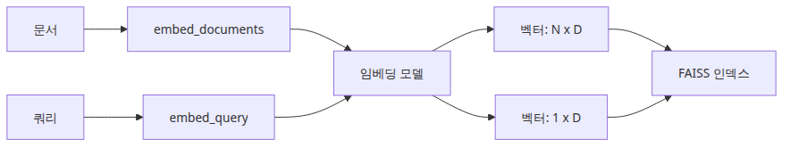
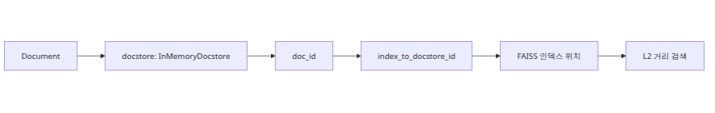
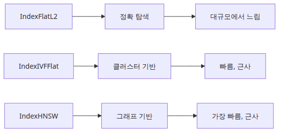
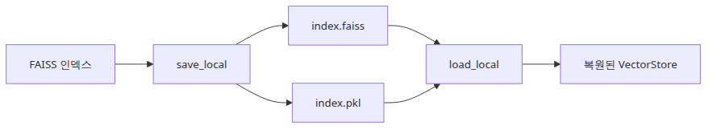

# 임베딩과 벡터 인덱스 — FAISS IndexFlatL2 동작 원리

<!-- a-grade-example:begin -->
## 최소 실행 예제

예제 파일: `/root/Github/rag-deep-dive/ko/02-embeddings-and-vector-index/main.py`

```bash
export GROQ_API_KEY=... && python main.py
```

```python
import faiss
import numpy as np
from langchain_community.embeddings import HuggingFaceEmbeddings

DOCS = [
    "The worker retries a failed message three times before dead-lettering.",
    "The dead-letter queue keeps the original payload for later inspection.",
    "HTTP 429 means the caller exceeded the per-minute quota.",
    "Operators inspect the exception chain before replaying the message.",
]
QUERY = "Why did the system stop retrying the message?"

def main() -> None:
    embeddings = HuggingFaceEmbeddings(
        model_name="sentence-transformers/all-MiniLM-L6-v2"
    )
    doc_vectors = np.array(embeddings.embed_documents(DOCS), dtype="float32")
    query_vector = np.array([embeddings.embed_query(QUERY)], dtype="float32")

    index = faiss.IndexFlatL2(doc_vectors.shape[1])
    index.add(doc_vectors)

    distances, indices = index.search(query_vector, k=3)
    for rank, (doc_index, distance) in enumerate(
        zip(indices[0], distances[0]), start=1
    ):
        print(f"rank={rank} distance={float(distance):.4f}")
        print(DOCS[int(doc_index)])
        print("-" * 60)

if __name__ == "__main__":
    main()
```

### 이 코드에서 봐야 할 것

- HuggingFace 임베딩 결과를 `float32` 행렬로 만든 뒤 직접 `IndexFlatL2`에 넣습니다.
- FAISS는 문서를 모르고 벡터와 정수 row id만 압니다.
- 검색 결과는 거리값이 낮은 순서로 반환됩니다.

### 실무에서 헷갈리는 지점

- cosine을 쓰고 있다고 말하면서 실제로는 L2 또는 inner product를 쓰는 경우가 많습니다.
- 정규화 여부를 모른 채 거리값만 비교하면 순위 의미를 잘못 해석하게 됩니다.
- 인덱스는 저장소가 아니라 ranking rule이라는 점을 놓치기 쉽습니다.

<!-- a-grade-example:end -->
## 체크리스트

- [ ] 문서 임베딩과 질의 임베딩 호출 경로를 구분했다.
- [ ] FAISS가 반환하는 값이 거리인지 유사도인지 확인했다.
- [ ] 벡터 row id를 원문과 다시 연결하는 매핑 계층을 이해했다.
- [ ] exact baseline 없이 approximate index만 먼저 튜닝하지 않았다.

## 소스 버전

이 글의 LangChain 코드 인용은 [`langchain-ai/langchain @ langchain==0.2.17`](https://github.com/langchain-ai/langchain/tree/langchain==0.2.17), FAISS C++ 코드 인용은 [`facebookresearch/faiss @ c72ef8a`](https://github.com/facebookresearch/faiss/tree/c72ef8a) 기준입니다.

1화에서 문서를 어떻게 읽고 어떻게 자르느냐가 RAG의 첫 번째 실패 지점이라고 봤습니다. 2화에서 볼 임베딩과 벡터 인덱스는 그 다음 단계이지만, 역할은 단순 저장이 아닙니다. 인덱스는 중립적인 창고가 아니라 이미 잘린 청크를 좌표계 안으로 밀어 넣는 장치입니다. 문단 경계가 어디였는지, 제목과 본문이 같은 청크에 묶였는지, 예외 조항이 다음 조각으로 찢어졌는지가 모두 벡터 공간의 이웃 관계로 굳어집니다. 1화에서 만든 경계가 2화에서 기하학이 되는 셈입니다.

그래서 임베딩과 인덱스를 따로 떼어 보면 자주 오해합니다. “좋은 임베딩 모델을 쓰면 검색이 좋아진다”는 말은 절반만 맞습니다. 실제 검색은 임베딩 모델이 만든 방향성과, 인덱스가 계산하는 거리 함수와, LangChain이 원문 청크를 다시 `Document`로 복원하는 매핑까지 한 번에 합쳐져 나옵니다. 이 글은 그 연결선을 소스 수준에서 따라갑니다. 먼저 `OpenAIEmbeddings`가 어떤 API 호출을 만들고 `embed_documents()`와 `embed_query()`를 어떻게 구분하는지 보고, 그다음 FAISS `IndexFlatL2`가 실제로 어떤 계산을 하는지 확인하겠습니다. 이어서 `FAISS.from_documents()`가 LangChain 문서를 어떻게 FAISS 정수 ID와 연결하는지, `IndexFlatIP`와 `IndexIVFFlat`은 무엇이 다른지, 마지막으로 저장과 복원이 왜 생각보다 보안 민감한지까지 정리하겠습니다.

---

## 1. `OpenAIEmbeddings`는 어떤 벡터를 만들고 무엇을 분리하는가

LangChain 0.2.17에서 우리가 흔히 쓰는 `OpenAIEmbeddings`는 `langchain_community.embeddings.openai`에 있습니다. 먼저 짚고 넘어갈 점이 하나 있습니다. 이 클래스는 이미 deprecated이며 새 코드에서는 `langchain_openai.OpenAIEmbeddings`가 권장됩니다. 그래도 0.2.17 소스를 읽는 이유는 RAG 튜토리얼과 운영 코드 상당수가 이 계층을 아직 기준선으로 삼고 있기 때문입니다.



*문서와 질의 임베딩 호출 흐름*

소스를 보면 `embed_documents()`와 `embed_query()`의 표면적 차이는 아주 얇습니다. `embed_documents()`는 `self._get_len_safe_embeddings(texts, engine=engine)`를 호출하고, `embed_query()`는 결국 `self.embed_documents([text])[0]`을 돌려줍니다. 즉 0.2.17의 이 구현만 놓고 보면 쿼리와 문서가 같은 경로를 탑니다. 하지만 인터페이스가 둘로 나뉘어 있는 것은 우연이 아닙니다. LangChain은 애초에 query embedding과 document embedding이 다를 수 있다는 가정을 인터페이스에 심어 두었습니다. 비대칭 검색 모델에서는 문서 쪽에는 더 긴 설명과 배경을 보존하도록 학습하고, 질문 쪽에는 짧은 질의를 더 날카롭게 쏘도록 따로 최적화하는 경우가 있기 때문입니다.

이 구분이 왜 중요한지는 “현재 구현은 같다”는 사실보다 “항상 같다고 가정하면 안 된다”는 점에 있습니다. 오늘의 pinned 구현에서는 `embed_query()`가 사실상 `embed_documents()`의 얇은 래퍼지만, 다른 provider나 이후 계열 모델은 쿼리 앞에 instruction을 붙이거나 query/document를 분리된 projection으로 다룰 수 있습니다. 검색형 모델군에서 흔히 말하는 asymmetric embedding이 바로 이 경우입니다. 실무에서 `embed_query()`와 `embed_documents()`를 구분 없이 섞어 쓰면, 지금은 우연히 맞아도 provider를 바꾸는 순간 검색 품질이 조용히 무너질 수 있습니다.

또 하나 중요하게 봐야 할 것은 `_get_len_safe_embeddings()`입니다. 이 함수는 긴 텍스트를 안전하게 임베딩하기 위해 먼저 토큰화하고 `embedding_ctx_length`를 넘으면 여러 조각으로 나눈 뒤, 각 조각 임베딩을 토큰 수 가중 평균으로 다시 합칩니다. 마지막에는 `average / np.linalg.norm(average)`로 L2 정규화까지 합니다. 즉 LangChain의 이 구현은 긴 문서를 한 번의 API 호출에 우겨 넣지 않고, 여러 조각을 임베딩한 뒤 하나의 정규화된 벡터로 축약합니다. 여기서 이미 1화의 chunk 경계가 한 번 더 중요해집니다. 우리가 만든 청크가 너무 크면 이 함수가 내부적으로 다시 쪼개고 평균내기 때문에, 결국 검색 벡터는 “청크 전체의 의미 평균”이 됩니다.

API 호출 모양도 단순합니다. `embed_with_retry()`는 `embeddings.client.create(**kwargs)`를 호출하고, OpenAI v1 경로에서 `_invocation_params`는 기본적으로 `model=self.model`과 `model_kwargs`만 담습니다. 인증과 timeout은 이 딕셔너리에 실리는 것이 아니라, 환경 검증 단계에서 생성된 `openai.OpenAI(...)` 클라이언트 객체에 이미 설정됩니다. 실제 호출 형태는 대략 아래와 같습니다.

```python
from langchain_community.embeddings import HuggingFaceEmbeddings

def build_embeddings() -> HuggingFaceEmbeddings:
    return HuggingFaceEmbeddings(model_name="sentence-transformers/all-MiniLM-L6-v2")

def demo() -> None:
    embeddings = build_embeddings()

    doc_vectors = embeddings.embed_documents(
        [
            "The retry budget for the payment worker is three attempts.",
            "The dead-letter queue preserves the original payload for later inspection.",
        ]
    )
    query_vector = embeddings.embed_query("Why did the worker move a message to the dead-letter queue?")

    print(len(doc_vectors), len(doc_vectors[0]))
    print(len(query_vector))

if __name__ == "__main__":
    demo()
```

운영 관점에서 이 섹션의 핵심은 세 가지입니다. 첫째, LangChain 인터페이스는 query와 document embedding을 분리해 두므로, 호출도 그 의도를 따라가야 합니다. 둘째, 0.2.17의 `OpenAIEmbeddings`는 긴 텍스트를 내부적으로 토큰 조각으로 나누고 평균낸 뒤 정규화합니다. 셋째, 따라서 벡터는 원문 청크의 순수 복사본이 아니라 이미 한 번 요약된 기하학적 표현입니다.

---

## 2. FAISS `IndexFlatL2`는 실제로 무엇을 계산하는가

FAISS의 `IndexFlatL2`는 자주 “기본 인덱스”, “brute-force 인덱스” 정도로 설명됩니다. 맞는 말이지만 중요한 설명이 빠져 있습니다. 무엇을 brute-force 하느냐가 핵심입니다. `IndexFlatL2`는 저장된 모든 벡터를 훑으면서 질의 벡터와의 L2 거리를 정확하게 계산합니다. 근사 탐색이 아니라 정확 탐색입니다. 대신 빨라지는 지름길도 없습니다.


*질의와 전체 벡터 비교 경로*

`faiss/IndexFlat.cpp`의 `IndexFlat::search()`를 보면 구조가 아주 직설적입니다. `metric_type == METRIC_INNER_PRODUCT`면 `knn_inner_product(...)`를, `metric_type == METRIC_L2`면 `knn_L2sqr(...)`를 호출합니다. `IndexFlatL2`는 여기서 두 번째 경로를 탑니다. 즉 FAISS가 반환하는 값은 보통 “유클리드 거리”라기보다 **제곱 L2 거리**입니다. 수식으로 쓰면 질의 벡터 `q`와 저장 벡터 `x`의 거리는 다음과 같습니다.

`||q - x||^2 = Σ_i (q_i - x_i)^2`

거리가 작을수록 더 가깝습니다. 이 방식이 정확한 이유는 후보를 줄이거나 양자화하지 않기 때문입니다. 저장된 `ntotal`개의 벡터를 전부 비교하니 top-k 결과는 exact nearest neighbors입니다. 반대로 비용은 선형입니다. 질의 하나당 대략 `O(n·d)` 계산이 필요합니다. 여기서 `n`은 저장 벡터 수, `d`는 임베딩 차원입니다. 예를 들어 1536차원 임베딩 50만 개를 매 질의마다 다 훑으면, 정확도는 좋지만 CPU와 메모리 대역폭을 계속 태웁니다.

이 복잡도는 언제 문제가 될까요. 수만 개 규모에서는 의외로 꽤 오래 버팁니다. 특히 오프라인 평가나 작은 사내 지식베이스에서는 `IndexFlatL2`가 가장 좋은 기준선입니다. 근사 오차가 없어서 chunking, embedding, metadata filter 문제를 순수하게 분리해 볼 수 있기 때문입니다. 하지만 백만 단위 이상으로 커지고 동시 질의가 붙기 시작하면 이야기가 달라집니다. 이때 병목은 모델이 아니라 검색 단계에서 먼저 나타날 수 있습니다.

아래 코드는 `IndexFlatL2`가 사실상 “전체 벡터 비교 후 상위 k개 선택”이라는 점을 보여 주는 최소 예시입니다.

```python
import numpy as np
import faiss

def main() -> None:
    dim = 4
    xb = np.array(
        [
            [0.1, 0.0, 0.0, 0.0],
            [0.0, 0.2, 0.0, 0.0],
            [0.0, 0.0, 0.3, 0.0],
            [0.9, 0.9, 0.9, 0.9],
        ],
        dtype="float32",
    )
    xq = np.array([[0.05, 0.0, 0.0, 0.0]], dtype="float32")

    index = faiss.IndexFlatL2(dim)
    index.add(xb)

    distances, labels = index.search(xq, k=2)
    print("distances:", distances.tolist())
    print("labels:", labels.tolist())

if __name__ == "__main__":
    main()
```

여기서 더 중요한 실무 포인트는 정규화와 거리 함수의 관계입니다. LangChain의 `OpenAIEmbeddings` 구현은 긴 입력 평균 후 L2 정규화를 수행합니다. 만약 저장 벡터와 질의 벡터가 모두 단위 길이라면 L2 거리와 cosine similarity는 순위 관점에서 가까운 관계를 가집니다. 그래서 많은 팀이 cosine을 쓰고 있다고 말하면서 실제로는 정규화 후 `IndexFlatIP` 또는 `IndexFlatL2`를 사용합니다. 핵심은 “이 인덱스가 무슨 거리 함수를 계산하는가”를 명시적으로 아는 것입니다. 인덱스는 저장소가 아니라 ranking rule입니다.

---

## 3. `FAISS.from_documents()`는 LangChain 문서를 어떻게 다시 찾게 만드는가

LangChain에서 `FAISS.from_documents()`를 호출하면 한 줄로 끝나는 것처럼 보입니다. 하지만 내부 경로는 생각보다 중요합니다. 먼저 `langchain_core.vectorstores.base.VectorStore.from_documents()`가 `documents`에서 `page_content`와 `metadata`를 뽑아 `from_texts()`로 넘깁니다. 그다음 `langchain_community.vectorstores.faiss.FAISS.from_texts()`가 `embedding.embed_documents(texts)`를 호출해 벡터를 만들고, 내부 `__from()`이 실제 FAISS 인덱스와 docstore를 초기화합니다.



*문서와 FAISS 계층 연결 구조*

소스를 그대로 따라가 보면 `__from()`은 distance strategy가 최대 내적이면 `faiss.IndexFlatIP`, 아니면 기본값으로 `faiss.IndexFlatL2`를 만듭니다. `docstore` 기본값은 `InMemoryDocstore()`이고, `index_to_docstore_id` 기본값은 빈 딕셔너리입니다. 그런 다음 `__add()`가 실제 데이터를 밀어 넣습니다. 여기서 세 계층이 분리됩니다.

1. FAISS 인덱스는 오직 `float32` 벡터만 압니다.
2. docstore는 `id -> Document` 매핑을 저장합니다.
3. `index_to_docstore_id`는 `faiss row id -> docstore id` 매핑을 저장합니다.

이 구조가 필요한 이유는 FAISS가 반환하는 것은 원문 문자열이 아니라 정수 라벨이기 때문입니다. `similarity_search_with_score_by_vector()`를 보면 `scores, indices = self.index.search(...)` 후에, 각 정수 인덱스 `i`를 `self.index_to_docstore_id[i]`로 바꿔 docstore에서 다시 `Document`를 꺼냅니다. 즉 retrieval 결과는 “FAISS가 찾은 row 번호”를 “LangChain 문서 객체”로 복원한 결과입니다. 이 중간 매핑이 깨지면 검색은 성공해도 원문 복원이 틀어집니다.

`docstore`를 별도 계층으로 두는 설계도 운영상 의미가 있습니다. FAISS는 메타데이터 필터링을 직접 이해하지 못합니다. LangChain은 먼저 벡터 후보를 FAISS에서 가져오고, 그다음 파이썬 계층에서 metadata filter를 적용할 수 있습니다. 작은 규모에서는 편하지만, 큰 규모에서는 `fetch_k`를 더 많이 가져온 뒤 필터링해야 해서 비용이 늘어납니다. 이 역시 인덱스가 고립된 부품이 아니라 상위 애플리케이션 계층과 묶여 있다는 증거입니다. 또 `VectorStore.from_documents()`는 `Document.id`를 그대로 보존하는 경로가 아니며, 별도 `ids`를 넘기지 않으면 `FAISS.__add()`가 UUID 문자열을 새로 만들어 docstore 키로 사용합니다.

```python
from langchain_core.documents import Document
from langchain_community.vectorstores import FAISS
from langchain_community.embeddings import HuggingFaceEmbeddings

def build_vector_store() -> FAISS:
    docs = [
        Document(
            page_content="The payment worker retries failed jobs three times before dead-lettering.",
            metadata={"source": "runbook.md", "section": "worker"},
        ),
        Document(
            page_content="The API gateway returns HTTP 429 when the caller exceeds the per-minute quota.",
            metadata={"source": "api.md", "section": "rate-limit"},
        ),
    ]

    embeddings = HuggingFaceEmbeddings(model_name="sentence-transformers/all-MiniLM-L6-v2")
    return FAISS.from_documents(docs, embeddings)

def main() -> None:
    vector_store = build_vector_store()
    print(type(vector_store.docstore).__name__)
    print(vector_store.index.ntotal)
    print(vector_store.index_to_docstore_id)

if __name__ == "__main__":
    main()
```

정리하면 `FAISS.from_documents()`의 편리함은 세 계층을 감춥니다. 그러나 디버깅할 때는 꼭 그 셋을 분리해서 봐야 합니다. 검색 품질 문제인지, docstore 복원 문제인지, 메타데이터 필터링 비용 문제인지가 여기서 갈립니다.

---

## 4. `IndexFlatIP`와 `IndexFlatL2`, 그리고 `IndexIVFFlat`은 언제 갈라지는가

FAISS에서 가장 먼저 부딪히는 선택은 metric입니다. `IndexFlatL2`는 제곱 L2 거리를 최소화합니다. `IndexFlatIP`는 inner product를 최대화합니다. 두 인덱스 모두 flat이므로 exact search라는 점은 같습니다. 차이는 ranking rule입니다. 벡터를 미리 L2 정규화했다면 cosine similarity 최대화와 inner product 최대화가 사실상 같은 순위를 만들 수 있어, 실무에서는 “cosine 검색”을 위해 `IndexFlatIP` + 정규화를 자주 사용합니다.



*인덱스 종류와 탐색 절충 구조*

`IndexIVFFlat`은 여기서 성격이 달라집니다. flat은 exact이지만 IVF는 approximate입니다. 아이디어는 간단합니다. 전체 벡터 공간을 `nlist`개의 coarse centroid로 나누고, 검색 때는 모든 벡터를 보지 않고 질의와 가까운 일부 inverted list만 탐색합니다. 이때 몇 개의 list를 열어 볼지 결정하는 값이 `nprobe`입니다. `faiss/IndexIVF.cpp`를 보면 검색 시 `cur_nprobe = std::min(nlist, params ? params->nprobe : this->nprobe)`로 현재 탐색할 list 수를 정합니다. `nprobe`가 작으면 빠르지만 정답이 들어 있는 list를 놓칠 수 있고, 크면 느려지지만 recall이 올라갑니다.

그래서 practical rule of thumb은 꽤 분명합니다. 첫째, 데이터가 아직 작거나 평가 기준선을 잡는 단계라면 `IndexFlatL2` 또는 `IndexFlatIP`로 시작합니다. 정확 탐색이라 문제를 분리하기 쉽습니다. 둘째, cosine 계열 유사도를 쓸 때는 벡터 정규화 여부를 먼저 정하고 그다음 `IP`와 `L2`를 선택합니다. 셋째, 문서 수가 커져 exact search latency가 감당 안 될 때만 `IndexIVFFlat`로 갑니다. 그리고 그 순간부터는 `nlist`, `nprobe`, 학습용 샘플 분포까지 운영 파라미터가 됩니다.

아래 예시는 같은 정규화 벡터와 같은 inner product metric 위에서 exact flat search와 approximate IVF search를 비교하는 출발점입니다. 즉 retrieval task는 하나이고, 차이는 exact와 approximate, 그리고 `nprobe` 설정뿐입니다.

```python
import numpy as np
import faiss

def build_indexes(vectors: np.ndarray) -> tuple[faiss.IndexFlatIP, faiss.IndexIVFFlat]:
    dim = vectors.shape[1]
    normalized = vectors.copy()
    faiss.normalize_L2(normalized)

    flat_ip = faiss.IndexFlatIP(dim)
    flat_ip.add(normalized)

    quantizer = faiss.IndexFlatIP(dim)
    ivf = faiss.IndexIVFFlat(quantizer, dim, 16, faiss.METRIC_INNER_PRODUCT)
    ivf.train(normalized)
    ivf.add(normalized)
    return flat_ip, ivf

def main() -> None:
    rng = np.random.default_rng(7)
    vectors = rng.random((2000, 64), dtype=np.float32)
    query = rng.random((1, 64), dtype=np.float32)

    flat_ip, ivf = build_indexes(vectors)

    normalized_query = query.copy()
    faiss.normalize_L2(normalized_query)
    flat_scores, flat_ids = flat_ip.search(normalized_query, 5)
    ivf.nprobe = 1
    ivf_scores_low, ivf_ids_low = ivf.search(normalized_query, 5)
    ivf.nprobe = 8
    ivf_scores_high, ivf_ids_high = ivf.search(normalized_query, 5)

    print("flat ip ids:", flat_ids[0].tolist())
    print("flat ip scores:", flat_scores[0].tolist())
    print("ivf nprobe=1 ids:", ivf_ids_low[0].tolist())
    print("ivf nprobe=1 scores:", ivf_scores_low[0].tolist())
    print("ivf nprobe=8 ids:", ivf_ids_high[0].tolist())
    print("ivf nprobe=8 scores:", ivf_scores_high[0].tolist())

if __name__ == "__main__":
    main()
```

운영에서는 보통 이렇게 출발합니다. 10만 청크 안팎이면 exact flat으로 기준선을 잡고, 100만 청크를 넘어가며 p95 latency가 부담되면 IVF를 검토합니다. 그리고 `nprobe`는 보통 작게 시작해 recall@k와 latency를 같이 재며 올립니다. 정확도보다 감으로 설정하면, 인덱스가 빨라진 대신 중요한 근거를 놓치는 상황이 생깁니다.

---

## 5. 저장과 복원은 성능 문제가 아니라 신뢰 경계 문제이기도 하다

LangChain의 FAISS 래퍼는 `save_local()`과 `load_local()`을 제공합니다. 겉으로는 간단하지만, 소스를 보면 왜 파일이 둘로 나뉘는지와 왜 역직렬화 플래그가 위험하게 보이는 이름을 갖는지가 분명합니다. `save_local()`은 먼저 `faiss.write_index(self.index, str(path / f"{index_name}.faiss"))`로 인덱스를 따로 저장하고, 그다음 `pickle.dump((self.docstore, self.index_to_docstore_id), f)`로 파이썬 객체를 `index.pkl`에 저장합니다.



*인덱스 저장과 복원 파일 흐름*

여기서 `.faiss` 파일에는 C++ 인덱스 구조와 벡터 데이터가 들어갑니다. 반면 `.pkl`에는 LangChain 쪽의 파이썬 객체, 즉 `docstore`와 `index_to_docstore_id`가 들어갑니다. 이 분리는 아주 합리적입니다. FAISS 인덱스는 picklable하지 않으니 자체 바이너리 포맷으로 저장하고, 파이썬 계층의 문서 객체와 매핑 정보는 pickle로 보관하는 것입니다.

문제는 바로 그 pickle입니다. `load_local()`은 0.2.x에서 `allow_dangerous_deserialization=False`를 기본값으로 둡니다. 그리고 이 플래그를 켜지 않으면, pickle 파일은 악의적인 payload를 담아 임의 코드를 실행할 수 있으니 신뢰할 수 있는 출처가 아니면 로드하지 말라는 긴 경고와 함께 실패합니다. 이름이 과장된 것이 아니라 정확한 설명입니다. 우리가 저장한 `.pkl`은 단순 데이터 파일이 아니라 **코드를 실행할 수 있는 역직렬화 포맷**입니다.

실무에서 이 뜻은 분명합니다. 내 파이프라인이 방금 저장한 artifact를 같은 신뢰 경계 안에서 다시 읽는 것은 괜찮습니다. 하지만 외부에서 받은 `.pkl`을 개발 서버나 운영 인프라에서 무심코 `load_local(..., allow_dangerous_deserialization=True)`로 읽는 것은 보안 사고 표면을 여는 일입니다. RAG 인덱스는 종종 “데이터”로만 취급되지만, LangChain의 저장 형식은 일부가 executable deserialization이라는 점을 잊으면 안 됩니다.

```python
from pathlib import Path

from langchain_community.embeddings import HuggingFaceEmbeddings
from langchain_community.vectorstores import FAISS
from langchain_core.documents import Document

def main() -> None:
    docs = [
        Document(page_content="Rotate secrets every 90 days.", metadata={"source": "policy.md"}),
        Document(page_content="Retry HTTP 429 with exponential backoff.", metadata={"source": "api.md"}),
    ]
    embeddings = HuggingFaceEmbeddings(model_name="sentence-transformers/all-MiniLM-L6-v2")
    store = FAISS.from_documents(docs, embeddings)

    target = Path("artifacts/faiss-demo")
    store.save_local(str(target), index_name="knowledge")

    restored = FAISS.load_local(
        str(target),
        embeddings,
        index_name="knowledge",
        # trusted artifact only
        allow_dangerous_deserialization=True,
    )
    result = restored.similarity_search("How often should secrets be rotated?", k=1)
    print(result[0].page_content)

if __name__ == "__main__":
    main()
```

결국 persistence의 핵심은 파일 저장 자체가 아닙니다. `.faiss`는 검색 구조를, `.pkl`은 LangChain 문맥 복원을 맡습니다. 그리고 둘을 다시 합칠 때는 신뢰 경계 판단이 필요합니다. 성능 최적화 문서에서 자주 놓치지만, 운영에서 더 큰 사고를 부르는 것은 latency보다 이런 경계 누수입니다.

---

## 이번 화에서 남겨 둘 기준선

이번 화의 기준선은 명확합니다. `OpenAIEmbeddings`는 문서와 질의를 같은 인터페이스 아래 두되, LangChain 추상화는 둘이 달라질 수 있는 미래를 이미 반영하고 있습니다. `IndexFlatL2`는 저장 벡터 전체를 훑어 제곱 L2 거리를 계산하는 exact search이며, 따라서 가장 좋은 디버깅 기준선이지만 비용은 `O(n·d)`입니다. `FAISS.from_documents()`의 편의성 아래에는 FAISS row id, `docstore`, `index_to_docstore_id`라는 세 층의 복원 경로가 숨어 있고, `IndexIVFFlat`으로 넘어가는 순간 `nprobe`라는 운영 파라미터가 속도와 재현율을 동시에 흔듭니다. 마지막으로 저장과 복원은 단순한 캐시가 아니라 `.faiss`와 `.pkl`의 결합이며, 특히 pickle 역직렬화는 신뢰 경계 안에서만 허용해야 합니다.

이 기준선을 잡아 두면 다음 화의 retriever 이야기가 훨씬 선명해집니다. retriever는 단순히 top-k를 가져오는 얇은 래퍼가 아닙니다. 어떤 거리 결과를 몇 개나 가져오고, diversity를 넣을지, metadata filter를 언제 적용할지를 결정하는 조정기이기 때문입니다. 3화에서는 `VectorStoreRetriever`와 MMR이 바로 이 벡터 공간 위에서 어떤 선택을 하는지 이어서 보겠습니다.

<!-- toc:begin -->
## 시리즈 목차

- [문서 로딩과 청크 전략 — LangChain TextSplitter 내부](./01-document-loading-and-chunking.md)
- **임베딩과 벡터 인덱스 — FAISS IndexFlatL2 동작 원리 (현재 글)**
- Retriever 설계 — VectorStoreRetriever와 MMR (예정)
- 프롬프트 구성과 컨텍스트 주입 — PromptTemplate 내부 (예정)
- RAG Chain 조립 — RetrievalQA vs LCEL (예정)
- 평가와 품질 게이트 — RAGAS 메트릭과 Faithfulness (예정)

<!-- toc:end -->

---

## 참고 자료

- [LangChain `OpenAIEmbeddings` source](https://github.com/langchain-ai/langchain/blob/langchain==0.2.17/libs/community/langchain_community/embeddings/openai.py)
- [LangChain FAISS vector store source](https://github.com/langchain-ai/langchain/blob/langchain==0.2.17/libs/community/langchain_community/vectorstores/faiss.py)
- [LangChain `VectorStore.from_documents` base source](https://github.com/langchain-ai/langchain/blob/langchain==0.2.17/libs/core/langchain_core/vectorstores/base.py)
- [FAISS `IndexFlat.cpp`](https://github.com/facebookresearch/faiss/blob/c72ef8a/faiss/IndexFlat.cpp)
- [FAISS `IndexIVF.cpp`](https://github.com/facebookresearch/faiss/blob/c72ef8a/faiss/IndexIVF.cpp)
- [FAISS `IndexFlat.h`](https://github.com/facebookresearch/faiss/blob/c72ef8a/faiss/IndexFlat.h)

Tags: RAG, LangChain, Vector Search, LLM
