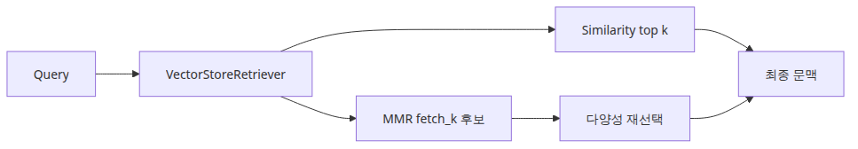
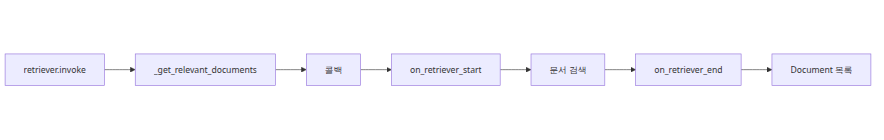
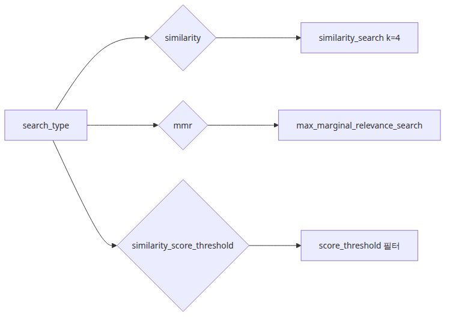
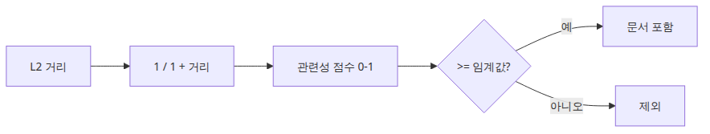

# Retriever 설계 — VectorStoreRetriever와 MMR

<!-- a-grade-intro:begin -->
## 이 글에서 답할 질문

- `BaseRetriever`는 단순 helper가 아니라 어떤 호출 규약을 강제할까요?
- `VectorStoreRetriever`는 어디에서 `similarity`, `mmr`, `threshold`로 갈라질까요?
- `fetch_k`가 `k`보다 넓어야 하는 이유는 무엇일까요?
- `lambda_mult`를 조절하면 결과 다양성은 어떻게 달라질까요?

> retriever는 가장 가까운 벡터를 기계적으로 꺼내는 부품이 아니라, 후보 집합을 어떤 정책으로 줄일지 결정하는 선택기입니다.


<!-- a-grade-intro:end -->

> RAG Deep Dive 시리즈 (3/6)

<!-- a-grade-example:begin -->
## 최소 실행 예제

예제 파일: `/root/Github/rag-deep-dive/ko/03-retriever-design/main.py`

```bash
export GROQ_API_KEY=... && python main.py
```

```python
from langchain_core.documents import Document
from langchain_community.embeddings import HuggingFaceEmbeddings
from langchain_community.vectorstores import FAISS

DOCS = [
    Document(page_content="Retry budget is three attempts before dead-lettering."),
    Document(page_content="The worker retries failed messages three times before it stops."),
    Document(page_content="After the final retry, the payload moves to the dead-letter queue."),
    Document(page_content="Operators inspect the exception chain before replaying a job."),
    Document(page_content="HTTP 429 requires exponential backoff on the client side."),
    Document(page_content="The dead-letter queue preserves the original payload for debugging."),
]
QUERY = "Why did the worker stop retrying the message?"

def show_results(label: str, docs: list[Document]) -> None:
    print(f"\n=== {label} ===")
    for index, doc in enumerate(docs, start=1):
        print(f"{index}. {doc.page_content}")

def main() -> None:
    embeddings = HuggingFaceEmbeddings(
        model_name="sentence-transformers/all-MiniLM-L6-v2"
    )
    store = FAISS.from_documents(DOCS, embeddings)

    similarity = store.as_retriever(
        search_type="similarity",
        search_kwargs={"k": 2},
    )
    mmr_small = store.as_retriever(
        search_type="mmr",
        search_kwargs={"k": 2, "fetch_k": 4, "lambda_mult": 0.3},
    )
    mmr_wide = store.as_retriever(
        search_type="mmr",
        search_kwargs={"k": 2, "fetch_k": 6, "lambda_mult": 0.3},
    )

    show_results("similarity k=2", similarity.invoke(QUERY))
    show_results("mmr k=2 fetch_k=4", mmr_small.invoke(QUERY))
    show_results("mmr k=2 fetch_k=6", mmr_wide.invoke(QUERY))

if __name__ == "__main__":
    main()
```

### 이 코드에서 봐야 할 것

- 같은 vector store라도 `search_type`에 따라 반환 문서 집합이 달라집니다.
- `fetch_k`를 넓히면 MMR이 중복이 아닌 다른 근거를 고를 공간이 생깁니다.
- `lambda_mult`가 낮을수록 다양성 쪽 가중치가 커집니다.

### 실무에서 헷갈리는 지점

- `k`만 늘리면 다양성이 좋아질 것이라고 생각하기 쉽습니다.
- `fetch_k == k` 상태에서는 MMR이 사실상 similarity search와 비슷해질 수 있습니다.
- retriever threshold와 vector store raw score threshold는 같은 계층이 아닙니다.

## 체크리스트

- [ ] similarity와 MMR을 같은 질의로 비교해 봤다.
- [ ] `fetch_k`를 `k`보다 충분히 크게 잡아 봤다.
- [ ] `lambda_mult`를 조절하며 중복과 커버리지 trade-off를 확인했다.
- [ ] 검색 품질 문제를 임베딩 문제와 retriever 정책 문제로 분리해서 봤다.
<!-- a-grade-example:end -->

## 소스 버전

이 글의 모든 코드 인용은 [`langchain-ai/langchain @ langchain==0.2.17`](https://github.com/langchain-ai/langchain/tree/langchain==0.2.17) 기준입니다.

2화에서 본 벡터 인덱스는 청크를 좌표로 바꾸는 곳이었습니다. 3화의 retriever는 그 좌표계를 실제 문맥 후보 목록으로 바꾸는 곳입니다. 이 지점이 중요한 이유는 단순합니다. 벡터 공간에서는 가까워 보이던 것들이, 실제 답변에 필요한 맥락 순서로는 엉뚱하게 정렬될 수 있기 때문입니다. 거리 계산은 정확했는데도 사용자는 “왜 이렇게 비슷한 문단만 여러 개 가져오지?” 혹은 “왜 딱 한 줄 차이인 정책 문서들만 쌓이지?” 같은 불만을 말합니다. 문제는 임베딩이 아니라 그 위에서 top-k를 어떤 규칙으로 꺼냈는가에 있습니다.

Retriever는 바로 그 규칙을 담당합니다. 같은 vector store라도 `similarity`로 가져오느냐, `mmr`로 다양성을 섞느냐, `similarity_score_threshold`로 점수 문턱을 두느냐에 따라 최종 컨텍스트의 모양이 달라집니다. 더 중요한 점도 있습니다. LangChain의 retriever 계층은 단순 convenience wrapper가 아닙니다. `BaseRetriever.invoke()`에서 callback run을 열고, `VectorStoreRetriever`에서 `search_type`별 분기를 타고, vector store에서 다시 거리값을 relevance score로 바꾸는 과정까지 묶여 있습니다. 소스 수준에서 보면 검색 품질은 “가장 가까운 벡터를 몇 개 가져오느냐”보다 “그 벡터들을 어떤 인터페이스와 어떤 의미 체계로 다루느냐”에 훨씬 더 가깝습니다.

이번 글은 그 연결선을 따라갑니다. 먼저 `BaseRetriever`가 `invoke()`와 `_get_relevant_documents()`를 어떻게 잇는지, callback과 `run_manager`가 어디를 통과하는지 보겠습니다. 이어서 `VectorStoreRetriever`가 `similarity`, `mmr`, `similarity_score_threshold`를 어떻게 분기하는지 확인합니다. 그다음 FAISS 구현의 `max_marginal_relevance_search()`와 `langchain_community.vectorstores.utils.maximal_marginal_relevance()`를 따라가며 왜 `fetch_k`가 `k`보다 훨씬 커야 하는지 설명합니다. 이어서 threshold 검색이 FAISS L2 거리와 만날 때 relevance score 변환이 왜 중요한지 살펴본 뒤, 마지막으로 메타데이터 기준으로 검색 범위를 먼저 좁히는 custom retriever 패턴까지 정리하겠습니다.

---

## 1. `BaseRetriever`는 어떤 호출 규약을 강제하는가

LangChain 0.2.17에서 retriever의 기준 인터페이스는 `langchain_core.retrievers.BaseRetriever`입니다. 이 클래스는 “문자열 질의를 받아 `Document` 리스트를 돌려준다”는 단순 추상처럼 보이지만, 실제로는 Runnable 체계 위에 올라가 있습니다. 그래서 권장 진입점은 예전의 `get_relevant_documents()`가 아니라 `invoke()`와 `ainvoke()`입니다. 이 차이가 중요한 이유는 retriever 호출이 이제 단순 함수 실행이 아니라, callback과 tracing metadata를 포함한 runnable run으로 취급되기 때문입니다.



소스를 보면 `invoke()`는 먼저 `ensure_config(config)`로 실행 설정을 정리하고, 그다음 `CallbackManager.configure(...)`를 호출해 callback manager를 만듭니다. 이때 `config`에 들어온 `callbacks`, `tags`, `metadata`와 retriever 인스턴스가 가진 `self.tags`, `self.metadata`, 그리고 `_get_ls_params()`가 돌려주는 LangSmith용 추적 메타데이터가 함께 합쳐집니다. 이후 `callback_manager.on_retriever_start(...)`가 실행되면서 `run_manager`가 생성되고, 실제 검색 로직은 이 `run_manager`를 받은 `_get_relevant_documents()`로 넘어갑니다. 검색이 성공하면 `run_manager.on_retriever_end(result)`, 실패하면 `run_manager.on_retriever_error(e)`가 호출됩니다. 즉 retriever는 검색 결과만 돌려주는 것이 아니라, 그 검색을 하나의 관측 가능한 run으로 감쌉니다.

여기서 `run_manager`가 왜 중요한지도 분명해집니다. custom retriever를 작성할 때 단순히 검색 함수만 구현하는 것이 아니라, 필요하면 내부 단계별 callback 이벤트를 더 내보낼 수 있기 때문입니다. 0.2.17의 `BaseRetriever.__init_subclass__()`는 자식 클래스의 `_get_relevant_documents()` 시그니처를 검사해서 `run_manager` 인자를 지원하는지 확인하고, 구버전 retriever가 public 메서드인 `get_relevant_documents()`를 직접 구현했더라도 deprecation warning과 함께 내부 메서드로 연결해 줍니다. 하위 호환은 유지하되, 새 기준은 분명히 `_get_relevant_documents()`라는 뜻입니다.

비동기 경로도 같은 원칙으로 읽어야 합니다. `ainvoke()`는 `AsyncCallbackManager.configure(...)`로 async run manager를 만들고, `_aget_relevant_documents()`를 호출합니다. 그런데 모든 retriever가 진짜 async 구현을 갖고 있는 것은 아닙니다. 그래서 `BaseRetriever`는 기본 `_aget_relevant_documents()`를 제공하고, 그 구현은 `run_in_executor(...)`로 동기 `_get_relevant_documents()`를 스레드풀에서 실행합니다. 이 fallback이 필요한 이유는 retriever 인터페이스를 async 체인 안에서도 일관되게 연결하기 위해서입니다. 즉 `_aget_relevant_documents()`가 존재하는 이유는 두 가지입니다. 하나는 네이티브 async I/O를 쓰는 retriever가 직접 최적화된 구현을 제공할 수 있게 하기 위해서이고, 다른 하나는 그런 구현이 없더라도 Runnable async 인터페이스를 유지하기 위해서입니다.

Public 메서드의 deprecation 의미도 여기서 정리됩니다. `get_relevant_documents()`와 `aget_relevant_documents()`는 0.1.46부터 deprecated이며, 각각 `invoke()`와 `ainvoke()`의 호환성 래퍼로만 남아 있습니다. 소스에는 removal target이 1.0으로 적혀 있습니다. 그래서 0.2.x 사용자가 “아직 동작하는데 왜 deprecated인가”라고 묻는다면 답은 명확합니다. 검색 로직의 중심이 이제 retriever 전용 public 메서드가 아니라 Runnable 표준 진입점으로 옮겨졌기 때문입니다. 앞으로는 retriever도 chain, model, parser와 같은 방식으로 `invoke()`와 `batch()`에 맞춰 조합된다는 뜻입니다.

아래 예시는 `BaseRetriever` 규약을 가장 작게 드러내는 custom 구현입니다.

```python
from typing import List

from langchain_core.callbacks.manager import CallbackManagerForRetrieverRun
from langchain_core.documents import Document
from langchain_core.retrievers import BaseRetriever

class KeywordWindowRetriever(BaseRetriever):
    docs: List[Document]
    k: int = 2

    def _get_relevant_documents(
        self, query: str, *, run_manager: CallbackManagerForRetrieverRun
    ) -> List[Document]:
        matched = [doc for doc in self.docs if query.lower() in doc.page_content.lower()]
        run_manager.on_text(f"matched {len(matched)} documents before truncation")
        return matched[: self.k]

def main() -> None:
    retriever = KeywordWindowRetriever(
        docs=[
            Document(page_content="Payment worker retries failed jobs three times."),
            Document(page_content="HTTP 429 indicates per-minute quota exhaustion."),
            Document(page_content="Dead-letter messages keep the original payload."),
        ],
        k=2,
    )
    results = retriever.invoke("worker")
    for doc in results:
        print(doc.page_content)

if __name__ == "__main__":
    main()
```

이 섹션의 기준선은 간단합니다. `BaseRetriever`는 검색 함수를 하나 감싼 추상 클래스가 아니라, callback 수명주기와 sync/async 호환 규약을 강제하는 runnable 인터페이스입니다. 그래서 이후에 볼 `VectorStoreRetriever`도 단순 top-k 래퍼로 읽으면 구조를 절반만 본 셈입니다.

---

## 2. `VectorStoreRetriever`는 어디에서 분기하는가

`VectorStoreRetriever`는 이름 그대로 vector store 위에 얹힌 기본 retriever입니다. 하지만 구현을 읽어 보면 “vector store를 retriever처럼 보이게 해 주는 어댑터” 이상입니다. 이 클래스는 `search_type`과 `search_kwargs`를 상태로 들고 있고, `_get_relevant_documents()`에서 그 둘을 vector store의 서로 다른 검색 메서드로 분기합니다. 즉 retriever 품질의 첫 번째 조정 손잡이는 vector store 내부가 아니라 바로 이 클래스의 분기점에 있습니다.



소스의 `allowed_search_types`는 세 가지입니다.

- `similarity`
- `similarity_score_threshold`
- `mmr`

`validate_search_type()`는 인스턴스 생성 시 이 값이 허용 목록에 있는지 검증하고, `search_type == "similarity_score_threshold"`일 때는 `search_kwargs["score_threshold"]`가 `float`인지까지 확인합니다. 이 검증이 중요한 이유는 threshold 검색이 “그냥 similarity search에 옵션 하나 더 준 것”이 아니기 때문입니다. 실제 호출 경로가 다릅니다.

`_get_relevant_documents()`는 아주 직설적입니다. `search_type == "similarity"`면 `self.vectorstore.similarity_search(query, **self.search_kwargs)`를 호출합니다. `search_type == "similarity_score_threshold"`면 `self.vectorstore.similarity_search_with_relevance_scores(query, **self.search_kwargs)`를 호출하고, 그 결과 `(doc, score)` 튜플에서 문서만 꺼냅니다. `search_type == "mmr"`면 `self.vectorstore.max_marginal_relevance_search(query, **self.search_kwargs)`를 호출합니다. 비동기 버전 `_aget_relevant_documents()`도 같은 구조로 `asimilarity_search`, `asimilarity_search_with_relevance_scores`, `amax_marginal_relevance_search`를 부릅니다.

이 흐름을 기준으로 파라미터가 어디에 사는지도 분리해서 봐야 합니다. `k`는 세 경로 모두에서 “최종 반환 문서 수”에 해당하지만, 의미는 미묘하게 다릅니다. `similarity`에서는 그대로 top-k입니다. `similarity_score_threshold`에서는 relevance score로 변환된 뒤 threshold를 통과한 문서들 가운데 최대 k개입니다. `mmr`에서는 먼저 더 큰 후보 집합을 모은 뒤 그 안에서 다양성을 반영해 최종 k개를 고르는 마지막 선택 폭입니다.

`fetch_k`는 오직 MMR 계열에서 의미가 있습니다. `VectorStoreRetriever` 자신은 이 값을 해석하지 않고 그대로 vector store로 넘깁니다. FAISS 구현을 기준으로 보면 `max_marginal_relevance_search()`가 질의를 임베딩한 뒤 `max_marginal_relevance_search_by_vector()`로 넘기고, 거기서 다시 `max_marginal_relevance_search_with_score_by_vector()`가 실제 후보 `fetch_k`개를 index search로 가져옵니다. 따라서 `fetch_k`는 retriever 계층의 옵션이지만, 실제 소비 지점은 store의 MMR 구현입니다.

`score_threshold`는 threshold 검색에서만 의미가 있고, 더 정확히는 `similarity_search_with_relevance_scores()` 경로에서 해석됩니다. 여기서 중요한 점은 `VectorStoreRetriever`가 raw FAISS distance를 직접 비교하지 않는다는 것입니다. 먼저 vector store가 raw distance를 relevance score로 변환하고, 그다음 threshold를 적용합니다. 같은 이름의 파라미터라도 raw distance 기준인지, normalized relevance 기준인지가 다를 수 있으므로 이 호출 체인을 분리해서 봐야 합니다.

이 경로를 가장 작은 코드로 보면 아래와 같습니다.

```python
from langchain_core.documents import Document
from langchain_community.vectorstores import FAISS
from langchain_community.embeddings import HuggingFaceEmbeddings

def build_store() -> FAISS:
    docs = [
        Document(page_content="Workers retry failed jobs three times.", metadata={"source": "runbook"}),
        Document(page_content="Dead-letter queues preserve the original payload.", metadata={"source": "runbook"}),
        Document(page_content="HTTP 429 means the caller exceeded quota.", metadata={"source": "api"}),
    ]
    embeddings = HuggingFaceEmbeddings(model_name="sentence-transformers/all-MiniLM-L6-v2")
    return FAISS.from_documents(docs, embeddings)

def main() -> None:
    store = build_store()

    similarity_retriever = store.as_retriever(
        search_type="similarity",
        search_kwargs={"k": 2},
    )
    threshold_retriever = store.as_retriever(
        search_type="similarity_score_threshold",
        search_kwargs={"k": 3, "score_threshold": 0.2},
    )
    mmr_retriever = store.as_retriever(
        search_type="mmr",
        search_kwargs={"k": 2, "fetch_k": 6, "lambda_mult": 0.3},
    )

    print("similarity")
    for doc in similarity_retriever.invoke("retry policy"):
        print(doc.page_content)

    print("threshold")
    for doc in threshold_retriever.invoke("retry policy"):
        print(doc.page_content)

    print("mmr")
    for doc in mmr_retriever.invoke("retry policy"):
        print(doc.page_content)

if __name__ == "__main__":
    main()
```

정리하면 `VectorStoreRetriever`의 핵심은 얇은 래퍼라는 사실이 아니라, **어떤 검색 의미론을 선택할지 결정하는 첫 분기점**이라는 사실입니다. 실제 검색 품질은 vector space 자체와 함께 이 분기를 어떻게 택했는지에 의해 크게 달라집니다.

---

## 3. MMR은 어떻게 비슷한 청크만 줄 세우는 문제를 완화하는가

MMR, 즉 Maximal Marginal Relevance는 “질의와의 유사도”만 최대화하면 생기는 편향을 줄이기 위한 고전적 선택 규칙입니다. 운영에서 흔한 실패는 이런 식입니다. 문서가 비슷한 템플릿으로 반복되면 similarity top-k는 사실상 같은 말을 하는 청크 여러 개를 연속으로 가져옵니다. 사용자는 top-k가 늘었는데도 새로운 증거를 얻지 못합니다. MMR은 이 후보 집합 안에서 서로 너무 닮은 항목에 패널티를 주어, 답변 컨텍스트의 폭을 넓히려는 시도입니다.


LangChain의 FAISS 구현에서 시작점을 보면 `max_marginal_relevance_search(query, k, fetch_k, lambda_mult, filter)`는 먼저 `_embed_query(query)`로 질의를 임베딩하고, `max_marginal_relevance_search_by_vector()`로 넘깁니다. 그다음 실제 후보 선택은 `max_marginal_relevance_search_with_score_by_vector()`에서 일어납니다. 이 함수는 `self.index.search(...)`로 먼저 `fetch_k`개 후보를 가져옵니다. 필터가 있으면 내부적으로 `fetch_k * 2`까지 가져온 뒤 메타데이터 필터를 적용합니다. 이후 남은 후보 벡터들을 `self.index.reconstruct(int(i))`로 다시 꺼내고, `langchain_community.vectorstores.utils`에서 가져온 `maximal_marginal_relevance(...)`에 전달합니다.

FAISS가 실제로 호출하는 MMR 핵심 함수는 `langchain_community.vectorstores.utils.maximal_marginal_relevance()`입니다. `langchain_core.vectorstores.utils` 아래에도 거의 같은 사본이 있지만, 0.2.17의 FAISS 코드 경로는 community 버전을 import해서 사용합니다. 실제 코드는 각 후보에 대해 다음 값을 계산합니다.

`equation_score = lambda_mult * query_score - (1 - lambda_mult) * redundant_score`

여기서 `query_score`는 질의와 후보 사이 cosine similarity이고, `redundant_score`는 이미 선택된 문서 집합과 그 후보 사이의 최대 cosine similarity입니다. 즉 소스의 `lambda_mult`는 “질의 유사도 쪽 가중치”입니다. 많은 설명이 이 공식을 `score = (1-λ)·similarity - λ·max_similarity_to_selected`로 적는데, 둘은 λ의 의미를 어떻게 두느냐만 다릅니다. LangChain 변수명 기준으로는 `λ = lambda_mult`가 similarity 쪽에 걸리고, diversity 가중치로 다시 이름 붙이면 사용자가 익숙한 `(1-λ)` / `λ` 표기로 다시 쓸 수 있습니다. 중요한 것은 기호보다 역할입니다. 하나는 질의와의 가까움, 다른 하나는 이미 뽑힌 항목과의 중복 패널티입니다.

이 구현은 greedy selection입니다. 먼저 질의와 가장 비슷한 항목 하나를 고르고, 그다음부터는 아직 선택되지 않은 후보들에 대해 위 공식을 계산해 최고 점수를 하나씩 추가합니다. 그래서 `fetch_k`가 `k`보다 훨씬 커야 합니다. `fetch_k == k`면 MMR이 개입할 여지가 거의 없습니다. 이미 similarity top-k만 받아 놓고 그 안에서 다양성을 계산해 봐야, 후보 폭 자체가 너무 좁기 때문입니다. 특히 정책 문서처럼 유사 문단이 여러 버전으로 반복되거나, 로그 템플릿이 거의 같은 문장만 다른 숫자로 채워질 때는 `fetch_k`를 넉넉히 잡아야 MMR이 “다른 의미 단위”를 찾을 공간이 생깁니다.

실무에서 자주 쓰는 감각적인 기준도 여기서 나옵니다. `k=4`라면 `fetch_k=20`은 시작점으로 무난하고, 중복이 심한 코퍼스라면 `fetch_k=40` 이상도 충분히 고려할 만합니다. `lambda_mult`는 0에 가까울수록 다양성 패널티가 커지고, 1에 가까울수록 그냥 similarity search와 비슷해집니다. 경험적으로는 0.2~0.4가 중복이 많은 문서군에서 안정적인 편이고, 0.5는 균형점, 0.7 이상은 “조금만 다양성을 섞은 similarity search”에 가깝습니다. 다만 정답은 코퍼스 모양에 따라 달라집니다. FAQ처럼 질문 하나에 답 하나 구조라면 너무 낮은 `lambda_mult`는 오히려 핵심 답 근처에서 멀어질 수 있습니다.

아래 예시는 같은 질의에 대해 MMR 파라미터를 바꿔 보는 최소 구성입니다.

```python
from langchain_core.documents import Document
from langchain_community.vectorstores import FAISS
from langchain_community.embeddings import HuggingFaceEmbeddings

def main() -> None:
    docs = [
        Document(page_content="Retry budget is three attempts before dead-lettering."),
        Document(page_content="The worker retries failed messages three times."),
        Document(page_content="Dead-letter queues keep the original payload for debugging."),
        Document(page_content="HTTP 429 responses require exponential backoff."),
        Document(page_content="Operators inspect exception chains after the final retry."),
    ]

    embeddings = HuggingFaceEmbeddings(model_name="sentence-transformers/all-MiniLM-L6-v2")
    store = FAISS.from_documents(docs, embeddings)

    print("lambda_mult=0.8")
    for doc in store.max_marginal_relevance_search(
        "Why did the worker stop retrying?",
        k=3,
        fetch_k=10,
        lambda_mult=0.8,
    ):
        print(doc.page_content)

    print("lambda_mult=0.2")
    for doc in store.max_marginal_relevance_search(
        "Why did the worker stop retrying?",
        k=3,
        fetch_k=10,
        lambda_mult=0.2,
    ):
        print(doc.page_content)

if __name__ == "__main__":
    main()
```

결국 MMR은 “더 똑똑한 similarity”가 아니라, **후보를 넓게 가져온 뒤 중복을 줄이는 재선택 단계**입니다. 그래서 실패를 줄이려면 `k`만 조절할 것이 아니라 `fetch_k`와 `lambda_mult`를 함께 봐야 합니다.

---

## 4. `similarity_score_threshold`는 거리와 점수를 어떻게 구분하는가

Threshold 검색은 이름만 보면 단순합니다. 점수가 일정 기준 이상인 문서만 남기면 되기 때문입니다. 하지만 FAISS L2를 쓸 때는 바로 여기서 가장 흔한 오해가 생깁니다. FAISS가 `IndexFlatL2`에서 반환하는 것은 similarity score가 아니라 거리값입니다. 값이 낮을수록 더 가깝습니다. 따라서 threshold를 raw distance에 바로 적용하면, score threshold라고 부르면서 사실은 “거리 상한”을 주는 셈이 됩니다. LangChain은 이 혼란을 줄이기 위해 relevance score 변환 계층을 하나 더 둡니다.



`VectorStoreRetriever`에서 `search_type="similarity_score_threshold"`를 선택하면 호출 경로는 `vectorstore.similarity_search_with_relevance_scores(...)`입니다. 이 함수는 먼저 `_similarity_search_with_relevance_scores()`를 호출하고, 내부에서 다시 `similarity_search_with_score()`의 raw 결과를 가져옵니다. 이후 `_select_relevance_score_fn()`이 돌려준 함수를 사용해 거리나 유사도를 0~1 범위의 relevance score로 바꿉니다. 마지막으로 `score_threshold`가 있으면 `similarity >= score_threshold` 기준으로 필터링합니다. 즉 retriever 경로에서 threshold는 normalized relevance 기준입니다.

FAISS 구현에서는 `_select_relevance_score_fn()`이 세 단계로 동작합니다. 첫째, 생성자에 `relevance_score_fn=`을 넘겼다면 그것을 그대로 사용합니다. 둘째, override가 없으면 `distance_strategy`를 보고 기본 함수를 고릅니다. `MAX_INNER_PRODUCT`면 `_max_inner_product_relevance_score_fn`, `EUCLIDEAN_DISTANCE`면 `_euclidean_relevance_score_fn`, `COSINE`이면 `_cosine_relevance_score_fn`입니다. 셋째, 알 수 없는 전략이면 예외를 냅니다. 즉 `relevance_score_fn`을 직접 주지 않았다고 해서 점수 변환이 사라지는 것이 아니라, 기본 fallback이 distance strategy 기반으로 선택됩니다.

L2 경로의 기본 함수도 소스에 명시돼 있습니다. `_euclidean_relevance_score_fn(distance)`는 `1.0 - distance / math.sqrt(2)`를 반환합니다. 이 식은 “정규화된 임베딩의 유클리드 거리”를 전제로 합니다. 2화에서 봤듯이 LangChain의 `OpenAIEmbeddings` 경로는 벡터를 L2 정규화합니다. 그런 조건에서는 완전히 같은 벡터일수록 1에 가깝고, 멀수록 0에 가까운 relevance score로 해석할 수 있습니다. 하지만 벡터가 정규화돼 있지 않거나 distance semantics가 다르면 점수가 0~1 범위를 벗어날 수 있고, `similarity_search_with_relevance_scores()`는 이런 경우 warning을 냅니다. “threshold가 이상하게 먹는다”는 문제는 대개 여기서 시작합니다.

한 가지 더 구분해야 할 점이 있습니다. FAISS 클래스의 raw 메서드 `similarity_search_with_score_by_vector()`도 `score_threshold` kwarg를 받지만, 이때는 raw distance/score에 직접 비교합니다. `distance_strategy`가 `EUCLIDEAN_DISTANCE`면 `operator.le`를 써서 더 작은 거리만 남기고, `MAX_INNER_PRODUCT`나 `JACCARD`면 `operator.ge`를 씁니다. 반면 `VectorStoreRetriever`의 threshold 검색은 raw 비교가 아니라 relevance score 변환 뒤 비교입니다. 이름이 비슷해도 경로가 다르므로, 디버깅할 때는 “어느 threshold를 어디에 준 것인가”를 분리해야 합니다.

이 차이는 아래 예시로 드러납니다.

```python
from langchain_core.documents import Document
from langchain_community.vectorstores import FAISS
from langchain_community.embeddings import HuggingFaceEmbeddings

def main() -> None:
    docs = [
        Document(page_content="Retry budget is three attempts.", metadata={"source": "ops"}),
        Document(page_content="HTTP 429 requires exponential backoff.", metadata={"source": "api"}),
        Document(page_content="Dead-letter queues preserve payloads.", metadata={"source": "ops"}),
    ]

    embeddings = HuggingFaceEmbeddings(model_name="sentence-transformers/all-MiniLM-L6-v2")
    store = FAISS.from_documents(docs, embeddings)

    print("raw scores")
    for doc, score in store.similarity_search_with_score("retry budget", k=3):
        print(round(score, 4), doc.page_content)

    print("relevance scores")
    for doc, score in store.similarity_search_with_relevance_scores("retry budget", k=3):
        print(round(score, 4), doc.page_content)

    retriever = store.as_retriever(
        search_type="similarity_score_threshold",
        search_kwargs={"k": 3, "score_threshold": 0.2},
    )
    print("threshold results")
    for doc in retriever.invoke("retry budget"):
        print(doc.page_content)

if __name__ == "__main__":
    main()
```

이 섹션의 결론은 명확합니다. `similarity_score_threshold`는 점수형 필터지만, FAISS L2에서는 그 점수가 raw distance 그대로가 아닙니다. LangChain은 relevance score 변환층을 두고, 기본 `relevance_score_fn`이 없을 때도 `distance_strategy`를 보고 fallback 함수를 고릅니다. 그래서 threshold 튜닝은 인덱스의 raw 수치가 아니라 **변환된 relevance 의미론**을 기준으로 해야 합니다.

---

## 5. Custom retriever는 언제 필요한가

`VectorStoreRetriever`가 기본 선택으로 충분한 경우는 많습니다. 하지만 검색 범위를 미리 잘라야 하는 도메인에서는 그것만으로 부족합니다. 예를 들어 사용자 질문이 “runbook 안에서만 찾기”인지, “api 문서 안에서만 찾기”인지가 이미 애플리케이션 상태로 정해져 있다면, 전역 인덱스 전체를 검색한 뒤 metadata filter로 후보를 걷어내는 방식은 늦습니다. FAISS 구현을 보면 일반 similarity 경로는 먼저 index search를 하고 나서 파이썬 레이어에서 filter를 적용합니다. MMR 경로는 필터가 있을 때 아예 `fetch_k * 2`로 더 넓게 가져와야 합니다. 즉 filter가 강할수록 “먼저 다 찾고 나중에 버리는” 비용이 커집니다.


그래서 custom retriever가 필요한 첫 번째 이유는 검색 의미론 자체를 바꾸기 위해서가 아니라, **검색 범위를 vector search 이전에 줄이기 위해서**입니다. `BaseRetriever`를 상속하면 이 정책을 직접 구현할 수 있습니다. 가장 단순한 패턴은 source별로 별도 vector store를 만들어 두고, retriever가 `doc.metadata["source"]` 값에 따라 적절한 하위 인덱스를 고른 뒤 그 안에서만 similarity search를 수행하는 방식입니다. 이렇게 하면 메타데이터 필터가 post-filter가 아니라 pre-routing이 됩니다.

이 패턴은 “filter 기능이 있으니 굳이 custom retriever가 왜 필요하지?”라는 질문에 대한 좋은 답입니다. 전역 인덱스 + metadata filter는 검색 결과를 줄이는 도구이고, source별 하위 인덱스 + custom retriever는 검색 공간 자체를 줄이는 도구입니다. 둘은 비용 구조가 다릅니다.

아래 코드는 source별 하위 인덱스를 고르는 retriever 예시입니다.

```python
from collections import defaultdict
from typing import Dict, List

from langchain_core.callbacks.manager import CallbackManagerForRetrieverRun
from langchain_core.documents import Document
from langchain_core.embeddings import Embeddings
from langchain_core.retrievers import BaseRetriever
from langchain_community.vectorstores import FAISS
from langchain_community.embeddings import HuggingFaceEmbeddings

def build_source_indexes(
    documents: List[Document], embeddings: Embeddings
) -> Dict[str, FAISS]:
    grouped: Dict[str, List[Document]] = defaultdict(list)
    for doc in documents:
        grouped[doc.metadata["source"]].append(doc)
    return {
        source: FAISS.from_documents(source_docs, embeddings)
        for source, source_docs in grouped.items()
    }

class SourceScopedRetriever(BaseRetriever):
    stores_by_source: Dict[str, FAISS]
    source: str
    k: int = 4

    def _get_relevant_documents(
        self, query: str, *, run_manager: CallbackManagerForRetrieverRun
    ) -> List[Document]:
        store = self.stores_by_source.get(self.source)
        if store is None:
            run_manager.on_text(f"no index for source={self.source}")
            return []
        run_manager.on_text(f"searching source={self.source}")
        return store.similarity_search(query, k=self.k)

def main() -> None:
    embeddings = HuggingFaceEmbeddings(model_name="sentence-transformers/all-MiniLM-L6-v2")
    documents = [
        Document(
            page_content="Workers retry failed jobs three times before dead-lettering.",
            metadata={"source": "runbook"},
        ),
        Document(
            page_content="Operators inspect the exception chain after the final retry.",
            metadata={"source": "runbook"},
        ),
        Document(
            page_content="HTTP 429 means the caller exceeded the public API quota.",
            metadata={"source": "api"},
        ),
        Document(
            page_content="Backoff is mandatory for retrying 429 responses.",
            metadata={"source": "api"},
        ),
    ]

    stores_by_source = build_source_indexes(documents, embeddings)
    retriever = SourceScopedRetriever(
        stores_by_source=stores_by_source,
        source="runbook",
        k=2,
    )

    for doc in retriever.invoke("Why did the worker stop retrying?"):
        print(doc.page_content)

if __name__ == "__main__":
    main()
```

이 예시는 source 값을 생성 시점에 고정했지만, 실제 서비스에서는 세션 컨텍스트나 권한 정보에 따라 source를 선택하게 만들 수도 있습니다. 중요한 것은 구현 디테일보다 경계 위치입니다. vector search 전에 범위를 줄이면 recall을 의도적으로 제한하는 대신 latency와 잡음을 함께 줄일 수 있습니다. 반대로 post-filter에만 의존하면 전역 코퍼스가 커질수록 비용이 늘고, `fetch_k`를 키워도 원하는 source 안에서 후보 다양성을 확보하지 못할 수 있습니다.

---

## 이번 화에서 남겨 둘 기준선

이번 화의 기준선은 이렇게 정리할 수 있습니다. `BaseRetriever`는 `invoke()` / `ainvoke()`를 중심으로 callback run과 sync/async 호환을 강제하는 runnable 인터페이스입니다. `get_relevant_documents()` 계열은 0.2.x에서 아직 남아 있지만 이미 호환성 래퍼입니다. `VectorStoreRetriever`는 `similarity`, `mmr`, `similarity_score_threshold` 세 갈래로 검색 의미론을 분기하며, `k`, `fetch_k`, `score_threshold`는 각 경로에서 서로 다른 위치와 의미를 가집니다. MMR은 먼저 넓게 후보를 가져온 뒤 질의 유사도와 중복 패널티를 함께 계산하는 greedy 재선택 단계이고, 그래서 `fetch_k >> k`가 사실상 필수입니다. Threshold 검색은 raw FAISS distance가 아니라 relevance score 변환층을 거친 값에 기대고, 기본 `relevance_score_fn`이 없더라도 `distance_strategy` 기반 fallback이 동작합니다. 마지막으로 custom retriever는 검색 품질을 꾸미기 위한 장식이 아니라, search space를 vector search 이전에 줄여야 할 때 필요한 정책 계층입니다.

이 기준선을 잡아 두면 다음 화가 자연스럽게 이어집니다. retriever가 뽑아 온 문서들은 아직 답변이 아닙니다. 그 문서들을 어떤 순서로 붙이고, 얼마나 압축하고, 어떤 프롬프트 슬롯에 주입하느냐가 다음 실패 지점입니다. 4화에서는 retrieval 이후 단계인 prompt construction과 context injection을 소스와 실제 체인 형태에 맞춰 이어서 보겠습니다.

<!-- toc:begin -->
## 시리즈 목차

- [문서 로딩과 청크 전략 — LangChain TextSplitter 내부](./01-document-loading-and-chunking.md)
- [임베딩과 벡터 인덱스 — FAISS IndexFlatL2 동작 원리](./02-embeddings-and-vector-index.md)
- **Retriever 설계 — VectorStoreRetriever와 MMR (현재 글)**
- 프롬프트 구성과 컨텍스트 주입 — PromptTemplate 내부 (예정)
- RAG Chain 조립 — RetrievalQA vs LCEL (예정)
- 평가와 품질 게이트 — RAGAS 메트릭과 Faithfulness (예정)

<!-- toc:end -->

---

## 참고 자료

- [LangChain `BaseRetriever` source](https://github.com/langchain-ai/langchain/blob/langchain==0.2.17/libs/core/langchain_core/retrievers.py)
- [LangChain `VectorStore` and `VectorStoreRetriever` source](https://github.com/langchain-ai/langchain/blob/langchain==0.2.17/libs/core/langchain_core/vectorstores/base.py)
- [LangChain FAISS vector store source](https://github.com/langchain-ai/langchain/blob/langchain==0.2.17/libs/community/langchain_community/vectorstores/faiss.py)
- [LangChain community vector store utils with `maximal_marginal_relevance`](https://github.com/langchain-ai/langchain/blob/langchain==0.2.17/libs/community/langchain_community/vectorstores/utils.py)
- [LangChain core vector store utils copy](https://github.com/langchain-ai/langchain/blob/langchain==0.2.17/libs/core/langchain_core/vectorstores/utils.py)
- [LangChain community vector store utils with `DistanceStrategy`](https://github.com/langchain-ai/langchain/blob/langchain==0.2.17/libs/community/langchain_community/vectorstores/utils.py)
- [LangChain `VectorStore.as_retriever` API source](https://github.com/langchain-ai/langchain/blob/langchain==0.2.17/libs/core/langchain_core/vectorstores/base.py#L937-L1002)

Tags: RAG, LangChain, Vector Search, LLM
