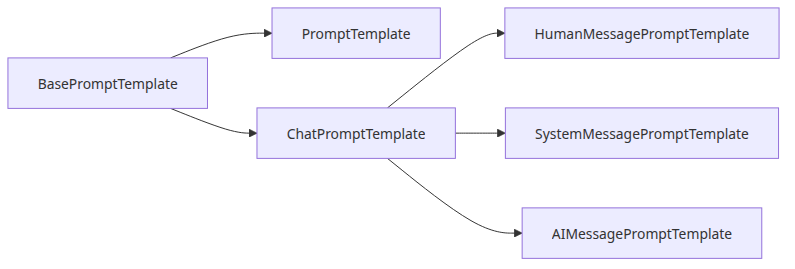
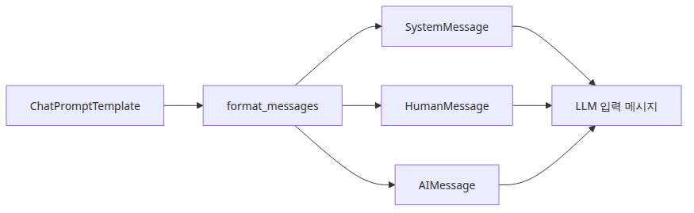
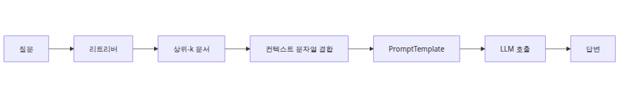
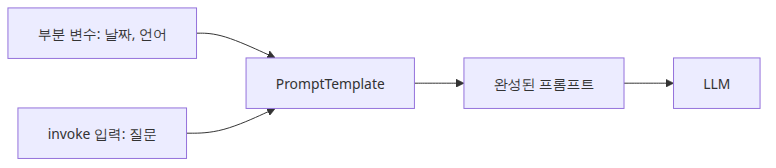
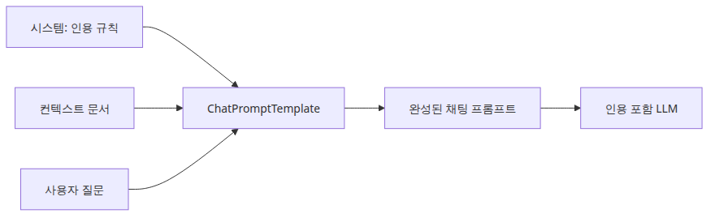

# 프롬프트 구성과 컨텍스트 주입 — PromptTemplate 내부

> RAG Deep Dive 시리즈 (4/6)

## 소스 버전

이 글의 모든 코드 인용은 [`langchain-ai/langchain @ langchain==0.2.17`](https://github.com/langchain-ai/langchain/tree/langchain==0.2.17) 기준입니다.

3화가 끝난 시점에는 retriever가 이미 할 일을 끝냈습니다. 관련 청크는 `Document` 객체로 메모리에 올라와 있고, 순위도 매겨져 있습니다. 그런데 여기서 바로 답이 나오는 것은 아닙니다. 모델이 실제로 보게 될 입력으로 다시 한 번 좁혀지는 단계가 남아 있기 때문입니다. 그 마지막 좁힘이 프롬프트 구성입니다. 어떤 필드가 남는지, 어떤 순서로 들어가는지, 시스템 지시와 검색 문맥 가운데 무엇이 더 눈에 띄는지, 그리고 이 모든 것이 모델의 컨텍스트 윈도 안에 실제로 들어가는지가 여기서 결정됩니다.

그래서 프롬프트 계층은 보기 좋게 문장을 붙이는 보조 장치가 아닙니다. RAG에서는 추론 직전의 마지막 손실 지점입니다. retriever가 맞는 청크를 가져와도 답변이 실패하는 경우가 있습니다. 문맥 조립이 조악해서 중요 문장을 묻어 버렸거나, 청크마다 붙인 보일러플레이트가 너무 많아서 실제 증거보다 장식이 커졌거나, 질문보다 배경 설명이 더 길어졌거나, 전체 길이가 모델 한도를 넘었기 때문입니다. LangChain 소스를 보면 이 경계가 꽤 노골적으로 드러납니다. `PromptTemplate`와 `ChatPromptTemplate`는 단순 문자열이 아니라, 변수 검증과 partial binding, prompt value 변환, 그리고 retrieval 경로에서는 `Document.page_content`를 `{context}`로 바꾸는 과정까지 직접 담당하는 runnable 객체입니다.

이번 글은 그 경로를 소스 수준에서 따라갑니다. 먼저 `PromptTemplate` 자체가 어떤 규약을 강제하는지 보고, 이어서 `ChatPromptTemplate.from_messages()`가 여러 메시지 템플릿을 어떻게 조립하는지 보겠습니다. 그다음 `RetrievalQA`와 `StuffDocumentsChain` 안에서 실제 컨텍스트 문자열이 어떻게 만들어지는지 확인하고, `partial()`과 `invoke()`가 변수 흐름을 어떻게 바꾸는지 정리하겠습니다. 마지막으로는 출처 인용 규칙을 명시한 실전 RAG 채팅 프롬프트 예시와 함께, 언제 기본 stuff 체인으로 충분하고 언제 직접 컨텍스트를 조립해야 하는지까지 연결해 보겠습니다.

---

## 1. `PromptTemplate` 내부 동작과 입력 변수 검증

소스에서 `PromptTemplate`는 `langchain_core.prompts.prompt.PromptTemplate`에 있지만, 실제 성격은 상속 구조를 같이 봐야 분명해집니다. `PromptTemplate`는 `StringPromptTemplate`를 상속하고, 그 위에는 다시 `BasePromptTemplate`가 있습니다. 이 구조 때문에 LangChain의 프롬프트는 “문자열 한 장”이 아닙니다. 필요한 입력 이름을 `input_variables`로 갖고, 미리 채워 둘 값은 `partial_variables`로 들고, `invoke()`로 runnable처럼 실행되며, `format_prompt()`를 호출하면 최종 문자열을 `StringPromptValue`로 감싼 결과를 돌려줍니다.



가장 흔한 생성 경로는 `PromptTemplate.from_template(template, template_format="f-string", partial_variables=None)`입니다. 구현은 생각보다 짧습니다. 먼저 `get_template_variables(template, template_format)`로 템플릿 안의 변수 이름을 뽑아 냅니다. 그다음 `partial_variables`에 이미 들어 있는 이름을 제외한 뒤 `PromptTemplate(...)`를 생성합니다. 그런데 여기서 끝이 아닙니다. `prompt.py`와 `base.py`의 validator가 두 가지를 더 강제합니다. 첫째, `stop`이라는 이름은 입력 변수나 partial 변수로 쓸 수 없습니다. 내부 예약 이름이기 때문입니다. 둘째, `input_variables`와 `partial_variables`가 겹치면 예외를 냅니다. LangChain은 변수 바인딩을 느슨한 문자열 치환이 아니라, 충돌을 미리 막아야 하는 계약으로 취급하는 셈입니다.

실제 포맷팅 경로도 소스에 선명하게 드러납니다. `PromptTemplate.format(**kwargs)`는 먼저 `_merge_partial_and_user_variables(**kwargs)`를 호출합니다. 이 단계에서 미리 바인딩된 partial 값과 호출 시점의 입력이 합쳐지고, callable partial이 있다면 여기서 평가됩니다. 그다음에야 `DEFAULT_FORMATTER_MAPPING[self.template_format](self.template, **kwargs)`가 실행됩니다. 기본 `f-string`이면 우리가 익숙한 변수 치환이고, 0.2.17은 `mustache`와 `jinja2`도 지원합니다. 다만 소스 주석이 분명히 경고하듯, `jinja2`는 sandbox가 best effort 수준일 뿐이라 신뢰할 수 없는 템플릿을 받아서는 안 됩니다.

`format_prompt()`는 한 단계를 더 올립니다. `StringPromptTemplate.format_prompt(**kwargs)`는 결국 `StringPromptValue(text=self.format(**kwargs))`를 반환합니다. 얼핏 사소해 보여도, LCEL 맥락에서는 이 차이가 중요합니다. 결과가 단순 문자열이 아니라 `PromptValue`이기 때문에, 다음 단계가 completion 모델인지 chat 모델인지에 따라 적절한 입력 형태로 다시 해석될 수 있기 때문입니다.

이 지점에서 `PromptTemplate`와 `ChatPromptTemplate`의 소스 수준 차이도 분명해집니다. `PromptTemplate.format()`은 문자열을 돌려줍니다. `PromptTemplate.format_prompt()`는 `StringPromptValue`를 돌려줍니다. 반면 채팅 프롬프트는 최종적으로 `BaseMessage` 목록을 담은 `ChatPromptValue` 쪽으로 갑니다. 즉 둘의 차이는 “예전 방식 대 새 방식”이 아니라, **문자열 한 덩어리로 모델에 넣을 것인가, 역할이 붙은 메시지 묶음으로 넣을 것인가**에 가깝습니다.

아래 코드는 문자열 프롬프트 쪽 동작을 가장 작게 보여 줍니다.

```python
from langchain_core.prompts import PromptTemplate

def main() -> None:
    prompt = PromptTemplate.from_template(
        "다음 정책 조각만 보고 질문에 답하세요.\n\n{context}\n\n질문: {question}",
        partial_variables={"context": "재시도 예산은 3회이며, 이후 dead-letter queue로 이동합니다."},
    )

    print("input variables:", prompt.input_variables)
    print("raw string:")
    print(prompt.format(question="왜 메시지가 dead-letter로 이동했나요?"))

    prompt_value = prompt.format_prompt(question="왜 메시지가 dead-letter로 이동했나요?")
    print("prompt value type:", type(prompt_value).__name__)
    print("prompt value text:")
    print(prompt_value.to_string())

if __name__ == "__main__":
    main()
```

실무 기준으로 보면 이 섹션의 핵심은 하나입니다. 프롬프트 오류는 종종 모델 호출 단계에서 발견되지만, 원인은 그보다 앞선 `PromptTemplate` 계약 위반인 경우가 많습니다. 입력 이름이 안 맞거나, partial과 호출 변수가 충돌하거나, 아예 프롬프트가 runnable로 어떤 타입을 반환하는지 이해하지 못한 채 조립하면 뒤에서 이상하게 터집니다.

---

## 2. `ChatPromptTemplate.from_messages()`와 메시지 조립 경로

문자열 프롬프트에서 채팅 프롬프트로 넘어가면 중심이 템플릿 문자열 하나에서 메시지 템플릿 목록으로 바뀝니다. `langchain_core.prompts.chat`의 구조를 보면 이 차이가 명확합니다. `SystemMessagePromptTemplate`, `HumanMessagePromptTemplate`, `AIMessagePromptTemplate`는 모두 내부적으로 문자열 프롬프트 템플릿을 감싼 얇은 래퍼입니다. 다만 최종 출력은 문자열이 아니라 각각 `SystemMessage`, `HumanMessage`, `AIMessage` 같은 concrete message 객체입니다.



가장 많이 쓰는 진입점은 `ChatPromptTemplate.from_messages(messages, template_format="f-string")`입니다. 이 메서드는 여러 형태의 message-like 입력을 내부 `self.messages` 목록으로 정규화합니다. 예를 들어 `("system", "...")` 튜플은 `SystemMessagePromptTemplate`로, `("human", "{question}")`은 `HumanMessagePromptTemplate`로 바뀝니다. 이미 만들어진 `BaseMessage`를 넘기면 그대로 저장합니다. 그래서 최종 프롬프트는 처음부터 이질적인 목록을 전제로 합니다. 어떤 항목은 정적 메시지이고, 어떤 항목은 템플릿이며, 또 어떤 항목은 대화 이력을 위한 placeholder일 수 있습니다.

실제 렌더링은 `ChatPromptTemplate.format_messages(**kwargs)`에서 일어납니다. 소스를 보면 먼저 partial 변수와 호출 변수를 합친 뒤 `self.messages`를 순회합니다. 항목이 `BaseMessage`면 그대로 결과 리스트에 넣고, 메시지 프롬프트 템플릿이나 중첩 chat prompt면 그 객체의 `format_messages(**kwargs)`를 호출해 나온 메시지들을 이어 붙입니다. 즉 이 메서드의 반환값은 문자열이 아니라 `List[BaseMessage]`입니다. 채팅 모델이 기대하는 구조적 입력이 바로 이 단계에서 만들어집니다.

메시지 클래스 자체는 의외로 얇습니다. `HumanMessage`, `SystemMessage`, `AIMessage`는 모두 `BaseMessage`를 상속하고, 공통 필드로 `content`, `additional_kwargs`, `response_metadata`, `name`, `id`를 가집니다. 그중 `AIMessage`만 모델 응답 쪽에 필요한 `tool_calls`, `invalid_tool_calls`, `usage_metadata`를 더 가집니다. 프롬프트 구성 관점에서 중요한 점은 역할 구분이 나중에 문자열을 분석해서 붙는 것이 아니라, 프롬프트 생성 단계부터 타입으로 박혀 있다는 사실입니다.

대화형 RAG에서 특히 중요한 장치가 `MessagesPlaceholder`입니다. 이 클래스는 어떤 변수 하나가 이미 메시지 리스트라고 가정합니다. `format_messages(**kwargs)`는 `kwargs[self.variable_name]`를 가져와 `convert_to_messages(...)`로 정규화하고, `n_messages`가 있으면 최근 N개만 남깁니다. `optional=True`면 값이 없어도 빈 리스트로 처리할 수 있습니다. 즉 이전 대화 이력을 억지로 한 문자열 필드에 납작하게 붙이지 않고, 메시지 구조를 유지한 채 프롬프트에 끼워 넣을 수 있습니다.

이 패턴은 conversational RAG에서 특히 유용합니다. 검색 문맥은 대개 `{context}`라는 단일 변수로 들어갑니다. 반면 이전 턴은 역할 정보가 중요하므로 메시지 리스트로 보존하는 편이 맞습니다. 이 둘을 같은 문자열로 미리 평탄화해 버리면, 채팅 프롬프트 계층이 제공하는 구조 이점을 스스로 지워 버리게 됩니다.

아래 코드는 `MessagesPlaceholder`가 실제로 어떻게 동작하는지 보여 줍니다.

```python
from langchain_core.messages import AIMessage, HumanMessage
from langchain_core.prompts import ChatPromptTemplate, MessagesPlaceholder

def main() -> None:
    prompt = ChatPromptTemplate.from_messages(
        [
            ("system", "검색된 문맥만 근거로 답하세요."),
            MessagesPlaceholder("history", optional=True, n_messages=4),
            ("human", "문맥:\n{context}\n\n질문: {question}"),
        ]
    )

    prompt_value = prompt.invoke(
        {
            "history": [
                HumanMessage(content="세 번째 재시도 뒤에는 무슨 일이 일어나나요?"),
                AIMessage(content="메시지는 dead-letter queue로 이동합니다."),
            ],
            "context": "재시도 예산은 3회이며, 이후 원본 payload가 dead-letter queue로 이동합니다.",
            "question": "운영자가 payload를 왜 다시 확인하나요?",
        }
    )

    for message in prompt_value.messages:
        print(type(message).__name__, "->", message.content)

if __name__ == "__main__":
    main()
```

정리하면 `ChatPromptTemplate`의 핵심은 문장을 보기 좋게 나누는 데 있지 않습니다. 역할이 다른 입력을 서로 다른 메시지 타입으로 유지한 채, 최종 모델 입력까지 구조를 끌고 가는 데 있습니다. RAG에서 이는 특히 중요합니다. 시스템 지시, 검색 문맥, 과거 대화는 의미도 다르고 취급도 달라야 하기 때문입니다.

---

## 3. `RetrievalQA`에서 컨텍스트는 어떻게 `{context}`가 되는가

검색 결과가 실제 프롬프트의 `{context}`로 바뀌는 경로는 `langchain/chains/retrieval_qa/base.py`에서 가장 선명하게 볼 수 있습니다. `RetrievalQA`는 0.2.17 시점에도 이미 deprecated지만, 전통적인 RAG 조립 경로를 읽기에는 오히려 더 단순해서 좋습니다. 핵심은 `_get_docs()`와 `_call()`입니다.



`RetrievalQA._get_docs()`의 구현은 아주 짧습니다. `self.retriever.invoke(question, config={"callbacks": run_manager.get_child()})`를 호출하고 `List[Document]`를 돌려줍니다. 즉 retrieval 자체는 이 시점에 끝입니다. 그다음 `_call()`은 `question = inputs[self.input_key]`로 사용자 질의를 꺼내고, `_get_docs(question)`로 문서를 얻은 뒤 아래 호출을 실행합니다.

```python
answer = self.combine_documents_chain.run(
    input_documents=docs,
    question=question,
    callbacks=_run_manager.get_child(),
)
```

이 한 줄이 retrieval과 prompt construction의 경계입니다. `RetrievalQA` 자체는 청크를 이어 붙이지 않습니다. 실제 병합은 combine-documents 체인 안에서 일어납니다. `BaseRetrievalQA.from_llm()`의 기본 경로를 보면 `LLMChain`과 `StuffDocumentsChain`을 만들고, 문서 하나를 포맷할 때 쓸 기본 `document_prompt`를 `template="Context:\n{page_content}"`로 설정합니다. 그리고 문서들이 최종 프롬프트에 들어갈 변수 이름은 `document_variable_name="context"`로 고정합니다.

이후 `StuffDocumentsChain._get_inputs()`가 실제 조립을 맡습니다. 이 메서드는 각 `Document`를 `format_document(doc, self.document_prompt)`로 문자열로 바꾸고, 그 결과를 `self.document_separator.join(doc_strings)`로 합칩니다. 기본 `document_separator`는 `"\n\n"`입니다. 따라서 기본 경로에서 `{context}`는 대략 이런 모양이 됩니다.

```text
Context:
<chunk 1>

Context:
<chunk 2>

Context:
<chunk 3>
```

즉 retriever는 구조화된 `Document` 리스트를 반환하지만, 기본 stuff 체인은 모델 직전에 그 구조를 하나의 평평한 문자열로 접어 버립니다. 문서 경계가 남는 것은 오직 문서별 포맷팅과 구분자뿐입니다. 메타데이터를 포함할지, 청크 앞에 출처를 붙일지, 섹션 헤더를 넣을지는 모두 이 조립 단계의 책임입니다.

여기서 0.2.17 LangChain의 대표적인 foot-gun도 보입니다. `RetrievalQA._call()`도, `StuffDocumentsChain.combine_docs()`도 컨텍스트가 너무 길 때 자동으로 잘라 주지 않습니다. `StuffDocumentsChain`에는 `prompt_length(docs, **kwargs)` 메서드가 있어서 현재 문서 집합으로 프롬프트를 만들면 토큰이 얼마나 되는지 계산할 수 있습니다. 하지만 이것은 권고용입니다. 기본 경로가 이 값을 강제로 검사하거나 초과 시 문서를 줄여 주지는 않습니다.

그래서 LangChain의 기본 동작은 사실상 “일단 다 붙여 보고 모델 한도 안이길 바란다”에 가깝습니다. 튜토리얼이나 작은 코퍼스에서는 버틸 수 있지만, 운영 환경에서는 위험합니다. retriever가 큰 청크를 여러 개 가져오면 LangChain은 그대로 oversized prompt를 만들고, 실패 처리는 나중의 모델 API 예외나 잘림 현상에 맡깁니다. RAG를 운영해 보면 검색 품질 문제처럼 보이던 것들 중 일부가 사실은 여기서 시작합니다. 답이 들어 있는 문서를 가져왔는데도, 최종 프롬프트에서 일부가 밀려나거나 provider가 앞뒤를 임의로 자른 경우입니다.

따라서 컨텍스트 윈도 근처에서 시스템을 돌린다면 정책을 직접 넣어야 합니다. `k`를 줄이거나, chunk 크기를 더 작게 하거나, 검색 후 압축을 하거나, 적어도 프롬프트 직전에는 토큰 예산을 계산해서 넘치는 문서를 다시 고르는 단계가 필요합니다. LangChain 소스는 그 훅을 제공하지만, 기본값이 대신 해주지는 않습니다.

---

## 4. `partial_variables`, `partial()`, 그리고 `format()`와 `invoke()`의 차이

이제 `{context}`가 어디서 오는지 봤으니, 다음은 변수들이 프롬프트 계층을 어떻게 통과하는지 정리할 차례입니다. 여기서는 `BasePromptTemplate`가 기준선입니다. 이 클래스가 partial binding과 runnable `invoke()` 둘 다 정의합니다.



`partial()`은 일회성 치환이 아니라 프롬프트 구조를 바꾸는 연산입니다. `BasePromptTemplate.partial(**kwargs)`는 현재 객체의 상태를 복사한 뒤, 새로 고정할 변수들을 `input_variables`에서 제거하고 `partial_variables`에 합쳐서 같은 타입의 새 프롬프트를 돌려줍니다. 이때 partial 값은 문자열뿐 아니라 callable도 될 수 있습니다. 그래서 매번 손으로 넘기기 귀찮지만 세션 동안은 거의 고정인 값, 예를 들어 오늘 날짜, 서비스 이름, 규정 버전, 인용 규칙 같은 것들을 미리 묶어 두기에 좋습니다.

실제 실행 시에는 `_merge_partial_and_user_variables()`가 먼저 partial을 평가하고, 그 결과 위에 호출 시점의 kwargs를 덮습니다. 소스가 단순한 만큼 이 규칙은 감춰진 마법이 아니라 공개된 계약으로 보는 편이 맞습니다. 같은 이름을 다시 넘기면 호출 입력이 우선하게 설계할 수 있고, 반대로 그런 override를 막고 싶다면 래퍼 단계에서 검증을 추가해야 합니다.

`format()`와 `invoke()` 차이도 LCEL에서는 꽤 큽니다. `format()`은 가장 좁은 결과만 반환합니다. `PromptTemplate`면 문자열, 채팅 프롬프트면 내부적으로 메시지 렌더링으로 이어지는 포맷 결과입니다. 반면 `invoke()`는 프롬프트를 runnable처럼 실행합니다. 입력 타입을 검증하고, config에 들어온 metadata와 tags를 tracing 정보와 합친 뒤, `PromptValue`를 돌려줍니다. 그래서 프롬프트가 retriever, model, parser와 같은 조합 가능한 런너블로 이어질 수 있습니다.

실무에서 이 차이는 보통 이렇게 드러납니다. 문자열이 바로 필요하면 `format()`으로 충분합니다. 하지만 LCEL 안에서 다른 컴포넌트와 이어 붙일 계획이라면 `invoke()` 쪽이 맞습니다. 전자는 프롬프트를 즉시 raw payload로 평탄화하고, 후자는 LangChain의 runnable 프로토콜 안에 남겨 둡니다.

`RetrievalQA.from_llm()` 경로에서 `{context}`와 `{question}`가 흘러가는 방식도 이 규칙으로 이해할 수 있습니다. 체인은 입력 키 `query`를 받아 로컬 변수 `question`으로 꺼냅니다. `_get_docs(question)`가 `List[Document]`를 반환합니다. `StuffDocumentsChain._get_inputs()`는 그 문서들을 이어 붙여 `context`라는 키로 넣습니다. 마지막으로 `LLMChain`이 `{question}`과 `{context}`를 둘 다 사용하는 프롬프트를 렌더링합니다. 즉 흐름은 다음과 같습니다.

- 사용자 입력 `query` -> `_call()` 안의 `question`
- 검색된 `List[Document]` -> 포맷 후 병합된 `context`
- 프롬프트 변수 `{question}`, `{context}` -> 최종 모델 입력

아래 코드는 외부 모델 없이 이 차이를 가장 작게 보여 줍니다.

```python
from langchain_core.prompts import ChatPromptTemplate

def main() -> None:
    prompt = ChatPromptTemplate.from_messages(
        [
            ("system", "주어진 문맥만 근거로 답하고, 출처를 같이 적으세요."),
            ("human", "문맥:\n{context}\n\n질문: {question}"),
        ]
    ).partial(question="왜 작업이 dead-letter로 이동했나요?")

    prompt_value = prompt.invoke(
        {"context": "[runbook.md] 재시도 예산은 3회이며, 이후 dead-letter queue로 이동합니다."}
    )

    print(prompt.input_variables)
    for message in prompt_value.messages:
        print(type(message).__name__, "->", message.content)

if __name__ == "__main__":
    main()
```

핵심은 두 가지입니다. `partial()`은 호출 시마다 반복되는 정책 입력을 줄여 주고, `invoke()`는 프롬프트를 runnable 그래프 안에 남겨 둡니다. RAG에서는 안정적인 규칙과 매번 달라지는 증거가 공존하므로, 이 둘을 분리하는 습관이 특히 유용합니다.

---

## 5. 실전 RAG 프롬프트 구성: 출처 인용 규칙과 컨텍스트 길이 제어

좋은 RAG 프롬프트는 단순히 “문맥을 보고 답하라”로 끝나지 않습니다. 증거를 어떻게 다뤄야 하는지, 문맥이 부족할 때는 어떻게 말해야 하는지, 여러 청크가 같은 내용을 반복하거나 일부만 겹칠 때는 출처를 어떻게 표기해야 하는지를 명시해 주는 편이 훨씬 안전합니다. LangChain의 프롬프트 계층은 이런 규칙을 구조적으로 표현하기에 충분합니다.



0.2.17 기준으로 가장 실용적인 기본형은 system + human 두 메시지로 나눈 채팅 프롬프트입니다. 변하지 않는 답변 정책은 system 메시지에 두고, 검색된 증거는 `{context}`에, 사용자의 실제 질문은 `{question}`에 분리해 두는 방식입니다. 이렇게 해 두면 나중에 디버깅할 때도 실패 원인이 정책 문구인지, 컨텍스트 포장 방식인지, 질문 표현인지 구분하기 쉬워집니다.

아래 예시는 문서마다 출처 라벨을 붙이고, 전체 컨텍스트 길이를 글자 수 기준으로 일단 제한한 뒤, 최종 채팅 메시지를 렌더링하는 자급자족형 코드입니다.

```python
from langchain_core.documents import Document
from langchain_core.prompts import ChatPromptTemplate, PromptTemplate, format_document

def build_context(docs: list[Document], max_chars: int = 800) -> str:
    document_prompt = PromptTemplate.from_template(
        "[{source}]\n{page_content}"
    )
    formatted_docs = [format_document(doc, document_prompt) for doc in docs]

    selected = []
    total = 0
    for item in formatted_docs:
        projected = total + len(item) + (2 if selected else 0)
        if projected > max_chars:
            break
        selected.append(item)
        total = projected

    return "\n\n".join(selected)

def main() -> None:
    docs = [
        Document(
            page_content="결제 워커는 실패한 작업을 세 번까지 재시도합니다.",
            metadata={"source": "runbook.md"},
        ),
        Document(
            page_content="마지막 재시도 뒤에는 원본 payload가 dead-letter queue로 이동합니다.",
            metadata={"source": "runbook.md"},
        ),
        Document(
            page_content="운영자는 작업을 재처리하기 전에 payload와 exception chain을 확인합니다.",
            metadata={"source": "ops-guide.md"},
        ),
    ]

    prompt = ChatPromptTemplate.from_messages(
        [
            (
                "system",
                "당신은 근거 중심 RAG 어시스턴트입니다. 주어진 문맥 밖의 사실은 추정하지 마세요. "
                "문맥이 부족하면 모른다고 말하세요. "
                "사실 주장마다 [runbook.md] 같은 대괄호 출처를 붙이세요.",
            ),
            (
                "human",
                "문맥:\n{context}\n\n질문: {question}\n\n"
                "답변은 3~5문장으로 쓰고, 각 문장을 뒷받침하는 출처만 남기세요.",
            ),
        ]
    )

    prompt_value = prompt.invoke(
        {
            "context": build_context(docs, max_chars=500),
            "question": "운영자가 작업을 재처리하기 전에 payload를 왜 확인하나요?",
        }
    )

    for message in prompt_value.messages:
        print(type(message).__name__)
        print(message.content)
        print("-" * 60)

if __name__ == "__main__":
    main()
```

이 예시는 동시에 `StuffDocumentsChain`를 언제 쓰고 언제 넘어설지에 대한 기준도 보여 줍니다. 기본 stuff 체인이 적합한 경우는 코퍼스가 크지 않고, chunk가 이미 깔끔하며, 문서별 포맷이 단순하고, 하나의 `{context}` 문자열로 충분할 때입니다. 내부 문서 검색, 운영 가이드 보조 도구, 초기 프로토타입은 대개 여기서 출발해도 괜찮습니다.

반대로 직접 컨텍스트를 조립해야 하는 경우도 분명합니다. 토큰 예산을 엄격하게 관리해야 하거나, 문서마다 출처 헤더를 붙여야 하거나, 메타데이터로 우선순위를 다시 정렬해야 하거나, 중복 청크를 제거해야 하거나, 높은 신뢰도의 문서와 낮은 신뢰도의 문서를 다른 섹션으로 나눠야 한다면 기본 stuff 체인은 너무 단순합니다. 이때는 `format_document()`로 문서별 렌더링을 하고, 그 사이에 길이 계산·재정렬·중복 제거 같은 packing 단계를 직접 끼워 넣는 편이 낫습니다.

이 시리즈의 관점으로 정리하면 결국 같은 결론에 닿습니다. retrieval 품질은 retrieval에서 끝나지 않습니다. 검색된 증거가 메모리에 있다는 사실과, 모델이 그 증거를 올바른 형태로 본다는 사실 사이에는 프롬프트 구성이라는 마지막 변환층이 있습니다. 이 층이 허술하면 retriever는 맞았는데 답은 틀릴 수 있습니다.

---

<!-- toc:begin -->
## 시리즈 목차

- [문서 로딩과 청크 전략 — LangChain TextSplitter 내부](./01-document-loading-and-chunking.md)
- [임베딩과 벡터 인덱스 — FAISS IndexFlatL2 동작 원리](./02-embeddings-and-vector-index.md)
- [Retriever 설계 — VectorStoreRetriever와 MMR](./03-retriever-design.md)
- **프롬프트 구성과 컨텍스트 주입 — PromptTemplate 내부 (현재 글)**
- RAG Chain 조립 — RetrievalQA vs LCEL (예정)
- 평가와 품질 게이트 — RAGAS 메트릭과 Faithfulness (예정)

<!-- toc:end -->

---

## 참고 자료

1. [`langchain_core/prompts/prompt.py`](https://github.com/langchain-ai/langchain/blob/langchain==0.2.17/libs/core/langchain_core/prompts/prompt.py)
2. [`langchain_core/prompts/string.py`](https://github.com/langchain-ai/langchain/blob/langchain==0.2.17/libs/core/langchain_core/prompts/string.py)
3. [`langchain_core/prompts/base.py`](https://github.com/langchain-ai/langchain/blob/langchain==0.2.17/libs/core/langchain_core/prompts/base.py)
4. [`langchain_core/prompts/chat.py`](https://github.com/langchain-ai/langchain/blob/langchain==0.2.17/libs/core/langchain_core/prompts/chat.py)
5. [`langchain_core/messages/base.py`](https://github.com/langchain-ai/langchain/blob/langchain==0.2.17/libs/core/langchain_core/messages/base.py)
6. [`langchain_core/messages/human.py`](https://github.com/langchain-ai/langchain/blob/langchain==0.2.17/libs/core/langchain_core/messages/human.py)
7. [`langchain_core/messages/system.py`](https://github.com/langchain-ai/langchain/blob/langchain==0.2.17/libs/core/langchain_core/messages/system.py)
8. [`langchain_core/messages/ai.py`](https://github.com/langchain-ai/langchain/blob/langchain==0.2.17/libs/core/langchain_core/messages/ai.py)
9. [`langchain/chains/retrieval_qa/base.py`](https://github.com/langchain-ai/langchain/blob/langchain==0.2.17/libs/langchain/langchain/chains/retrieval_qa/base.py)
10. [`langchain/chains/combine_documents/stuff.py`](https://github.com/langchain-ai/langchain/blob/langchain==0.2.17/libs/langchain/langchain/chains/combine_documents/stuff.py)

Tags: RAG, LangChain, Vector Search, LLM
