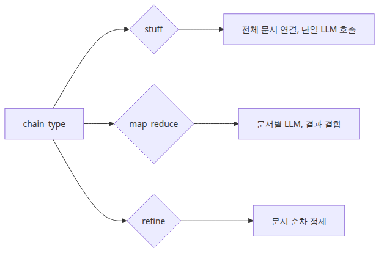
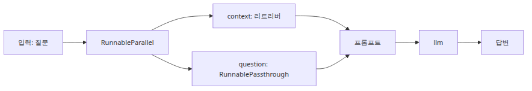
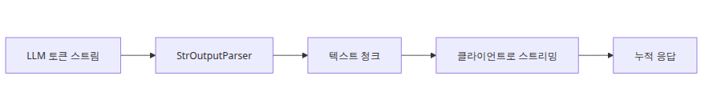

# RAG Chain 조립 — RetrievalQA vs LCEL

> RAG Deep Dive 시리즈 (5/6)

## 소스 버전

이 글의 모든 코드 인용은 [`langchain-ai/langchain @ langchain==0.2.17`](https://github.com/langchain-ai/langchain/tree/langchain==0.2.17) 기준입니다.

1화부터 4화까지는 RAG의 층을 하나씩 따로 떼어 봤습니다. 문서를 어떻게 읽고 잘게 나누는지, 벡터 인덱스가 무엇을 저장하는지, retriever가 어떤 문서를 어떤 순서로 가져오는지, 그리고 마지막으로 그 문서들을 프롬프트에 어떻게 밀어 넣는지까지 분해했습니다. 이제 남은 일은 조립입니다. 실제 서비스에서는 chunking, retrieval, prompting이 따로 돌지 않습니다. 사용자 질문 하나가 들어오면 검색과 조립과 생성이 하나의 실행 그래프로 이어져야 합니다.

그런데 LangChain 0.2.x에서는 이 조립 경로가 둘로 나뉩니다. 하나는 오래된 체인 API인 `RetrievalQA`입니다. 내부가 단순하고 한 번에 동작을 감싸 주기 때문에 소스를 읽기 쉽습니다. 다른 하나는 LCEL, 즉 LangChain Expression Language입니다. `retriever | prompt | llm | parser`처럼 runnable을 파이프로 연결하는 방식인데, 0.2.x의 새 표준은 사실상 이쪽입니다. 둘 다 같은 문제를 풉니다. 질문을 받아 관련 문서를 찾고, 문맥을 프롬프트에 넣고, 모델을 호출하고, 결과를 돌려줍니다. 하지만 조립의 단위, 관측 가능성, 스트리밍 가능성, 중간 결과를 다시 다루는 유연성은 크게 다릅니다.

이번 글에서는 그 차이를 소스 기준으로 따라갑니다. 먼저 `RetrievalQA.from_chain_type()`가 어떤 combine-documents 체인을 고르는지 보겠습니다. 이어서 LCEL의 `|` 연산자가 실제로 무엇을 만드는지, 그리고 `invoke()`·`stream()`·`batch()`가 어떤 실행 모델 위에 놓여 있는지 정리합니다. 그다음 가장 전형적인 LCEL RAG 패턴인 `{"context": retriever, "question": RunnablePassthrough()} | prompt | llm | parser`를 단계별로 해체해 보겠습니다. 마지막으로 `RunnablePassthrough.assign()`을 이용해 답변과 출처를 한 번에 되돌리는 법, 그리고 왜 스트리밍과 배치에서는 LCEL이 사실상 기본 선택지가 되는지까지 연결하겠습니다.

---

## 1. `RetrievalQA` 고전 API: `from_chain_type()`는 무엇을 고르는가

`langchain/chains/retrieval_qa/base.py`를 먼저 보면 `BaseRetrievalQA`가 눈에 들어옵니다. 이 클래스는 `combine_documents_chain`, `input_key`, `output_key`, `return_source_documents`를 핵심 상태로 들고 있습니다. 기본 `input_key`는 `"query"`, 기본 `output_key`는 `"result"`입니다. 그래서 `qa.invoke({"query": "..."})`의 결과는 기본적으로 `{"result": "..."}` 모양이 됩니다. 여기에 `return_source_documents=True`를 주면 `output_keys` 프로퍼티가 `source_documents`를 추가해서 `{"result": "...", "source_documents": [...]}`를 반환합니다. 이름만 보면 사소해 보이지만, 이 규약이 중요한 이유는 `RetrievalQA`가 처음부터 “질문 한 개를 받아 답 하나를 돌려주는 봉인된 체인”으로 설계됐기 때문입니다. 입력 표면과 출력 표면이 좁고 고정적입니다.



이 클래스에서 가장 자주 쓰이던 생성 경로가 `from_chain_type()`입니다. 구현은 짧습니다. `chain_type`과 `chain_type_kwargs`를 받아 `load_qa_chain(llm, chain_type=chain_type, **kwargs)`를 호출하고, 그 결과를 `combine_documents_chain`에 넣은 뒤 자신을 생성합니다. 즉 `RetrievalQA`가 직접 `stuff`나 `map_reduce`를 구현하는 것은 아닙니다. 문서를 어떻게 합칠지는 `load_qa_chain()`에 위임하고, 자신은 retriever와 combine-documents 체인을 접착하는 얇은 래퍼에 가깝습니다.

실제 분기는 `langchain/chains/question_answering/chain.py`의 `load_qa_chain()`에 있습니다. 0.2.17 소스를 보면 `loader_mapping`이 `"stuff"`, `"map_reduce"`, `"refine"`, `"map_rerank"` 네 가지를 지원합니다. 이 중에서 RAG 입문 문맥에서 가장 많이 언급되는 것은 `stuff`, `map_reduce`, `refine`입니다.

- `stuff`: 검색된 문서를 하나의 문자열로 이어 붙여 한 번에 LLM으로 보냅니다. 가장 단순하고 빠르지만, 문서 수가 많아질수록 컨텍스트 한계에 가장 취약합니다.
- `map_reduce`: 각 문서나 문서 묶음에 먼저 질문을 적용한 뒤, 그 중간 결과를 다시 reduce 단계에서 합칩니다. retrieval 결과가 길거나 문서별 요약을 먼저 뽑고 싶을 때 쓰지만, 호출 수가 늘어납니다.
- `refine`: 첫 문서로 초안을 만들고, 뒤 문서를 하나씩 보며 기존 답을 갱신합니다. 문서 순서와 누적 갱신이 의미를 가지므로, 중간 추론 경로를 단계적으로 통제하기 쉽습니다.

여기서 중요한 점은 `chain_type`이 retriever 동작을 바꾸지 않는다는 사실입니다. 검색은 여전히 `_get_docs(question)`에서 끝납니다. `chain_type`이 바꾸는 것은 **검색된 `List[Document]`를 LLM이 읽을 수 있는 입력으로 접는 방식**입니다. `stuff`는 한 번에 펴고, `map_reduce`는 나눠 읽고 다시 합치고, `refine`는 누적 갱신합니다. 즉 3화의 retriever 설계와 4화의 프롬프트 조립 사이에 있는 “문서 결합 정책”이 바로 `chain_type`입니다.

`return_source_documents`도 이 맥락에서 보면 분명해집니다. `_call()`은 먼저 `question = inputs[self.input_key]`로 질문을 꺼내고, `_get_docs(question)`로 문서를 받고, `self.combine_documents_chain.run(input_documents=docs, question=question, ...)`을 호출해 문자열 답을 얻습니다. 그다음 `return_source_documents`가 켜져 있으면 답과 함께 원래의 `docs` 리스트를 그대로 되돌립니다. 즉 source document 반환은 프롬프트 안으로 들어간 최종 컨텍스트 문자열을 되돌리는 기능이 아닙니다. **retriever가 반환한 원본 `Document` 객체를 같이 붙여 주는 기능**입니다. 검색 후 압축, 재정렬, 필드 삭제 같은 변형이 중간에 있었다면, 최종 모델 입력과 source document 리스트는 1:1로 같지 않을 수 있습니다.

이 고전 API가 0.2.x에서 사실상 레거시로 취급되는 이유도 소스에 직접 드러납니다. `BaseRetrievalQA`와 `RetrievalQA` 둘 다 `@deprecated` 데코레이터가 붙어 있고, 메시지는 일관되게 `create_retrieval_chain`으로 이동하라고 말합니다. 이유는 단순합니다. `RetrievalQA`는 편하지만 너무 많은 것을 내부에 숨깁니다. 입력 키가 `query`인지 `input`인지, 문서가 언제 문자열이 되는지, 중간 결과를 다시 쓰려면 어디에 끼워야 하는지, 스트리밍이 어느 단계에서 막히는지 같은 것을 외부에서 다루기 어렵습니다. 0.2.x의 LangChain은 이 봉인된 체인보다, 각 단계를 별도 runnable로 드러내는 LCEL 쪽으로 무게중심을 옮겼습니다.

아래 코드는 고전 API의 표면이 어떻게 생겼는지 가장 작게 보여 줍니다. 외부 벡터 DB 대신 메모리 기반 retriever를 직접 만들었고, LLM도 fake 구현을 써서 예제가 완결되도록 했습니다.

```python
from typing import List

from langchain.chains import RetrievalQA
from langchain_core.documents import Document
from langchain_core.retrievers import BaseRetriever
from langchain_groq import ChatGroq

class KeywordRetriever(BaseRetriever):
    docs: List[Document]

    def _get_relevant_documents(self, query: str) -> List[Document]:
        tokens = set(query.lower().split())
        matched = []
        for doc in self.docs:
            text = doc.page_content.lower()
            if any(token in text for token in tokens):
                matched.append(doc)
        return matched or self.docs[:1]

def main() -> None:
    retriever = KeywordRetriever(
        docs=[
            Document(page_content="Retry budget is three attempts.", metadata={"source": "runbook.md"}),
            Document(page_content="After the final retry, the job moves to the dead-letter queue.", metadata={"source": "ops.md"}),
        ]
    )
    llm = ChatGroq(model="llama-3.1-8b-instant", temperature=0)

    qa = RetrievalQA.from_chain_type(
        llm=llm,
        retriever=retriever,
        chain_type="stuff",
        return_source_documents=True,
    )

    result = qa.invoke({"query": "When is the job dead-lettered?"})
    print(result["result"])
    print([doc.metadata["source"] for doc in result["source_documents"]])
    print("input key:", qa.input_key)
    print("output keys:", qa.output_keys)

if __name__ == "__main__":
    main()
```

이 예제의 핵심은 답변 품질이 아니라 인터페이스입니다. `RetrievalQA`는 여전히 쓸 수 있지만, 체인 내부를 수정하고 관찰하려는 순간 바로 벽이 생깁니다. 이제부터 볼 LCEL은 그 벽을 낮추기 위해 나온 조립 언어에 가깝습니다.

---

## 2. LCEL 기초: `|` 연산자는 runnable을 어떻게 잇는가

LCEL의 출발점은 `langchain_core.runnables.base.py`입니다. 여기서 `Runnable` 추상 클래스가 `invoke`, `batch`, `stream`, `input_schema`, `output_schema` 같은 공통 인터페이스를 정의합니다. 그리고 같은 파일 안에서 `Runnable.__or__()`는 단 두 줄로 핵심 아이디어를 드러냅니다. `self | other`가 호출되면 `RunnableSequence(self, coerce_to_runnable(other))`를 반환합니다. 즉 파이프 연산자는 특수한 문법이 아니라, “왼쪽 출력이 오른쪽 입력으로 흐르는 sequence 객체를 만든다”는 선언입니다.


이 설계가 중요한 이유는 구성 단위가 모두 같은 runnable 프로토콜을 공유하기 때문입니다. retriever도 runnable일 수 있고, prompt도 runnable이고, LLM도 runnable이며, parser도 runnable입니다. 그래서 파이프를 잇는 순간 LangChain은 단순 체인 하나를 만드는 것이 아니라, 공통 실행 메서드를 가진 그래프 조각들을 순서대로 연결합니다. 이 덕분에 LCEL로 만든 체인은 자동으로 `invoke()`뿐 아니라 `ainvoke()`, `batch()`, `abatch()`, `stream()`, `astream()`까지 물려받습니다.

`invoke()`는 가장 좁은 실행 경로입니다. 입력 하나를 받아 마지막 runnable의 출력 하나를 돌려줍니다. 디버깅할 때 가장 직관적이지만, 어디서 병렬화되고 어디서 스트리밍되는지는 드러나지 않습니다. `stream()`은 다릅니다. 기본 `Runnable.stream()`은 그냥 `yield self.invoke(...)`이지만, sequence 안의 각 단계가 `transform()` 또는 `stream()`을 구현하면 청크 단위 전파가 가능합니다. 즉 LCEL의 스트리밍은 “최종 LLM이 토큰을 흘릴 수 있는가”만의 문제가 아닙니다. 앞 단계가 스트림 친화적인 runnable인지, 중간에 결과를 한 번에 모아 버리는 blocking 단계가 끼어 있는지도 같이 봐야 합니다.

`batch()`와 `abatch()`도 같은 철학 위에 있습니다. 기본 구현은 source에 그대로 적혀 있듯이, sync 경로에서는 executor를 써서 `invoke()`를 병렬 실행하고, async 경로에서는 `asyncio.gather` 계열 유틸리티를 통해 여러 `ainvoke()`를 함께 돌립니다. 즉 LCEL의 배치는 특수한 벡터 검색 최적화가 아니라, “같은 runnable 그래프를 입력 여러 개에 병렬로 적용하는 일반 메커니즘”입니다. 어떤 단계가 네이티브 배치 API를 갖고 있으면 그 runnable이 override할 수 있고, 아니면 공통 기본 구현이 안전한 병렬화를 맡습니다.

또 하나 실무적으로 중요한 것이 스키마 반사입니다. `Runnable`은 `InputType`, `OutputType`, 그리고 이를 Pydantic 모델로 감싼 `input_schema`, `output_schema`를 노출합니다. 단순한 문자열 입력이면 `__root__` 모델이 생기고, dict 기반 체인이면 필드가 있는 object schema가 생깁니다. 이 기능은 데모에서는 조용하지만, 운영 환경에서는 꽤 유용합니다. 체인 앞단에 API 검증을 붙이거나, 내부 도구가 어떤 입력을 기대하는지 자동 문서화하거나, UI 폼을 체인 스키마에서 역으로 만들 때 바로 써먹을 수 있기 때문입니다.

아래 코드는 sequence 구성과 스키마 반사를 가장 작게 보여 줍니다.

```python
from langchain_core.pydantic_v1 import BaseModel
from langchain_core.runnables import RunnableLambda

class NumberInput(BaseModel):
    value: int

class NumberOutput(BaseModel):
    doubled: int

chain = (
    RunnableLambda(lambda payload: payload["value"])
    | RunnableLambda(lambda number: number * 2)
    | RunnableLambda(lambda number: {"doubled": number})
).with_types(input_type=NumberInput, output_type=NumberOutput)

def main() -> None:
    print(chain.invoke({"value": 7}))
    print(chain.input_schema.schema())
    print(chain.output_schema.schema())
    print(chain.batch([{"value": 2}, {"value": 5}, {"value": 9}]))

if __name__ == "__main__":
    main()
```

여기서 `.with_types()`가 하는 일은 실행 로직을 바꾸는 것이 아니라, LCEL 그래프에 더 정확한 입출력 타입 정보를 덧씌우는 것입니다. 뒤에서 `RunnablePassthrough.assign()`으로 답변과 출처를 같이 반환할 때 이 패턴이 특히 유용해집니다.

---

## 3. LCEL로 RAG 체인 조립하기: dict literal은 왜 `RunnableParallel`이 되는가

LCEL에서 가장 자주 보게 되는 RAG 기본형은 다음과 같습니다.

```python
chain = (
    {"context": retriever, "question": RunnablePassthrough()}
    | prompt
    | llm
    | StrOutputParser()
)
```

겉보기에는 간단한 dict 리터럴 하나와 파이프 몇 개뿐입니다. 하지만 소스 기준으로 보면 여기에는 두 가지 중요한 변환이 숨어 있습니다. 첫째, `|` 오른쪽이나 왼쪽에 dict가 오면 `coerce_to_runnable(...)`이 그것을 `RunnableParallel`로 감쌉니다. 둘째, `RunnablePassthrough()`는 입력을 바꾸지 않는 identity runnable입니다. 그래서 위 코드는 사실상 “질문 하나를 받아, 같은 입력을 병렬로 두 갈래에 보내고, 한 갈래에서는 retriever를 돌려 `context`를 만들고, 다른 갈래에서는 질문 원문을 그대로 `question`으로 보존한 뒤, 그 dict를 prompt에 넘긴다”는 뜻입니다.



실행을 단계별로 따라가면 더 분명합니다.

1. 사용자가 `"왜 dead-letter로 갔나요?"` 같은 질문 문자열을 넣습니다.
2. 첫 단계의 dict 리터럴은 `RunnableParallel`이 되어 같은 질문을 각 브랜치에 동시에 보냅니다.
3. `context` 브랜치의 `retriever.invoke(question)`가 `List[Document]`를 반환합니다. 실전에서는 여기서 바로 문자열이 아니라 문서 리스트가 나옵니다.
4. 보통 retriever 뒤에는 문서 포맷팅 runnable이 하나 더 붙습니다. `format_document`를 써서 각 문서를 문자열로 만들고 join해서 최종 `{context}` 문자열을 얻습니다.
5. `question` 브랜치의 `RunnablePassthrough.invoke(question)`는 입력 문자열을 그대로 돌려줍니다.
6. 두 브랜치 결과는 `{"context": "...", "question": "..."}` 딕셔너리로 합쳐집니다.
7. prompt runnable이 이 dict를 받아 메시지나 문자열 프롬프트로 바꿉니다.
8. llm runnable이 실제 생성 호출을 수행합니다.
9. `StrOutputParser()`가 모델 출력 객체에서 최종 문자열을 꺼냅니다.

중요한 점은 retrieval과 prompt formatting이 이제 더 이상 숨겨져 있지 않다는 사실입니다. `RetrievalQA`에서는 `_call()` 안쪽에서 문서가 어떻게 흘렀는지 한 덩어리로 가려졌습니다. LCEL에서는 retriever 앞뒤에 어떤 runnable이 있는지, 문서 리스트가 어느 시점에 문자열로 접히는지, 질문 원문을 별도 필드로 언제 보존하는지 모두 그래프 수준에서 드러납니다. 그래서 중간에 re-rank를 끼우거나, metadata를 붙이거나, `context`를 여러 섹션으로 나눠 prompt에 넣는 식의 변형이 훨씬 자연스럽습니다.

아래 코드는 이 흐름을 외부 LLM 없이 완결형으로 재현한 예제입니다. retriever는 문서 리스트를 반환하고, 뒤 단계에서 그것을 문자열로 바꾸며, 마지막 “LLM”은 prompt 내용을 읽고 문자열을 돌려주는 fake runnable입니다.

```python
from typing import Any

from langchain_core.documents import Document
from langchain_core.output_parsers import StrOutputParser
from langchain_core.prompts import ChatPromptTemplate
from langchain_core.runnables import RunnableLambda, RunnablePassthrough

DOCS = [
    Document(
        page_content="Retry budget is three attempts before the worker stops retrying.",
        metadata={"source": "runbook.md"},
    ),
    Document(
        page_content="After the final retry, the original payload moves to the dead-letter queue.",
        metadata={"source": "ops-guide.md"},
    ),
]

def retrieve(question: str) -> list[Document]:
    lowered = question.lower()
    if "dead-letter" in lowered or "retry" in lowered:
        return DOCS
    return DOCS[:1]

def format_docs(docs: list[Document]) -> str:
    return "\n\n".join(
        f"[{doc.metadata['source']}]\n{doc.page_content}" for doc in docs
    )

def fake_llm(prompt_value: Any) -> str:
    rendered = prompt_value.to_string() if hasattr(prompt_value, "to_string") else str(prompt_value)
    return f"Synthetic answer based on:\n{rendered}"

retriever = RunnableLambda(retrieve) | RunnableLambda(format_docs)
prompt = ChatPromptTemplate.from_messages(
    [
        ("system", "주어진 문맥만 근거로 2문장 이내로 답하세요."),
        ("human", "문맥:\n{context}\n\n질문: {question}"),
    ]
)

chain = (
    {"context": retriever, "question": RunnablePassthrough()}
    | prompt
    | RunnableLambda(fake_llm)
    | StrOutputParser()
)

def main() -> None:
    print(chain.invoke("왜 dead-letter queue로 이동했나요?"))

if __name__ == "__main__":
    main()
```

이 패턴의 장점은 단순히 예쁘다는 데 있지 않습니다. 첫 dict 단계에서 이미 “질문 원문”, “검색 결과”, “추가 계산 필드”를 병렬로 만들 수 있기 때문에, 복잡한 RAG일수록 오히려 구조가 덜 숨겨집니다. 답변 전처리나 후처리도 같은 runnable 언어 안에서 해결할 수 있습니다.

---

## 4. `RunnablePassthrough.assign()`: 답만 주지 말고 출처도 같이 돌려주기

LCEL로 체인을 짜다 보면 곧바로 부딪히는 요구가 있습니다. 최종 답변 문자열만으로는 부족하다는 점입니다. 운영용 RAG에서는 최소한 출처 목록, 사용한 문서 ID, 점수, 때로는 최종 prompt까지 같이 보고 싶습니다. 그런데 기본 `prompt | llm | parser` 패턴은 마지막에 문자열 하나만 남깁니다. 이때 유용한 도구가 `langchain_core.runnables.passthrough.py`의 `RunnablePassthrough.assign()`입니다.


소스를 보면 `RunnablePassthrough.assign(**kwargs)`는 결국 `RunnableAssign(RunnableParallel(kwargs))`를 반환합니다. 즉 입력 dict를 그대로 통과시키면서, 동시에 추가 계산 브랜치를 병렬로 실행한 뒤 결과 키를 merge합니다. `RunnableAssign.invoke()` 구현은 더 노골적입니다. `return {**input, **self.mapper.invoke(input, ...)}` 형태이므로, 원래 dict에 새 필드를 덧붙이는 연산입니다. 그래서 assign은 “앞단 출력을 버리지 않고 풍부하게 만들기”에 딱 맞습니다.

RAG에서는 보통 이런 순서가 됩니다.

1. 처음에 `question`과 `sources`를 함께 만드는 dict를 구성합니다.
2. `assign(context=...)`로 source documents를 prompt용 문자열로 바꿉니다.
3. 또 한 번 `assign(answer=...)`로 `context`와 `question`을 prompt·llm·parser에 태워 답변 문자열을 만듭니다.
4. 마지막에 `RunnableLambda`나 `pick()`으로 필요한 필드만 남겨 `{"answer": ..., "sources": ...}`를 반환합니다.

이 방식의 좋은 점은 retrieval 결과를 두 번 재계산하지 않는다는 것입니다. `RetrievalQA`에서는 `return_source_documents=True`가 내부 옵션이라 답과 docs를 같이 받을 수는 있지만, 그 docs가 어느 중간 단계에서 어떻게 조정되었는지 체인 바깥에서 풍부하게 확장하기 어렵습니다. LCEL에서는 source documents를 초기에 한 번 구해 dict에 올려 두고, 그 뒤 계산 단계마다 재사용하면 됩니다.

또 이 섹션에서 `with_types()`가 다시 의미를 가집니다. 출력이 더 이상 문자열 하나가 아니라 `answer`와 `sources`를 가진 dict라면, 체인 자체에 그 모양을 선언해 두는 편이 좋습니다. 그러면 `output_schema`가 즉시 읽을 수 있는 문서가 되고, API 계층에서도 응답 구조를 안정적으로 재사용할 수 있습니다.

아래 코드는 질문 하나를 받아 답변과 출처 목록을 같이 반환하는 완결형 예제입니다.

```python
from operator import itemgetter

from langchain_core.documents import Document
from langchain_core.output_parsers import StrOutputParser
from langchain_core.prompts import ChatPromptTemplate
from langchain_core.pydantic_v1 import BaseModel
from langchain_core.runnables import RunnableLambda, RunnablePassthrough

DOCS = [
    Document(page_content="Retry budget is three attempts.", metadata={"source": "runbook.md"}),
    Document(page_content="The final failure moves the job into the dead-letter queue.", metadata={"source": "ops-guide.md"}),
]

def retrieve(question: str) -> list[Document]:
    return DOCS if "retry" in question.lower() or "dead-letter" in question.lower() else DOCS[:1]

def format_docs(docs: list[Document]) -> str:
    return "\n\n".join(
        f"[{doc.metadata['source']}]\n{doc.page_content}" for doc in docs
    )

def fake_llm(prompt_value) -> str:
    rendered = prompt_value.to_string() if hasattr(prompt_value, "to_string") else str(prompt_value)
    return f"Answer grounded in context:\n{rendered.split('Question:')[-1].strip()}"

class QuestionInput(BaseModel):
    question: str

class AnswerOutput(BaseModel):
    answer: str
    sources: list[str]

prompt = ChatPromptTemplate.from_messages(
    [
        ("system", "Answer only from the retrieved context and cite sources."),
        ("human", "Context:\n{context}\n\nQuestion: {question}"),
    ]
)

chain = (
    {
        "question": itemgetter("question"),
        "sources": itemgetter("question") | RunnableLambda(retrieve),
    }
    | RunnablePassthrough.assign(context=lambda x: format_docs(x["sources"]))
    | RunnablePassthrough.assign(
        answer=(
            RunnableLambda(lambda x: {"context": x["context"], "question": x["question"]})
            | prompt
            | RunnableLambda(fake_llm)
            | StrOutputParser()
        )
    )
    | RunnableLambda(
        lambda x: {
            "answer": x["answer"],
            "sources": [doc.metadata["source"] for doc in x["sources"]],
        }
    )
).with_types(input_type=QuestionInput, output_type=AnswerOutput)

def main() -> None:
    result = chain.invoke({"question": "Why was the job sent to dead-letter after retries?"})
    print(result)
    print(chain.output_schema.schema())

if __name__ == "__main__":
    main()
```

이 예제에서 중요한 것은 `assign()`이 문법 설탕 이상이라는 점입니다. 앞단에서 만든 `sources`를 유지한 채 `context`와 `answer`를 순차적으로 덧붙이기 때문에, retrieval 결과를 잃지 않고 chain output을 점점 풍부하게 만들 수 있습니다. RAG를 API나 UI에 연결할 때 이 차이는 큽니다. 사용자에게는 답변을 보여 주면서, 개발자에게는 source list와 schema를 동시에 제공할 수 있기 때문입니다.

---

## 5. 스트리밍과 배치: 여기서 LCEL이 사실상 기본 선택지가 된다

이제 실행 모델 차이를 볼 차례입니다. `RetrievalQA`는 `_call()`과 `_acall()` 중심의 고전 체인입니다. 최종적으로 `combine_documents_chain.run(...)` 또는 `arun(...)`을 호출해 문자열 답을 다 만든 뒤에야 결과를 반환합니다. source 문서를 같이 돌려주는 옵션은 있어도, 토큰이 생성되는 중간을 체인 표면에서 바로 흘려주지는 못합니다. 반면 LCEL은 runnable마다 `stream()`과 `transform()`을 공유하므로, 뒤 단계가 청크를 생산하면 그 청크를 sequence 전체가 전파할 수 있습니다.



물론 여기에도 조건은 있습니다. 모든 단계가 스트림 친화적이어야 가장 자연스럽게 흐릅니다. retriever처럼 본질적으로 한 번에 결과를 내는 단계는 앞부분에서 잠깐 막힐 수 있습니다. prompt formatting도 대부분 한 번에 끝납니다. 하지만 LLM 단계가 토큰을 스트리밍하고 parser가 청크 단위 출력을 받을 수 있으면, 최소한 “검색과 프롬프트 준비가 끝난 뒤부터는” 최종 사용자에게 바로 흘려보낼 수 있습니다. 이 지점이 체감 성능에 매우 큽니다. Retrieval은 200ms, 모델 생성은 4초인 시스템이라면, LCEL 스트리밍은 그 4초를 기다리는 경험을 훨씬 부드럽게 만듭니다.

배치도 마찬가지입니다. `Runnable.batch()` 기본 구현은 thread pool executor로 여러 `invoke()`를 병렬 호출합니다. `abatch()`는 여러 `ainvoke()` 코루틴을 모아 `asyncio.gather` 계열 유틸리티로 함께 기다립니다. 그래서 같은 질문-답변 그래프를 여러 질의에 동시에 적용할 때 별도 래퍼를 짤 필요가 없습니다. 실무적으로는 오프라인 평가, synthetic question 세트 생성, 회귀 테스트에서 특히 유용합니다. 문서 코퍼스는 같고 질문만 수십 개 바뀌는 상황이라면, LCEL 체인 하나를 만든 뒤 `batch()`나 `abatch()`로 돌리면 됩니다.

아래 코드는 한 체인에서 `invoke()`, `stream()`, `batch()`가 각각 어떤 사용감을 주는지 보여 줍니다. `answer_chain`은 일반 문자열 응답을 만들고, `stream_chain`은 `Iterator[Any] -> Iterator[str]` 형태의 generator runnable을 붙여 청크 전파를 흉내 냅니다.

```python
from typing import Any, Iterator

from langchain_core.output_parsers import StrOutputParser
from langchain_core.prompts import PromptTemplate
from langchain_core.runnables import RunnableLambda

def fake_llm(prompt_value: Any) -> str:
    rendered = prompt_value.to_string() if hasattr(prompt_value, "to_string") else str(prompt_value)
    return f"Answer: {rendered.split('Question:')[-1].strip()}"

def fake_streaming_llm(prompt_values: Iterator[Any]) -> Iterator[str]:
    for prompt_value in prompt_values:
        rendered = (
            prompt_value.to_string()
            if hasattr(prompt_value, "to_string")
            else str(prompt_value)
        )
        answer = f"Answer: {rendered.split('Question:')[-1].strip()}"
        for token in answer.split():
            yield token + " "

prompt = PromptTemplate.from_template("Context: {context}\nQuestion: {question}")

answer_chain = (
    RunnableLambda(lambda x: {"context": "retry budget is 3", "question": x})
    | prompt
    | RunnableLambda(fake_llm)
    | StrOutputParser()
)

stream_chain = (
    RunnableLambda(lambda x: {"context": "retry budget is 3", "question": x})
    | prompt
    | fake_streaming_llm
)

def main() -> None:
    print(answer_chain.invoke("When does dead-lettering happen?"))

    print("batch:")
    print(
        answer_chain.batch(
            [
                "When does dead-lettering happen?",
                "How many retries are allowed?",
            ]
        )
    )

    print("stream:")
    for chunk in stream_chain.stream("When does dead-lettering happen?"):
        print(repr(chunk))

if __name__ == "__main__":
    main()
```

실전에서는 `fake_streaming_llm` 자리에 실제 streaming chat model runnable이 들어갑니다. 여기서는 LCEL이 generator 기반 runnable에서 나온 청크를 다음 단계로 흘려보낼 수 있다는 점만 작게 보여 준 것입니다.

정리하면 `RetrievalQA`는 고전적인 “질문 하나 -> 최종 답 하나” 모델에 최적화된 래퍼입니다. 빠르게 시작할 수 있지만, 스트리밍·중간 결과 재사용·출력 구조 확장·스키마 반사 같은 현대적 요구가 붙는 순간 답답해집니다. 반대로 LCEL은 처음에는 조금 더 장황해 보여도, retrieval과 prompt와 generation을 같은 runnable 언어로 다룰 수 있기 때문에 장기적으로 훨씬 다루기 쉽습니다.

이 시리즈의 흐름으로 보면 이 결론은 자연스럽습니다. 1화부터 4화까지는 각 층을 따로 읽으며 어디서 정보가 손실되는지 봤습니다. 이제 5화에서는 그 층들을 하나의 실행 그래프로 묶었습니다. 결국 좋은 RAG는 “좋은 retriever를 고른다”에서 끝나지 않습니다. **검색 결과가 어떤 체인 구조를 통과해 어떤 타입으로 모델에 전달되고, 답과 출처가 어떤 인터페이스로 밖으로 나오느냐**까지 포함해 설계해야 합니다. 다음 6화에서는 이 조립된 체인을 어떻게 평가하고, 실패를 어떻게 측정하고, 품질 게이트를 어디에 둘지로 넘어가겠습니다.

---

<!-- blog-only:start -->
다음 글: [평가와 품질 게이트 — RAGAS 메트릭과 Faithfulness](./06-evaluation-and-quality-gates.md)
<!-- blog-only:end -->

<!-- toc:begin -->
## 시리즈 목차

- [문서 로딩과 청크 전략 — LangChain TextSplitter 내부](./01-document-loading-and-chunking.md)
- [임베딩과 벡터 인덱스 — FAISS IndexFlatL2 동작 원리](./02-embeddings-and-vector-index.md)
- [Retriever 설계 — VectorStoreRetriever와 MMR](./03-retriever-design.md)
- [프롬프트 구성과 컨텍스트 주입 — PromptTemplate 내부](./04-prompt-construction-and-context-injection.md)
- **RAG Chain 조립 — RetrievalQA vs LCEL (현재 글)**
- 평가와 품질 게이트 — RAGAS 메트릭과 Faithfulness (예정)

<!-- toc:end -->

---

## 참고 자료

1. [`langchain/chains/retrieval_qa/base.py`](https://github.com/langchain-ai/langchain/blob/langchain==0.2.17/libs/langchain/langchain/chains/retrieval_qa/base.py)
2. [`langchain/chains/question_answering/chain.py`](https://github.com/langchain-ai/langchain/blob/langchain==0.2.17/libs/langchain/langchain/chains/question_answering/chain.py)
3. [`langchain/chains/combine_documents/stuff.py`](https://github.com/langchain-ai/langchain/blob/langchain==0.2.17/libs/langchain/langchain/chains/combine_documents/stuff.py)
4. [`langchain_core/runnables/base.py`](https://github.com/langchain-ai/langchain/blob/langchain==0.2.17/libs/core/langchain_core/runnables/base.py)
5. [`langchain_core/runnables/passthrough.py`](https://github.com/langchain-ai/langchain/blob/langchain==0.2.17/libs/core/langchain_core/runnables/passthrough.py)
6. [`langchain_core/output_parsers/string.py`](https://github.com/langchain-ai/langchain/blob/langchain==0.2.17/libs/core/langchain_core/output_parsers/string.py)
7. [`langchain/chains/base.py`](https://github.com/langchain-ai/langchain/blob/langchain==0.2.17/libs/langchain/langchain/chains/base.py)

Tags: RAG, LangChain, Vector Search, LLM
