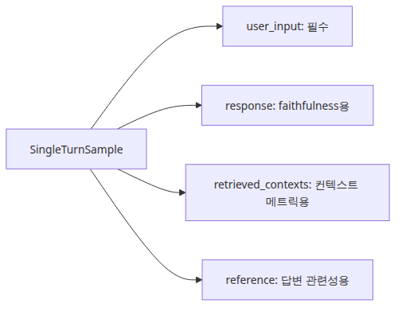
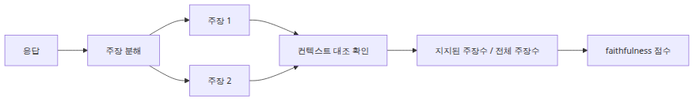
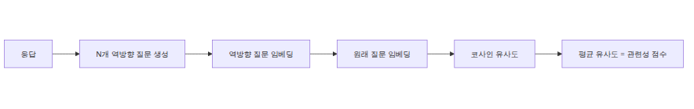
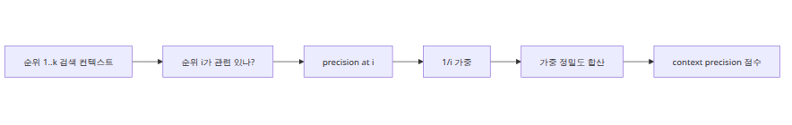
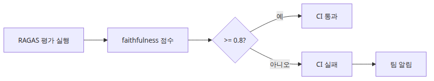

# 평가와 품질 게이트 — RAGAS 메트릭과 Faithfulness

> RAG Deep Dive 시리즈 (6/6)

## 소스 버전

이 글의 RAGAS 코드는 설치 가능한 [`ragas==0.1.22`](https://pypi.org/project/ragas/0.1.22/) 기준이고, LangChain 코드는 [`langchain-ai/langchain @ langchain==0.2.17`](https://github.com/langchain-ai/langchain/tree/langchain==0.2.17) 기준입니다. 따라서 메트릭 구현 경로도 `ragas/metrics/_faithfulness.py`, `ragas/metrics/_answer_relevance.py`, `ragas/metrics/_context_precision.py`처럼 underscore-prefixed 파일명을 그대로 따릅니다.

RAG 파이프라인이 질문에 대답한다는 사실과, 그 대답을 올바르게 한다는 사실은 전혀 다릅니다. 데모에서는 검색이 되는지, 답이 그럴듯한지 정도로 만족하기 쉽습니다. 운영에서는 그렇지 않습니다. chunk 크기, retriever `k`, MMR 설정을 바꿨을 때 정말 좋아졌는지 판단하려면 평가가 필요합니다. 평가가 들어와야 튜닝이 재현 가능한 개선으로 바뀝니다.

이번 마지막 글은 그 평가 층을 다룹니다. `datasets.Dataset` 입력 형식에서 시작해 faithfulness, answer relevancy, context precision을 따라가고, 마지막에는 CI 품질 게이트로 묶겠습니다.

---

## 1. RAGAS 개요와 `datasets.Dataset`: 입력 열이 곧 평가 가능 범위다

RAGAS를 처음 볼 때 가장 중요한 오해 하나를 먼저 걷어내야 합니다. RAGAS는 “답변 문자열 하나를 받아 좋은지 나쁜지 말해 주는 채점기”가 아닙니다. 메트릭마다 필요한 입력 열이 다르고, 그 열이 없으면 아예 계산 자체가 불가능합니다. 그래서 출발점은 늘 데이터셋 스키마입니다. `ragas==0.1.22`의 `evaluate()`는 Hugging Face `datasets.Dataset`를 받고, 기본 입력 열은 `question`, `contexts`, `answer`, `ground_truth`입니다.

이 네 열이 사실상 평가의 중심축입니다. `question`은 사용자 질문, `contexts`는 retriever가 돌려준 컨텍스트 조각 목록, `answer`는 모델 답변, `ground_truth`는 사람이 준비한 기준 답입니다. 질문이 없으면 answer relevancy처럼 “원래 질문과 얼마나 맞닿아 있는가”를 계산할 수 없고, `contexts`가 없으면 faithfulness처럼 “이 답이 근거에 기대고 있는가”를 따질 수 없으며, `ground_truth`가 없으면 context precision이나 answer correctness처럼 기준 답을 축으로 삼는 메트릭은 설 자리가 줄어듭니다.



이 점이 중요한 이유는 평가 스키마가 곧 실패 분류 체계이기 때문입니다. 답이 질문과 동떨어졌다면 answer relevancy 문제이고, 근거 문맥에 없는 사실을 섞었다면 faithfulness 문제이며, 유용한 chunk가 뒤로 밀렸다면 context precision 문제입니다. 스키마가 넓을수록 “어디서 망가졌는가”를 더 선명하게 분리할 수 있습니다.

메트릭별 입력 요구도 여기서 바로 갈립니다. faithfulness는 `question`, `answer`, `contexts`가 필요합니다. answer relevancy도 `evaluation_mode = qac`이므로 `question`, `answer`, `contexts`를 모두 요구합니다. 실제로 `_create_question_gen_prompt()`는 `row["answer"]`와 `row["contexts"]`를 함께 읽어 역질문 프롬프트를 만들기 때문에, `contexts`가 빠지면 `evaluate()` 검증 단계에서 실패합니다. context precision은 `question`, `contexts`, `ground_truth` 축이 있어야 각 chunk의 유용성을 판정할 수 있습니다.

아래처럼 작은 평가셋을 명시적으로 만드는 습관이 좋습니다. 운영 로그에서 바로 평가하려고 들면 필드 이름이 제각각이라 나중에 메트릭을 붙일 때 고생합니다. 반대로 `question`·`contexts`·`answer`·`ground_truth`를 처음부터 남겨 두면, chunking 전략을 바꾸든 retriever를 교체하든 같은 샘플 위에서 전후 비교가 가능합니다. 열 이름이 다르면 `evaluate(..., column_map={...})`로 **RAGAS의 canonical column name을 현재 데이터셋 열 이름에 연결**하면 됩니다.

```python
from datasets import Dataset

dataset = Dataset.from_dict(
    {
        "question": ["장애가 몇 번 재시도된 뒤 dead-letter queue로 이동하나요?"],
        "contexts": [[
            "The worker retries the job up to three times before giving up.",
            "After the final retry, the payload is moved to the dead-letter queue.",
        ]],
        "answer": ["작업은 세 번 재시도된 뒤 dead-letter queue로 이동합니다."],
        "ground_truth": ["작업은 최대 세 번 재시도된 뒤 dead-letter queue로 이동합니다."],
    }
)

print(dataset)
print(dataset.features)

legacy_dataset = Dataset.from_dict(
    {
        "query": ["장애가 몇 번 재시도된 뒤 dead-letter queue로 이동하나요?"],
        "retrieved_passages": [[
            "The worker retries the job up to three times before giving up.",
            "After the final retry, the payload is moved to the dead-letter queue.",
        ]],
        "prediction": ["작업은 세 번 재시도된 뒤 dead-letter queue로 이동합니다."],
        "reference_answer": ["작업은 최대 세 번 재시도된 뒤 dead-letter queue로 이동합니다."],
    }
)

column_map = {
    "question": "query",
    "contexts": "retrieved_passages",
    "answer": "prediction",
    "ground_truth": "reference_answer",
}

print(column_map)
```

이 코드는 평가 설계의 핵심을 드러냅니다. **좋은 평가셋은 모델 출력 모음이 아니라, 질문·근거·답변·기준 답의 관계를 다시 구성할 수 있는 샘플 모음**입니다.

---

## 2. Faithfulness 내부 동작: 답변을 주장으로 쪼개고 근거와 대조한다

RAGAS에서 RAG다운 메트릭을 하나만 꼽으라면 많은 팀이 faithfulness를 먼저 봅니다. 이유는 단순합니다. RAG 시스템의 가장 전형적인 실패는 “그럴듯하지만 근거에 없는 말”이기 때문입니다. `ragas/metrics/_faithfulness.py`를 읽으면 이 메트릭이 그 실패를 어떻게 연산으로 바꾸는지 꽤 명확하게 드러납니다.

핵심은 2단계입니다. 첫 단계에서 RAGAS는 답변 전체를 그대로 판단하지 않습니다. 먼저 LLM을 써서 답변을 더 단순한 statement 목록으로 분해합니다. `LONG_FORM_ANSWER_PROMPT`를 보면 문장별 복잡도를 분석하고, 대명사를 없애고, 완전히 이해 가능한 더 작은 statement로 쪼개라고 지시합니다. 예를 들어 “그 작업자는 세 번 재시도한 뒤 포기하고 dead-letter queue로 보낸다”라는 한 문장은 `재시도 횟수는 세 번이다`와 `마지막 재시도 뒤 payload가 dead-letter queue로 이동한다` 같은 원자적 주장 둘로 나뉠 수 있습니다.

둘째 단계에서는 이렇게 분해된 각 statement를 retrieved context 목록에 대조합니다. `NLI_STATEMENTS_MESSAGE`는 문맥만 보고 각 statement가 직접 추론 가능한지 `verdict` 0 또는 1로 돌려달라고 요구합니다. 구현에서 `_create_nli_prompt()`는 `row["contexts"]`를 줄바꿈으로 합쳐 하나의 premise처럼 만들고, statement 목록을 JSON 문자열로 전달합니다. 그리고 `_compute_score()`는 아주 단순한 비율을 계산합니다.



공식은 사실상 다음과 같습니다.

\[
faithfulness\_score = \frac{|supported\_claims|}{|total\_claims|}
\]

즉 지원된 주장 수를 전체 주장 수로 나눈 값입니다. 소스에서 `faithful_statements / num_statements`로 바로 구현되어 있고, statement가 하나도 생성되지 않으면 `NaN`으로 떨어집니다. 중요한 것은 이 점수가 “답변 전체가 마음에 드는가”를 묻지 않는다는 점입니다. 문장이 매끄러운지, 표현이 간결한지, 질문에 친절히 답했는지는 관심사가 아닙니다. 오직 **답변이 자기 근거로 제공된 `contexts` 안에서 지지되는 주장들로만 이루어져 있는가**만 봅니다.

이때 hallucination도 운영적으로 다시 정의됩니다. 보통 사람은 hallucination을 “거짓말”로 받아들이지만, faithfulness는 더 좁고 더 실무적인 정의를 씁니다. `contexts`로 직접 지지되지 않는 statement는 점수를 깎습니다. 그 statement가 세상 전체 기준으로 사실일 수도 있습니다. 하지만 현재 RAG 호출의 근거 묶음 안에 없으면, 이 메트릭에서는 faithfulness 위반입니다. 이 정의가 중요한 이유는 RAG의 계약이 “모델이 세상에서 맞는 말을 하라”가 아니라 “이번에 검색된 근거 위에서 답하라”이기 때문입니다.

예를 들어 retriever가 “세 번 재시도 후 dead-letter”까지만 가져왔는데 모델이 “기본 backoff는 30초입니다”를 덧붙였다고 해 봅시다. 그 정보가 문서 다른 곳에서는 참일 수 있어도, 이번 호출의 `contexts` 안에 없으면 faithfulness는 unsupported claim으로 봅니다.

아래 코드는 점수 계산의 정신만 가장 작게 보여 줍니다.

```python
from dataclasses import dataclass

@dataclass
class ClaimVerdict:
    statement: str
    verdict: int

def faithfulness_score(verdicts: list[ClaimVerdict]) -> float:
    if not verdicts:
        raise ValueError("At least one claim verdict is required")
    supported_claims = sum(1 for item in verdicts if item.verdict == 1)
    return supported_claims / len(verdicts)

verdicts = [
    ClaimVerdict("The worker retries the job three times.", 1),
    ClaimVerdict("The payload is moved to the dead-letter queue after the final retry.", 1),
    ClaimVerdict("The default retry backoff is 30 seconds.", 0),
]

print(faithfulness_score(verdicts))
```

결국 faithfulness는 생성 모델의 수사력을 보지 않고, retrieval과 prompting이 만든 경계 안에 답변이 머무는지를 봅니다. 그래서 이 점수가 갑자기 떨어졌다면 보통은 세 군데를 의심해야 합니다. 3화에서 다룬 retriever가 충분한 근거를 못 가져왔거나, 4화에서 본 prompt가 근거 경계를 약하게 만들었거나, 5화의 chain 조립 과정에서 문맥이 잘리거나 순서가 어긋났을 가능성입니다.

---

## 3. Answer Relevancy: 역질문 생성은 정확도가 아니라 초점도를 잰다

faithfulness가 “근거 안에서만 말했는가”를 본다면, answer relevancy는 다른 질문을 합니다. **이 답변이 원래 질문을 곧장 겨냥하고 있는가**입니다. 여기서 중요한 것은 이 메트릭이 사실 정확성을 직접 채점하지 않는다는 점입니다. `ragas/metrics/_answer_relevance.py`를 보면 그 이유가 구현에 그대로 들어 있습니다.

RAGAS는 먼저 답변을 보고 “이 답변이 어떤 질문의 답처럼 보이는가?”를 거꾸로 생성합니다. `QUESTION_GEN` 프롬프트는 `answer`와 `context`를 함께 입력으로 받아 질문 하나와 `noncommittal` 플래그를 JSON으로 내놓게 만듭니다. `strictness` 기본값이 3이므로, 보통은 한 답변에 대해 역질문을 여러 개 생성합니다. 그런 다음 `_calculate_score()`는 원래 질문 `row["question"]`의 임베딩과 생성된 질문들 임베딩 사이의 코사인 유사도를 계산해 평균을 냅니다.



여기서 포인트는 방향입니다. 메트릭은 답변을 직접 사실 검증하지 않습니다. 대신 “이 답을 읽고 역으로 추정한 질문이 원래 사용자 질문과 얼마나 비슷한가”를 봅니다. 답변이 장황하게 옆길로 새거나, 질문과 무관한 배경 설명을 길게 붙이거나, 반대로 핵심을 흐리면 생성된 역질문이 원래 질문에서 멀어집니다. 그래서 answer relevancy는 정확히 말해 **정답성보다 초점도와 간결성**을 더 잘 측정합니다.

소스의 `noncommittal` 처리도 이 점을 강화합니다. `ragas==0.1.22` 구현에서는 한 샘플에 대해 생성된 역질문 집합이 noncommittal로 판정되면 그 샘플의 answer relevancy 점수는 0이 됩니다. 그리고 `evaluate()`가 여러 샘플의 점수를 모은 뒤 최종적으로 평균을 냅니다. 즉 “잘 모르겠습니다”, “확실하지 않습니다”, “정보가 부족합니다”처럼 회피적 답변이 달린 샘플은 mean에 0으로 기여합니다. 이는 relevance를 “질문과 붙어 있으면서 실제로 대답하려는 의지까지 가진 응답”으로 해석한다는 뜻입니다.

이 메트릭을 faithfulness와 혼동하면 안 됩니다. 예를 들어 “몇 번 재시도하나요?”라는 질문에 “세 번 재시도한 뒤 dead-letter queue로 이동합니다. 이 시스템은 분산 워커 구조를 사용하며 장애 격리를 위해…”처럼 맞는 말과 주변 설명을 길게 덧붙인 답은 faithfulness는 높게 나올 수 있습니다. 모두 근거 안에 있는 사실이기 때문입니다. 하지만 answer relevancy는 떨어질 수 있습니다. 역질문을 생성해 보면 “이 시스템의 장애 처리 구조는 무엇인가?” 같은 다른 질문으로도 읽히기 시작하기 때문입니다.

반대로 매우 짧고 초점이 맞는 답이 relevance는 높지만 faithfulness는 낮을 수도 있습니다. `contexts`에 없는 숫자를 단정적으로 짧게 말하면, 질문에는 딱 맞아 보여도 근거 위반입니다. 그래서 운영에서는 answer relevancy를 “이 답이 질문을 제대로 조준하는가”라는 보조 축으로, faithfulness를 “그 조준이 근거 위에서 이루어졌는가”라는 본 축으로 두는 편이 안정적입니다.

아래는 역질문 유사도 계산의 핵심만 순수 파이썬으로 옮긴 예제입니다. RAGAS는 임베딩 모델을 통해 같은 계산을 수행합니다.

```python
import numpy as np

def cosine_similarity(a: np.ndarray, b: np.ndarray) -> float:
    return float(np.dot(a, b) / (np.linalg.norm(a) * np.linalg.norm(b)))

original_question = np.array([0.9, 0.1, 0.0, 0.2])
generated_question_1 = np.array([0.85, 0.12, 0.02, 0.18])
generated_question_2 = np.array([0.88, 0.05, 0.01, 0.24])

scores = [
    cosine_similarity(original_question, generated_question_1),
    cosine_similarity(original_question, generated_question_2),
]

print(sum(scores) / len(scores))
```

요약하면 answer relevancy는 “질문에 대한 답처럼 읽히는가”를 재는 메트릭입니다. 사실 검증까지 맡기면 안 되고, 특히 retrieval failure를 직접 잡아내는 도구로 오해하면 안 됩니다. 대신 prompt가 너무 수다스러워졌는지, answer template이 불필요한 boilerplate를 붙이고 있는지, chain 조립 뒤에 질문 원문이 희미해졌는지를 잡는 데는 꽤 민감합니다.

---

## 4. Context Precision: 좋은 chunk가 앞에 오를수록 점수가 높다

context precision은 retrieval 품질을 더 직접적으로 겨냥합니다. `ragas/metrics/_context_precision.py`를 보면 구현은 “이 retrieved chunk가 정답 도달에 유용했는가”를 각 순위별로 0/1 판정한 뒤, 그 순위 목록에 average precision 공식을 적용하는 구조입니다. 이름 그대로 precision@k 계열이며, 특히 **순서가 중요하다**는 점이 핵심입니다.

`ragas==0.1.22`의 입력 `Dataset`는 `question`, `contexts`, `answer`, `ground_truth` 열을 받습니다. `evaluate()` 내부에서는 먼저 `remap_column_names(dataset, column_map)`를 호출해 사용자가 넘긴 별칭 열을 이 기본 이름으로 정규화합니다. 그다음 context precision은 각 `context` 조각을 질문과 기준 답 축에 대조해 `verdict` 0 또는 1을 만듭니다. 따라서 이 메트릭은 “모델이 실제로 뭐라고 답했는가”보다 “정답을 재구성하는 데 이 retrieved chunk가 유용했는가”를 더 강하게 봅니다. 그래서 generation보다 retrieval ranking 메트릭에 가깝습니다.



점수 계산은 `_calculate_average_precision()`에 거의 그대로 드러납니다. verdict 리스트를 `v_i`라고 두면, 각 위치 `i`에서의 precision은 그 시점까지 나온 relevant chunk 수를 `i`로 나눈 값입니다. 그리고 relevant chunk였던 위치들에 대해서만 이 precision을 더해, 전체 relevant chunk 수로 나눕니다. 식으로 쓰면 다음과 같습니다.

\[
AP@k = \frac{\sum_{i=1}^{k} P(i) \cdot rel(i)}{\sum_{i=1}^{k} rel(i)}
\]

여기서 `rel(i)`는 i번째 chunk가 유용하면 1, 아니면 0입니다. 이 식의 의미는 직관적입니다. 유용한 chunk가 앞쪽에 몰릴수록 앞 구간 precision이 높아지고 전체 점수도 올라갑니다. 같은 유용한 chunk 두 개가 있더라도 1위와 2위에 있느냐, 4위와 5위에 있느냐에 따라 점수가 달라집니다. 그래서 context precision은 단순히 “좋은 chunk를 포함했는가”가 아니라 “좋은 chunk를 얼마나 빨리 보여 줬는가”를 봅니다.

이제 3화의 retriever 설정과 바로 연결됩니다. `k`를 늘리면 관련 chunk를 더 많이 포함할 가능성은 커지지만, 앞부분이 잡음으로 오염되면 context precision은 오히려 떨어질 수 있습니다. MMR을 켜면 중복은 줄어도 정답 핵심과 직접 관련된 chunk가 1위에서 3위로 밀릴 수 있습니다. `fetch_k`를 크게 잡아 후보 폭을 넓히는 것은 좋지만, 최종 재정렬이 약하면 유용한 증거가 뒤로 밀립니다. 즉 retrieval에서는 recall만 보면 안 되고, **ranked evidence quality**를 같이 봐야 합니다. context precision이 그 역할을 합니다.

아래 예제는 average precision 계산을 작은 리스트로 보여 줍니다. 첫 번째와 세 번째 chunk가 relevant이고, 두 번째와 네 번째는 irrelevant라고 가정해 보겠습니다.

```python
def average_precision(verdicts: list[int]) -> float:
    relevant = sum(verdicts)
    if relevant == 0:
        raise ValueError("At least one relevant context is required")

    numerator = 0.0
    for index, verdict in enumerate(verdicts, start=1):
        if verdict == 1:
            precision_at_i = sum(verdicts[:index]) / index
            numerator += precision_at_i

    return numerator / relevant

ranking = [1, 0, 1, 0]
print(average_precision(ranking))
```

이 메트릭을 보면 왜 “retriever의 `k`를 일단 크게”가 항상 정답이 아닌지 이해가 됩니다. context precision이 낮다면 단순히 더 많이 가져오기보다, 더 관련 있고 더 앞선 순서로 가져오도록 retriever 정책을 손봐야 합니다.

---

## 5. CI에서 품질 게이트 세우기: `faithfulness < 0.8`이면 실패시켜라

이제 중요한 마지막 질문이 남습니다. 점수를 계산하는 것과, 그 점수로 시스템 변화를 막아 세우는 것은 다릅니다. 평가가 진짜 힘을 가지려면 실험 노트가 아니라 품질 게이트가 되어야 합니다. 가장 실용적인 형태는 단순합니다. 대표 질문 셋을 평가 데이터셋으로 유지하고, PR이나 nightly job에서 `ragas.evaluate()`를 돌린 뒤, 핵심 메트릭이 임계값 아래로 떨어지면 파이프라인을 실패시키는 것입니다.

RAGAS 0.1.x의 `evaluate()`는 기본적으로 Hugging Face `Dataset`과 `question`·`contexts`·`answer`·`ground_truth` 열을 사용합니다. 다만 실제 운영 데이터셋 이름이 다를 수 있으므로, `column_map` 파라미터로 **canonical name -> existing dataset column** 방향의 매핑을 넘길 수 있습니다. 즉 `{"question": "query"}`는 RAGAS의 `question` 슬롯이 현재 데이터셋의 `query` 열에서 값을 읽는다는 뜻입니다. 같은 방식으로 `retrieved_passages`, `prediction`, `reference_answer` 같은 이름도 실행 직전에 정규화할 수 있습니다.



아래 스크립트는 가장 작은 CI 게이트 예제입니다. faithfulness, answer relevancy, context precision의 평균을 계산하고, faithfulness 평균이 0.8 아래면 즉시 실패합니다.

```python
import numpy as np
from datasets import Dataset
from langchain_groq import ChatGroq
from langchain_community.embeddings import HuggingFaceEmbeddings
from ragas import evaluate
from ragas.metrics import answer_relevancy, context_precision, faithfulness
from ragas.llms import LangchainLLMWrapper

def build_eval_dataset() -> Dataset:
    rows = {
        "question": [
            "장애가 몇 번 재시도된 뒤 dead-letter queue로 이동하나요?",
            "MMR에서 fetch_k는 왜 k보다 크게 잡나요?",
        ],
        "answer": [
            "작업은 최대 세 번 재시도된 뒤 dead-letter queue로 이동합니다.",
            "MMR은 더 넓은 후보 집합에서 중복을 줄이며 재선택하므로 fetch_k가 k보다 커야 다양성 선택의 여지가 생깁니다.",
        ],
        "contexts": [
            [
                "The worker retries the job up to three times before giving up.",
                "After the final retry, the payload is moved to the dead-letter queue.",
            ],
            [
                "MMR first gathers a larger candidate pool before selecting the final k documents.",
                "If fetch_k equals k, the reranking stage has almost no room to improve diversity.",
            ],
        ],
        "ground_truth": [
            "작업은 최대 세 번 재시도된 뒤 dead-letter queue로 이동합니다.",
            "fetch_k는 최종 k보다 넓은 후보를 먼저 모아야 MMR이 유사도와 다양성을 함께 고려할 수 있기 때문에 더 크게 잡습니다.",
        ],
    }
    return Dataset.from_dict(rows)

def run_quality_gate() -> dict[str, float]:
    dataset = build_eval_dataset()
    judge_llm = LangchainLLMWrapper(ChatGroq(model="llama-3.1-8b-instant", temperature=0))

    metrics = [faithfulness, answer_relevancy, context_precision]
    for m in metrics:
        m.llm = judge_llm

    result = evaluate(dataset=dataset, metrics=metrics)

    summary = {
        "faithfulness": float(np.nanmean(result["faithfulness"])),
        "answer_relevancy": float(np.nanmean(result["answer_relevancy"])),
        "context_precision": float(np.nanmean(result["context_precision"])),
    }

    if summary["faithfulness"] < 0.8:
        raise SystemExit(
            f"Fail: faithfulness {summary['faithfulness']:.3f} is below 0.800"
        )

    print(summary)
    return summary

if __name__ == "__main__":
    run_quality_gate()
```

pytest에 붙이고 싶다면 더 간단합니다. 위 함수를 감싼 테스트 하나만 있으면 됩니다.

```python
from quality_gate import run_quality_gate

def test_rag_quality_gate() -> None:
    summary = run_quality_gate()
    assert summary["faithfulness"] >= 0.8
    assert summary["context_precision"] >= 0.7
```

faithfulness를 최우선 게이트로 두는 이유도 자연스럽습니다. chunking, retrieval, prompting, chain assembly가 모두 최종 답의 근거 경계를 결정하기 때문입니다. faithfulness 하락은 **RAG 전체 조립선 어디선가 근거 계약이 무너졌다는 신호**에 가깝습니다.

LangChain의 `EvaluatorType`과 `load_evaluator()`는 QA, criteria, exact match 같은 범용 evaluator를 붙이기에 좋습니다. 다만 retrieval-grounded faithfulness를 직접 계산해 주지는 않습니다. 이 지점을 RAGAS가 메웁니다.

시리즈의 마지막 결론은 단순합니다. **좋은 RAG는 조립으로 끝나지 않고, 평가를 통해 계약을 수치로 고정할 때 비로소 운영 가능한 시스템이 됩니다.**

---

<!-- toc:begin -->
## 시리즈 목차

- [문서 로딩과 청크 전략 — LangChain TextSplitter 내부](./01-document-loading-and-chunking.md)
- [임베딩과 벡터 인덱스 — FAISS IndexFlatL2 동작 원리](./02-embeddings-and-vector-index.md)
- [Retriever 설계 — VectorStoreRetriever와 MMR](./03-retriever-design.md)
- [프롬프트 구성과 컨텍스트 주입 — PromptTemplate 내부](./04-prompt-construction-and-context-injection.md)
- [RAG Chain 조립 — RetrievalQA vs LCEL](./05-rag-chain-assembly.md)
- **평가와 품질 게이트 — RAGAS 메트릭과 Faithfulness (현재 글)**

<!-- toc:end -->

---

## 참고 자료

1. [`ragas==0.1.22` package index](https://pypi.org/project/ragas/0.1.22/)
2. `ragas/evaluation.py` from installed `ragas==0.1.22`
3. `ragas/metrics/_faithfulness.py` from installed `ragas==0.1.22`
4. `ragas/metrics/_answer_relevance.py` from installed `ragas==0.1.22`
5. `ragas/metrics/_context_precision.py` from installed `ragas==0.1.22`
6. [`langchain/evaluation/loading.py`](https://github.com/langchain-ai/langchain/blob/langchain==0.2.17/libs/langchain/langchain/evaluation/loading.py)
7. [`langchain/evaluation/schema.py`](https://github.com/langchain-ai/langchain/blob/langchain==0.2.17/libs/langchain/langchain/evaluation/schema.py)

Tags: RAG, LangChain, Vector Search, LLM
