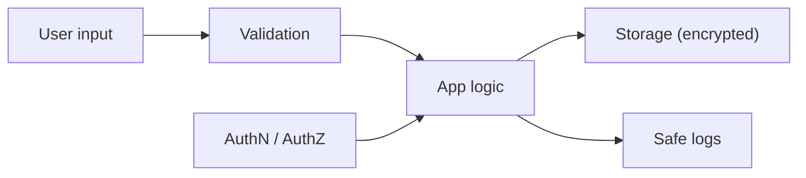

# What Is Secure Coding?

This is the first post in the Secure Coding 101 series.

> Secure Coding 101 series (1/10)

<!-- a-grade-intro:begin -->

**Core question**: Code is not finished when the *feature works*. It is finished when it *survives an attacker*. How do we close that gap?

> *Secure coding is the daily habit of *shrinking the attack surface* without slowing the feature down.*

<!-- a-grade-intro:end -->

## What You Will Learn

- What *secure coding* means and *why* it matters
- The idea of a *threat model* and how to apply it
- What *OWASP Top 10* covers
- Five steps for a safer development flow
- Five common mistakes

## Why It Matters

Most security incidents are *known patterns* repeated. *Skipped input validation*. *Secrets in code*. *No permission check*. Secure coding is not *exotic cryptography* — it is a small, daily set of rules.

> *Security is not a *coating on top* of the feature. It is *part of the structure*.*

## Concept at a Glance



## Key Terms

- **Threat model**: a *map* of who attacks, from where, and what they want.
- **Attack surface**: the *input points* an attacker can touch.
- **Trust boundary**: the line between *trusted* and *untrusted* zones.
- **Defense in depth**: multiple *thin defenses* layered together.
- **Least privilege**: grant *only the access needed*.

## Before/After

**Before**: Build the feature first, security *later*. When something breaks, *rewrite it all*.

**After**: Design *input, auth, storage, logs* together from day one. When something breaks, the *blast radius is small*.

## Hands-on: A Safer Flow in Five Steps

### Step 1 — Mark the input boundary

```python
def parse_age(raw: str) -> int:
    if not raw.isdigit():
        raise ValueError("age must be digits")
    age = int(raw)
    if not (0 < age < 150):
        raise ValueError("age out of range")
    return age
```

### Step 2 — Separate secrets from code

```python
import os
DB_PASSWORD = os.environ["DB_PASSWORD"]  # never hardcoded
```

### Step 3 — Check permission inside the function

```python
def delete_post(user, post):
    if post.author_id != user.id:
        raise PermissionError("not your post")
    post.delete()
```

### Step 4 — Escape on output

```python
import html
def render(name: str) -> str:
    return f"<p>Hello, {html.escape(name)}</p>"
```

### Step 5 — Keep secrets out of logs

```python
def log_login(user):
    print({"event": "login", "user_id": user.id})  # no password
```

## What to Notice in This Code

- Validation happens *at every boundary*, not only the first one.
- *Secrets* come from environment variables or a *secret store*.
- Permission is checked at the *route* and again *inside the function*.

## Five Common Mistakes

1. **Validating only on the *client*.** The server must *re-validate* every time.
2. **Committing secrets to *git*.** Once leaked, *leaked forever*.
3. **Leaking *internal structure* in error messages.** That hands attackers a *map*.
4. **Hiding actions in the *UI* only.** The API is *still callable*.
5. **Never updating *dependencies*.** Known CVEs *pile up*.

## How This Shows Up in Production

Most teams begin with a *threat-modeling workshop*. They draw a *data-flow diagram* and list threats at every *trust boundary*. CI runs *secret scanning*, *dependency scanning*, and *SAST* by default.

## How a Senior Engineer Thinks

- *Treat input as *hostile by default*.*
- *Secrets must *live outside the code*.*
- *The server decides authorization. The UI is a *hint*.*
- *Logs are *evidence and risk* at the same time.*
- *There is no perfect security — only security that *buys time*.*

## Checklist

- [ ] I can write the *threat model* in one paragraph.
- [ ] I can list my *attack surface*.
- [ ] *No secret* lives in the codebase.
- [ ] *Server-side validation* covers every input.

## Practice Problems

1. Sketch the *trust boundaries* of a service you are building.
2. Write the *validation rules* for the three inputs you receive most often.
3. Grep your repository for *strings that look like secrets*.

## Wrap-up and Next Steps

Secure coding is a *habit*. The next post goes deep on the place that leaks most often: *input validation*.

<!-- toc:begin -->
- **What Is Secure Coding? (current)**
- Input Validation (upcoming)
- Authentication and Session (upcoming)
- Authorization and Permissions (upcoming)
- Safe Data Storage (upcoming)
- Secret and Key Management (upcoming)
- SQL Injection and Safe ORM Usage (upcoming)
- XSS and CSRF Defense (upcoming)
- Managing Dependency Vulnerabilities (upcoming)
- Safe Logging and Audit (upcoming)
<!-- toc:end -->

## References

- [OWASP Top 10](https://owasp.org/www-project-top-ten/)
- [OWASP Secure Coding Practices Quick Reference](https://owasp.org/www-pdf-archive/OWASP_SCP_Quick_Reference_Guide_v2.pdf)
- [Microsoft Threat Modeling](https://learn.microsoft.com/en-us/azure/security/develop/threat-modeling-tool)
- [Google — Secure by Design](https://security.googleblog.com/2024/01/secure-by-design.html)

Tags: SecureCoding, Security, OWASP, DevSecOps, AppSec
