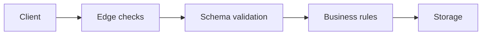

# Input Validation

This is post 2 in the Secure Coding 101 series.

> Secure Coding 101 series (2/10)

<!-- a-grade-intro:begin -->

**Core question**: How do we keep the system *predictable* no matter *what* a user sends?

> *Input validation is the *first defense against attacks* and the *first defense against bugs*.*

<!-- a-grade-intro:end -->

## What You Will Learn

- The difference between *allowlists* and *denylists*
- The power of *schema-based* validation
- What an *input boundary* really is
- A five-step routine for *type, range, format* checks
- Five common mistakes

## Why It Matters

Half of the OWASP Top 10 comes from *trusting input*. SQL injection, XSS, path traversal, unsafe deserialization — all are the result of a server *trusting the client too much*.

> *The client is *hostile*. Validate again on the *server*.*

## Concept at a Glance



## Key Terms

- **Allowlist**: only *what is allowed* gets through.
- **Denylist**: blocks *what is forbidden* (always incomplete).
- **Schema**: a *contract for shape*.
- **Sanitization**: strip or escape *dangerous parts*.
- **Canonicalization**: normalize input to a *single canonical form*.

## Before/After

**Before**: every route validates with ad-hoc *if statements*. The one you forget becomes a *bug*.

**After**: a *schema* validates once; the route reads *business rules* only.

## Hands-on: Validate in Five Steps

### Step 1 — Start with type

```python
def to_int(raw: str) -> int:
    if not raw.lstrip("-").isdigit():
        raise ValueError("not an integer")
    return int(raw)
```

### Step 2 — Check range and length

```python
def parse_quantity(n: int) -> int:
    if not (1 <= n <= 1000):
        raise ValueError("quantity out of range")
    return n
```

### Step 3 — Format with an allowlist regex

```python
import re
USERNAME = re.compile(r"^[a-z0-9_]{3,20}$")

def parse_username(raw: str) -> str:
    if not USERNAME.match(raw):
        raise ValueError("invalid username")
    return raw
```

### Step 4 — One schema for the whole payload

```python
from pydantic import BaseModel, Field

class CreateUser(BaseModel):
    username: str = Field(pattern=r"^[a-z0-9_]{3,20}$")
    age: int = Field(ge=0, le=150)
    email: str = Field(pattern=r"^[^@]+@[^@]+\.[^@]+$")
```

### Step 5 — Make the boundary explicit

```python
def handle_signup(payload: dict):
    user = CreateUser(**payload)  # boundary
    save_user(user)               # downstream code is now trusted
```

## What to Notice in This Code

- *Allowlists* leak less than *denylists*.
- Schema validation is *documentation and code at once*.
- A clear *boundary* removes defensive code from inner functions.

## Five Common Mistakes

1. **Using *denylists only*.** Bypasses keep getting invented.
2. **Trusting *client-side checks* on the server.** Clients *change*.
3. **Passing *raw dicts* through the system.** You never know what keys arrive.
4. **Echoing the *raw input* in error messages.** That becomes an XSS path.
5. **Truncating internationalized input by *bytes*.** Non-ASCII text *breaks*.

## How This Shows Up in Production

Most FastAPI / Flask teams use *Pydantic* or *marshmallow* to validate at the *route entry point*. Valid payloads flow on as *typed objects*; invalid ones return *422*.

## How a Senior Engineer Thinks

- *Schemas are *contracts*.*
- *Validate at *every boundary explicitly*.*
- *Attackers also read your *error messages*.*
- *The default is *deny*; allow is the *exception*.*
- *Normalize *before* validation.*

## Checklist

- [ ] Every route runs through a *schema*.
- [ ] *Allowlist* is the default.
- [ ] *Error messages* are safe to display.
- [ ] Lengths, ranges, formats are *explicit*.

## Practice Problems

1. Build a *Pydantic schema* for a postal address.
2. Write a regex that prevents *path traversal* in a filename.
3. Run the same input through *two normalization rules* — how do the results differ?

## Wrap-up and Next Steps

With validation, behavior becomes *predictable*. Next we look at *who is who* — *authentication and session*.

<!-- toc:begin -->
- [What Is Secure Coding?](./01-what-is-secure-coding.md)
- **Input Validation (current)**
- Authentication and Session (upcoming)
- Authorization and Permissions (upcoming)
- Safe Data Storage (upcoming)
- Secret and Key Management (upcoming)
- SQL Injection and Safe ORM Usage (upcoming)
- XSS and CSRF Defense (upcoming)
- Managing Dependency Vulnerabilities (upcoming)
- Safe Logging and Audit (upcoming)
<!-- toc:end -->

## References

- [OWASP Input Validation Cheat Sheet](https://cheatsheetseries.owasp.org/cheatsheets/Input_Validation_Cheat_Sheet.html)
- [Pydantic docs](https://docs.pydantic.dev/)
- [OWASP — Mass Assignment](https://cheatsheetseries.owasp.org/cheatsheets/Mass_Assignment_Cheat_Sheet.html)
- [PortSwigger — Input validation](https://portswigger.net/web-security)

Tags: InputValidation, SecureCoding, Pydantic, OWASP, AppSec
