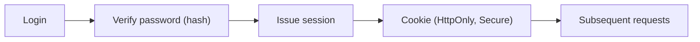

# Authentication and Session

This is post 3 in the Secure Coding 101 series.

> Secure Coding 101 series (3/10)

<!-- a-grade-intro:begin -->

**Core question**: When a request asks *who are you*, how should the *code answer* without leaking?

> *Authentication confirms identity. The session remembers it. Both leak quietly when you are not looking.*

<!-- a-grade-intro:end -->

## What You Will Learn

- The difference between *authentication* and *authorization*
- The principles of *password hashing*
- *Session cookies* vs *JWT* trade-offs
- The role of *MFA*
- A five-step auth flow and five common mistakes

## Why It Matters

When auth leaks, *every permission leaks*. The most common incidents are *weak hashing*, *session fixation*, and *secret leakage*.

> *Auth is the *door*. The session is the *hallway badge*.*

## Concept at a Glance



## Key Terms

- **AuthN**: *who are you* (authentication).
- **AuthZ**: *what may you do* (authorization).
- **Hash**: turn the password into something *not reversible*.
- **Salt**: makes the same password produce a *different hash*.
- **MFA**: identity confirmed by *two or more factors*.

## Before/After

**Before**: Passwords stored as *MD5*, session IDs *readable from JS*. One leak exposes *everything*.

**After**: Hashing with *bcrypt or argon2*, cookies marked *HttpOnly + Secure + SameSite*, login behind a *rate limit*.

## Hands-on: A Safe Auth Flow in Five Steps

### Step 1 — Hash the password

```python
from passlib.hash import argon2
hashed = argon2.hash("user-password")
ok = argon2.verify("user-password", hashed)
```

### Step 2 — Handle login

```python
def login(username, password):
    user = users.find(username)
    if not user or not argon2.verify(password, user.hash):
        raise PermissionError("invalid credentials")
    return create_session(user)
```

### Step 3 — Issue a safe cookie

```python
response.set_cookie(
    "session", session_id,
    httponly=True, secure=True, samesite="Lax", max_age=3600,
)
```

### Step 4 — Logout and revoke

```python
def logout(session_id):
    sessions.delete(session_id)  # truly revoked on the server
```

### Step 5 — Rate limit and lockout

```python
def can_attempt(user_id):
    n = redis.incr(f"login:{user_id}")
    redis.expire(f"login:{user_id}", 60)
    return n <= 5
```

## What to Notice in This Code

- A safe hash is *intentionally slow*.
- Cookie flags work as a *single set*, not one at a time.
- Sessions must be *server-revocable*.

## Five Common Mistakes

1. **Hashing passwords with *MD5 or SHA1*.** Both are broken.
2. **Hashing without a *salt*.** Rainbow tables apply directly.
3. **Issuing *long-lived JWTs*.** Revocation is *impossible*.
4. **Cookies *without HttpOnly*.** A single XSS steals the session.
5. **Login errors that *reveal account existence*.** Enables *enumeration*.

## How This Shows Up in Production

Most teams hash with *Argon2id* or *bcrypt*, combine *short-lived session cookies* with a *refresh* flow, and require *MFA* for sensitive actions.

## How a Senior Engineer Thinks

- *You should never *need* the password — only the hash.*
- *Sessions should be *short and revocable*.*
- *JWTs are convenient but *hard to revoke* — keep them short.*
- *MFA has the *best ROI* of any control.*
- *Every auth path has a *rate limit*.*

## Checklist

- [ ] *Argon2 or bcrypt* in use.
- [ ] Cookies set *HttpOnly + Secure + SameSite*.
- [ ] *Logout* really invalidates the session.
- [ ] *Rate limiting* is on the login route.

## Practice Problems

1. Measure two different *bcrypt cost* values.
2. Compare JWT vs session cookie in a single *trade-off table*.
3. Write login error messages that prevent *account enumeration*.

## Wrap-up and Next Steps

Auth answers *who*. Next we answer *what may they do* — *authorization and permissions*.

<!-- toc:begin -->
- [What Is Secure Coding?](./01-what-is-secure-coding.md)
- [Input Validation](./02-input-validation.md)
- **Authentication and Session (current)**
- Authorization and Permissions (upcoming)
- Safe Data Storage (upcoming)
- Secret and Key Management (upcoming)
- SQL Injection and Safe ORM Usage (upcoming)
- XSS and CSRF Defense (upcoming)
- Managing Dependency Vulnerabilities (upcoming)
- Safe Logging and Audit (upcoming)
<!-- toc:end -->

## References

- [OWASP Authentication Cheat Sheet](https://cheatsheetseries.owasp.org/cheatsheets/Authentication_Cheat_Sheet.html)
- [OWASP Session Management Cheat Sheet](https://cheatsheetseries.owasp.org/cheatsheets/Session_Management_Cheat_Sheet.html)
- [Argon2 — RFC 9106](https://datatracker.ietf.org/doc/rfc9106/)
- [NIST 800-63B — Digital Identity](https://pages.nist.gov/800-63-3/sp800-63b.html)

Tags: Authentication, Session, Cookie, JWT, SecureCoding
