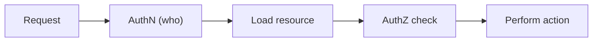

# Authorization and Permissions

> Secure Coding 101 series (4/10)

<!-- a-grade-intro:begin -->

**Core question**: The user is logged in. But *who decides whether they may touch this resource*?

> *Authorization is decided per *action and resource*, not just per *role*. The server decides — every time.*

<!-- a-grade-intro:end -->

## What You Will Learn

- The difference between *RBAC* and *ABAC*
- What *IDOR* is and how to defend
- *Least privilege* in real code
- A five-step authorization flow
- Five common mistakes

## Why It Matters

OWASP Top 10 is often led by *Broken Access Control*. Hiding a button in the UI is *not a defense*. Every decision must happen *on the server*.

> *Authorize at the *resource* level, not just the *route*.*

## Concept at a Glance



## Key Terms

- **RBAC**: *role-based* (admin, editor, viewer).
- **ABAC**: *attribute-based* (owner, department, time).
- **IDOR**: changing the *id* to access someone else's resource.
- **Least privilege**: *deny by default*, allow only what is needed.
- **Policy**: decision rules kept *separate from business code*.

## Before/After

**Before**: A route checks `if user.role == 'admin'` and forgets to verify *ownership*.

**After**: Every resource call goes through `can(user, action, resource)` *explicitly*.

## Hands-on: Authorization in Five Steps

### Step 1 — Attach an *owner* to the resource

```python
class Post:
    def __init__(self, id, author_id, content):
        self.id, self.author_id, self.content = id, author_id, content
```

### Step 2 — Write a policy function

```python
def can_edit(user, post) -> bool:
    return user.id == post.author_id or user.role == "admin"
```

### Step 3 — Check at the resource level

```python
def edit_post(user, post_id, new_text):
    post = posts.get(post_id)
    if not can_edit(user, post):
        raise PermissionError("forbidden")
    post.content = new_text
```

### Step 4 — Filter list queries too

```python
def my_posts(user):
    return [p for p in posts.all() if p.author_id == user.id]
```

### Step 5 — Default deny

```python
def authorize(user, action, resource):
    handler = POLICIES.get(action)
    if not handler:
        raise PermissionError("no policy")  # default deny
    if not handler(user, resource):
        raise PermissionError("forbidden")
```

## What to Notice in This Code

- Policies live in *one place*.
- The *default* is *deny*.
- Resource-level checks *complement* route-level ones.

## Five Common Mistakes

1. **Replacing authorization with *UI hiding*.** The API is still callable.
2. **Trusting `?id=` and skipping the *ownership check*.** The classic *IDOR*.
3. **Checking *role only* and ignoring *resource ownership*.** Editors see everything.
4. **Spreading policies across *every route*.** Miss one place and *all are at risk*.
5. **Returning lists *without filtering*.** The page leaks them anyway.

## How This Shows Up in Production

Most teams keep a *policy module* (`policies.py`) and the route just calls `authorize(user, action, resource)`. Larger orgs adopt *OPA* or *Cedar* for cross-service policy.

## How a Senior Engineer Thinks

- *Authorize at the *resource* boundary.*
- *Treat policies as *data*.*
- *The default is *deny*.*
- *List APIs need *permission filters* too.*
- *Permission changes go to the *audit log*.*

## Checklist

- [ ] `can_*` functions live in *one module*.
- [ ] *Default deny* is enforced.
- [ ] *IDOR* defenses exist at the resource level.
- [ ] *List APIs* have *permission filters*.

## Practice Problems

1. Give one example of using *RBAC* and *ABAC* together.
2. Show one line that creates an *IDOR* and one line that fixes it.
3. Design the schema for a *permission-change audit log*.

## Wrap-up and Next Steps

Once authorization is *explicit*, incidents stay *short*. Next we make the *resource itself safe* — *safe data storage*.

<!-- toc:begin -->
- [What Is Secure Coding?](./01-what-is-secure-coding.md)
- [Input Validation](./02-input-validation.md)
- [Authentication and Session](./03-authentication-and-session.md)
- **Authorization and Permissions (current)**
- Safe Data Storage (upcoming)
- Secret and Key Management (upcoming)
- SQL Injection and Safe ORM Usage (upcoming)
- XSS and CSRF Defense (upcoming)
- Managing Dependency Vulnerabilities (upcoming)
- Safe Logging and Audit (upcoming)
<!-- toc:end -->

## References

- [OWASP Top 10 — Broken Access Control](https://owasp.org/Top10/A01_2021-Broken_Access_Control/)
- [OWASP Authorization Cheat Sheet](https://cheatsheetseries.owasp.org/cheatsheets/Authorization_Cheat_Sheet.html)
- [NIST RBAC](https://csrc.nist.gov/projects/role-based-access-control)
- [Open Policy Agent](https://www.openpolicyagent.org/)

Tags: Authorization, RBAC, ABAC, LeastPrivilege, SecureCoding
