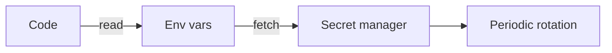

# Secret and Key Management

This is post 6 in the Secure Coding 101 series.

> Secure Coding 101 series (6/10)

<!-- a-grade-intro:begin -->

**Core question**: Where do we put secrets so we can *rotate them anytime* and *never leak them by accident*?

> *Secrets must live *outside the code*, stay *short-lived*, and be *rotatable any time*.*

<!-- a-grade-intro:end -->

## What You Will Learn

- What counts as a *secret*
- Why *hard-coded* secrets are dangerous
- The role of a *secret manager*
- What *key rotation* means
- A five-step routine and five common mistakes

## Why It Matters

The most common incident is a *secret committed to git*. Once pushed, it is *forever traceable*. Even *history rewrite* is not a complete fix.

> *Design every secret on the assumption that it *will leak someday*.*

## Concept at a Glance



## Key Terms

- **Secret**: API keys, DB passwords, tokens — *values that are dangerous when known*.
- **Secret manager**: a central place that *stores, rotates, audits* secrets.
- **Rotation**: replacing secrets *on a schedule*.
- **Scope**: how *broadly* a secret reaches.
- **Audit log**: who *read* the secret, and when.

## Before/After

**Before**: `config.py` contains `API_KEY = "..."`. CI logs print it as-is.

**After**: Loaded from env vars, fetched from a secret manager, *masked* in logs.

## Hands-on: Safe Secrets in Five Steps

### Step 1 — Separate the secret

```python
import os
DB_PASSWORD = os.environ["DB_PASSWORD"]  # never in code
```

### Step 2 — Make `.env` *local-only*

```bash
echo ".env" >> .gitignore
```

### Step 3 — Fetch from a secret manager

```python
import boto3
client = boto3.client("secretsmanager")
val = client.get_secret_value(SecretId="prod/db")["SecretString"]
```

### Step 4 — Rotate

```bash
# Issue a new secret -> reload the app -> revoke the old one
aws secretsmanager rotate-secret --secret-id prod/db
```

### Step 5 — Mask exposure

```python
def mask(s, keep=4):
    return s[:keep] + "*" * (len(s) - keep)
print("API key:", mask(API_KEY))
```

## What to Notice in This Code

- A *secret manager* makes *access auditing* the default.
- Rotation should be possible *without app downtime*.
- Log masking is *on by default*.

## Five Common Mistakes

1. **Committing secrets to *git*.** Once is *forever*.
2. **Printing *env vars* in CI logs.** A *public build* means *public secrets*.
3. **Rotating secrets *manually only*.** It never actually happens.
4. **Reusing the *same secret across environments*.** One leak hits *all of them*.
5. **Holding secrets *in process memory forever*.** A single dump is enough.

## How This Shows Up in Production

Most teams adopt *Vault*, *AWS Secrets Manager*, *Doppler*, or *1Password Connect*, separate secrets *per environment*, and have *CI* fetch *short-lived tokens*. A *secret-scan hook* runs on every `git push`.

## How a Senior Engineer Thinks

- *A secret will leak — design for that.*
- *Rotation that is not *automatic* is not real rotation.*
- *Smaller *scope* means smaller blast radius.*
- *Access is audited by default.*
- *Logs are *masked by default*.*

## Checklist

- [ ] *git secret scanning* is on.
- [ ] Secrets are *separated per environment*.
- [ ] Rotation is *automatic*.
- [ ] An *audit log* exists for secret reads.

## Practice Problems

1. Two commands to find secrets in *git history*.
2. Trade-offs between *env vars* and a *secret manager*.
3. Why *short-lived tokens* beat *long-lived* ones.

## Wrap-up and Next Steps

Safe secrets keep *recovery cost* small. Next we tackle the oldest attack — *SQL injection*.

<!-- toc:begin -->
- [What Is Secure Coding?](./01-what-is-secure-coding.md)
- [Input Validation](./02-input-validation.md)
- [Authentication and Session](./03-authentication-and-session.md)
- [Authorization and Permissions](./04-authorization-and-permissions.md)
- [Safe Data Storage](./05-safe-data-storage.md)
- **Secret and Key Management (current)**
- SQL Injection and Safe ORM Usage (upcoming)
- XSS and CSRF Defense (upcoming)
- Managing Dependency Vulnerabilities (upcoming)
- Safe Logging and Audit (upcoming)
<!-- toc:end -->

## References

- [OWASP Secrets Management Cheat Sheet](https://cheatsheetseries.owasp.org/cheatsheets/Secrets_Management_Cheat_Sheet.html)
- [HashiCorp Vault](https://developer.hashicorp.com/vault/docs)
- [AWS Secrets Manager](https://docs.aws.amazon.com/secretsmanager/)
- [GitHub — Secret scanning](https://docs.github.com/en/code-security/secret-scanning)

Tags: Secrets, KeyManagement, Vault, SecureCoding, DevSecOps
