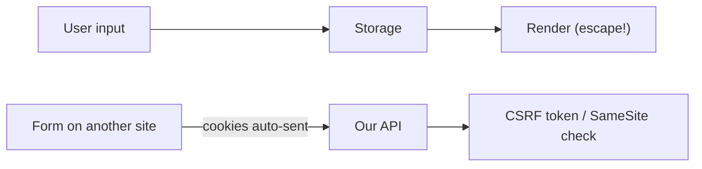

# XSS and CSRF Defense

This is post 8 in the Secure Coding 101 series.

> Secure Coding 101 series (8/10)

<!-- a-grade-intro:begin -->

**Core question**: How do we tell whether the *user's browser* is *on our side* or has been turned into the *attacker's weapon*?

> *XSS runs the *attacker's code on our page*. CSRF triggers *unintended requests with the user's authority*.*

<!-- a-grade-intro:end -->

## What You Will Learn

- The three flavors of *XSS*
- The role of *output escaping* and *CSP*
- How *CSRF* works
- *SameSite cookies* and *CSRF tokens*
- A five-step defense and five common mistakes

## Why It Matters

A single *XSS* can hijack the session. *CSRF* triggers transfers and deletes *without the user knowing*.

> *Default rule — *escape on output, verify origin on request*.*

## Concept at a Glance



## Key Terms

- **Reflected XSS**: input from the URL *echoed straight back*.
- **Stored XSS**: input *saved in the DB* and rendered later.
- **DOM XSS**: client JS inserts via *innerHTML* or similar.
- **CSP**: the browser executes *only code from allowed origins*.
- **CSRF token**: bind requests to an *unguessable token*.

## Before/After

**Before**: `<div>{{ comment }}</div>` rendered as-is. A `<script>` tag *runs*.

**After**: Escape on output, apply *CSP*, set cookies to *SameSite=Lax*, attach a *CSRF token* on state-changing requests.

## Hands-on: Defense in Five Steps

### Step 1 — Escape on output

```python
import html
def render_comment(text):
    return f"<div>{html.escape(text)}</div>"
```

### Step 2 — Content Security Policy

```python
response.headers["Content-Security-Policy"] = "default-src 'self'; script-src 'self'"
```

### Step 3 — SameSite cookies

```python
response.set_cookie(
    "session", sid,
    httponly=True, secure=True, samesite="Lax",
)
```

### Step 4 — CSRF token

```python
import secrets
def issue_csrf():
    return secrets.token_urlsafe(32)

def verify_csrf(form_token, session_token):
    return secrets.compare_digest(form_token, session_token)
```

### Step 5 — Avoid dangerous sinks

```javascript
// element.innerHTML = userInput;  // forbidden
element.textContent = userInput;    // safe
```

## What to Notice in This Code

- Output escaping must match the *context* (HTML, JS, attribute, URL).
- CSP is *defense in depth* — your *last line* if escaping leaks.
- *SameSite* and *CSRF tokens* are used *together*.

## Five Common Mistakes

1. **Rendering Markdown as *raw HTML*.** Lets `<script>` slip in.
2. **Putting input into *`innerHTML`*.** A textbook *DOM XSS*.
3. **Leaving CSP on `unsafe-inline`.** That *defeats* CSP.
4. **CSRF tokens carried in *GET*.** They end up *cached*.
5. **APIs that ignore *Origin/Referer*.** CSRF *passes through*.

## How This Shows Up in Production

Most teams keep *template auto-escape* on by default. They roll out *CSP* in *report-only* mode and harden gradually. Every state-changing API verifies a *CSRF token* or *Origin*.

## How a Senior Engineer Thinks

- *Escape by default; raw is the *exception*.*
- *Strengthen CSP *over time*.*
- *Use *SameSite and a CSRF token* — both.*
- *Never put input into the *DOM raw*; use textContent.*
- *Output escaping is safer than input sanitization.*

## Checklist

- [ ] Template *auto-escape* is enabled.
- [ ] *CSP* is in place.
- [ ] Cookies use *SameSite*.
- [ ] State-changing requests have *CSRF verification*.

## Practice Problems

1. Show one-line examples of *Reflected* and *Stored* XSS.
2. Explain how a *CSP nonce* works.
3. Name a flow that *SameSite=Strict* would break.

## Wrap-up and Next Steps

Browser-side attacks are stopped by *fundamentals*. Next we tackle the code we *did not write* — *dependency vulnerabilities*.

<!-- toc:begin -->
- [What Is Secure Coding?](./01-what-is-secure-coding.md)
- [Input Validation](./02-input-validation.md)
- [Authentication and Session](./03-authentication-and-session.md)
- [Authorization and Permissions](./04-authorization-and-permissions.md)
- [Safe Data Storage](./05-safe-data-storage.md)
- [Secret and Key Management](./06-secret-and-key-management.md)
- [SQL Injection and Safe ORM Usage](./07-sql-injection-and-orm.md)
- **XSS and CSRF Defense (current)**
- Managing Dependency Vulnerabilities (upcoming)
- Safe Logging and Audit (upcoming)
<!-- toc:end -->

## References

- [OWASP XSS Prevention Cheat Sheet](https://cheatsheetseries.owasp.org/cheatsheets/Cross_Site_Scripting_Prevention_Cheat_Sheet.html)
- [OWASP CSRF Prevention Cheat Sheet](https://cheatsheetseries.owasp.org/cheatsheets/Cross-Site_Request_Forgery_Prevention_Cheat_Sheet.html)
- [MDN — Content Security Policy](https://developer.mozilla.org/en-US/docs/Web/HTTP/CSP)
- [MDN — SameSite cookies](https://developer.mozilla.org/en-US/docs/Web/HTTP/Cookies)

Tags: XSS, CSRF, CSP, SecureCoding, WebSecurity
