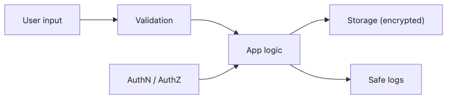

# Secure Coding이란 무엇인가?

기능이 동작하는 것과 공격을 버티는 것은 다른 문제입니다. 로그인은 되는데 계정 탈취에 약할 수 있고, 파일 업로드는 되는데 경로 조작에 무너질 수 있습니다. 보안 사고 대부분은 낯선 암호학 이론보다 입력 검증 누락, 비밀값 노출, 권한 확인 누락처럼 익숙한 개발 실수에서 시작합니다.

이 글은 Secure Coding 101 시리즈의 첫 번째 글입니다.

여기서는 secure coding을 기능 개발 뒤에 덧칠하는 작업이 아니라, 입력 경계와 권한, 저장, 로그를 처음부터 함께 설계하는 습관으로 보겠습니다. 이 관점을 잡아 두면 이후 글에서 다룰 입력 검증, 인증, 인가, 저장, 로깅이 서로 어떻게 이어지는지도 훨씬 선명해집니다.

## 이 글에서 다룰 문제

- secure coding은 정확히 무엇을 뜻할까요?
- 위협 모델과 공격 표면은 코드 설계와 어떤 관계가 있을까요?
- OWASP Top 10은 입문자가 어떤 관점으로 읽어야 할까요?
- 기능 개발 속도를 늦추지 않으면서도 공격 표면을 줄이려면 어디부터 시작해야 할까요?
- 팀 차원에서 secure coding을 일상 습관으로 만들려면 무엇이 필요할까요?

> Secure coding은 기능을 늦추는 별도 절차가 아니라, 공격 표면을 매일 조금씩 줄이는 개발 습관입니다.

## 왜 중요한가

보안 사고는 대개 예외적인 천재 공격보다 반복되는 기본 실수에서 나옵니다. 서버가 입력을 너무 쉽게 믿고, 비밀값을 코드나 로그에 남기고, 권한을 UI에서만 숨긴 채 API에서 다시 확인하지 않으면 기능은 돌아가도 시스템은 쉽게 흔들립니다.

secure coding이 중요한 이유도 여기에 있습니다. 사고가 난 뒤 전체를 다시 고치는 방식은 비용이 큽니다. 반대로 처음부터 입력 경계를 분명히 하고, 권한을 서버에서 다시 보고, 민감한 데이터를 분리해 두면 문제가 생겨도 영향 범위가 작아집니다. 운영에서는 이 차이가 그대로 복구 시간과 사고 규모로 이어집니다.

## 한눈에 보는 구조



*Secure coding을 구성하는 입력, 인증, 저장, 로그의 기본 흐름*
이 그림은 secure coding을 구성하는 기본 흐름을 한 장에 모아 둔 것입니다. 사용자가 보낸 입력은 먼저 검증을 통과해야 하고, 핵심 로직은 인증과 인가 판단 안에서만 실행돼야 하며, 저장과 로그는 그 결과를 안전하게 다뤄야 합니다. 어느 한 단계만 비어도 나머지 단계의 품질이 함께 무너집니다.

## 핵심 용어

- **위협 모델(threat model)**: 누가 어디서 무엇을 노리는지 정리한 공격 지도입니다.
- **공격 표면(attack surface)**: 공격자가 실제로 건드릴 수 있는 입력 지점입니다.
- **신뢰 경계(trust boundary)**: 신뢰 가능한 영역과 신뢰하면 안 되는 영역이 갈리는 선입니다.
- **심층 방어(defense in depth)**: 얇은 방어막을 여러 겹 쌓아 한 번의 실수가 전체 사고로 번지지 않게 하는 방식입니다.
- **최소 권한(least privilege)**: 꼭 필요한 권한만 주고 나머지는 기본적으로 막는 원칙입니다.

## 바꾸기 전과 후

**바꾸기 전**: 기능을 먼저 만들고 보안은 나중에 붙입니다. 문제가 생기면 설계 전체를 다시 손봐야 하고, 이미 노출된 비밀값이나 잘못 열린 권한은 되돌리기 어렵습니다.

**바꾼 후**: 입력, 인증, 저장, 로그를 처음부터 함께 설계합니다. 문제가 생겨도 공격이 번지는 범위가 작고, 어디서 막아야 할지 판단하기 쉬워집니다.

## 실습: 더 안전한 흐름을 만드는 5단계

### 1단계 — 입력 경계를 먼저 표시합니다

```python
def parse_age(raw: str) -> int:
    if not raw.isdigit():
        raise ValueError("age must be digits")
    age = int(raw)
    if not (0 < age < 150):
        raise ValueError("age out of range")
    return age
```

입력값은 비즈니스 로직 안으로 들어오기 전에 형식과 범위를 확인해야 합니다. 이 함수가 하는 일은 단순하지만, 숫자가 아닌 값을 조용히 통과시키지 않는다는 점이 중요합니다. secure coding은 거대한 보안 프레임워크보다 이런 작은 경계 선언에서 시작합니다.

### 2단계 — 비밀값을 코드에서 분리합니다

```python
import os
DB_PASSWORD = os.environ["DB_PASSWORD"]  # 절대 하드코딩하지 않음
```

비밀번호나 API 키를 코드에 직접 넣는 순간 저장소, 리뷰 화면, 배포 로그, 협업 도구가 모두 유출 경로가 됩니다. 비밀값은 환경 변수나 비밀 저장소에서 읽고, 코드베이스는 그 값이 없다는 전제로 유지합니다.

### 3단계 — 함수 내부에서도 권한을 다시 확인합니다

```python
def delete_post(user, post):
    if post.author_id != user.id:
        raise PermissionError("not your post")
    post.delete()
```

라우트에서 한 번 권한을 검사했다고 끝나지 않습니다. 실제로 중요한 작업을 수행하는 함수 안에서 자원 소유권을 다시 확인해야 우회 호출을 막을 수 있습니다. UI에서 버튼을 숨기는 것과 서버에서 작업을 거부하는 것은 전혀 다른 수준의 방어입니다.

### 4단계 — 출력 단계에서 이스케이프합니다

```python
import html
def render(name: str) -> str:
    return f"<p>Hello, {html.escape(name)}</p>"
```

입력을 한 번 검증했다고 해서 출력이 자동으로 안전해지지는 않습니다. 브라우저에 HTML로 섞여 들어가는 값은 출력 위치에 맞게 다시 이스케이프해야 합니다. XSS는 대개 입력 단계보다 출력 단계에서 터집니다.

### 5단계 — 로그에서 비밀값을 지웁니다

```python
def log_login(user):
    print({"event": "login", "user_id": user.id})  # 비밀번호는 남기지 않음
```

로그는 운영 증거이면서 동시에 유출 위험입니다. 문제를 추적하려고 모든 값을 남기고 싶어지지만, 비밀번호와 토큰, 인증 헤더, 카드 번호는 복구 자료가 아니라 사고 자료가 됩니다. 운영에 필요한 식별자만 남기는 습관이 필요합니다.

## 이 코드에서 먼저 볼 점

- 검증은 한 번의 이벤트가 아니라 경계마다 반복되는 절차입니다.
- 비밀값은 코드가 아니라 환경 변수나 비밀 저장소에서 읽어야 합니다.
- 권한 검사는 라우트 바깥 설명이 아니라 실제 작업 함수 안에 둡니다.
- 저장과 출력, 로그는 모두 별도 보안 판단이 필요한 단계입니다.

## 실무에서 자주 헷갈리는 지점

1. **클라이언트 검증만 믿는 경우**: 브라우저 검증은 편의 기능일 뿐입니다. 서버는 항상 다시 확인해야 합니다.
2. **비밀값을 Git에 올리는 경우**: 한 번 커밋된 비밀값은 지워도 기록에 남기 쉽습니다. 회전 비용도 함께 생깁니다.
3. **오류 메시지에 내부 구조를 드러내는 경우**: 스택 트레이스나 SQL 조각은 공격자에게 시스템 지도를 줍니다.
4. **권한을 UI에서만 숨기는 경우**: API가 살아 있으면 공격자는 화면 없이도 직접 호출합니다.
5. **의존성 업데이트를 미루는 경우**: 알려진 CVE가 그대로 쌓이면 기능 결함이 아니라 운영 부채가 됩니다.

## 실무에서는 이렇게 봅니다

현업 팀은 대개 위협 모델링으로 출발합니다. 간단한 데이터 흐름도를 그리고, 어느 입력이 신뢰 경계를 넘는지, 어떤 자산이 가장 민감한지 먼저 적습니다. 그다음 CI에서 비밀값 스캔, 의존성 스캔, 정적 분석을 기본값으로 돌려 사람의 실수를 반복적으로 잡습니다.

중요한 점은 secure coding을 보안팀 전용 일로 분리하지 않는 것입니다. 기능을 만드는 개발자가 입력 스키마와 권한 체크, 로그 마스킹까지 같이 책임질 때 가장 효과가 큽니다. 반대로 보안을 마지막 리뷰 단계에만 몰아두면 구조적인 문제는 이미 코드 곳곳에 퍼져 있게 됩니다.

## 선임 엔지니어는 이렇게 생각합니다

- 입력은 기본적으로 적대적이라고 가정합니다.
- 비밀값은 언젠가 샐 수 있으니 코드 밖에 두고 회전 가능하게 설계합니다.
- 인가는 서버가 결정하고, UI는 그 결정을 보여 주는 층으로 봅니다.
- 로그는 증거이자 위험이므로 남길 값과 지울 값을 먼저 구분합니다.
- 완벽한 보안보다 사고 시간을 벌어 주는 설계를 현실적인 목표로 둡니다.

## 체크리스트

- [ ] 우리 서비스의 위협 모델을 한 문단으로 설명할 수 있습니다.
- [ ] 공격 표면이 어디인지 나열할 수 있습니다.
- [ ] 비밀값이 코드 저장소에 없습니다.
- [ ] 모든 입력이 서버 쪽 검증을 거칩니다.

## 연습 문제

1. 지금 만들고 있는 서비스의 신뢰 경계를 그림으로 그려 보세요.
2. 가장 자주 받는 입력 세 가지에 대해 검증 규칙을 적어 보세요.
3. 저장소에서 비밀값처럼 보이는 문자열을 검색해 보세요.

## 정리와 다음 글

secure coding은 거창한 추가 기능이 아니라, 입력 경계와 권한, 저장, 로그를 매일 조금씩 더 안전하게 만드는 개발 습관입니다. 이 글에서는 그 출발점으로 위협 모델, 공격 표면, 최소 권한 같은 기본 관점을 잡았습니다.

다음 글에서는 가장 먼저 무너지고 가장 자주 새는 지점인 입력값 검증을 깊게 다룹니다.

<!-- toc:begin -->
- **Secure Coding이란 무엇인가? (현재 글)**
- 입력값 검증 (예정)
- 인증과 세션 (예정)
- 인가와 권한 (예정)
- 안전한 데이터 저장 (예정)
- Secret과 키 관리 (예정)
- SQL Injection과 ORM 안전 사용 (예정)
- XSS와 CSRF 방어 (예정)
- Dependency 취약점 관리 (예정)
- 안전한 로깅과 감사 (예정)
<!-- toc:end -->

## 참고 자료

- [OWASP Top 10](https://owasp.org/www-project-top-ten/)
- [OWASP Secure Coding Practices Quick Reference](https://owasp.org/www-pdf-archive/OWASP_SCP_Quick_Reference_Guide_v2.pdf)
- [Microsoft Threat Modeling](https://learn.microsoft.com/en-us/azure/security/develop/threat-modeling-tool)
- [Google — Secure by Design](https://security.googleblog.com/2024/01/secure-by-design.html)
- [CISA와 국제 파트너 — Secure by Design 원칙](https://www.cisa.gov/resources-tools/resources/shifting-balance-cybersecurity-risk-principles-and-approaches-secure-design)

Tags: SecureCoding, Security, OWASP, DevSecOps, AppSec
