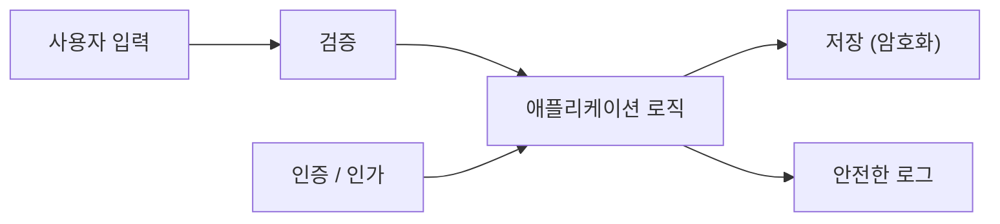

# Secure Coding이란 무엇인가?

> Secure Coding 101 시리즈 (1/10)


## 이 글에서 다룰 문제

대부분의 보안 사고는 *알려진 패턴* 의 반복입니다. *입력 검증을 잊는다*, *secret 을 코드에 박는다*, *권한을 안 본다*. Secure coding 은 *대단한 암호학* 이 아니라 *일상의 작은 규칙* 입니다.

> *보안은 *기능 위에 얹는 코팅* 이 아니라, *처음부터 짜는 구조* 다.*

## 전체 흐름


## Before/After

**Before**: 기능을 먼저 만들고 보안은 나중에 본다. 사고가 나면 전체를 다시 짠다.

**After**: 입력, 인증, 저장, 로그를 *처음부터 함께* 설계한다. 사고가 나도 *영향 범위가 좁다*.

## 안전한 흐름 5단계

### 1단계 — 입력의 경계를 표시한다

```python
def parse_age(raw: str) -> int:
    if not raw.isdigit():
        raise ValueError("age must be digits")
    age = int(raw)
    if not (0 < age < 150):
        raise ValueError("age out of range")
    return age
```

### 2단계 — secret 을 분리한다

```python
import os
DB_PASSWORD = os.environ["DB_PASSWORD"]  # 코드에 박지 않는다
```

### 3단계 — 권한을 함수 안에서 확인한다

```python
def delete_post(user, post):
    if post.author_id != user.id:
        raise PermissionError("not your post")
    post.delete()
```

### 4단계 — 출력에서 escape 한다

```python
import html
def render(name: str) -> str:
    return f"<p>Hello, {html.escape(name)}</p>"
```

### 5단계 — 로그에 비밀을 남기지 않는다

```python
def log_login(user):
    print({"event": "login", "user_id": user.id})  # password 금지
```

## 이 코드에서 주목할 점

- 검증은 *경계에서 한 번* 이 아니라 각 경계마다 한다.
- *Secret* 은 *환경 변수* 또는 *비밀 저장소* 에서 읽는다.
- 권한은 *route 에서 한 번, 함수에서 다시*.

## 자주 하는 실수 5가지

1. **검증을 *클라이언트만* 에서 한다.** 서버는 *항상 다시* 검증한다.
2. **Secret 을 *git 에 commit* 한다.** 한 번 새면 *영원히 샌다*.
3. **Error 메시지에 *내부 구조* 를 노출.** 공격자에게 지도를 준다.
4. **권한을 *UI* 만 숨긴다.** API 는 *그대로 호출* 가능.
5. **Dependency 를 *영원히 안 올린다*.** *알려진 취약점* 이 쌓인다.

## 실무에서는 이렇게 쓰입니다

대부분의 팀은 *threat model 워크숍* 으로 시작합니다. *데이터 흐름도* 를 그리고, *trust boundary* 마다 위협을 적습니다. CI 에서 *secret scan*, *dependency scan*, *SAST* 를 기본으로 돌립니다.

## 체크리스트

- [ ] *Threat model* 을 한 문단으로 쓸 수 있다.
- [ ] *Attack surface* 를 나열할 수 있다.
- [ ] *Secret* 이 *코드에 없다*.
- [ ] *서버 검증* 이 모든 입력에 있다.

## 정리 및 다음 단계

Secure coding 은 습관입니다. 다음 글에서는 가장 많이 새는 곳, *입력값 검증* 을 깊이 봅니다.

<!-- toc:begin -->
- **Secure Coding이란 무엇인가? (현재 글)**
- 입력값 검증 (예정)
- 인증과 세션 (예정)
- 인가와 권한 (예정)
- 안전한 데이터 저장 (예정)
- Secret과 키 관리 (예정)
- SQL Injection과 ORM 안전 사용 (예정)
- XSS와 CSRF 방어 (예정)
- Dependency 취약점 관리 (예정)
- 안전한 로깅과 감사 (예정)
<!-- toc:end -->

## 참고 자료

- [OWASP Top 10](https://owasp.org/www-project-top-ten/)
- [OWASP Secure Coding Practices Quick Reference](https://owasp.org/www-pdf-archive/OWASP_SCP_Quick_Reference_Guide_v2.pdf)
- [Microsoft Threat Modeling](https://learn.microsoft.com/en-us/azure/security/develop/threat-modeling-tool)
- [Google — Secure by Design](https://security.googleblog.com/2024/01/secure-by-design.html)

Tags: SecureCoding, Security, OWASP, DevSecOps, AppSec
