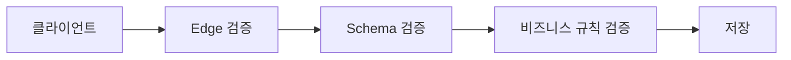

# 입력값 검증

> Secure Coding 101 시리즈 (2/10)


## 이 글에서 다룰 문제

OWASP Top 10 의 절반은 *입력을 믿어서* 생깁니다. SQL injection, XSS, path traversal, deserialization. 모두 *서버가 클라이언트를 너무 믿은* 결과입니다.

> *클라이언트는 *적대적*. 검증은 *서버에서 한 번 더*.*

## 개념 한눈에 보기



## Before/After

**Before**: route 마다 *if 문* 으로 검증한다. 빠뜨린 곳에서 *버그*.

**After**: *schema* 로 한 번에 검증, route 는 *비즈니스 규칙* 만 본다.

## 실습: 검증 5단계

### 1단계 — Type 부터 본다

```python
def to_int(raw: str) -> int:
    if not raw.lstrip("-").isdigit():
        raise ValueError("not an integer")
    return int(raw)
```

### 2단계 — Range, length 검증

```python
def parse_quantity(n: int) -> int:
    if not (1 <= n <= 1000):
        raise ValueError("quantity out of range")
    return n
```

### 3단계 — Format (allowlist 정규식)

```python
import re
USERNAME = re.compile(r"^[a-z0-9_]{3,20}$")

def parse_username(raw: str) -> str:
    if not USERNAME.match(raw):
        raise ValueError("invalid username")
    return raw
```

### 4단계 — Schema 한 방에

```python
from pydantic import BaseModel, Field

class CreateUser(BaseModel):
    username: str = Field(pattern=r"^[a-z0-9_]{3,20}$")
    age: int = Field(ge=0, le=150)
    email: str = Field(pattern=r"^[^@]+@[^@]+\.[^@]+$")
```

### 5단계 — 경계 명시

```python
def handle_signup(payload: dict):
    user = CreateUser(**payload)  # boundary
    save_user(user)               # 이후는 신뢰 가능
```

## 이 코드에서 주목할 점

- *Allowlist* 가 *denylist* 보다 *덜 새는다*.
- Schema 검증은 *문서이자 코드*.
- *Boundary* 가 명확하면, 내부 함수는 *방어적 코드* 가 줄어든다.

## 자주 하는 실수 5가지

1. **Denylist 만 쓴다.** 새로운 우회 패턴이 *계속* 등장.
2. **Client 검증을 *서버에서 신뢰*.** 클라이언트는 *바뀐다*.
3. **Schema 없이 *dict 그대로* 처리.** 어떤 키가 올지 *모른다*.
4. **Error 메시지에 *입력 그대로* 출력.** XSS 통로가 된다.
5. **국제화된 입력을 *byte 단위* 로 자른다.** 한글이 *깨진다*.

## 실무에서는 이렇게 쓰입니다

대부분의 FastAPI / Flask 팀은 *Pydantic* 또는 *marshmallow* 로 입력을 *route 진입점* 에서 한 번에 검증합니다. 정상 입력은 *typed object* 로 흐르고, 비정상 입력은 *422* 로 떨어집니다.

## 체크리스트

- [ ] 모든 route 가 *schema* 를 통과한다.
- [ ] *Allowlist* 가 기본이다.
- [ ] *Error 메시지* 가 안전하다.
- [ ] 길이, 범위, format 이 *명시* 되어 있다.

## 정리 및 다음 단계

검증이 있으면 *예측 가능* 해집니다. 다음 글에서는 *누가 누구인지* — *인증과 세션* 을 봅니다.

<!-- toc:begin -->
- [Secure Coding이란 무엇인가?](./01-what-is-secure-coding.md)
- **입력값 검증 (현재 글)**
- 인증과 세션 (예정)
- 인가와 권한 (예정)
- 안전한 데이터 저장 (예정)
- Secret과 키 관리 (예정)
- SQL Injection과 ORM 안전 사용 (예정)
- XSS와 CSRF 방어 (예정)
- Dependency 취약점 관리 (예정)
- 안전한 로깅과 감사 (예정)
<!-- toc:end -->

## 참고 자료

- [OWASP Input Validation Cheat Sheet](https://cheatsheetseries.owasp.org/cheatsheets/Input_Validation_Cheat_Sheet.html)
- [Pydantic docs](https://docs.pydantic.dev/)
- [OWASP — Mass Assignment](https://cheatsheetseries.owasp.org/cheatsheets/Mass_Assignment_Cheat_Sheet.html)
- [PortSwigger — Input validation](https://portswigger.net/web-security)

Tags: InputValidation, SecureCoding, Pydantic, OWASP, AppSec
