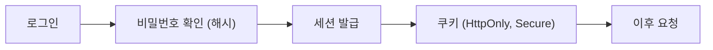

# 인증과 세션

> Secure Coding 101 시리즈 (3/10)


## 이 글에서 다룰 문제

인증이 새면 *모든 권한* 이 샙니다. 가장 흔한 사고는 *약한 해싱*, *세션 고정*, *secret 유출* 입니다.

> *인증은 *문* 이고, 세션은 *복도의 출입증* 이다.*

## 전체 흐름


## Before/After

**Before**: 비밀번호를 *MD5* 로 저장, 세션 ID 를 *JS 에서 읽는다*. 한 번 새면 *전체 노출*.

**After**: *bcrypt/argon2* 해싱, 쿠키 *HttpOnly + Secure + SameSite*, 로그인 *rate limit*.

## 안전한 인증 5단계

### 1단계 — 비밀번호 해싱

```python
from passlib.hash import argon2
hashed = argon2.hash("user-password")
ok = argon2.verify("user-password", hashed)
```

### 2단계 — 로그인 처리

```python
def login(username, password):
    user = users.find(username)
    if not user or not argon2.verify(password, user.hash):
        raise PermissionError("invalid credentials")
    return create_session(user)
```

### 3단계 — 안전한 세션 쿠키

```python
response.set_cookie(
    "session", session_id,
    httponly=True, secure=True, samesite="Lax", max_age=3600,
)
```

### 4단계 — 로그아웃과 세션 폐기

```python
def logout(session_id):
    sessions.delete(session_id)  # 서버에서 진짜 폐기
```

### 5단계 — Rate limit 과 lockout

```python
def can_attempt(user_id):
    n = redis.incr(f"login:{user_id}")
    redis.expire(f"login:{user_id}", 60)
    return n <= 5
```

## 이 코드에서 주목할 점

- 해시는 *느린 알고리즘* 이 안전.
- 쿠키 속성은 *세 가지가 한 세트*.
- 세션은 *서버에서 폐기* 가 가능해야 한다.

## 자주 하는 실수 5가지

1. **MD5 / SHA1 로 비밀번호 해싱.** *깨진 알고리즘*.
2. **Salt 없이 해싱.** rainbow table 에 *바로 노출*.
3. **JWT 를 *영원* 으로 발급.** 폐기가 *불가능*.
4. **쿠키에 *HttpOnly* 가 없다.** XSS 한 방에 *세션 탈취*.
5. **로그인 실패 메시지로 *계정 존재 여부* 노출.** *enumeration* 공격.

## 실무에서는 이렇게 쓰입니다

대부분의 팀은 *Argon2id* 또는 *bcrypt* 로 해싱하고, 짧은 만료의 *세션 쿠키* 와 *refresh* 흐름을 결합합니다. 중요 기능은 *MFA* 를 강제합니다.

## 체크리스트

- [ ] *Argon2 / bcrypt* 사용.
- [ ] 쿠키에 *HttpOnly + Secure + SameSite*.
- [ ] *로그아웃* 이 서버에서 동작.
- [ ] *Rate limit* 이 로그인에 있다.

## 정리 및 다음 단계

인증은 *신원* 입니다. 다음은 *그 신원이 무엇을 할 수 있는가* — *인가와 권한* 입니다.

<!-- toc:begin -->
- [Secure Coding이란 무엇인가?](./01-what-is-secure-coding.md)
- [입력값 검증](./02-input-validation.md)
- **인증과 세션 (현재 글)**
- 인가와 권한 (예정)
- 안전한 데이터 저장 (예정)
- Secret과 키 관리 (예정)
- SQL Injection과 ORM 안전 사용 (예정)
- XSS와 CSRF 방어 (예정)
- Dependency 취약점 관리 (예정)
- 안전한 로깅과 감사 (예정)
<!-- toc:end -->

## 참고 자료

- [OWASP Authentication Cheat Sheet](https://cheatsheetseries.owasp.org/cheatsheets/Authentication_Cheat_Sheet.html)
- [OWASP Session Management Cheat Sheet](https://cheatsheetseries.owasp.org/cheatsheets/Session_Management_Cheat_Sheet.html)
- [Argon2 — RFC 9106](https://datatracker.ietf.org/doc/rfc9106/)
- [NIST 800-63B — Digital Identity](https://pages.nist.gov/800-63-3/sp800-63b.html)

Tags: Authentication, Session, Cookie, JWT, SecureCoding
