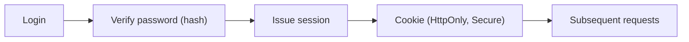

# 인증과 세션

인증이 무너지면 그 위에 쌓인 권한도 함께 무너집니다. 비밀번호 저장 방식이 약하거나, 세션 쿠키 설정이 느슨하거나, 로그인 실패 처리로 계정 존재 여부를 노출하면 기능은 멀쩡해 보여도 시스템 전체가 흔들립니다. 공격자는 복잡한 취약점보다 이런 기본 경로를 먼저 노립니다.

이 글은 Secure Coding 101 시리즈의 3번째 글입니다.

여기서는 인증과 세션을 한 덩어리로 보지 않고, 신원을 확인하는 단계와 그 신원을 기억하는 단계를 분리해서 보겠습니다. 이 차이를 분명히 이해해야 JWT와 세션 쿠키의 선택 기준, 로그아웃 처리, MFA 적용 지점도 함께 정리됩니다.

## 이 글에서 다룰 문제

- 인증과 인가는 무엇이 다를까요?
- 비밀번호 해시는 왜 의도적으로 느린 알고리즘을 써야 할까요?
- 세션 쿠키와 JWT는 어떤 장단점이 있을까요?
- 로그아웃은 왜 서버 쪽 폐기 가능성을 전제로 설계해야 할까요?
- MFA와 로그인 rate limit은 어느 지점에서 가장 큰 효과를 낼까요?

> 인증은 사용자가 누구인지 확인하는 단계이고, 세션은 그 결과를 이후 요청에서도 안전하게 기억하게 만드는 장치입니다.

## 왜 중요한가

인증 관련 사고는 한 번 터지면 영향 범위가 큽니다. 공격자가 계정을 탈취하면 그 계정이 가진 권한 전체를 얻기 때문입니다. 그래서 weak hash, 세션 고정, 장기 토큰 남발, 쿠키 속성 누락 같은 문제는 단일 버그가 아니라 시스템 전체의 신뢰 문제로 이어집니다.

보안 설계에서 인증이 중요한 또 하나의 이유는 사용성 때문입니다. 지나치게 느슨하면 계정 탈취가 쉬워지고, 지나치게 거칠면 정상 사용자도 계속 막힙니다. 선임 엔지니어는 이 균형을 개별 화면이 아니라 해시, 세션, 폐기, MFA, rate limit가 묶인 하나의 흐름으로 봅니다.

## 한눈에 보는 구조



로그인 요청은 먼저 비밀번호 검증을 거치고, 검증이 끝나면 서버가 세션을 발급합니다. 이후 요청은 쿠키나 토큰으로 그 세션을 다시 증명합니다. 여기서 한 단계라도 약하면 나머지 단계 품질이 상쇄됩니다. 예를 들어 해시가 안전해도 쿠키가 `HttpOnly` 없이 내려가면 XSS 한 번으로 세션이 탈취될 수 있습니다.

## 핵심 용어

- **인증(AuthN)**: 사용자가 누구인지 확인하는 절차입니다.
- **인가(AuthZ)**: 확인된 사용자가 무엇을 할 수 있는지 판단하는 절차입니다.
- **해시(hash)**: 비밀번호를 복원 불가능한 형태로 바꾸는 값입니다.
- **솔트(salt)**: 같은 비밀번호라도 서로 다른 해시가 나오게 만드는 추가 값입니다.
- **다중 인증(MFA)**: 두 개 이상 요소로 신원을 다시 확인하는 방식입니다.

## 바꾸기 전과 후

**바꾸기 전**: 비밀번호를 MD5 같은 빠른 해시로 저장하고, 세션 ID를 자바스크립트가 읽을 수 있게 둡니다. 한 번 노출되면 전체 계정이 흔들립니다.

**바꾼 후**: Argon2나 bcrypt로 비밀번호를 해시하고, 쿠키에 `HttpOnly`, `Secure`, `SameSite`를 함께 적용합니다. 로그인 경로에는 rate limit를 걸고, 서버가 세션을 직접 폐기할 수 있게 만듭니다.

## 실습: 안전한 인증 흐름을 만드는 5단계

### 1단계 — 비밀번호를 안전하게 해시합니다

```python
from passlib.hash import argon2
hashed = argon2.hash("user-password")
ok = argon2.verify("user-password", hashed)
```

안전한 해시는 일부러 느립니다. 공격자가 대량 추측을 시도할 때 비용을 크게 만들기 위해서입니다. 비밀번호를 평문이나 빠른 해시로 저장하면 유출 순간 대량 복구가 쉬워집니다.

### 2단계 — 로그인 검증을 신중하게 처리합니다

```python
def login(username, password):
    user = users.find(username)
    if not user or not argon2.verify(password, user.hash):
        raise PermissionError("invalid credentials")
    return create_session(user)
```

이 단계에서는 계정 존재 여부를 드러내지 않는 것이 중요합니다. 사용자 이름이 틀렸는지 비밀번호가 틀렸는지를 구분해 주면 공격자는 계정 목록을 빠르게 수집할 수 있습니다. 인증 실패 메시지는 의도적으로 뭉뚱그리는 편이 안전합니다.

### 3단계 — 안전한 세션 쿠키를 발급합니다

```python
response.set_cookie(
    "session", session_id,
    httponly=True, secure=True, samesite="Lax", max_age=3600,
)
```

쿠키 속성은 하나씩 따로 보는 항목이 아닙니다. `HttpOnly`는 자바스크립트 접근을 막고, `Secure`는 HTTPS에서만 전송하게 하며, `SameSite`는 교차 사이트 요청 위험을 줄입니다. 셋을 한 세트로 봐야 합니다.

### 4단계 — 로그아웃 시 서버에서 세션을 폐기합니다

```python
def logout(session_id):
    sessions.delete(session_id)  # 서버에서 실제로 폐기
```

클라이언트에서 쿠키를 지우는 것만으로는 충분하지 않습니다. 서버가 해당 세션을 더 이상 유효하지 않다고 기억해야 진짜 로그아웃이 됩니다. 이 차이를 놓치면 이미 탈취된 세션이 계속 살아 있을 수 있습니다.

### 5단계 — 로그인 시도에 속도 제한을 둡니다

```python
def can_attempt(user_id):
    n = redis.incr(f"login:{user_id}")
    redis.expire(f"login:{user_id}", 60)
    return n <= 5
```

강한 해시만으로는 대입 공격을 충분히 늦추지 못할 수 있습니다. 로그인 엔드포인트에 rate limit와 lockout 정책을 두면 계정 추측 비용이 크게 올라갑니다. MFA와 함께 적용하면 효과가 더 큽니다.

## 이 코드에서 먼저 볼 점

- 안전한 비밀번호 해시는 의도적으로 느립니다.
- 쿠키 보안 속성은 함께 적용해야 의미가 있습니다.
- 세션은 서버에서 폐기 가능해야 합니다.
- 인증 실패 응답은 계정 존재 여부를 드러내지 않아야 합니다.

## 실무에서 자주 헷갈리는 지점

1. **MD5나 SHA1로 비밀번호를 해시하는 경우**: 너무 빠르고 이미 안전하지 않습니다.
2. **솔트 없이 해시하는 경우**: 같은 비밀번호가 같은 해시로 남아 rainbow table 공격에 취약합니다.
3. **수명이 긴 JWT를 남발하는 경우**: 탈취 후 폐기가 어렵습니다. 짧은 수명과 별도 갱신 흐름이 필요합니다.
4. **`HttpOnly` 없는 쿠키를 쓰는 경우**: XSS 한 번이면 세션 탈취로 이어집니다.
5. **로그인 오류로 계정 존재 여부를 알려 주는 경우**: 계정 열거 공격의 출발점이 됩니다.

## 실무에서는 이렇게 봅니다

현업에서는 Argon2id나 bcrypt로 비밀번호를 저장하고, 짧은 세션 쿠키에 갱신 흐름을 조합하는 구성이 흔합니다. 관리자 기능이나 결제, 비밀번호 변경처럼 민감한 작업에는 MFA를 추가하고, 로그인과 비밀번호 재설정 경로에는 반드시 rate limit를 둡니다.

또한 세션 관리와 토큰 설계는 편의성보다 폐기 가능성을 먼저 봅니다. JWT는 서비스 간 전달에는 편리하지만, 탈취 후 즉시 폐기하기 어렵습니다. 세션 쿠키는 서버 저장소 부담이 있지만 revocation이 쉬워 운영 통제가 좋습니다. 어느 쪽이든 만료와 폐기 전략을 함께 설계해야 합니다.

## 선임 엔지니어는 이렇게 생각합니다

- 시스템은 비밀번호 원문을 알 필요가 없고, 해시만 알면 됩니다.
- 세션은 짧고 폐기 가능해야 합니다.
- JWT는 편리하지만 폐기가 어렵기 때문에 수명을 짧게 잡아야 합니다.
- MFA는 대비 효과가 큰 통제 수단입니다.
- 모든 인증 경로에는 속도 제한이 붙어 있어야 합니다.

## 체크리스트

- [ ] Argon2 또는 bcrypt를 사용합니다.
- [ ] 쿠키에 `HttpOnly`, `Secure`, `SameSite`가 함께 설정돼 있습니다.
- [ ] 로그아웃이 서버에서 실제로 세션을 무효화합니다.
- [ ] 로그인 경로에 rate limit가 있습니다.

## 연습 문제

1. 서로 다른 bcrypt cost 값을 두 개 골라 해시 시간을 비교해 보세요.
2. JWT와 세션 쿠키의 장단점을 표로 정리해 보세요.
3. 계정 열거를 막는 로그인 오류 메시지를 설계해 보세요.

## 정리와 다음 글

인증은 신원을 확인하는 단계이고, 세션은 그 결과를 이후 요청까지 안전하게 이어 주는 장치입니다. 이 글에서는 해시, 쿠키 속성, 세션 폐기, rate limit, MFA를 하나의 흐름으로 묶어 봐야 하는 이유를 정리했습니다.

다음 글에서는 확인된 사용자가 어떤 자원에 어떤 작업을 할 수 있는지 판단하는 인가와 권한을 다룹니다.

<!-- toc:begin -->
- [Secure Coding이란 무엇인가?](./01-what-is-secure-coding.md)
- [입력값 검증](./02-input-validation.md)
- **인증과 세션 (현재 글)**
- 인가와 권한 (예정)
- 안전한 데이터 저장 (예정)
- Secret과 키 관리 (예정)
- SQL Injection과 ORM 안전 사용 (예정)
- XSS와 CSRF 방어 (예정)
- Dependency 취약점 관리 (예정)
- 안전한 로깅과 감사 (예정)
<!-- toc:end -->

## 참고 자료

- [OWASP Authentication Cheat Sheet](https://cheatsheetseries.owasp.org/cheatsheets/Authentication_Cheat_Sheet.html)
- [OWASP Session Management Cheat Sheet](https://cheatsheetseries.owasp.org/cheatsheets/Session_Management_Cheat_Sheet.html)
- [Argon2 — RFC 9106](https://datatracker.ietf.org/doc/rfc9106/)
- [NIST 800-63B — Digital Identity](https://pages.nist.gov/800-63-3/sp800-63b.html)

Tags: Authentication, Session, Cookie, JWT, SecureCoding
