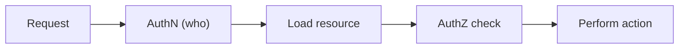

# 인가와 권한

사용자가 로그인했다는 사실만으로는 아직 아무것도 끝나지 않습니다. 그 사용자가 이 문서를 읽어도 되는지, 저 게시글을 수정해도 되는지, 다른 사람 주문 내역을 내려받아도 되는지는 별도의 판단이 필요합니다. 보안 사고에서 가장 자주 보이는 broken access control도 바로 이 지점에서 시작합니다.

이 글은 Secure Coding 101 시리즈의 4번째 글입니다.

여기서는 인가를 역할 이름 몇 개로 끝내지 않고, 요청마다 자원과 행위를 함께 보는 서버 쪽 결정으로 정리하겠습니다. 이 관점을 잡으면 RBAC와 ABAC의 차이, IDOR 방어, 목록 API 필터링, 기본 거부 정책이 왜 한 세트로 묶이는지도 자연스럽게 보입니다.

## 이 글에서 다룰 문제

- RBAC와 ABAC는 어떤 차이가 있을까요?
- IDOR는 왜 흔하고도 위험한 인가 취약점일까요?
- 인가 판단은 라우트 수준과 자원 수준에서 어떻게 나눠 봐야 할까요?
- 목록 조회 API에서도 권한 필터가 필요한 이유는 무엇일까요?
- 정책 함수를 분리해 두면 운영과 감사가 왜 쉬워질까요?

> 인가는 역할 이름만 보는 검사가 아니라, 누가 어떤 자원에 어떤 작업을 하려는지 서버가 매번 다시 판단하는 절차입니다.

## 왜 중요한가

OWASP Top 10에서 broken access control이 상위에 반복해서 등장하는 이유는 단순합니다. UI에서 버튼을 숨기는 것으로는 아무것도 막을 수 없기 때문입니다. 공격자는 브라우저 화면을 거치지 않고 직접 API를 호출할 수 있고, URL의 ID 하나만 바꿔도 남의 자원에 접근할 수 있습니다.

인가가 특히 까다로운 이유는 기능 요구사항과 강하게 얽혀 있기 때문입니다. 관리자, 편집자, 일반 사용자처럼 큰 역할만 나눠 두면 처음에는 쉬워 보이지만, 실제 서비스에서는 자원 소유권, 부서, 시간대, 승인 상태 같은 조건이 금방 붙습니다. 그래서 인가는 화면 정책이 아니라 코드와 데이터가 만나는 경계에서 명시적으로 표현돼야 합니다.

## 한눈에 보는 구조



이 흐름에서 가장 중요한 단계는 자원을 먼저 읽고 그 자원 기준으로 권한을 판단하는 부분입니다. 사용자가 누구인지만 알아서는 충분하지 않습니다. 수정하려는 게시글, 다운로드하려는 파일, 조회하려는 주문처럼 실제 대상 자원을 기준으로 다시 결정해야 합니다.

## 핵심 용어

- **역할 기반 접근 제어(RBAC)**: 관리자, 편집자, 조회자처럼 역할을 기준으로 권한을 부여하는 방식입니다.
- **속성 기반 접근 제어(ABAC)**: 소유자, 부서, 시간대, 지역 같은 속성을 기준으로 권한을 판단하는 방식입니다.
- **IDOR**: ID 값을 바꿔 다른 사람 자원에 접근하는 직접 객체 참조 취약점입니다.
- **최소 권한(least privilege)**: 꼭 필요한 권한만 허용하고 나머지는 기본적으로 막는 원칙입니다.
- **정책(policy)**: 비즈니스 로직과 분리해 둔 권한 결정 규칙입니다.

## 바꾸기 전과 후

**바꾸기 전**: 라우트에서 `if user.role == 'admin'` 정도만 확인하고 실제 자원 소유권은 보지 않습니다. 목록 조회에서는 전체 데이터를 내려보낸 뒤 화면에서만 가립니다.

**바꾼 후**: 모든 자원 작업이 `can(user, action, resource)` 같은 명시적 정책 함수를 거칩니다. 목록 API도 동일한 기준으로 필터링하고, 정책이 없는 작업은 기본적으로 거부합니다.

## 실습: 안전한 인가 흐름을 만드는 5단계

### 1단계 — 자원에 소유자를 연결합니다

```python
class Post:
    def __init__(self, id, author_id, content):
        self.id, self.author_id, self.content = id, author_id, content
```

인가를 정확히 하려면 자원이 누구 것인지 코드와 데이터에 드러나 있어야 합니다. 게시글, 주문, 문서처럼 사용자 단위로 보호해야 하는 자원에는 소유자 정보가 빠지면 안 됩니다. 소유자 필드가 없으면 인가는 역할 이름 몇 개에만 기대게 됩니다.

### 2단계 — 정책 함수를 분리합니다

```python
def can_edit(user, post) -> bool:
    return user.id == post.author_id or user.role == "admin"
```

정책 함수는 인가 규칙을 한곳에 모아 줍니다. 라우트마다 조건문을 복사하는 대신 `can_edit`, `can_delete`, `can_view` 같은 함수로 분리하면 누락을 줄이고, 변경 이유도 추적하기 쉬워집니다.

### 3단계 — 자원 단위에서 다시 확인합니다

```python
def edit_post(user, post_id, new_text):
    post = posts.get(post_id)
    if not can_edit(user, post):
        raise PermissionError("forbidden")
    post.content = new_text
```

라우트에서 한 번 인증했다고 끝내지 말고, 실제 작업 직전에 자원을 읽은 뒤 다시 검사해야 합니다. 이 단계가 빠지면 URL 파라미터나 JSON payload의 ID만 바꿔도 남의 자원에 접근하는 IDOR가 쉽게 생깁니다.

### 4단계 — 목록 조회도 같은 기준으로 필터링합니다

```python
def my_posts(user):
    return [p for p in posts.all() if p.author_id == user.id]
```

상세 조회와 수정만 보호하고 목록 API를 그대로 열어 두면 정보 노출은 계속됩니다. 목록은 화면 렌더링 전에 이미 서버에서 권한 필터를 통과해야 합니다. 목록 필터를 빼먹는 팀이 생각보다 많습니다.

### 5단계 — 기본값을 거부로 둡니다

```python
def authorize(user, action, resource):
    handler = POLICIES.get(action)
    if not handler:
        raise PermissionError("no policy")  # 기본 거부
    if not handler(user, resource):
        raise PermissionError("forbidden")
```

정책이 없는 작업을 암묵적으로 허용하면 새 기능이 생길 때마다 구멍이 열립니다. 인가 시스템은 허용 규칙이 명시된 경우에만 열리고, 그렇지 않으면 닫혀 있어야 합니다. 기본 거부는 작은 번거로움이 아니라 구조적 안전장치입니다.

## 이 코드에서 먼저 볼 점

- 인가 정책이 한곳에 모이면 변경과 감사가 쉬워집니다.
- 기본값은 허용이 아니라 거부입니다.
- 라우트 수준 검사와 자원 수준 검사는 서로 대체 관계가 아니라 보완 관계입니다.
- 목록 API도 인가 대상이며, 별도 필터를 반드시 가져야 합니다.

## 실무에서 자주 헷갈리는 지점

1. **UI 숨김을 인가로 착각하는 경우**: 버튼을 감춰도 API는 여전히 호출할 수 있습니다.
2. **`?id=` 값을 믿고 소유권 검사를 생략하는 경우**: 가장 흔한 IDOR 패턴입니다.
3. **역할만 보고 자원 소유권을 무시하는 경우**: 편집자 권한이 곧 전체 데이터 열람 권한으로 번질 수 있습니다.
4. **정책을 라우트마다 흩어 두는 경우**: 한 군데 누락이 전체 취약점이 됩니다.
5. **목록 API를 필터 없이 반환하는 경우**: 상세 권한을 막아도 이미 데이터는 새고 있습니다.

## 실무에서는 이렇게 봅니다

규모가 작은 팀은 보통 `policies.py` 같은 모듈을 두고 라우트나 서비스 함수가 `authorize(user, action, resource)`만 부르게 만듭니다. 이 구조만으로도 중복이 크게 줄고, 권한 변경 리뷰가 쉬워집니다. 서비스가 커지면 Open Policy Agent나 Cedar 같은 외부 정책 엔진을 붙여 서비스 간 규칙을 통합하기도 합니다.

중요한 점은 정책을 비즈니스 로직에서 완전히 떼어 낸다는 뜻이 아니라, 결정 규칙을 재사용 가능한 형태로 분리한다는 점입니다. 자원 소유권, 조직 속성, 감사 로그는 결국 도메인 정보와 연결되기 때문에 정책 계층과 애플리케이션 계층이 명확히 협력해야 합니다.

## 선임 엔지니어는 이렇게 생각합니다

- 인가는 라우트가 아니라 자원 경계에서 판단합니다.
- 정책은 코드 조각이 아니라 관리 가능한 데이터처럼 다룹니다.
- 기본값은 언제나 거부입니다.
- 목록 API에도 같은 권한 필터를 적용합니다.
- 권한 변경과 거부 이벤트는 감사 로그에 남겨야 합니다.

## 체크리스트

- [ ] `can_*` 함수가 한 모듈에 모여 있습니다.
- [ ] 기본 거부 정책이 적용됩니다.
- [ ] 자원 단위 IDOR 방어가 있습니다.
- [ ] 목록 API가 권한 필터를 거칩니다.

## 연습 문제

1. RBAC와 ABAC를 함께 쓰는 예를 하나 설계해 보세요.
2. IDOR를 만드는 코드 한 줄과, 이를 고치는 코드 한 줄을 각각 적어 보세요.
3. 권한 변경 감사 로그 스키마를 설계해 보세요.

## 정리와 다음 글

인가는 로그인 여부를 확인하는 작업이 아니라, 요청마다 자원과 행위를 기준으로 권한을 다시 판단하는 절차입니다. 이 글에서는 정책 함수 분리, 자원 단위 검사, 목록 필터, 기본 거부 원칙이 왜 함께 가야 하는지 정리했습니다.

다음 글에서는 권한으로 보호한 자원 자체를 어떻게 안전하게 저장할지, 데이터 저장 관점의 보안을 다룹니다.

<!-- toc:begin -->
- [Secure Coding이란 무엇인가?](./01-what-is-secure-coding.md)
- [입력값 검증](./02-input-validation.md)
- [인증과 세션](./03-authentication-and-session.md)
- **인가와 권한 (현재 글)**
- 안전한 데이터 저장 (예정)
- Secret과 키 관리 (예정)
- SQL Injection과 ORM 안전 사용 (예정)
- XSS와 CSRF 방어 (예정)
- Dependency 취약점 관리 (예정)
- 안전한 로깅과 감사 (예정)
<!-- toc:end -->

## 참고 자료

- [OWASP Top 10 — Broken Access Control](https://owasp.org/Top10/A01_2021-Broken_Access_Control/)
- [OWASP Authorization Cheat Sheet](https://cheatsheetseries.owasp.org/cheatsheets/Authorization_Cheat_Sheet.html)
- [NIST RBAC](https://csrc.nist.gov/projects/role-based-access-control)
- [Open Policy Agent](https://www.openpolicyagent.org/)

Tags: Authorization, RBAC, ABAC, LeastPrivilege, SecureCoding
