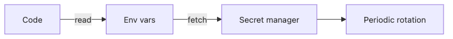

# Secret과 키 관리

비밀값은 유출되기 전까지는 잘 보이지 않지만, 한 번 새면 복구 비용이 크게 튀는 자산입니다. 데이터베이스 비밀번호, API 키, 서명 키, 액세스 토큰이 코드 저장소나 CI 로그, 채팅창, 운영 문서에 흩어져 있으면 시스템은 기능적으로 정상이어도 운영 복원력은 아주 약해집니다.

이 글은 Secure Coding 101 시리즈의 6번째 글입니다.

여기서는 secret 관리를 단순히 환경 변수에 넣는 방법으로 끝내지 않고, 코드 분리, 비밀 저장소, 회전, 접근 감사, 마스킹까지 이어지는 운영 체계로 정리하겠습니다. 이 관점을 이해하면 왜 하드코딩이 위험한지뿐 아니라, 왜 회전 가능성이 secret 설계의 핵심인지도 분명해집니다.

## 이 글에서 다룰 문제

- 어떤 값까지 secret으로 봐야 할까요?
- 하드코딩된 secret은 왜 Git에 한 번만 올라가도 치명적일까요?
- secret manager는 환경 변수와 무엇이 다를까요?
- 키 회전은 왜 자동화가 아니면 사실상 실패할까요?
- 로그 마스킹과 접근 감사는 왜 secret 관리의 일부일까요?

> secret은 코드 밖에 두고, 수명을 짧게 유지하며, 언제든 회전 가능한 상태로 관리합니다.

## 왜 중요한가

가장 흔한 secret 사고는 Git에 비밀값을 커밋하는 경우입니다. 한 번 원격 저장소로 밀어 올리면 삭제해도 기록과 포크, CI 로그, 캐시, 협업 도구에 흔적이 남습니다. 그래서 history rewrite만으로는 완전한 복구가 되지 않는 경우가 많습니다.

또한 secret 문제는 단일 유출 사건으로 끝나지 않습니다. 같은 값을 여러 환경에서 재사용하면 개발 환경 유출이 곧 운영 유출이 되고, 회전 절차가 수동이면 사고가 나도 교체가 늦어집니다. 선임 엔지니어는 secret을 숨기는 대상이 아니라, 언젠가 샐 수 있다고 가정하고 회복 가능한 형태로 설계해야 할 운영 자산으로 봅니다.

## 한눈에 보는 구조



*코드 밖의 secret을 저장소와 회전 절차로 관리하는 흐름*
이 구조에서 코드에는 secret이 직접 들어 있지 않고, 런타임이 환경 변수나 secret manager를 통해 값을 읽습니다. secret manager는 저장뿐 아니라 접근 감사와 회전을 함께 담당합니다. 회전 경로가 처음부터 설계돼 있어야 사고 대응 속도가 나옵니다.

## 핵심 용어

- **비밀값(secret)**: 알려지면 위험한 값입니다. API 키, DB 비밀번호, 토큰, 서명 키가 여기에 들어갑니다.
- **비밀 저장소(secret manager)**: secret을 저장하고, 접근을 제어하며, 회전과 감사를 지원하는 중앙 서비스입니다.
- **회전(rotation)**: 비밀값을 주기적으로 또는 사고 후 즉시 새 값으로 교체하는 절차입니다.
- **범위(scope)**: secret 하나가 영향을 미치는 시스템 폭입니다.
- **감사 로그(audit log)**: 누가 언제 어떤 secret을 읽었는지 남기는 기록입니다.

## 바꾸기 전과 후

**바꾸기 전**: `config.py` 안에 `API_KEY = "..."`가 있고, CI 로그와 예외 출력이 그 값을 그대로 보여 줍니다. 운영과 개발 환경도 같은 비밀값을 씁니다.

**바꾼 후**: secret은 환경 변수와 secret manager를 통해 주입하고, 로그는 기본적으로 마스킹하며, 환경별로 분리된 값을 자동 회전합니다. 접근 이력도 감사 로그로 남깁니다.

## 실습: 안전하게 secret을 관리하는 5단계

### 1단계 — secret을 코드에서 분리합니다

```python
import os
DB_PASSWORD = os.environ["DB_PASSWORD"]  # 절대 코드에 넣지 않음
```

가장 먼저 해야 할 일은 secret이 코드 저장소에 들어오지 않게 하는 것입니다. 코드 리뷰와 브랜치, 스냅샷, 포크, 협업 문서까지 모두 잠재 유출 경로이기 때문입니다. 코드베이스는 secret을 참조만 하고, 값 자체는 런타임이 주입해야 합니다.

### 2단계 — `.env`는 로컬 전용으로 둡니다

```bash
echo ".env" >> .gitignore
```

개발 편의를 위한 `.env` 파일은 로컬 전용으로 취급해야 합니다. 이 파일이 저장소에 들어오는 순간 팀 전체가 유출 범위 안에 들어갑니다. 로컬 개발용과 운영용 secret 공급 경로는 처음부터 분리하는 편이 안전합니다.

### 3단계 — secret manager에서 값을 읽습니다

```python
import boto3
client = boto3.client("secretsmanager")
val = client.get_secret_value(SecretId="prod/db")["SecretString"]
```

secret manager를 쓰면 저장뿐 아니라 접근 권한, 회전, 감사가 함께 따라옵니다. 환경 변수만으로는 값이 어디서 왔는지, 누가 읽었는지 추적하기 어렵지만, 중앙 저장소는 그 부분을 운영 체계로 묶어 줍니다.

### 4단계 — 회전 절차를 자동화합니다

```bash
# 새 secret 발급 -> 애플리케이션 재적재 -> 이전 secret 폐기
aws secretsmanager rotate-secret --secret-id prod/db
```

회전이 수동 절차에만 의존하면 평소에는 거의 실행되지 않습니다. 사고가 난 뒤에도 교체 속도가 늦어집니다. secret은 처음 발급할 때부터 교체 경로가 준비돼 있어야 합니다. 새 값을 발급하고 애플리케이션이 다시 읽은 뒤 이전 값을 폐기하는 흐름이 자동이어야 합니다.

### 5단계 — 노출은 기본적으로 마스킹합니다

```python
def mask(s, keep=4):
    return s[:keep] + "*" * (len(s) - keep)
print("API key:", mask(API_KEY))
```

## 회전이 실무에서 실패하는 지점

secret 회전은 새 값을 발급하는 데서 끝나지 않습니다. 주변 시스템이 이전 값을 얼마나 오래 붙잡고 있는지까지 봐야 실제로 성공합니다.

```text
실패 형태: 새 DB 비밀번호는 발급됐지만 앱 연결은 여전히 이전 연결을 씁니다
먼저 볼 항목:
1. connection pool 재생성 시점
2. 워커와 배치 잡의 재기동 순서
3. 이전 비밀번호 폐기 유예 시간

실패 형태: JWT 서명 키를 바꿨더니 기존 토큰이 바로 모두 실패합니다
먼저 볼 항목:
1. kid 기반 키 공존 기간
2. 활성 세션에 대한 grace period
3. API gateway 캐시 무효화 시점
```

회전이 어려운 secret은 결국 운영 부채입니다. secret manager를 도입했더라도 실제 교체 절차를 장애 훈련처럼 검증하지 않으면 사고 시점에 가장 먼저 흔들립니다.

운영 중에는 디버깅 편의 때문에 secret 일부를 보고 싶어질 수 있습니다. 이때도 전체 값을 그대로 노출하지 말고 기본적으로 마스킹해야 합니다. 로그, 콘솔 출력, 알림 메시지는 모두 유출 표면입니다.

## 이 코드에서 먼저 볼 점

- secret manager는 접근 감사와 권한 통제를 기본값으로 제공합니다.
- 회전은 애플리케이션 중단 없이 가능해야 합니다.
- 로그 마스킹은 예외 상황이 아니라 기본 설정이어야 합니다.
- 환경별 분리는 유출 반경을 줄이는 가장 쉬운 방법입니다.

## 실무에서 자주 헷갈리는 지점

1. **secret을 Git에 커밋하는 경우**: 한 번의 실수로 기록 전체를 오염시킬 수 있습니다.
2. **CI 로그에 환경 변수를 그대로 찍는 경우**: 공개 로그는 곧 공개 secret이 됩니다.
3. **회전을 수동으로만 하는 경우**: 결국 주기가 지켜지지 않고 사고 대응도 늦어집니다.
4. **모든 환경에서 같은 secret을 재사용하는 경우**: 한 환경 유출이 전체 유출로 번집니다.
5. **secret을 프로세스 메모리에 오래 붙잡아 두는 경우**: 메모리 덤프나 크래시 자료가 곧 유출 자료가 됩니다.

## 실무에서는 이렇게 봅니다

많은 팀이 Vault, AWS Secrets Manager, Doppler, 1Password Connect 같은 도구를 채택해 환경별 secret을 분리합니다. CI는 장기 비밀번호 대신 short-lived token으로 필요한 순간에만 값을 읽게 하고, `git push` 단계에는 secret scan을 기본 훅으로 붙입니다.

여기서 핵심은 secret 관리가 저장 방식이 아니라 운영 절차라는 점입니다. 누가 읽을 수 있는지, 언제 교체하는지, 유출 징후가 보이면 어떤 순서로 폐기하는지까지 문서와 자동화가 있어야 실제로 작동합니다. secret manager 도입만으로 문제가 끝나지 않는 이유가 여기에 있습니다.

## 선임 엔지니어는 이렇게 생각합니다

- secret은 언젠가 샐 수 있다고 가정하고 설계합니다.
- 자동이 아닌 회전은 실제 회전이 아닙니다.
- 범위가 작은 secret일수록 유출 반경도 작습니다.
- secret 접근은 기본적으로 감사 가능해야 합니다.
- 로그는 기본적으로 마스킹돼 있어야 합니다.

## 체크리스트

- [ ] Git secret scanning이 켜져 있습니다.
- [ ] secret이 환경별로 분리돼 있습니다.
- [ ] 회전이 자동화돼 있습니다.
- [ ] secret 조회에 대한 감사 로그가 있습니다.

## 연습 문제

1. Git 기록에서 secret을 찾는 명령 두 개를 적어 보세요.
2. 환경 변수와 secret manager의 장단점을 비교해 보세요.
3. 장기 토큰보다 short-lived token이 왜 유리한지 설명해 보세요.

## 정리와 다음 글

secret 관리의 핵심은 값을 숨기는 데서 끝나지 않습니다. 코드 분리, 중앙 저장, 접근 감사, 자동 회전, 기본 마스킹까지 갖춰야 유출 사고가 나도 복구 비용을 작게 유지할 수 있습니다.

다음 글에서는 이런 비밀값으로 지키는 데이터 계층에서 가장 오래된 공격인 SQL injection과 ORM 안전 사용을 다룹니다.

<!-- toc:begin -->
- [Secure Coding이란 무엇인가?](./01-what-is-secure-coding.md)
- [입력값 검증](./02-input-validation.md)
- [인증과 세션](./03-authentication-and-session.md)
- [인가와 권한](./04-authorization-and-permissions.md)
- [안전한 데이터 저장](./05-safe-data-storage.md)
- **Secret과 키 관리 (현재 글)**
- SQL Injection과 ORM 안전 사용 (예정)
- XSS와 CSRF 방어 (예정)
- Dependency 취약점 관리 (예정)
- 안전한 로깅과 감사 (예정)
<!-- toc:end -->

## 참고 자료

- [OWASP Secrets Management Cheat Sheet](https://cheatsheetseries.owasp.org/cheatsheets/Secrets_Management_Cheat_Sheet.html)
- [HashiCorp Vault](https://developer.hashicorp.com/vault/docs)
- [AWS Secrets Manager](https://docs.aws.amazon.com/secretsmanager/)
- [GitHub — Secret scanning](https://docs.github.com/en/code-security/secret-scanning)
- [The Twelve-Factor App — Config](https://12factor.net/config)

Tags: Secrets, KeyManagement, Vault, SecureCoding, DevSecOps
