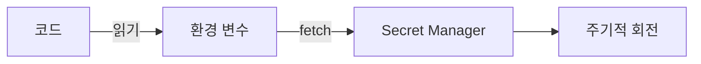

# Secret과 키 관리

> Secure Coding 101 시리즈 (6/10)


## 이 글에서 다룰 문제

가장 흔한 사고가 *git 에 secret commit*. 한 번 push 되면 *영원히 추적 가능* 합니다. *History rewrite* 도 *완전한 해결* 이 아닙니다.

> *모든 secret 은 *언제든 새는 전제* 로 설계한다.*

## 전체 흐름


## Before/After

**Before**: `config.py` 에 `API_KEY = "..."`. CI 로그에 *그대로 출력*.

**After**: 환경 변수로 주입, secret manager 에서 *fetch*, 로그에는 *마스킹* 만.

## 안전한 secret 5단계

### 1단계 — Secret 분리

```python
import os
DB_PASSWORD = os.environ["DB_PASSWORD"]  # 코드에 없다
```

### 2단계 — `.env` 는 *로컬 전용*

```bash
echo ".env" >> .gitignore
```

### 3단계 — Secret manager 에서 fetch

```python
import boto3
client = boto3.client("secretsmanager")
val = client.get_secret_value(SecretId="prod/db")["SecretString"]
```

### 4단계 — 회전

```bash
# 새 secret 발급 → 애플리케이션 reload → 옛 secret 폐기
aws secretsmanager rotate-secret --secret-id prod/db
```

### 5단계 — 노출 마스킹

```python
def mask(s, keep=4):
    return s[:keep] + "*" * (len(s) - keep)
print("API key:", mask(API_KEY))
```

## 이 코드에서 주목할 점

- *Secret manager* 는 *접근 감사* 가 기본.
- 회전은 *애플리케이션을 멈추지 않고* 가능해야 한다.
- 로그 마스킹은 *기본값* 으로.

## 자주 하는 실수 5가지

1. **Secret 을 *git 에 commit*.** 한 번이면 *영원히 새었다*.
2. **CI 로그에 *환경 변수 출력*.** *공개 빌드* 면 *공개 secret*.
3. **Secret 회전을 *수동* 으로만.** 결국 *안 한다*.
4. **모든 환경이 *같은 secret*.** 한 곳이 새면 *전부 새는*.
5. **Secret 이 *프로세스 메모리* 에 *영원히 머문다*.** dump 한 번이면 끝.

## 실무에서는 이렇게 쓰입니다

대부분의 팀은 *Vault*, *AWS Secrets Manager*, *Doppler*, *1Password Connect* 중 하나를 채택해 *환경별로 분리* 하고, *CI* 는 *short-lived token* 으로 fetch 합니다. *git push* 에는 *secret scan* 이 hook 으로 걸립니다.

## 체크리스트

- [ ] *git secret scan* 이 켜져 있다.
- [ ] *환경별* secret 이 분리.
- [ ] *회전* 이 자동.
- [ ] *Audit log* 가 남는다.

## 정리 및 다음 단계

Secret 이 안전하면 *복구 비용* 이 작습니다. 다음은 가장 오래된 공격, *SQL Injection* 입니다.

<!-- toc:begin -->
- [Secure Coding이란 무엇인가?](./01-what-is-secure-coding.md)
- [입력값 검증](./02-input-validation.md)
- [인증과 세션](./03-authentication-and-session.md)
- [인가와 권한](./04-authorization-and-permissions.md)
- [안전한 데이터 저장](./05-safe-data-storage.md)
- **Secret과 키 관리 (현재 글)**
- SQL Injection과 ORM 안전 사용 (예정)
- XSS와 CSRF 방어 (예정)
- Dependency 취약점 관리 (예정)
- 안전한 로깅과 감사 (예정)
<!-- toc:end -->

## 참고 자료

- [OWASP Secrets Management Cheat Sheet](https://cheatsheetseries.owasp.org/cheatsheets/Secrets_Management_Cheat_Sheet.html)
- [HashiCorp Vault](https://developer.hashicorp.com/vault/docs)
- [AWS Secrets Manager](https://docs.aws.amazon.com/secretsmanager/)
- [GitHub — Secret scanning](https://docs.github.com/en/code-security/secret-scanning)

Tags: Secrets, KeyManagement, Vault, SecureCoding, DevSecOps
