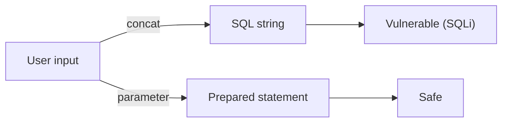

# SQL Injection과 ORM 안전 사용

SQL injection은 오래된 취약점이지만 아직도 가장 비싼 사고를 만듭니다. 이유는 단순합니다. 한 번 뚫리면 개별 화면이 아니라 데이터베이스 전체가 보상으로 걸려 있기 때문입니다. 인증 우회, 데이터 유출, 데이터 조작이 한 줄의 문자열 연결에서 동시에 시작될 수 있습니다.

이 글은 Secure Coding 101 시리즈의 7번째 글입니다.

여기서는 SQL injection을 ORM을 쓰면 자동으로 사라지는 문제로 보지 않고, SQL과 데이터를 문법적으로 분리하지 않았을 때 생기는 구조적 문제로 정리하겠습니다. 이 관점을 잡아 두면 raw SQL, ORM, 정렬 컬럼, DB 계정 권한을 한 흐름에서 함께 볼 수 있습니다.

## 이 글에서 다룰 문제

- SQL injection은 정확히 어떤 식으로 SQL 의미를 바꿀까요?
- parameterized query는 왜 가장 중요한 기본기일까요?
- ORM을 써도 SQL injection이 생기는 경우는 언제일까요?
- 동적 컬럼이나 raw SQL은 어떻게 다뤄야 안전할까요?
- 데이터베이스 계정 권한 분리는 왜 SQLi 대응의 일부일까요?

> SQL injection의 원인은 거의 늘 같습니다. SQL을 문자열로 조립했기 때문입니다. 해결책도 같습니다. SQL과 데이터를 분리해 파라미터로 넘기는 것입니다.

## 왜 중요한가

SQL injection은 단일 필드 검증 실수가 데이터베이스 전체 사고로 번지는 전형적인 취약점입니다. 애플리케이션이 사용자 입력을 SQL 구문의 일부로 해석하는 순간, 공격자는 값을 넣는 것이 아니라 쿼리 구조 자체를 바꾸게 됩니다. 이 차이가 치명적입니다.

또한 많은 팀이 ORM을 사용하면서 안심하는데, 이 안심이 오히려 위험할 수 있습니다. ORM은 안전한 습관을 돕지만, raw SQL이나 `text()` 호출, 동적 컬럼 이름 처리, 문자열 합성을 잘못 쓰면 같은 취약점이 그대로 남습니다. 결국 핵심은 도구보다 데이터와 구문을 어떻게 분리했는가입니다.

## 한눈에 보는 구조



이 그림은 SQL injection의 본질을 단순하게 보여 줍니다. 문자열 연결은 입력값을 SQL 문법 안으로 섞어 넣고, prepared statement는 SQL과 값을 분리합니다. 이 한 차이가 공격 가능성과 안전성을 가릅니다.

## 핵심 용어

- **SQL injection**: 입력값이 SQL의 의미를 바꾸도록 만드는 취약점입니다.
- **파라미터 바인딩(parameterized query)**: SQL 구문과 데이터 값을 문법적으로 분리해 넘기는 방식입니다.
- **준비된 구문(prepared statement)**: 데이터베이스가 미리 해석해 두는 SQL 실행 단위입니다.
- **ORM**: 객체 모델을 바탕으로 SQL을 만들어 주는 라이브러리입니다.
- **저장 프로시저(stored procedure)**: 데이터베이스 내부에 저장된 함수 형태의 실행 단위입니다.

## 바꾸기 전과 후

**바꾸기 전**: `f"SELECT * FROM users WHERE name='{name}'"`처럼 문자열을 이어 붙여 쿼리를 만듭니다. 입력 하나가 그대로 SQL 구문 일부가 됩니다.

**바꾼 후**: `cursor.execute("SELECT * FROM users WHERE name=%s", (name,))`처럼 SQL과 값을 분리해 전달합니다. 데이터베이스는 값을 구문이 아니라 값으로만 해석합니다.

## 실습: SQL injection을 막는 5단계

### 1단계 — 모든 값을 파라미터로 넘깁니다

```python
cursor.execute(
    "SELECT id FROM users WHERE name=%s AND status=%s",
    (name, "active"),
)
```

이 방식의 핵심은 단순 편의가 아니라 문법 분리입니다. 사용자 입력이 문자열 따옴표나 SQL 조각을 포함해도 데이터베이스는 이를 값으로만 취급합니다. SQLi 방어는 여기서 출발합니다.

### 2단계 — ORM을 올바른 방식으로 사용합니다

```python
from sqlalchemy import select
stmt = select(User).where(User.name == name)
result = session.scalars(stmt).all()
```

ORM은 안전한 패턴을 기본값으로 제공하지만, 어디까지나 기본값일 뿐입니다. ORM 쿼리 빌더를 그대로 사용하면 파라미터 분리가 자연스럽게 따라오지만, 문자열 조합으로 우회하면 같은 문제를 다시 끌어옵니다.

### 3단계 — 동적 컬럼은 허용 목록으로 제한합니다

```python
ALLOWED = {"name", "created_at", "id"}
def order_by(field):
    if field not in ALLOWED:
        raise ValueError("invalid order field")
    return field  # 안전하게 SQL에 끼워 넣을 수 있음
```

컬럼명이나 테이블명처럼 SQL 식별자는 일반 파라미터 바인딩으로 처리할 수 없습니다. 그래서 동적 식별자가 필요하다면 허용 목록이 유일한 안전한 선택입니다. 이 부분에서 자주 실수가 납니다.

### 4단계 — raw SQL도 예외 없이 파라미터를 씁니다

```python
session.execute(text("SELECT * FROM logs WHERE user_id=:uid"), {"uid": uid})
```

보고서 쿼리나 배치 작업처럼 raw SQL이 꼭 필요할 수는 있습니다. 그렇더라도 규칙은 바뀌지 않습니다. raw SQL은 예외 상황일 뿐이고, 예외일수록 더 엄격하게 파라미터 사용 여부를 확인해야 합니다.

### 5단계 — DB 계정 권한을 분리합니다

```sql
-- 애플리케이션 계정은 DML만 수행하고 DDL은 별도 계정이 맡습니다.
GRANT SELECT, INSERT, UPDATE ON db.* TO 'app'@'%';
```

SQL injection이 완전히 막히지 못하더라도 DB 계정 권한이 최소화돼 있으면 피해 범위를 줄일 수 있습니다. 애플리케이션 계정에 `DROP`이나 광범위한 관리자 권한이 있으면 취약점 하나가 곧 데이터 파괴로 이어집니다.

## 이 코드에서 먼저 볼 점

- SQL 문자열 연결은 항상 경고 신호입니다.
- ORM은 안전한 습관을 돕지만 마법 방패는 아닙니다.
- 동적 식별자는 허용 목록 없이는 안전하게 처리할 수 없습니다.
- DB 계정 권한도 최소 권한 원칙을 따라야 합니다.

## 실무에서 자주 헷갈리는 지점

1. **f-string으로 SQL을 만드는 경우**: 가장 흔한 SQL injection 패턴입니다.
2. **ORM 안에서도 문자열 합성을 하는 경우**: ORM을 써도 취약점은 그대로 생깁니다.
3. **정렬 컬럼을 입력값 그대로 받는 경우**: 동적 컬럼 기반 SQL injection이 됩니다.
4. **애플리케이션 계정에 과한 권한을 주는 경우**: 사고 반경이 불필요하게 커집니다.
5. **오류 메시지에 raw SQL을 노출하는 경우**: blind SQLi 실마리를 공격자에게 줍니다.

## 실무에서는 이렇게 봅니다

대부분의 팀은 ORM을 기본 경로로 두고, raw SQL은 예외 상황으로 취급합니다. raw SQL이 등장하면 코드 리뷰에서 가장 먼저 파라미터 사용 여부를 확인합니다. 이 규칙만 잘 지켜도 많은 사고를 미리 막을 수 있습니다.

또한 데이터베이스 계정도 애플리케이션 일부라는 관점이 중요합니다. 읽기 전용 계정, 쓰기 계정, 마이그레이션 계정을 분리하면 쿼리 취약점이 생겨도 영향 범위를 줄일 수 있습니다. SQLi 대응은 애플리케이션 코드와 DB 운영 정책이 함께 맞물려야 완성됩니다.

## 선임 엔지니어는 이렇게 생각합니다

- 문자열로 만든 SQL은 금지된 패턴으로 봅니다.
- 동적 식별자는 허용 목록을 통과한 경우에만 사용합니다.
- DB 계정도 최소 권한 원칙을 따라야 합니다.
- SQL이 오류 메시지로 새지 않게 합니다.
- ORM은 안전한 기본 습관이지 자동 보호막이 아닙니다.

## 체크리스트

- [ ] 모든 SQL이 파라미터 바인딩을 사용합니다.
- [ ] 동적 컬럼과 테이블 이름이 허용 목록을 거칩니다.
- [ ] DB 계정이 역할별로 분리돼 있습니다.
- [ ] 오류 메시지가 SQL 내부 구조를 노출하지 않습니다.

## 연습 문제

1. blind SQL injection이 무엇인지 한 문단으로 설명해 보세요.
2. ORM에서 raw text를 안전하게 쓰는 패턴 두 가지를 적어 보세요.
3. 정렬용 허용 목록 헬퍼 함수를 직접 작성해 보세요.

## 정리와 다음 글

SQL injection은 새로운 종류의 공격이라기보다, SQL과 데이터를 분리하지 않았을 때 반복해서 생기는 오래된 구조적 문제입니다. 이 글에서는 파라미터 바인딩, ORM 기본 사용, 동적 식별자 허용 목록, 최소 권한 DB 계정이 왜 함께 가야 하는지 정리했습니다.

다음 글에서는 브라우저가 공격자의 실행 환경으로 바뀌는 두 가지 대표 시나리오, XSS와 CSRF를 다룹니다.

<!-- toc:begin -->
- [Secure Coding이란 무엇인가?](./01-what-is-secure-coding.md)
- [입력값 검증](./02-input-validation.md)
- [인증과 세션](./03-authentication-and-session.md)
- [인가와 권한](./04-authorization-and-permissions.md)
- [안전한 데이터 저장](./05-safe-data-storage.md)
- [Secret과 키 관리](./06-secret-and-key-management.md)
- **SQL Injection과 ORM 안전 사용 (현재 글)**
- XSS와 CSRF 방어 (예정)
- Dependency 취약점 관리 (예정)
- 안전한 로깅과 감사 (예정)
<!-- toc:end -->

## 참고 자료

- [OWASP SQL Injection Prevention Cheat Sheet](https://cheatsheetseries.owasp.org/cheatsheets/SQL_Injection_Prevention_Cheat_Sheet.html)
- [PortSwigger — SQL injection](https://portswigger.net/web-security/sql-injection)
- [SQLAlchemy security](https://docs.sqlalchemy.org/)
- [psycopg parameter binding](https://www.psycopg.org/psycopg3/docs/basic/params.html)

Tags: SQLInjection, ORM, Database, SecureCoding, OWASP
