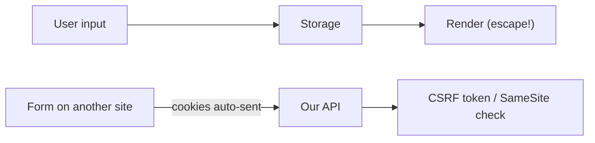

# XSS와 CSRF 방어

브라우저는 사용자 편의 도구이지만, 동시에 공격자가 가장 자주 노리는 실행 환경이기도 합니다. 댓글 한 줄이 스크립트로 바뀌거나, 사용자가 모르는 사이에 다른 사이트에서 우리 서비스로 상태 변경 요청이 날아가면 기능은 그대로 있어도 신뢰는 무너집니다. XSS와 CSRF는 그 대표적인 두 갈래입니다.

이 글은 Secure Coding 101 시리즈의 8번째 글입니다.

여기서는 브라우저 공격을 입력 정제만으로 보는 대신, 출력 이스케이프와 CSP, 쿠키 정책, CSRF 검증이 함께 돌아가는 방어 체계로 정리하겠습니다. 이 관점을 이해하면 브라우저가 언제 우리 편이고 언제 공격자 도구가 되는지도 더 명확해집니다.

## 이 글에서 다룰 문제

- XSS는 어떤 종류로 나뉘고 각각 어디서 생길까요?
- 출력 이스케이프와 CSP는 어떤 역할 분담을 할까요?
- CSRF는 왜 사용자의 권한을 그대로 악용할 수 있을까요?
- SameSite 쿠키와 CSRF 토큰은 왜 함께 써야 할까요?
- `innerHTML` 같은 위험한 DOM API는 왜 기본적으로 금지해야 할까요?

> XSS는 공격자 코드를 우리 페이지에서 실행하게 만들고, CSRF는 사용자의 권한으로 원하지 않은 요청을 보내게 만듭니다.

## 왜 중요한가

XSS 한 번이면 세션 탈취, 화면 변조, 피싱 삽입, 관리자 권한 남용이 한 번에 이어질 수 있습니다. CSRF는 사용자가 로그인한 상태라는 사실을 악용해 송금, 삭제, 설정 변경 같은 상태 변경 요청을 몰래 수행하게 만듭니다. 두 취약점 모두 사용자의 브라우저를 우회 경로로 삼는다는 점에서 위험합니다.

이 주제가 특히 헷갈리는 이유는 입력이 아니라 출력과 요청 맥락이 핵심이기 때문입니다. 개발자는 종종 입력을 정제했으니 안전하다고 생각하지만, 실제로는 HTML 본문, 속성, 자바스크립트 문자열, URL 같은 출력 위치별 인코딩 규칙이 다릅니다. CSRF도 토큰 하나만의 문제가 아니라 쿠키 정책과 요청 출처 검증까지 함께 봐야 합니다.

## 한눈에 보는 구조



사용자 입력은 저장된 뒤 다시 출력될 수 있고, 그 출력이 브라우저에서 실행될 수도 있습니다. 동시에 브라우저는 다른 사이트에서 보낸 요청에도 쿠키를 자동 첨부할 수 있습니다. 그래서 출력 방어와 요청 출처 검증이 각각 필요합니다.

## 핵심 용어

- **반사형 XSS**: URL이나 요청 입력을 즉시 다시 출력하면서 생기는 XSS입니다.
- **저장형 XSS**: 데이터베이스에 저장된 입력이 나중에 렌더링될 때 발생하는 XSS입니다.
- **DOM 기반 XSS**: 클라이언트 자바스크립트가 `innerHTML` 같은 API로 입력을 삽입하면서 생기는 XSS입니다.
- **콘텐츠 보안 정책(CSP)**: 허용한 출처의 코드만 브라우저가 실행하도록 제한하는 정책입니다.
- **CSRF 토큰**: 상태 변경 요청이 우리 세션에서 나온 정상 요청인지 확인하는 예측 불가능한 토큰입니다.

## 바꾸기 전과 후

**바꾸기 전**: `<div>{{ comment }}</div>`를 그대로 렌더링하고, 상태 변경 요청은 쿠키만 있으면 처리합니다. 다른 사이트에서 보낸 요청도 브라우저가 쿠키를 붙여 전송할 수 있습니다.

**바꾼 후**: 출력 위치에 맞게 이스케이프하고, CSP를 적용하며, 쿠키에 `SameSite=Lax`를 설정하고, 상태 변경 요청에는 CSRF 토큰 검증을 붙입니다.

## 실습: 브라우저 공격을 막는 5단계

### 1단계 — 출력 위치에서 이스케이프합니다

```python
import html
def render_comment(text):
    return f"<div>{html.escape(text)}</div>"
```

중요한 점은 입력을 받는 순간이 아니라 출력하는 순간의 맥락입니다. HTML 본문, 속성, 자바스크립트, URL은 각기 다른 인코딩 규칙을 가집니다. 출력 위치에 맞게 이스케이프해야 안전합니다.

### 2단계 — 콘텐츠 보안 정책을 추가합니다

```python
response.headers["Content-Security-Policy"] = "default-src 'self'; script-src 'self'"
```

CSP는 이스케이프가 새는 상황에서 마지막 방어선 역할을 합니다. 기본적으로 어떤 출처의 스크립트를 허용할지 제한해 공격 성공 가능성을 낮춥니다. 다만 `unsafe-inline` 같은 예외를 많이 열어 두면 효과가 크게 약해집니다.

### 3단계 — 쿠키에 SameSite를 설정합니다

```python
response.set_cookie(
    "session", sid,
    httponly=True, secure=True, samesite="Lax",
)
```

SameSite는 교차 사이트 요청에 쿠키가 자동 전송되는 범위를 줄여 줍니다. 완전한 CSRF 방어는 아니지만, 기본 보호막으로 매우 중요합니다. `HttpOnly`와 `Secure`까지 함께 봐야 실제 세션 보호가 됩니다.

### 4단계 — CSRF 토큰을 발급하고 검증합니다

```python
import secrets
def issue_csrf():
    return secrets.token_urlsafe(32)

def verify_csrf(form_token, session_token):
    return secrets.compare_digest(form_token, session_token)
```

상태 변경 요청은 쿠키만으로 신뢰하면 안 됩니다. 브라우저가 자동으로 붙인 세션과, 우리 페이지가 발급한 예측 불가능한 토큰이 함께 맞아야 정상 요청으로 봐야 합니다. CSRF 방어의 핵심은 이중 확인입니다.

### 5단계 — 위험한 DOM 삽입 지점을 피합니다

```javascript
// element.innerHTML = userInput;  // 금지
element.textContent = userInput;    // 안전
```

클라이언트 코드에서도 같은 원칙이 적용됩니다. 문자열을 HTML로 해석하게 만드는 API는 기본적으로 금지하고, 텍스트로만 넣는 API를 기본값으로 삼아야 합니다. DOM 기반 XSS는 서버 템플릿만 본다고 막히지 않습니다.

## 이 코드에서 먼저 볼 점

- 출력 이스케이프는 HTML, JS, 속성, URL처럼 맥락별로 달라집니다.
- CSP는 심층 방어이며, 이스케이프 누락을 보완하는 마지막 줄입니다.
- SameSite와 CSRF 토큰은 함께 써야 합니다.
- 브라우저 측 코드도 `innerHTML` 같은 위험한 지점을 직접 통제해야 합니다.

## 실무에서 자주 헷갈리는 지점

1. **Markdown을 raw HTML로 렌더링하는 경우**: `<script>`가 그대로 흘러 들어갈 수 있습니다.
2. **사용자 입력을 `innerHTML`에 넣는 경우**: 전형적인 DOM 기반 XSS입니다.
3. **CSP를 `unsafe-inline` 중심으로 구성하는 경우**: 정책을 켠 것처럼 보이지만 실제 보호는 약합니다.
4. **CSRF 토큰을 GET 요청에 실어 보내는 경우**: 캐시와 로그에 남을 수 있습니다.
5. **API가 `Origin`이나 `Referer`를 보지 않는 경우**: 교차 사이트 요청이 쉽게 통과할 수 있습니다.

## 실무에서는 이렇게 봅니다

대부분의 팀은 템플릿 엔진 자동 이스케이프를 기본으로 켜 두고, CSP는 먼저 report-only 모드로 배포한 뒤 위반 로그를 보며 점진적으로 강화합니다. 상태 변경 API는 CSRF 토큰 또는 `Origin` 검증을 반드시 거치고, 프런트엔드 코드 리뷰에서는 위험한 DOM API 사용 여부를 따로 확인합니다.

중요한 점은 입력 정제와 출력 이스케이프를 혼동하지 않는 것입니다. 입력 정제는 비즈니스 규칙을 위해 필요할 수 있지만, 브라우저 보안 관점에서는 출력 위치에 맞는 인코딩이 더 직접적인 방어입니다. 이 원칙을 놓치면 XSS 방어가 계속 어긋납니다.

## 선임 엔지니어는 이렇게 생각합니다

- 기본값은 항상 이스케이프이고 raw 출력은 예외입니다.
- CSP는 한 번에 끝내지 않고 점진적으로 강화합니다.
- SameSite와 CSRF 토큰을 함께 사용합니다.
- 사용자 입력을 DOM에 그대로 넣지 않고 `textContent`를 기본값으로 둡니다.
- 입력 정제보다 출력 이스케이프가 더 직접적인 방어인 경우가 많습니다.

## 체크리스트

- [ ] 템플릿 자동 이스케이프가 켜져 있습니다.
- [ ] CSP가 적용돼 있습니다.
- [ ] 쿠키에 SameSite 설정이 있습니다.
- [ ] 상태 변경 요청에 CSRF 검증이 있습니다.

## 연습 문제

1. 반사형 XSS와 저장형 XSS 예를 한 줄씩 적어 보세요.
2. CSP nonce가 어떻게 동작하는지 설명해 보세요.
3. `SameSite=Strict`가 깨뜨릴 수 있는 사용자 흐름을 하나 들어 보세요.

## 정리와 다음 글

브라우저 공격은 복잡한 마술보다 기본 원칙으로 막는 경우가 많습니다. 이 글에서는 출력 이스케이프, CSP, SameSite 쿠키, CSRF 토큰, 위험한 DOM API 회피가 어떻게 한 방어 체계를 이루는지 정리했습니다.

다음 글에서는 우리가 직접 작성하지 않은 코드에서 시작되는 공급망 위험, 의존성 취약점 관리를 다룹니다.

<!-- toc:begin -->
- [Secure Coding이란 무엇인가?](./01-what-is-secure-coding.md)
- [입력값 검증](./02-input-validation.md)
- [인증과 세션](./03-authentication-and-session.md)
- [인가와 권한](./04-authorization-and-permissions.md)
- [안전한 데이터 저장](./05-safe-data-storage.md)
- [Secret과 키 관리](./06-secret-and-key-management.md)
- [SQL Injection과 ORM 안전 사용](./07-sql-injection-and-orm.md)
- **XSS와 CSRF 방어 (현재 글)**
- Dependency 취약점 관리 (예정)
- 안전한 로깅과 감사 (예정)
<!-- toc:end -->

## 참고 자료

- [OWASP XSS Prevention Cheat Sheet](https://cheatsheetseries.owasp.org/cheatsheets/Cross_Site_Scripting_Prevention_Cheat_Sheet.html)
- [OWASP CSRF Prevention Cheat Sheet](https://cheatsheetseries.owasp.org/cheatsheets/Cross-Site_Request_Forgery_Prevention_Cheat_Sheet.html)
- [MDN — Content Security Policy](https://developer.mozilla.org/en-US/docs/Web/HTTP/CSP)
- [MDN — SameSite cookies](https://developer.mozilla.org/en-US/docs/Web/HTTP/Cookies)

Tags: XSS, CSRF, CSP, SecureCoding, WebSecurity
