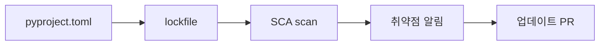

# Dependency 취약점 관리

> Secure Coding 101 시리즈 (9/10)

<!-- a-grade-intro:begin -->

**핵심 질문**: 우리 코드의 *대부분은 우리가 안 짰는데*, 그 코드의 *보안* 은 누가 책임지나요?

> *Dependency 는 *우리 코드의 일부*. 모르는 결함은 *우리 결함이 된다*.*

<!-- a-grade-intro:end -->

## 이 글에서 배울 것

- *SCA* (Software Composition Analysis) 의 의미
- *SBOM* 의 역할
- *Lockfile* 이 왜 필수인가
- *Dependabot / Renovate* 자동화
- 5단계와 흔한 함정 5가지

## 왜 중요한가

Log4j, event-stream, ua-parser-js — *공급망 공격* 은 *우리 코드 0줄* 만으로 일어납니다. *모르고 쓰는* 라이브러리가 *문* 이 됩니다.

> *Dependency 는 *언젠가 새는 자산*. 추적이 *방어의 시작*.*

## 개념 한눈에 보기



## 핵심 용어 정리

- **SCA**: dependency 의 *취약점 스캔*.
- **SBOM**: 사용한 *모든 컴포넌트 목록*.
- **Lockfile**: 정확한 *버전 + 해시* 고정.
- **Pinning**: 직접 의존성 버전을 *명시*.
- **Transitive dependency**: dependency 의 *dependency*.

## Before/After

**Before**: `requirements.txt` 에 `requests` 만 적혀 있다. 빌드마다 *다른 버전*. 무엇이 들어왔는지 *모른다*.

**After**: `uv.lock` / `poetry.lock` 으로 *해시 고정*. *주간 dependency PR* 자동 생성, CI 가 *SCA* 를 막는다.

## 실습: Dependency 안전 5단계

### 1단계 — Lockfile 생성

```bash
uv lock          # 또는 poetry lock, pip-compile
```

### 2단계 — SBOM 생성

```bash
syft packages dir:. -o cyclonedx-json > sbom.json
```

### 3단계 — SCA 스캔

```bash
pip-audit                # Python
osv-scanner --lockfile=uv.lock   # generic
```

### 4단계 — 자동 업데이트

```yaml
# .github/dependabot.yml
version: 2
updates:
  - package-ecosystem: pip
    directory: "/"
    schedule:
      interval: weekly
```

### 5단계 — Pin + verify

```bash
pip install --require-hashes -r requirements.txt
```

## 이 코드에서 주목할 점

- *Lockfile + 해시* 가 *재현 가능* 빌드의 핵심.
- SBOM 은 *사고 발생 시 1초 내* 영향 범위 확인.
- 업데이트는 *정기* 가 *비정기* 보다 안전.

## 자주 하는 실수 5가지

1. **Lockfile 없이 *latest* 사용.** *공급망 공격* 표적.
2. **SCA 결과를 *무시* 한다.** 노이즈 속에 *진짜* 가 묻힌다.
3. **Transitive dependency 를 *안 본다*.** 대부분 취약점은 *transitive*.
4. **포기한 라이브러리 *그대로 사용*.** 패치가 *영원히 안 옴*.
5. **자동 업데이트 *PR 을 방치*.** 한 달이면 *수백 건* 누적.

## 실무에서는 이렇게 쓰입니다

대부분의 팀은 *Renovate* 또는 *Dependabot* 으로 *주간* PR 을 받고, *CI* 에 *SCA gate* 를 둡니다. 큰 조직은 *SBOM* 을 *생산물* 처럼 발행합니다.

## 시니어 엔지니어는 이렇게 생각합니다

- *Dependency 는 *우리 코드*. 책임도 우리 것.*
- *Lockfile 없는 빌드는 *재현 불가*.*
- *작은 업데이트가 *큰 사고를 막는다*.*
- *SBOM 은 *사고 응대 도구*.*
- *적게 의존하는 것 자체가 보안.*

## 체크리스트

- [ ] *Lockfile* 이 commit 되어 있다.
- [ ] *SCA* 가 CI 에서 돈다.
- [ ] *자동 업데이트 PR* 이 매주 들어온다.
- [ ] *SBOM* 이 발행된다.

## 연습 문제

1. *pip-audit* 결과 한 줄을 분석해 보세요.
2. *Transitive dependency* 의 취약점 사례 한 가지.
3. *Lockfile* 이 없는 빌드의 위험 세 가지.

## 정리 및 다음 단계

남이 쓴 코드도 *우리 코드* 입니다. 마지막은 사고 시 *증거* 가 되는 *안전한 로깅* 입니다.

<!-- toc:begin -->
- [Secure Coding이란 무엇인가?](./01-what-is-secure-coding.md)
- [입력값 검증](./02-input-validation.md)
- [인증과 세션](./03-authentication-and-session.md)
- [인가와 권한](./04-authorization-and-permissions.md)
- [안전한 데이터 저장](./05-safe-data-storage.md)
- [Secret과 키 관리](./06-secret-and-key-management.md)
- [SQL Injection과 ORM 안전 사용](./07-sql-injection-and-orm.md)
- [XSS와 CSRF 방어](./08-xss-and-csrf.md)
- **Dependency 취약점 관리 (현재 글)**
- 안전한 로깅과 감사 (예정)
<!-- toc:end -->

## 참고 자료

- [OWASP — Vulnerable and Outdated Components](https://owasp.org/Top10/A06_2021-Vulnerable_and_Outdated_Components/)
- [pip-audit](https://github.com/pypa/pip-audit)
- [OSV.dev](https://osv.dev/)
- [CycloneDX SBOM](https://cyclonedx.org/)

Tags: Dependencies, SCA, SBOM, SupplyChain, SecureCoding
