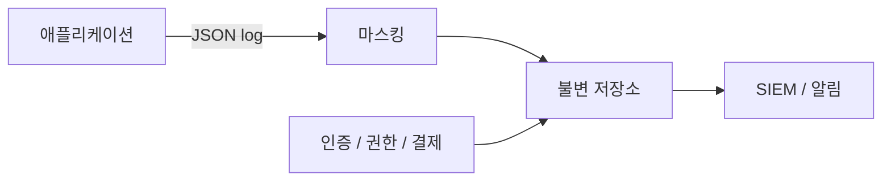

# 안전한 로깅과 감사

> Secure Coding 101 시리즈 (10/10)


## 이 글에서 다룰 문제

사고 응대의 첫 질문은 *언제, 누가, 무엇을* 입니다. 답할 수 없으면 *사고는 끝나지 않는다*. 동시에 비밀번호, 토큰, 카드번호가 로그에 흐르면 *사고가 두 배* 입니다.

> *기록은 정확하게, 비밀은 절대로.*

## 개념 한눈에 보기



## Before/After

**Before**: `print` 으로 *비밀번호도 그대로*. 보존 정책 *없음*. 누가 지웠는지도 *모름*.

**After**: 구조화된 *JSON 로그*, 민감 필드는 *마스킹*, *append-only* 저장, *보존 기간* 명시.

## 실습: 안전한 로깅 5단계

### 1단계 — 구조화된 로그

```python
import json, time
def log_event(event, **fields):
    print(json.dumps({"ts": time.time(), "event": event, **fields}))
```

### 2단계 — 민감 필드 마스킹

```python
SENSITIVE = {"password", "token", "card_number", "ssn"}

def mask(d):
    return {k: ("***" if k in SENSITIVE else v) for k, v in d.items()}

log_event("login", **mask({"user": "ana", "password": "x"}))
```

### 3단계 — Audit log 분리

```python
def audit(actor, action, target, result):
    log_event(
        "audit", actor=actor, action=action,
        target=target, result=result,
    )
```

### 4단계 — Append-only 저장

```bash
# 객체 저장소 + Object Lock 또는 immutable 설정
aws s3api put-object-lock-configuration ...
```

### 5단계 — 보존 정책

```text
- application log: 30일
- audit log: 1년 이상 (규정 별)
- 분기마다 무결성 점검
```

## 이 코드에서 주목할 점

- *Audit log* 는 *application log* 와 *분리*.
- 마스킹은 *기본값* 으로, opt-out 으로 풀어준다.
- 저장은 *append-only* — 위변조 *흔적이 남는다*.

## 자주 하는 실수 5가지

1. **로그에 *비밀번호 / 토큰* 흘러간다.** 한 줄이면 *전부 노출*.
2. **Audit 와 application 로그 *섞기*.** 사고 응대 시 *추적 불가*.
3. **로그가 *서버 디스크* 만에 있다.** 공격자가 *지운다*.
4. **시간대 *불일치*.** UTC 가 아닌 *로컬* 만 기록.
5. **보존 기간이 *무한*.** 비용 *폭발* + 사고 시 *피해 확대*.

## 실무에서는 이렇게 쓰입니다

대부분의 팀은 *JSON 로그* 를 *수집기* (Fluent Bit, Vector) 로 모아 *중앙 저장소* (Loki, Elasticsearch, S3) 로 보냅니다. *SIEM* (Splunk, Datadog, Wazuh) 이 *audit 패턴* 에 *경보* 를 겁니다.

## 체크리스트

- [ ] 로그에 *민감 필드* 가 마스킹.
- [ ] *Audit log* 가 분리되어 있다.
- [ ] 저장이 *append-only* 또는 *immutable*.
- [ ] *보존 기간* 이 문서화.

## 정리 및 다음 단계

여기까지가 *Secure Coding 101* 입니다. 검증 → 인증 → 인가 → 저장 → secret → DB → 브라우저 → dependency → 로그. 각 단계에서 *가장 흔한 함정* 을 피하면, 우리 시스템은 *시간을 버는 보안* 을 갖게 됩니다.

<!-- toc:begin -->
- [Secure Coding이란 무엇인가?](./01-what-is-secure-coding.md)
- [입력값 검증](./02-input-validation.md)
- [인증과 세션](./03-authentication-and-session.md)
- [인가와 권한](./04-authorization-and-permissions.md)
- [안전한 데이터 저장](./05-safe-data-storage.md)
- [Secret과 키 관리](./06-secret-and-key-management.md)
- [SQL Injection과 ORM 안전 사용](./07-sql-injection-and-orm.md)
- [XSS와 CSRF 방어](./08-xss-and-csrf.md)
- [Dependency 취약점 관리](./09-dependency-vulnerabilities.md)
- **안전한 로깅과 감사 (현재 글)**
<!-- toc:end -->

## 참고 자료

- [OWASP Logging Cheat Sheet](https://cheatsheetseries.owasp.org/cheatsheets/Logging_Cheat_Sheet.html)
- [NIST 800-92 — Log Management](https://csrc.nist.gov/publications/detail/sp/800-92/final)
- [Google SRE — Logging](https://sre.google/sre-book/monitoring-distributed-systems/)
- [AWS S3 Object Lock](https://docs.aws.amazon.com/AmazonS3/latest/userguide/object-lock.html)

Tags: Logging, AuditLog, SecureCoding, Compliance, SIEM
