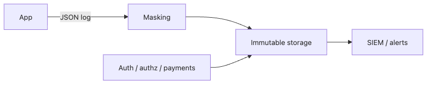

# 안전한 로깅과 감사

사고가 터졌을 때 팀이 가장 먼저 묻는 질문은 늘 비슷합니다. 언제 시작됐는지, 누가 어떤 요청을 보냈는지, 어떤 자원이 바뀌었는지 알아야 복구가 시작됩니다. 그런데 로그에 비밀번호와 토큰이 남아 있거나, 중요한 이벤트가 섞여 있어서 읽을 수 없거나, 공격자가 로그를 지워 버릴 수 있다면 기록은 증거가 아니라 새로운 위험이 됩니다.

이 글은 Secure Coding 101 시리즈의 10번째 글입니다.

여기서는 로깅을 디버깅 편의 기능으로만 보지 않고, 사고 대응과 감사에 필요한 증거 체계로 정리하겠습니다. 이 관점을 이해하면 왜 민감 필드 마스킹, 감사 로그 분리, 불변 저장소, 보존 정책이 모두 함께 필요하며, 시리즈 전체의 보안 원칙이 마지막에 로그로 모이는지도 분명해집니다.

## 이 글에서 다룰 문제

- 애플리케이션 로그와 감사 로그는 무엇이 다를까요?
- 민감 필드 마스킹 정책은 어디까지 포함해야 할까요?
- 위변조 탐지와 append-only 저장은 왜 중요한가요?
- 보존 정책은 비용과 규제 사이에서 어떻게 설계해야 할까요?
- SIEM은 로깅 체계에서 어떤 역할을 할까요?

> 로그는 증거이면서 동시에 위험입니다. 정확한 기록과 민감정보 비노출, 그리고 위변조 방지가 함께 있어야 비로소 안전한 로그가 됩니다.

## 왜 중요한가

사고 대응은 사실 재구성에서 시작합니다. 언제, 누가, 무엇을 했는지 답할 수 없으면 사고는 끝나지 않습니다. 반대로 로그에 비밀번호, 토큰, 카드 번호가 남아 있으면 사고 조사 자료가 곧 유출 자료가 됩니다. 그래서 로깅은 많이 남기는 것보다 무엇을 남기지 않을지 먼저 정하는 일이 중요합니다.

또한 모든 로그가 같은 목적을 갖지 않습니다. 애플리케이션 로그는 디버깅과 운영 관찰을 돕고, 감사 로그는 누가 어떤 자원을 바꿨는지에 대한 법적·운영적 증거가 됩니다. 두 종류를 섞어 두면 읽기도 어려워지고, 조사와 보존 정책도 흐려집니다.

## 한눈에 보는 구조



*구조화 로그, 마스킹, 불변 저장소, SIEM으로 이어지는 감사 흐름*
애플리케이션은 구조화된 로그를 남기고, 민감 필드는 먼저 마스킹됩니다. 중요한 감사 이벤트는 중앙 저장소에 별도로 보관되며, 저장소는 위변조가 어려운 형태여야 합니다. SIEM은 그 기록을 모아 이상 징후를 탐지하고 알림을 보냅니다.

## 핵심 용어

- **애플리케이션 로그**: 디버깅과 운영 관찰을 위한 일반 로그입니다.
- **감사 로그**: 누가 어떤 자원에 어떤 작업을 했는지 남기는 증거 로그입니다.
- **위변조 탐지(tamper evidence)**: 로그가 수정되거나 삭제됐을 때 그 흔적을 알아낼 수 있는 성질입니다.
- **보존(retention)**: 로그를 얼마 동안 보관할지 정한 정책입니다.
- **SIEM**: 보안 로그를 수집하고 분석하며 경보를 올리는 시스템입니다.

## 바꾸기 전과 후

**바꾸기 전**: `print`로 비밀번호까지 그대로 남기고, 감사 이벤트와 디버그 로그가 섞여 있으며, 보존 기간도 정해져 있지 않습니다. 사고가 나면 누가 무엇을 지웠는지도 알기 어렵습니다.

**바꾼 후**: 구조화된 JSON 로그를 쓰고, 민감 필드는 기본적으로 마스킹하며, 감사 로그를 분리해 append-only 또는 immutable 저장소에 보관합니다. 보존 기간과 무결성 점검 주기도 문서로 남깁니다.

## 실습: 안전하게 로깅하는 5단계

### 1단계 — 구조화된 로그를 남깁니다

```python
import json, time
def log_event(event, **fields):
    print(json.dumps({"ts": time.time(), "event": event, **fields}))
```

문자열 로그는 읽을 때는 편할 수 있지만, 나중에 검색과 집계, 경보 규칙을 만들기 어렵습니다. 구조화된 로그는 운영 분석과 사고 대응 모두에 유리합니다. 어떤 필드를 기준으로 추적할지도 훨씬 분명해집니다.

### 2단계 — 민감 필드를 기본적으로 마스킹합니다

```python
SENSITIVE = {"password", "token", "card_number", "ssn"}

def mask(d):
    return {k: ("***" if k in SENSITIVE else v) for k, v in d.items()}

log_event("login", **mask({"user": "ana", "password": "x"}))
```

로그는 운영 편의를 위해 거의 모든 팀원이 보게 됩니다. 그래서 비밀번호, 토큰, 카드 번호 같은 값은 처음부터 남기지 않는 편이 안전합니다. 마스킹은 옵션이 아니라 기본값이어야 합니다.

### 3단계 — 감사 로그를 별도로 분리합니다

```python
def audit(actor, action, target, result):
    log_event(
        "audit", actor=actor, action=action,
        target=target, result=result,
    )
```

인증, 인가, 결제, 권한 변경처럼 나중에 증거가 되는 이벤트는 일반 운영 로그와 분리하는 편이 좋습니다. 그래야 보존 기간, 접근 권한, 조사 흐름을 별도로 설계할 수 있습니다.

### 4단계 — append-only 저장소를 사용합니다

```bash
# Object Lock 또는 immutable 설정이 켜진 객체 저장소를 사용합니다.
aws s3api put-object-lock-configuration ...
```

로그가 서버 로컬 디스크에만 있으면 공격자가 침입 후 쉽게 지울 수 있습니다. append-only 또는 immutable 저장소는 수정과 삭제를 어렵게 만들고, 위변조 흔적을 남깁니다. 증거 보전에는 이 특성이 핵심입니다.

### 5단계 — 보존 정책을 문서화합니다

```text
- application log: 30 days
- audit log: 1+ year (per regulation)
- integrity check every quarter
```

## 실제 조사 흐름으로 로그를 읽는 예

좋은 로그는 많이 남기는 로그가 아니라, 사건 순서를 빠르게 복원할 수 있는 로그입니다. 그래서 요청 ID, 사용자 ID, 자원 ID, UTC 타임스탬프가 꾸준히 이어져야 합니다.

```json
{"ts":"2026-05-15T09:00:11Z","event":"login","user_id":"u-42","request_id":"r-100"}
{"ts":"2026-05-15T09:00:15Z","event":"role_change","actor_id":"admin-7","target_user_id":"u-42","request_id":"r-101"}
{"ts":"2026-05-15T09:01:02Z","event":"export_started","user_id":"u-42","request_id":"r-102"}
```

이 정도만 갖춰도 “무슨 일이 있었지?”라는 질문을 “이 권한 변경 뒤에 어떤 내보내기 요청이 이어졌지?”라는 조사 가능한 질문으로 바꿀 수 있습니다. 감사 로그가 독자에게 실제로 주는 가치는 바로 이런 재구성 가능성입니다.

로그를 무한정 쌓는 것은 보안이 아니라 비용과 위험을 키울 수 있습니다. 반대로 너무 짧게 지우면 조사에 필요한 기록이 남지 않습니다. 용도와 규제에 맞춘 보존 기간을 문서화하고 주기적으로 무결성을 점검해야 합니다.

## 이 코드에서 먼저 볼 점

- 감사 로그는 애플리케이션 로그와 분리돼야 합니다.
- 마스킹은 opt-in이 아니라 기본 동작이어야 합니다.
- append-only 저장은 위변조 흔적을 남기게 해 줍니다.
- 보존 정책은 기술 설정이 아니라 운영 정책 문서이기도 합니다.

## 실무에서 자주 헷갈리는 지점

1. **비밀번호나 토큰이 로그에 흘러가는 경우**: 한 줄만 남아도 사고가 커집니다.
2. **감사 로그와 애플리케이션 로그를 섞는 경우**: 조사와 보존이 모두 어려워집니다.
3. **로그를 서버 디스크에만 두는 경우**: 침입 후 삭제되기 쉽습니다.
4. **시간대를 제각각 쓰는 경우**: 조사 시 이벤트 순서가 흐려집니다. UTC 기준이 안전합니다.
5. **보존 기간 없이 무한 저장하는 경우**: 비용과 노출 표면이 함께 커집니다.

## 실무에서는 이렇게 봅니다

많은 팀이 JSON 로그를 Fluent Bit나 Vector 같은 수집기로 모아 Loki, Elasticsearch, S3 같은 중앙 저장소로 보냅니다. 그 위에서 Splunk, Datadog, Wazuh 같은 SIEM이 감사 패턴과 이상 징후를 감지해 경보를 올립니다. 로깅은 수집과 저장, 분석이 분리된 파이프라인으로 보는 편이 실무적입니다.

또한 선임 엔지니어는 로그를 남기는 것과 읽히게 만드는 것을 함께 봅니다. 필드 이름이 일관돼야 하고, 사용자 ID와 요청 ID, 자원 ID가 서로 연결돼야 하며, 인증·인가·결제 같은 핵심 이벤트는 공통 형식으로 남아야 조사 속도가 나옵니다. 좋은 로그는 많이 남긴 로그가 아니라, 필요한 사실을 안전하게 다시 읽을 수 있는 로그입니다.

## 선임 엔지니어는 이렇게 생각합니다

- 로그는 자산이면서 동시에 위험입니다.
- 감사 로그는 비즈니스 신뢰에 직접 영향을 줍니다.
- 저장소가 불변에 가깝지 않으면 증거 의미가 약해집니다.
- 마스킹은 기본값이고, 예외만 제한적으로 풀어야 합니다.
- 보존 기간은 문서화된 정책이어야 합니다.

## 체크리스트

- [ ] 민감 필드가 마스킹됩니다.
- [ ] 감사 로그가 분리돼 있습니다.
- [ ] 저장소가 append-only 또는 immutable입니다.
- [ ] 보존 정책이 문서화돼 있습니다.

## 연습 문제

1. 지금 서비스에서 감사 이벤트 다섯 가지를 적어 보세요.
2. Pydantic 모델에 적용할 마스킹 함수를 설계해 보세요.
3. append-only 보장이 깨질 수 있는 시나리오 두 가지를 적어 보세요.

## 정리와 다음 글

안전한 로깅은 많이 기록하는 기술이 아니라, 필요한 사실을 정확히 남기되 민감정보는 숨기고 기록 자체는 보존하는 설계입니다. 이 글에서는 구조화된 로그, 기본 마스킹, 감사 로그 분리, 불변 저장소, 보존 정책이 왜 함께 가야 하는지 정리했습니다.

여기까지가 Secure Coding 101입니다. 입력 검증에서 시작해 인증, 인가, 저장, secret, 데이터베이스, 브라우저, 의존성, 로깅까지 가장 흔한 함정을 단계별로 피하면 시스템은 사고를 늦추고 복구 시간을 벌 수 있는 보안을 갖게 됩니다.

<!-- toc:begin -->
- [Secure Coding이란 무엇인가?](./01-what-is-secure-coding.md)
- [입력값 검증](./02-input-validation.md)
- [인증과 세션](./03-authentication-and-session.md)
- [인가와 권한](./04-authorization-and-permissions.md)
- [안전한 데이터 저장](./05-safe-data-storage.md)
- [Secret과 키 관리](./06-secret-and-key-management.md)
- [SQL Injection과 ORM 안전 사용](./07-sql-injection-and-orm.md)
- [XSS와 CSRF 방어](./08-xss-and-csrf.md)
- [Dependency 취약점 관리](./09-dependency-vulnerabilities.md)
- **안전한 로깅과 감사 (현재 글)**
<!-- toc:end -->

## 참고 자료

- [OWASP Logging Cheat Sheet](https://cheatsheetseries.owasp.org/cheatsheets/Logging_Cheat_Sheet.html)
- [NIST 800-92 — Log Management](https://csrc.nist.gov/publications/detail/sp/800-92/final)
- [Google SRE — Logging](https://sre.google/sre-book/monitoring-distributed-systems/)
- [AWS S3 Object Lock](https://docs.aws.amazon.com/AmazonS3/latest/userguide/object-lock.html)
- [OpenTelemetry Logs Data Model](https://opentelemetry.io/docs/specs/otel/logs/data-model/)

Tags: Logging, AuditLog, SecureCoding, Compliance, SIEM
