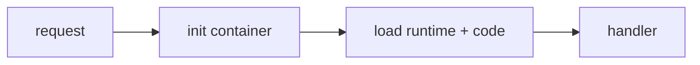

# Cold Start

This is post 4 in the Serverless 101 series.

> Serverless 101 series (4/10)

<!-- a-grade-intro:begin -->

**Core question**: why is the *first call* of a *function* slow?

> *Cold start* is the *time* to *create* the *container* and *load* the *runtime* and *code*.

<!-- a-grade-intro:end -->

## What You Will Learn

- the definition of *Cold Start*
- the *causes* broken down
- how to *measure* it
- *mitigation strategies*
- when to *accept* it

## Why It Matters

If *p99* spikes from *cold start*, *SLOs break*. You need a balance between *mitigation* and *acceptance*.

## Concept at a Glance



## Key Terms

- **cold start**: *initialization latency* on the *first run*.
- **warm**: a *reused* container.
- **provisioned concurrency**: *pre-warmed* instances.
- **init code**: code *outside* the *handler*.
- **package size**: scales with *load time*.

## Before/After

**Before**: *p99 5s* spikes during *peaks*.

**After**: *provisioning* + *lean package* yields a *stable p99*.

## Hands-on: Measure and Mitigate

### Step 1 — Measure init time

```python
import time

t0 = time.perf_counter()
# heavy import here

INIT_MS = (time.perf_counter() - t0) * 1000

def handler(event, context):
    return {"init_ms": INIT_MS}
```

### Step 2 — Trim the package

```python
def lean_requirements(reqs):
    return [r for r in reqs if r not in {"pandas", "numpy"} or r in {"required"}]
```

### Step 3 — Global cache

```python
_client = None

def get_client():
    global _client
    if _client is None:
        _client = build_client()
    return _client

def build_client():
    return {"ready": True}
```

### Step 4 — Provisioning (pseudo)

```python
"""
provisioned_concurrency:
  function: web
  min: 5
"""
```

### Step 5 — Track p50/p95/p99

```python
def percentile(values, p):
    s = sorted(values)
    return s[int(len(s) * p) - 1]
```

## What to Notice in This Code

- Code *outside the handler* runs *only once* on cold.
- Reusing a *global client* is *core to warming*.
- *Provisioning* trades *cost* for *latency*.

## Five Common Mistakes

1. **Watching *averages* and ignoring *p99*.**
2. **Creating a *client* inside the *handler* every time.**
3. **Pulling in *heavy dependencies* unguarded.**
4. **Treating *provisioning* as the *default*.**
5. **Ignoring the *cold-start cost* of the *language*.**

## How This Shows Up in Production

Use *provisioning* on *latency-sensitive* paths like *payments, login*; *accept* cold for *internal jobs*.

## How a Senior Engineer Thinks

- *Manage* cold rather than *eliminate* it.
- *p99* is the *truth*.
- *Lean dependencies* are the *best weapon*.
- *Provisioning* is the *last card*.
- *Language choice* affects *cold*.

## Checklist

- [ ] *p99* tracked.
- [ ] *Global cache* used.
- [ ] *Package size* monitored.
- [ ] *Provisioning* cost reviewed.

## Practice Problems

1. In one line, the difference between *cold* and *warm*.
2. In one line, the *cost* of *provisioning*.
3. In one line, what *handler-external code* means.

## Wrap-up and Next Steps

Next, we look at *Scaling* and the *concurrency model*.

<!-- toc:begin -->
- [What is Serverless?](./01-what-is-serverless.md)
- [Function as a Service](./02-function-as-a-service.md)
- [Trigger and Event](./03-trigger-and-event.md)
- **Cold Start (current)**
- Scaling (upcoming)
- State Management (upcoming)
- Queue and Event-driven Architecture (upcoming)
- Observability (upcoming)
- Cost (upcoming)
- Designing a Serverless App (upcoming)
<!-- toc:end -->

## References

- [Lambda cold start](https://docs.aws.amazon.com/lambda/latest/dg/lambda-runtime-environment.html)
- [Provisioned Concurrency](https://docs.aws.amazon.com/lambda/latest/dg/provisioned-concurrency.html)
- [Package optimization](https://docs.aws.amazon.com/lambda/latest/dg/best-practices.html)
- [SnapStart](https://docs.aws.amazon.com/lambda/latest/dg/snapstart.html)

Tags: Serverless, ColdStart, Performance, Latency, Cloud
