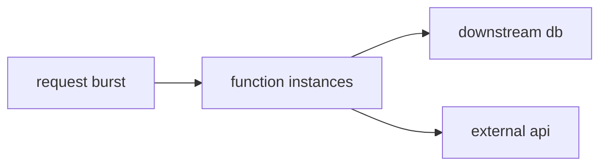

# Scaling

> Serverless 101 series (5/10)

<!-- a-grade-intro:begin -->

**Core question**: *how fast* and *how many* can *functions* scale to?

> *Serverless* defaults to *horizontal scale*, but *limits* and *burst rules* still apply.

<!-- a-grade-intro:end -->

## What You Will Learn

- the *concurrency* model
- *burst* vs *sustained* limits
- *reserved/limited concurrency*
- *downstream protection*
- *backpressure* patterns

## Why It Matters

Scale looks *infinite* until your *DB* and *external APIs* — which are *finite* — buckle under it. *Scaling* itself can *cause incidents*.

## Concept at a Glance



## Key Terms

- **concurrency**: number of *parallel* *instances*.
- **burst limit**: cap on *short-window* growth.
- **reserved concurrency**: a *fixed* allocation per *function*.
- **throttling**: *rejecting* calls beyond the *limit*.
- **backpressure**: *downstream* pushing back on *demand*.

## Before/After

**Before**: *huge call volume* exhausts *DB connections*.

**After**: *reserved concurrency* + *queue buffering* yield *flow control*.

## Hands-on: Scaling and Protection

### Step 1 — Estimate concurrency

```python
def concurrency(rps, duration_s):
    return rps * duration_s
```

### Step 2 — Burst simulation

```python
import concurrent.futures as cf

def burst(call, n):
    with cf.ThreadPoolExecutor(max_workers=n) as ex:
        list(ex.map(lambda i: call(i), range(n)))
```

### Step 3 — Reserved concurrency (pseudo)

```python
"""
reserved_concurrency:
  function: web
  value: 50
"""
```

### Step 4 — Queue buffering

```python
def enqueue(queue, msg):
    queue.append(msg)

def drain(queue, handler, batch=10):
    chunk, queue[:] = queue[:batch], queue[batch:]
    for m in chunk:
        handler(m, None)
```

### Step 5 — Backpressure

```python
def backoff(attempt):
    return min(2 ** attempt, 30)
```

## What to Notice in This Code

- *Reserved concurrency* protects the *DB*.
- *Queues* absorb *shock*.
- *Backoff* prevents *retry storms*.

## Five Common Mistakes

1. **Leaving the *DB connection pool* unprotected.**
2. **Treating *burst* as *sustained*.**
3. **Ignoring the *rate limit* of *external APIs*.**
4. **Skipping *reserved concurrency*, starving *peer functions*.**
5. **Retrying *immediately* without *backoff*.**

## How This Shows Up in Production

A *queue* absorbs the *spike* and *functions* with *reserved concurrency* drain it while protecting the *DB*.

## How a Senior Engineer Thinks

- The *cost* of *horizontal scale* is paid by *downstream*.
- *Backpressure* is a *base pattern*.
- *Concurrency limits* are a *budget*.
- *Queues* buy *time*.
- Watch *peer-function starvation*.

## Checklist

- [ ] *DB* protection strategy.
- [ ] *Reserved concurrency* reviewed.
- [ ] *Backoff* in place.
- [ ] *External API* limits known.

## Practice Problems

1. In one line, the *purpose* of *reserved concurrency*.
2. In one line, the meaning of *backpressure*.
3. In one line, the *effect* of *queue buffering*.

## Wrap-up and Next Steps

Next, we cover *State Management*.

<!-- toc:begin -->
- [What is Serverless?](./01-what-is-serverless.md)
- [Function as a Service](./02-function-as-a-service.md)
- [Trigger and Event](./03-trigger-and-event.md)
- [Cold Start](./04-cold-start.md)
- **Scaling (current)**
- State Management (upcoming)
- Queue and Event-driven Architecture (upcoming)
- Observability (upcoming)
- Cost (upcoming)
- Designing a Serverless App (upcoming)
<!-- toc:end -->

## References

- [Lambda concurrency](https://docs.aws.amazon.com/lambda/latest/dg/lambda-concurrency.html)
- [Reserved/Provisioned concurrency](https://docs.aws.amazon.com/lambda/latest/dg/configuration-concurrency.html)
- [SQS buffering pattern](https://docs.aws.amazon.com/AWSSimpleQueueService/latest/SQSDeveloperGuide/welcome.html)
- [Throttling guide](https://docs.aws.amazon.com/lambda/latest/dg/invocation-scaling.html)

Tags: Serverless, Scaling, Concurrency, Throttling, Cloud
