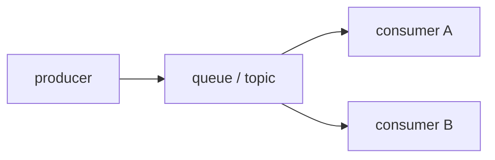

# Queue and Event-driven Architecture

> Serverless 101 series (7/10)

<!-- a-grade-intro:begin -->

**Core question**: how do you connect *services* without *direct calls*?

> *Queues* and *event buses* *decouple* *producers* and *consumers* across *time and space*.

<!-- a-grade-intro:end -->

## What You Will Learn

- the meaning of *decoupling*
- *queue* vs *Pub/Sub*
- *fan-out* patterns
- *FIFO* and *ordering*
- *retries/DLQ*

## Why It Matters

A *synchronous call chain* fails *whole* when *one node* fails. *Async messaging* provides *resilience*.

## Concept at a Glance



## Key Terms

- **queue**: *1:1* or *competing consumers*.
- **topic**: *1:N* publish/subscribe.
- **fan-out**: *one event* → *many subscribers*.
- **FIFO**: *order-preserving* queue.
- **DLQ**: *isolation* for *failed messages*.

## Before/After

**Before**: *Order API* → *payment → email → analytics* synchronously.

**After**: publish *order events* to a *topic*; each *function* handles its part *independently*.

## Hands-on: Tiny Messaging

### Step 1 — In-memory queue

```python
from collections import deque
queue = deque()
def publish(msg): queue.append(msg)
def consume(): return queue.popleft() if queue else None
```

### Step 2 — Fan-out

```python
subs = []
def subscribe(fn): subs.append(fn)
def emit(event):
    for fn in subs:
        fn(event)
```

### Step 3 — Consumer functions

```python
def billing(event): print("bill", event)
def mail(event): print("mail", event)
```

### Step 4 — Retry and DLQ

```python
def retry(handler, dlq, attempts=3):
    def wrap(event):
        for i in range(attempts):
            try:
                return handler(event)
            except Exception:
                if i == attempts - 1:
                    dlq.append(event)
                    raise
    return wrap
```

### Step 5 — FIFO ordering key

```python
def fifo_key(order):
    return order["customer_id"]
```

## What to Notice in This Code

- *Fan-out* lowers *coupling*.
- A *FIFO key* defines the *order unit*.
- *DLQs* make *problems visible*.

## Five Common Mistakes

1. **Assuming *order* is needed *everywhere*.**
2. **Misunderstanding *competing-consumer* semantics.**
3. **Doing *fan-out* without *idempotency*.**
4. **Skipping *DLQ* setup.**
5. **Ignoring *message size* limits.**

## How This Shows Up in Production

Domain teams (*orders, billing, analytics*) are *loosely coupled* through an *event bus*.

## How a Senior Engineer Thinks

- *Event schemas* are *public APIs*.
- *Fan-out* helps with *org boundaries* too.
- *FIFO* is *expensive*.
- Pair *DLQ* with *alarms*.
- *Evolve* without *breaking compatibility*.

## Checklist

- [ ] *Event schema* documented.
- [ ] *DLQ* + alarm.
- [ ] *Idempotency* checked.
- [ ] *FIFO* need decided.

## Practice Problems

1. In one line, the difference between *queue* and *topic*.
2. In one line, the *benefit* of *fan-out*.
3. In one line, the *role* of a *FIFO key*.

## Wrap-up and Next Steps

Next, we cover *Observability*.

<!-- toc:begin -->
- [What is Serverless?](./01-what-is-serverless.md)
- [Function as a Service](./02-function-as-a-service.md)
- [Trigger and Event](./03-trigger-and-event.md)
- [Cold Start](./04-cold-start.md)
- [Scaling](./05-scaling.md)
- [State Management](./06-state-management.md)
- **Queue and Event-driven Architecture (current)**
- Observability (upcoming)
- Cost (upcoming)
- Designing a Serverless App (upcoming)
<!-- toc:end -->

## References

- [SQS](https://docs.aws.amazon.com/AWSSimpleQueueService/latest/SQSDeveloperGuide/welcome.html)
- [SNS](https://docs.aws.amazon.com/sns/latest/dg/welcome.html)
- [EventBridge](https://docs.aws.amazon.com/eventbridge/latest/userguide/eb-what-is.html)
- [Event-driven architecture](https://martinfowler.com/articles/201701-event-driven.html)

Tags: Serverless, Queue, EventDriven, PubSub, Cloud
