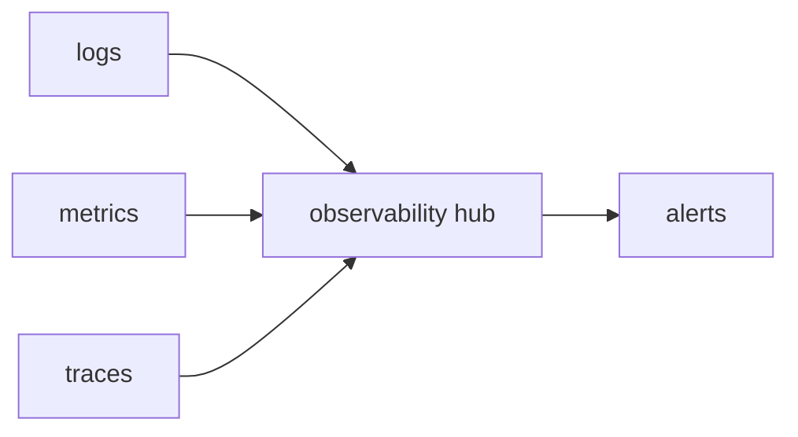

# Observability

> Serverless 101 series (8/10)

<!-- a-grade-intro:begin -->

**Core question**: how do you know *where* and *why* a *function* was slow?

> *Logs, metrics, and distributed traces* — all three legs — make *serverless* *debuggable*.

<!-- a-grade-intro:end -->

## What You Will Learn

- the *three legs* of observability
- *correlation IDs*
- distinguishing *cold vs warm*
- *cost-aware* logging
- *dashboard / alarm* design

## Why It Matters

Functions are *short and distributed*; one viewpoint is not enough. You need *connectable signals*.

## Concept at a Glance



## Key Terms

- **structured log**: *machine-readable* (e.g., JSON).
- **metric**: a *numeric* signal.
- **trace**: the *path* of a *request*.
- **correlation id**: a *request identifier*.
- **sampling**: balance of *cost* and *resolution*.

## Before/After

**Before**: tracing *plain logs* with *grep*.

**After**: *correlation id* + *trace* leads to *root cause* in *5 minutes*.

## Hands-on: Observability Basics

### Step 1 — Structured logging

```python
import json, time

def log(level, msg, **fields):
    print(json.dumps({"t": time.time(), "level": level, "msg": msg, **fields}))
```

### Step 2 — Propagate correlation id

```python
def with_corr(handler):
    def wrap(event, ctx):
        cid = event.get("correlation_id", "unknown")
        log("info", "start", cid=cid)
        return handler(event, ctx)
    return wrap
```

### Step 3 — Metric counts

```python
metrics = {}
def incr(name, n=1):
    metrics[name] = metrics.get(name, 0) + n
```

### Step 4 — Trace span (pseudo)

```python
import contextlib, time

@contextlib.contextmanager
def span(name):
    t0 = time.perf_counter()
    yield
    log("info", "span", name=name, ms=(time.perf_counter() - t0) * 1000)
```

### Step 5 — Mark cold

```python
COLD = True

def handler(event, ctx):
    global COLD
    log("info", "invoke", cold=COLD)
    COLD = False
```

## What to Notice in This Code

- *Structured logs* enable *aggregation*.
- *Every function* must *propagate* the *correlation id*.
- The *cold flag* is core to *p99 analysis*.

## Five Common Mistakes

1. **Using *plain text* logs.**
2. **Logging *sensitive data*.**
3. **Watching only *logs* and ignoring *metrics*.**
4. **Letting *traces* explode in *cost* without *sampling*.**
5. **Setting *too many alarms*.**

## How This Shows Up in Production

A standard like *OpenTelemetry* unifies the *three signals* into *one backend* viewable on *one screen*.

## How a Senior Engineer Thinks

- Plan *observability* from *design*.
- *Correlation* is the *lifeline*.
- *Observe cost* too.
- *Alarms* must be *actionable*.
- *Sampling* balances *resolution* and *cost*.

## Checklist

- [ ] *Structured logging*.
- [ ] *Correlation id* propagated.
- [ ] *Metrics + traces* collected.
- [ ] *Alarms* are actionable.

## Practice Problems

1. In one line, what the *three legs* are.
2. In one line, the *role* of a *correlation id*.
3. In one line, the *purpose* of *trace sampling*.

## Wrap-up and Next Steps

Next, we cover *Cost*.

<!-- toc:begin -->
- [What is Serverless?](./01-what-is-serverless.md)
- [Function as a Service](./02-function-as-a-service.md)
- [Trigger and Event](./03-trigger-and-event.md)
- [Cold Start](./04-cold-start.md)
- [Scaling](./05-scaling.md)
- [State Management](./06-state-management.md)
- [Queue and Event-driven Architecture](./07-queue-and-event-driven.md)
- **Observability (current)**
- Cost (upcoming)
- Designing a Serverless App (upcoming)
<!-- toc:end -->

## References

- [OpenTelemetry](https://opentelemetry.io/docs/)
- [AWS X-Ray](https://docs.aws.amazon.com/xray/latest/devguide/aws-xray.html)
- [CloudWatch Logs Insights](https://docs.aws.amazon.com/AmazonCloudWatch/latest/logs/AnalyzingLogData.html)
- [Distributed tracing in serverless](https://aws.amazon.com/blogs/compute/instrumenting-distributed-systems-for-operational-visibility/)

Tags: Serverless, Observability, Logging, Tracing, Metrics
