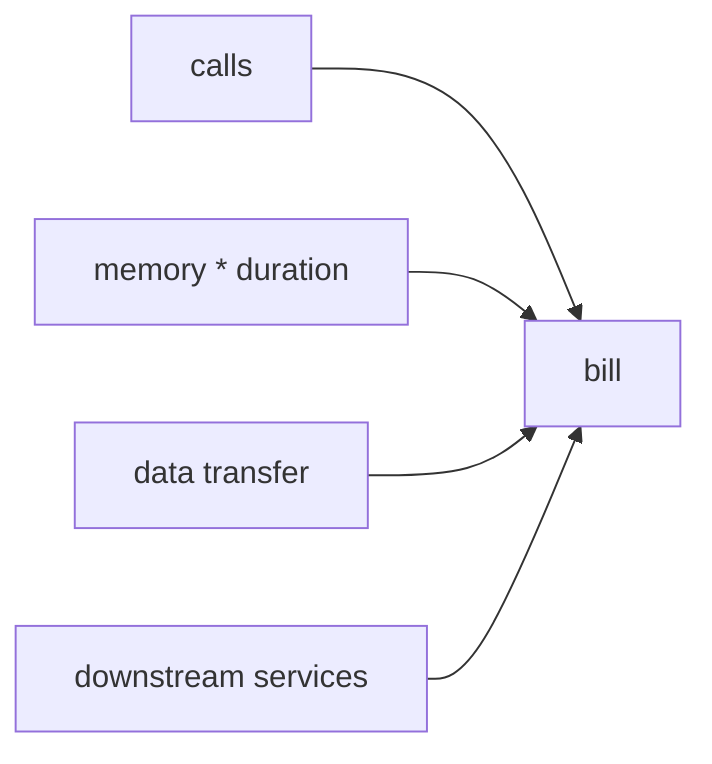

# Cost

This is post 9 in the Serverless 101 series.

> Serverless 101 series (9/10)

<!-- a-grade-intro:begin -->

**Core question**: If each invocation costs *$0.0000002*, why does the *bill* still surprise you?

> *Cost* is the *sum* of *calls + duration + memory + data transfer + downstream services*.

<!-- a-grade-intro:end -->

## What You Will Learn

- The *cost components* of serverless
- The effect of *memory tuning*
- The hidden cost of *data transfer*
- The cost of *idle* provisioning
- A starting point for *FinOps*

## Why It Matters

*Serverless* is *not always cheaper*. For some workloads it can cost *more* than a steady *EC2* instance.

## Concept at a Glance



## Key Terms

- **invocation cost**: price *per call*.
- **GB-seconds**: *memory × duration*.
- **egress**: *outbound data transfer*.
- **idle**: the cost of *provisioned* capacity sitting unused.
- **unit economics**: *margin per call*.

## Before/After

**Before**: estimate cost from the *per-call price* alone.

**After**: compare alternatives using a *total cost of ownership* model.

## Hands-on: Modeling Cost

The constants in the sample below are an **AWS Lambda pricing example**, not a provider-neutral serverless default. Azure Functions and Google Cloud Functions use different pricing rules, free tiers, and billing details, so treat the numbers as one worked example rather than a universal formula.

### Step 1 — Invocation cost (AWS Lambda example)

```python
def calls_cost(n, unit_price=0.0000002):
    return n * unit_price
```

### Step 2 — GB-seconds

```python
def gb_seconds(memory_mb, duration_ms, n):
    return (memory_mb / 1024) * (duration_ms / 1000) * n
```

### Step 3 — Egress (example rate)

```python
def egress_cost(gb, price_per_gb=0.09):
    return gb * price_per_gb
```

### Step 4 — Scenario comparison (AWS-shaped sample)

```python
def total(n, mem_mb, dur_ms, gb_out):
    return (
        calls_cost(n)
        + gb_seconds(mem_mb, dur_ms, n) * 0.0000166667
        + egress_cost(gb_out)
    )
```

### Step 5 — Memory tuning sweep

```python
sizes = [128, 256, 512, 1024]
for s in sizes:
    print(s, total(1_000_000, s, 200, 5))
```

## What to Notice in This Code

- The numeric constants are **provider-specific example values**, not universal serverless defaults.
- *Memory* sets both *CPU* and *cost*.
- *Data transfer* is a *hidden* line item.
- Compare alternatives at the *scenario* level, not the unit level.

## Five Common Mistakes

1. **Treating one provider's published constants as if they were generic *serverless* defaults.**
2. **Pinning *memory* at the *minimum* without measuring duration.**
3. **Ignoring *egress*.**
4. **Forgetting *DB* and *queue* charges.**
5. **Using *provisioned concurrency* without tracking its *idle cost*.**

## How This Shows Up in Production

A *FinOps* team feeds *margin per call* back into *product decisions* — pricing, feature scope, and SLAs.

## How a Senior Engineer Thinks

- *Cost* is part of the *feature*.
- *Memory tuning* is a *time-vs-money* trade.
- *Egress* is solved by *network design*, not code.
- *Idle* is a *tax* on *provisioned* capacity.
- Compare *alternatives* on a *fair* basis.

## Checklist

- [ ] *Total cost model* in place.
- [ ] *Memory tuning* reviewed.
- [ ] *Egress* measured.
- [ ] *FinOps* dashboard live.

## Practice Problems

1. Define *GB-seconds* in one line.
2. Define *egress* in one line.
3. Define the *idle cost* of *provisioned concurrency* in one line.

## Wrap-up and Next Steps

The final episode is *Designing a Serverless App*.

<!-- toc:begin -->
- [What is Serverless?](./01-what-is-serverless.md)
- [Function as a Service](./02-function-as-a-service.md)
- [Triggers and Events](./03-trigger-and-event.md)
- [Cold Start](./04-cold-start.md)
- [Scaling](./05-scaling.md)
- [State Management](./06-state-management.md)
- [Queues and Event-driven Architecture](./07-queue-and-event-driven.md)
- [Observability](./08-observability.md)
- **Cost (current)**
- Designing a Serverless App (upcoming)
<!-- toc:end -->

## References

- [Lambda Pricing](https://aws.amazon.com/lambda/pricing/)
- [Cloud Functions Pricing](https://cloud.google.com/functions/pricing)
- [Azure Functions Pricing](https://azure.microsoft.com/pricing/details/functions/)
- [FinOps Foundation](https://www.finops.org/)

Tags: Serverless, Cost, FinOps, Pricing, Cloud
