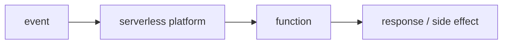

# Serverless란 무엇인가?

> Serverless 101 시리즈 (1/10)

<!-- a-grade-intro:begin -->

**핵심 질문**: *서버* 가 *없는* 게 정말 *서버* 없이 돌아가는 걸까요?

> *Serverless* 는 *서버* 가 *없다* 는 뜻이 아니라 *서버 운영* 책임을 *플랫폼* 이 *대신* 진다는 뜻입니다.

<!-- a-grade-intro:end -->

## 이 글에서 배울 것

- *Serverless* 의 정의
- *FaaS* 와의 관계
- *사용량 기반 과금*
- *책임 분담* 이 어떻게 바뀌는지
- 적합한 *워크로드* 와 *한계*

## 왜 중요한가

*인프라* 에 *시간* 을 덜 쓰면 *제품* 에 더 쓸 수 있습니다. *Serverless* 는 *작은 팀* 의 *지렛대* 입니다.

## 개념 한눈에 보기



## 핵심 용어 정리

- **Serverless**: *서버 운영* 을 *플랫폼* 에 위임하는 모델.
- **FaaS**: *함수 단위* 실행 환경.
- **이벤트 소스**: *함수* 를 *깨우는* 신호.
- **수명**: *함수* 가 *살아있는* 짧은 시간.
- **사용량 기반 과금**: *호출* 한 만큼만 *과금*.

## Before/After

**Before**: *24시간* 떠 있는 *서버*, 트래픽 *0* 일 때도 *비용*.

**After**: *호출* 한 만큼만 *비용*, *프로비저닝* 없음.

## 실습: 가장 작은 함수

### 1단계 — Python 함수 작성

```python
def handler(event, context):
    name = event.get("name", "world")
    return {"message": f"hello, {name}"}
```

### 2단계 — 로컬에서 호출 시뮬레이션

```python
def invoke_local(handler, event):
    return handler(event, context=None)

print(invoke_local(handler, {"name": "Alice"}))
```

### 3단계 — 이벤트 형태 익히기

```python
http_event = {"path": "/hello", "method": "GET", "name": "Bob"}
queue_event = {"records": [{"body": "msg-1"}, {"body": "msg-2"}]}
```

### 4단계 — 타임아웃 인지

```python
import time

def slow_handler(event, context):
    time.sleep(0.1)
    return {"ok": True}
```

### 5단계 — 결과를 표준 형태로

```python
def http_response(status, body):
    return {"statusCode": status, "body": body}
```

## 이 코드에서 주목할 점

- *event* 와 *context* 두 인자 형태가 *공통*.
- *함수* 는 *짧고 결정적* 이어야 함.
- *상태* 는 *함수 외부* 에 둔다.

## 자주 하는 실수 5가지

1. ***장시간 실행* 작업을 *함수* 로 짜기.**
2. ***로컬 파일* 에 상태 저장.**
3. ***콜드 스타트* 무시.**
4. ***비용* 을 *호출 수* 만으로 추정.**
5. ***관측성* 없이 운영 시작.**

## 실무에서는 이렇게 쓰입니다

*이벤트 처리, ETL, API 백엔드, 스케줄 작업* 등 *짧고 독립적* 인 작업에 잘 맞습니다.

## 시니어 엔지니어는 이렇게 생각합니다

- *Serverless* 는 *옵션* 이지 *기본* 이 아니다.
- *비용* 은 *호출 수 + 실행 시간 + 자원*.
- *상태* 는 *외부 저장소* 에.
- *콜드 스타트* 는 *설계 변수*.
- *관측성* 이 *디버깅의 절반*.

## 체크리스트

- [ ] *함수* 가 *짧고* *결정적*.
- [ ] *상태* 외부화.
- [ ] *비용 모델* 검토.
- [ ] *관측성* 준비.

## 연습 문제

1. *Serverless* 가 *서버 없음* 을 뜻하지 않는 *이유* 한 줄로.
2. *FaaS* 의 *기본 단위* 한 줄로.
3. *Serverless* 가 *불리* 한 워크로드 한 줄로.

## 정리 및 다음 단계

다음 글은 *FaaS* 의 구조와 사용 패턴을 자세히 다룹니다.

<!-- toc:begin -->
- **Serverless란 무엇인가? (현재 글)**
- Function as a Service (예정)
- Trigger와 Event (예정)
- Cold Start (예정)
- Scaling (예정)
- State 관리 (예정)
- Queue와 Event-driven Architecture (예정)
- Observability (예정)
- Cost (예정)
- Serverless 앱 설계 (예정)
<!-- toc:end -->

## 참고 자료

- [AWS Lambda 개요](https://docs.aws.amazon.com/lambda/latest/dg/welcome.html)
- [Google Cloud Functions](https://cloud.google.com/functions/docs)
- [Azure Functions](https://learn.microsoft.com/azure/azure-functions/)
- [Serverless 정의 (Martin Fowler)](https://martinfowler.com/articles/serverless.html)

Tags: Serverless, Cloud, FaaS, Architecture, DevOps
