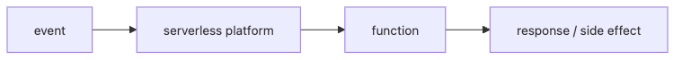

# 서버리스란 무엇인가?

처음 서버리스를 접하면 흔히 이렇게 받아들입니다. “서버를 안 만지는 방식이구나.” 방향은 맞지만, 여기서 멈추면 이후의 모든 판단이 흐려집니다. 서버가 사라지는 것이 아니라, 서버를 운영하는 책임의 위치가 바뀌기 때문입니다.

이 글은 Serverless 101 시리즈의 첫 번째 글입니다.

## 이 글에서 다룰 문제

- 서버리스는 정말 서버가 없다는 뜻일까요?
- 서버리스와 FaaS는 같은 말일까요, 아니면 다른 층위의 개념일까요?
- 사용량 기반 과금은 왜 무조건 저렴하다는 뜻이 아닐까요?
- 어떤 워크로드는 서버리스에 잘 맞고, 어떤 워크로드는 처음부터 다른 선택이 더 나을까요?

> 서버리스는 서버가 없는 모델이 아니라, 서버 운영 책임을 플랫폼이 대신 맡는 실행 모델입니다.

## 왜 이 주제가 중요한가

서버리스는 편의 기능이 아니라 아키텍처 선택지입니다. 작은 팀에게는 특히 강력합니다. 서버 패치, 기본 스케일링, 런타임 운영 같은 반복 작업을 플랫폼에 넘기고 제품 기능에 집중할 수 있기 때문입니다.

하지만 이 장점은 오해와 함께 따라옵니다. 호출이 있을 때만 돈을 내니 항상 싸다고 생각하기 쉽고, 함수만 잘게 나누면 운영이 단순해질 것처럼 보이기도 합니다. 실제로는 반대인 경우도 많습니다. 비용은 호출 수만이 아니라 실행 시간, 메모리, 네트워크 전송, 연결된 관리형 서비스 비용까지 합쳐서 결정됩니다. 함수가 짧아졌다고 분산 시스템의 복잡성이 사라지는 것도 아닙니다.

그래서 서버리스 입문에서 가장 먼저 잡아야 할 문장은 “무엇이 사라졌는가”가 아니라 “누가 어떤 책임을 가져갔는가”입니다. 이 기준이 있어야 콜드 스타트, 상태 관리, 관측성, 비용 같은 뒤의 주제가 모두 한 줄로 이어집니다.

## 한눈에 보는 구조



*플랫폼이 이벤트와 함수 실행 사이에서 어떤 책임을 맡는지 보여 주는 기본 구조입니다.*
이 그림에서 핵심 주체는 함수보다 플랫폼입니다. 이벤트가 들어오면 플랫폼이 적절한 실행 환경을 준비하고, 함수는 짧은 시간 동안 코드를 수행한 뒤 응답이나 부수 효과를 남깁니다. 개발자는 직접 서버를 띄우고 유지보수하지 않지만, 대신 함수의 경계와 입력 구조, 상태 저장 위치를 더 분명하게 설계해야 합니다.

## 핵심 용어 먼저 정리하기

| 용어 | 뜻 | 실무에서 왜 중요한가 |
| --- | --- | --- |
| **서버리스** | 서버 운영 책임을 플랫폼에 위임하는 모델 | 책임 분리의 기준이 됩니다 |
| **FaaS** | 함수를 실행 단위로 다루는 환경 | 서버리스의 대표적인 실행 형태입니다 |
| **이벤트 소스** | 함수를 깨우는 신호 | HTTP, 큐, 스케줄, 스토리지 이벤트가 여기에 들어갑니다 |
| **실행 수명** | 함수 인스턴스가 살아 있는 짧은 구간 | 상태를 함수 내부에 두면 왜 위험한지 설명해 줍니다 |
| **사용량 기반 과금** | 호출·실행 시간·자원 사용량 중심 과금 | 비용 추정을 단순 호출 수로 끝내면 안 되는 이유입니다 |

여기서 가장 흔한 혼동은 서버리스와 FaaS를 완전히 같은 말로 쓰는 것입니다. 실무에서는 많이 겹쳐 보이지만, 더 큰 개념은 서버리스이고 FaaS는 그 안의 대표 실행 모델입니다. 관리형 인증, 이벤트 버스, 관리형 데이터 저장소까지 넓게 보면 모두 서버리스 생태계 안에서 함께 움직입니다.

## 전통적인 서버 운영과 무엇이 달라질까

**이전 방식**에서는 24시간 살아 있는 서버를 전제로 용량을 잡고, 트래픽이 없어도 기본 비용과 운영 부담이 계속 남습니다.

**서버리스 방식**에서는 호출이 들어올 때 함수를 실행하고, 플랫폼이 기본적인 인프라 운영을 맡습니다. 팀의 관심사는 서버 수보다 이벤트 경계와 함수 책임으로 이동합니다.

이 변화가 중요한 이유는 설계 질문 자체가 달라지기 때문입니다. “몇 대를 띄울까”보다 “어떤 이벤트를 기준으로 깨울까”, “한 번의 호출에서 어디까지 끝낼까”, “상태는 어디에 남길까”가 더 중요한 질문이 됩니다.

## 가장 작은 함수로 감각 잡기

### 1단계 — Python 함수 작성

```python
def handler(event, context):
    name = event.get("name", "world")
    return {"message": f"hello, {name}"}
```

서버리스 함수의 가장 기본적인 형태입니다. 입력은 `event`, 실행 환경 정보는 `context`, 출력은 직렬화 가능한 결과입니다. 플랫폼마다 세부 형식은 달라도 이 패턴은 꽤 비슷하게 반복됩니다.

### 2단계 — 로컬에서 호출 시뮬레이션

```python
def invoke_local(handler, event):
    return handler(event, context=None)

print(invoke_local(handler, {"name": "Alice"}))
```

서버리스 입문에서 좋은 습관은 함수 본체를 플랫폼과 분리해서 보는 일입니다. 함수는 본질적으로 입력을 받아 결과를 만드는 코드이므로, 로컬에서도 실행 모델을 어느 정도 연습할 수 있습니다.

### 3단계 — 이벤트 모양 익히기

```python
http_event = {"path": "/hello", "method": "GET", "name": "Bob"}
queue_event = {"records": [{"body": "msg-1"}, {"body": "msg-2"}]}
```

서버리스 함수를 이해할 때 함수 이름보다 더 중요한 것이 이벤트 모양입니다. HTTP 요청을 처리할 때와 큐 메시지를 처리할 때는 입력 구조와 실패 의미가 완전히 달라집니다.

### 4단계 — 타임아웃 감각 익히기

```python
import time

def slow_handler(event, context):
    time.sleep(0.1)
    return {"ok": True}
```

함수는 대개 짧게 살아 있습니다. 그래서 오래 걸리는 외부 API 호출이나 무거운 변환 작업은 곧바로 타임아웃, 재시도, 비용 문제로 이어집니다.

### 5단계 — 응답 형식 표준화하기

```python
def http_response(status, body):
    return {"statusCode": status, "body": body}
```

응답 형식을 일찍 통일해 두면 함수가 늘어날수록 운영 비용이 줄어듭니다. 예외 처리, 에러 응답, 로깅 포맷까지 함께 정리하기 쉬워지기 때문입니다.

## 이 코드에서 먼저 봐야 할 점

- `event`와 `context` 조합이 공통 호출 규약이라는 점입니다.
- 함수는 짧고 결정적으로 끝날수록 운영이 쉬워진다는 점입니다.
- 상태를 함수 내부에 붙잡아 두지 말고 외부 저장소에 둬야 한다는 점입니다.

서버리스 함수는 오래 살아 있는 프로세스보다, 한 번 호출되어 한 가지 일을 끝내는 작업자에 가깝습니다. 이 특성을 받아들이면 함수 경계와 책임 분리가 자연스럽게 보이기 시작합니다.

## 실무에서 자주 헷갈리는 지점

### 서버리스가 곧 무상태 시스템일까

아닙니다. 비즈니스는 여전히 상태를 가집니다. 다만 그 상태를 함수 프로세스 안이 아니라 외부 저장소에 둬야 합니다.

### 호출이 적으면 무조건 저렴할까

그렇지 않습니다. 실행 시간이 길거나 메모리 설정이 크면 호출 수가 적어도 비용이 커질 수 있습니다. 데이터 전송과 연결된 관리형 서비스 비용도 함께 봐야 합니다.

### 모든 API 백엔드가 서버리스에 잘 맞을까

짧고 독립적인 작업에는 잘 맞습니다. 반면 긴 연결, 무거운 지속 연산, 세밀한 런타임 제어가 필요한 워크로드는 다른 실행 환경이 더 단순할 수 있습니다.

## 자주 하는 실수 다섯 가지

1. 장시간 실행 작업을 함수 하나에 몰아넣습니다.
2. 로컬 파일이나 메모리에 상태를 저장합니다.
3. 콜드 스타트를 무시한 채 응답 시간을 설계합니다.
4. 비용을 호출 수만 보고 추정합니다.
5. 로그와 메트릭 없이 운영을 시작합니다.

이 다섯 가지는 모두 같은 오해에서 출발합니다. 서버리스를 “편한 서버”로만 보기 때문입니다. 실제로는 별도의 운영 모델이고, 그 모델의 핵심은 책임 이동과 경계 설계입니다.

## 실무에서는 이렇게 판단합니다

- 이벤트 처리, ETL, 가벼운 API 백엔드, 스케줄 작업처럼 짧고 독립적인 단위에 잘 맞습니다.
- 상태는 외부 저장소에 두고, 함수는 계산과 조립에 집중하게 만드는 편이 좋습니다.
- 비용은 호출 수가 아니라 호출 수 + 실행 시간 + 메모리 + 네트워크 + 연계 서비스까지 함께 계산해야 합니다.
- 관측성은 나중에 붙이는 장식이 아니라 서버리스 운영의 절반입니다.

숙련된 엔지니어는 “함수를 몇 개 만들까”보다 “어떤 경계에서 시스템을 깨울까”를 먼저 봅니다. 서버리스의 품질은 함수 개수보다 경계 설계에서 더 크게 갈립니다.

## 체크리스트

- [ ] 함수가 짧고 한 번의 책임에 집중하는가
- [ ] 상태를 외부 저장소로 분리했는가
- [ ] 비용 모델을 호출 수 외 요소까지 검토했는가
- [ ] 로그와 메트릭을 준비했는가

## 정리

서버리스의 핵심은 서버 삭제가 아니라 책임 이동입니다. 플랫폼이 서버 운영을 대신 맡는 대신, 우리는 함수 경계, 이벤트 구조, 상태 저장 위치, 관측성을 더 명확하게 설계해야 합니다. 이 관점을 잡아 두면 이후의 FaaS, 트리거, 콜드 스타트, 상태 관리 주제가 서로 분리된 조각이 아니라 하나의 운영 모델로 읽힙니다.

다음 글에서는 서버리스의 대표 실행 모델인 FaaS를 더 구체적으로 살펴보겠습니다.

<!-- toc:begin -->
- **서버리스란 무엇인가? (현재 글)**
- 함수형 서비스(FaaS)란 무엇인가? (예정)
- 트리거와 이벤트 (예정)
- 콜드 스타트 (예정)
- 스케일링 (예정)
- 상태 관리 (예정)
- 큐와 이벤트 기반 아키텍처 (예정)
- 관측성 (예정)
- 비용 (예정)
- 서버리스 앱 설계 (예정)
<!-- toc:end -->

## 참고 자료

### 공식 문서

- [AWS Lambda 개요](https://docs.aws.amazon.com/lambda/latest/dg/welcome.html)
- [Google Cloud Functions 개요](https://cloud.google.com/functions/docs)
- [Azure Functions 개요](https://learn.microsoft.com/azure/azure-functions/functions-overview)

### 아키텍처와 코드

- [Serverless 정의 - Martin Fowler](https://martinfowler.com/articles/serverless.html)
- [AWS Lambda 개발자 가이드 예제 (GitHub)](https://github.com/awsdocs/aws-lambda-developer-guide)
- [Azure Functions 101](../../azure-functions-101/ko/)

Tags: Serverless, Cloud, FaaS, Architecture, DevOps
