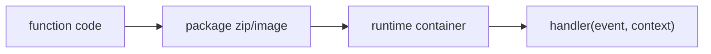

# 함수형 서비스(FaaS)란 무엇인가?

서버리스를 개념으로 이해했다면 이제 질문이 하나 남습니다. “그래서 함수는 클라우드에서 실제로 어떻게 실행되는가?” 이 질문에 답하지 못하면 콜드 스타트, 메모리 설정, 동시성 같은 운영 포인트를 계속 감으로만 다루게 됩니다.

이 글은 Serverless 101 시리즈의 2번째 글입니다.

## 이 글에서 다룰 문제

- FaaS는 어떤 실행 모델 위에서 동작할까요?
- 핸들러(handler)는 왜 FaaS의 핵심 계약일까요?
- 런타임 선택과 패키징 방식은 운영에 어떤 차이를 만들까요?
- 메모리와 CPU, 동시성은 왜 함께 봐야 할까요?

> FaaS는 플랫폼이 짧게 살아 있는 실행 환경을 준비하고, 그 안에서 함수를 실행한 뒤 결과만 돌려주는 모델입니다.

## 왜 이 주제가 중요한가

FaaS를 모르면 서버리스를 너무 추상적으로 이해하게 됩니다. 함수만 올리면 알아서 돌아간다고 생각하기 쉽지만, 실제로는 런타임 초기화, 코드 로딩, 패키지 크기, 동시성 한도 같은 구체적인 제약이 있습니다.

이 기본 가정을 모르면 직관이 계속 빗나갑니다. 메모리를 낮추면 항상 비용이 줄 것 같지만 실행 시간이 늘어 총비용이 오를 수도 있고, 간단해 보이는 의존성 추가가 콜드 스타트를 크게 악화시킬 수도 있습니다. FaaS는 함수 하나를 실행하는 서비스가 아니라, 함수 실행을 둘러싼 플랫폼 계약 전체를 이해해야 제대로 다룰 수 있는 모델입니다.

## 한눈에 보는 구조



이 흐름은 FaaS의 가장 실용적인 멘탈 모델입니다. 먼저 코드를 패키지로 만들고, 플랫폼이 해당 패키지를 실행할 런타임 환경을 준비한 다음, 최종적으로 `handler(event, context)`를 호출합니다. 즉, 개발자는 함수만 쓰는 것처럼 느끼지만 실제 운영에서는 패키지와 런타임, 초기화 코드까지 모두 결과에 영향을 줍니다.

## 핵심 용어 먼저 정리하기

| 용어 | 뜻 | 운영에 주는 의미 |
| --- | --- | --- |
| 핸들러 | 함수 실행의 진입점 | 플랫폼과 코드가 만나는 계약입니다 |
| 런타임 | Python, Node.js 같은 언어 실행 환경 | 지원 버전과 초기화 시간이 달라집니다 |
| 배포 패키지 | ZIP 파일 또는 컨테이너 이미지 | 크기와 구조가 로딩 시간에 영향을 줍니다 |
| 동시성 | 동시에 살아 있는 함수 인스턴스 수 | 비용과 지연 시간, 다운스트림 부하를 함께 결정합니다 |
| 메모리 크기 | 메모리와 CPU를 묶어서 설정하는 단위 | 많은 플랫폼에서 성능과 비용을 함께 좌우합니다 |

FaaS를 단순한 코드 업로드 기능으로만 보면 함정에 빠집니다. 실행 환경도 제품의 일부이고, 핸들러 시그니처도 공용 인터페이스이며, 패키징 방식도 성능에 영향을 줍니다.

## 전통적인 서버 프로세스와 무엇이 다를까

**기존 방식**에서는 서버 위에 프로세스를 띄우고 `systemd`나 프로세스 매니저가 이를 오래 유지합니다.

**FaaS 방식**에서는 패키지를 올리면 플랫폼이 필요할 때만 실행 환경을 준비하고 핸들러를 호출합니다.

이 차이는 개발 경험보다 운영 감각에서 더 크게 드러납니다. 프로세스를 직접 붙들고 있지 않으므로, 실행 환경이 언제 새로 생기고 언제 재사용되는지, 한 번의 호출이 어떤 리소스를 소비하는지 더 민감하게 봐야 합니다.

## 패키징과 실행 흐름을 코드로 보기

### 1단계 — 의존성 고정

```python
"""
requirements.txt:
requests==2.32.0
"""
```

FaaS에서는 의존성도 실행 시간의 일부입니다. 필요한 패키지만 남기는 습관이 중요합니다. 사용하지 않는 대형 라이브러리는 배포 크기와 초기화 시간을 동시에 키웁니다.

### 2단계 — 핸들러 작성

```python
import json

def handler(event, context):
    return {"statusCode": 200, "body": json.dumps({"ok": True})}
```

핸들러는 FaaS의 핵심 계약입니다. 이벤트를 입력받고, 플랫폼이 기대하는 형식으로 결과를 돌려주는 최소 진입점이기 때문입니다.

### 3단계 — 패키징

```python
import zipfile, pathlib

def package(src_dir, out):
    with zipfile.ZipFile(out, "w") as z:
        for p in pathlib.Path(src_dir).rglob("*"):
            z.write(p, p.relative_to(src_dir))
```

패키징은 사소한 배포 절차가 아닙니다. 어떤 파일이 실제 배포 단위에 포함되는지, 의존성이 어떻게 묶이는지, 불필요한 파일이 섞이지 않는지 모두 여기서 결정됩니다.

### 4단계 — 메모리 설정이 CPU에 미치는 영향 보기

```python
def memory_to_cpu(mb):
    return mb / 1769  # 대략 1 vCPU at ~1769MB
```
메모리 설정은 저장 공간만의 문제가 아닙니다. 많은 플랫폼에서 메모리와 CPU가 묶여 움직이므로, 메모리를 올리면 같은 코드가 더 빨리 끝나 전체 비용이 오히려 줄 수 있습니다.

### 5단계 — 동시성 시뮬레이션

```python
import concurrent.futures as cf

def burst(handler, n):
    with cf.ThreadPoolExecutor(max_workers=n) as ex:
        return list(ex.map(lambda i: handler({"i": i}, None), range(n)))
```

동시성은 단순히 “많이 처리한다”는 뜻이 아닙니다. 같은 순간에 몇 개의 함수 인스턴스가 살아 있고, 그 인스턴스들이 데이터베이스나 외부 API에 얼마나 큰 압력을 줄지까지 함께 의미합니다.

## 이 코드에서 먼저 봐야 할 점

- 핸들러는 가능한 한 순수 함수처럼 다루는 편이 좋습니다.
- 메모리 설정이 CPU와 비용에 동시에 영향을 주는 플랫폼이 많습니다.
- 동시성은 성능 설정이면서 동시에 비용 예산이기도 합니다.

FaaS에서 잘 돌아가는 코드는 대개 본체가 작고, 초기화 부담이 적고, 외부 의존성을 통제합니다. 반대로 모든 것을 핸들러 안에 몰아넣거나 대형 패키지를 무심코 추가하면 바로 성능과 비용 문제가 따라옵니다.

## 실무에서 자주 헷갈리는 지점

### 핸들러 바깥 코드는 모두 나쁜가

그렇지 않습니다. 재사용할 클라이언트나 설정 로딩처럼 초기화 한 번으로 충분한 작업은 핸들러 바깥이 더 낫습니다. 다만 무거운 초기화는 콜드 스타트 비용이 되므로 측정이 필요합니다.

### 메모리를 최소값으로 두는 것이 항상 절약일까

아닙니다. 메모리를 너무 낮게 잡아 실행 시간이 늘어나면 총비용이 오를 수 있습니다. 시간과 자원을 함께 측정해야 합니다.

### 동시성은 무조건 높을수록 좋을까

함수 자체만 보면 그렇지 않을 수 있습니다. 다운스트림 데이터베이스와 외부 API는 유한하므로, 동시성이 커질수록 시스템 전체는 더 불안정해질 수 있습니다.

## 자주 하는 실수 다섯 가지

1. 전역 상태에만 캐시를 의존합니다.
2. 무거운 의존성으로 콜드 스타트를 악화시킵니다.
3. 메모리를 지나치게 낮게 설정합니다.
4. 동시성 한도를 모른 채 배포합니다.
5. 런타임 지원 종료 일정을 방치합니다.

이 다섯 가지는 모두 FaaS를 “함수 실행기”로만 보고 “운영 플랫폼”으로 보지 않을 때 자주 생깁니다. 핸들러 코드만 맞으면 끝나는 것이 아니라, 실행 환경과 자원 모델까지 함께 다뤄야 합니다.

## 실무에서는 이렇게 생각합니다

- 핸들러는 얇게 유지하고, 무거운 본문은 작게 나눕니다.
- 메모리 튜닝은 비용 절감의 핵심 수단입니다.
- 컨테이너 이미지와 ZIP 패키지 중 무엇이 더 적합한지 워크로드별로 판단합니다.
- 런타임 업데이트는 한 번 해 두고 끝나는 작업이 아니라 주기적인 유지보수입니다.
- 동시성은 성능 수치가 아니라 예산처럼 다룹니다.

## 체크리스트

- [ ] 의존성을 최소화했는가
- [ ] 메모리와 CPU를 함께 검토했는가
- [ ] 런타임 버전과 지원 종료 일정을 알고 있는가
- [ ] 동시성 한도를 파악했는가

## 정리

FaaS는 함수 하나를 돌리는 기능이 아니라, 함수 실행을 표준화한 플랫폼 계약입니다. 핸들러, 런타임, 패키지, 메모리, 동시성까지 한 묶음으로 이해해야 이후의 콜드 스타트와 스케일링, 비용 이야기가 자연스럽게 이어집니다.

다음 글에서는 함수를 깨우는 트리거와 이벤트를 살펴보겠습니다.

<!-- toc:begin -->
- [서버리스란 무엇인가?](./01-what-is-serverless.md)
- **함수형 서비스(FaaS)란 무엇인가? (현재 글)**
- 트리거와 이벤트 (예정)
- 콜드 스타트 (예정)
- 스케일링 (예정)
- 상태 관리 (예정)
- 큐와 이벤트 기반 아키텍처 (예정)
- 관측성 (예정)
- 비용 (예정)
- 서버리스 앱 설계 (예정)
<!-- toc:end -->

## 참고 자료

- [AWS Lambda Python 핸들러](https://docs.aws.amazon.com/lambda/latest/dg/python-handler.html)
- [Lambda 컨테이너 이미지](https://docs.aws.amazon.com/lambda/latest/dg/images-create.html)
- [Cloud Functions 런타임](https://cloud.google.com/functions/docs/runtime-support)
- [Azure Functions 호스팅](https://learn.microsoft.com/azure/azure-functions/functions-scale)

Tags: Serverless, FaaS, Lambda, Runtime, Cloud
