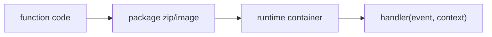

# Function as a Service

> Serverless 101 시리즈 (2/10)


## 이 글에서 다룰 문제

*FaaS* 의 *기본 가정* 을 모르면 *콜드 스타트, 동시성, 메모리* 모두 *직관* 이 어긋납니다.

## 개념 한눈에 보기



## Before/After

**Before**: *서버* 에 *프로세스* 띄우고 *systemd* 관리.

**After**: *zip* 업로드, *플랫폼* 이 *실행*.

## 실습: 패키징과 실행

### 1단계 — 의존성 정리

```python
"""
requirements.txt:
requests==2.32.0
"""
```

### 2단계 — handler 작성

```python
import json

def handler(event, context):
    return {"statusCode": 200, "body": json.dumps({"ok": True})}
```

### 3단계 — 패키징

```python
import zipfile, pathlib

def package(src_dir, out):
    with zipfile.ZipFile(out, "w") as z:
        for p in pathlib.Path(src_dir).rglob("*"):
            z.write(p, p.relative_to(src_dir))
```

### 4단계 — 메모리 설정 효과 확인

```python
def memory_to_cpu(mb):
    return mb / 1769  # 대략 1 vCPU at ~1769MB
```

### 5단계 — 동시성 시뮬레이션

```python
import concurrent.futures as cf

def burst(handler, n):
    with cf.ThreadPoolExecutor(max_workers=n) as ex:
        return list(ex.map(lambda i: handler({"i": i}, None), range(n)))
```

## 이 코드에서 주목할 점

- *handler* 는 *순수 함수* 처럼 다루기 좋다.
- *메모리* 가 *CPU* 를 결정하는 플랫폼이 많다.
- *동시성* 은 *비용* 과 *지연* 의 균형.

## 자주 하는 실수 5가지

1. ***글로벌 상태* 에 캐싱 의존.**
2. ***대용량 의존성* 으로 *콜드 스타트* 악화.**
3. ***메모리* 를 *과소* 설정.**
4. ***동시성 제한* 을 모름.**
5. ***런타임 EOL* 을 *방치*.**

## 실무에서는 이렇게 쓰입니다

*HTTP API, S3 트리거, 큐 소비자* 같은 *짧은 단위 작업* 에 폭넓게 사용됩니다.

## 체크리스트

- [ ] *의존성* 최소화.
- [ ] *메모리/CPU* 튜닝.
- [ ] *런타임* 최신.
- [ ] *동시성 한도* 인지.

## 정리 및 다음 단계

다음 글은 *Trigger* 와 *Event* 를 살펴봅니다.

<!-- toc:begin -->
- [Serverless란 무엇인가?](./01-what-is-serverless.md)
- **Function as a Service (현재 글)**
- Trigger와 Event (예정)
- Cold Start (예정)
- Scaling (예정)
- State 관리 (예정)
- Queue와 Event-driven Architecture (예정)
- Observability (예정)
- Cost (예정)
- Serverless 앱 설계 (예정)
<!-- toc:end -->

## 참고 자료

- [AWS Lambda 핸들러](https://docs.aws.amazon.com/lambda/latest/dg/python-handler.html)
- [Lambda 컨테이너 이미지](https://docs.aws.amazon.com/lambda/latest/dg/images-create.html)
- [Cloud Functions 런타임](https://cloud.google.com/functions/docs/runtime-support)
- [Azure Functions 호스팅](https://learn.microsoft.com/azure/azure-functions/functions-scale)

Tags: Serverless, FaaS, Lambda, Runtime, Cloud
