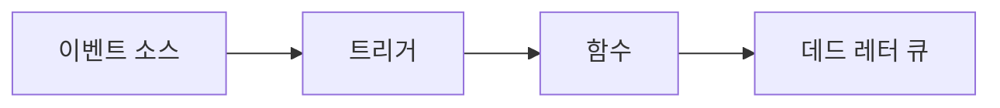

# Trigger와 Event

## 이 글에서 다룰 문제

- 함수는 누가, 언제, 어떤 방식으로 깨우는 걸까요?
- HTTP 요청, 큐 메시지, 스케줄 이벤트는 왜 서로 다르게 다뤄야 할까요?
- 재시도는 편의 기능일 뿐일까요, 아니면 중복 처리 위험의 출발점일까요?
- DLQ와 멱등성이 왜 함께 이야기되는 걸까요?

> Serverless 101 시리즈 (3/10)

Serverless에서 함수 본체만 보고 설계하면 곧바로 문제가 생깁니다. 실서비스에서는 코드보다 먼저 호출 방식이 문제를 만듭니다. 같은 함수라도 HTTP로 동기 호출될 때와 큐 메시지로 비동기 호출될 때 실패의 의미, 재시도 방식, 순서 보장 여부가 전부 달라지기 때문입니다.

그래서 Trigger와 Event는 입문 단계에서 반드시 잡아야 하는 주제입니다. 함수가 무엇을 하는지보다, 무엇이 함수를 깨우고 어떤 규칙으로 다시 깨울 수 있는지를 알아야 중복 처리, 메시지 유실, 재시도 폭주를 피할 수 있습니다.

이 글에서는 Trigger와 Event를 한 묶음으로 보겠습니다. 이벤트 소스가 어떤 형태의 payload를 만들고, Trigger가 그 payload를 함수에 어떻게 전달하는지, 그리고 실무에서 왜 멱등성과 DLQ가 거의 기본 전제처럼 따라오는지 정리하겠습니다.

## 이 글에서 배울 것

- 대표적인 Trigger 종류와 이벤트 소스의 차이
- 이벤트 payload가 달라질 때 코드가 어떻게 달라지는지
- 동기 호출과 비동기 호출의 운영 차이
- 재시도, DLQ, 멱등성이 함께 움직이는 이유

## 왜 중요한가

Trigger 의미를 모르면 운영 문제는 거의 예고 없이 터집니다. 큐가 같은 메시지를 다시 전달할 수 있다는 사실을 모르고 결제 처리 코드를 짜면 같은 결제가 두 번 일어날 수 있습니다. 순서 보장이 없다는 조건을 모르고 상태 전이를 설계하면 나중 메시지가 먼저 들어오면서 데이터가 뒤집힐 수 있습니다.

문제는 이런 오류가 로컬 테스트에서는 잘 드러나지 않는다는 점입니다. 한 번만 호출해 보면 멀쩡해 보이기 때문입니다. 하지만 실제 운영에서는 네트워크 지연, 일시 실패, 플랫폼 재시도가 섞이면서 같은 입력이 두 번 이상 들어오는 상황이 흔하게 발생합니다. Trigger를 이해한다는 말은 이런 현실을 전제로 설계한다는 뜻입니다.

## 한눈에 보는 흐름



> Trigger는 이벤트를 함수로 전달하는 연결점입니다. 호출 의미와 재시도 규칙은 Trigger 종류에 따라 달라집니다.

이 그림을 보면 책임이 나뉩니다. 이벤트 소스는 신호를 만들고, Trigger는 그 신호를 함수 호출로 바꾸며, 함수가 계속 실패하면 일부 플랫폼은 메시지를 DLQ로 격리합니다. 따라서 문제 해결도 이 세 지점을 나눠서 봐야 합니다.

## 핵심 용어

- **Trigger**: 이벤트를 함수 호출로 연결하는 장치입니다.
- **이벤트 소스**: 큐, 스토리지, HTTP, 스케줄처럼 이벤트를 만드는 시스템입니다.
- **호출 유형(invocation type)**: 동기, 비동기, 스트림처럼 함수가 호출되는 방식입니다.
- **DLQ**: 처리 실패한 메시지를 따로 격리하는 데드 레터 큐입니다.
- **멱등성(idempotency)**: 같은 입력이 여러 번 들어와도 결과가 같도록 만드는 성질입니다.

입문자에게 가장 중요한 문장은 이것입니다. 대부분의 Trigger는 at-least-once를 전제로 생각하는 편이 안전합니다. 즉, 한 번만 올 것이라고 가정하지 말고 같은 이벤트가 다시 올 수 있다고 보고 코드를 짜야 합니다.

## Before / After

**Before**: 크론 스크립트와 수동 재시도를 붙여 두고, 실패 메시지는 로그에서 직접 찾습니다.

**After**: 스케줄 Trigger, 자동 재시도, DLQ를 조합해 실패 경로를 구조적으로 분리합니다.

이 차이는 운영 품질을 크게 바꿉니다. 실패가 났을 때 원인을 추적할 통로가 생기고, 일시 실패와 영구 실패를 구분할 수 있으며, 재처리 전략도 코드 바깥의 정책으로 일부 옮길 수 있습니다.

## 실습: HTTP / Queue / Schedule

### 1단계 — HTTP 이벤트

```python
def http_handler(event, context):
    body = event.get("body", "")
    return {"statusCode": 200, "body": f"echo:{body}"}
```

HTTP Trigger는 요청 하나에 응답 하나를 돌려주는 구조를 직관적으로 보여 줍니다. 사용자는 기다리고 있고, 실패는 즉시 응답 코드로 드러납니다. 그래서 큐 기반 처리보다 지연 시간에 더 민감합니다.

### 2단계 — Queue 이벤트

```python
def queue_handler(event, context):
    for rec in event["records"]:
        process(rec["body"])

def process(msg):
    print("got", msg)
```

큐 기반 이벤트는 보통 `records`처럼 배치 형태로 들어옵니다. 이 순간부터 함수는 단순한 요청 처리기가 아니라 메시지 소비자가 됩니다. 한 레코드만 실패해도 전체 배치를 어떻게 볼지 고민해야 하므로 설계가 훨씬 까다로워집니다.

### 3단계 — Schedule 이벤트

```python
import datetime as dt

def cron_handler(event, context):
    now = dt.datetime.utcnow().isoformat()
    return {"ran_at": now}
```

스케줄 Trigger는 가장 단순해 보여도 겹침 문제가 자주 생깁니다. 이전 실행이 끝나기 전에 다음 tick이 오면 같은 작업이 동시에 돌 수 있기 때문입니다. 주기를 짧게 잡을수록 이 위험은 더 커집니다.

### 4단계 — 멱등 키 적용

```python
seen = set()

def idempotent(handler):
    def wrap(event, ctx):
        key = event.get("id")
        if key in seen:
            return {"skipped": True}
        seen.add(key)
        return handler(event, ctx)
    return wrap
```

이 예제는 개념 설명용입니다. 실서비스에서는 메모리 집합이 아니라 외부 저장소에 키를 남겨야 합니다. 중요한 점은 구현체보다 원리입니다. 같은 이벤트가 다시 와도 이미 처리한 입력임을 판별할 수 있어야 안전합니다.

### 5단계 — DLQ로 보낼지 판단

```python
def safe(handler, dlq):
    def wrap(event, ctx):
        try:
            return handler(event, ctx)
        except Exception as e:
            dlq.append({"event": event, "error": str(e)})
            raise
    return wrap
```

DLQ는 실패를 덮어 두는 장치가 아닙니다. 오히려 실패를 보이게 만드는 장치입니다. 재시도로 해결되지 않는 메시지를 분리해 두어야 원인 분석과 재처리가 가능합니다.

## 이 코드에서 주목할 점

- `records`는 한 건이 아니라 배치일 수 있습니다.
- 멱등 키는 재시도 안전망입니다.
- DLQ는 디버깅의 출발점입니다.

Trigger를 이해할 때는 코드 형태보다 실패 시나리오를 먼저 떠올리는 편이 좋습니다. 메시지가 두 번 오면 어떤 일이 일어나는지, 순서가 뒤집히면 어떤 상태 오염이 생기는지, 계속 실패한 메시지를 어디서 다시 볼 수 있는지가 핵심입니다.

## 자주 하는 실수 5가지

1. 재시도가 없을 것이라고 가정하기
2. 메시지 순서가 항상 보장된다고 믿기
3. 멱등성 없이 결제 같은 작업 처리하기
4. DLQ를 설정하지 않은 채 운영 시작하기
5. 스케줄 주기를 지나치게 짧게 잡아 겹침을 만들기

이 실수들은 대부분 한 번 호출되면 한 번만 처리된다는 전통적인 요청/응답 사고에서 나옵니다. 하지만 비동기 Trigger는 그런 보장을 거의 주지 않습니다. 그래서 멱등성과 DLQ는 선택 기능이 아니라 기본 방어선에 가깝습니다.

## 실무에서는 이렇게 쓰입니다

업로드 후 썸네일 생성, 결제 이벤트 뒤 영수증 메일 발송, 큐 기반 배치 적재처럼 비동기 파이프라인에서 Trigger와 Event 설계가 핵심이 됩니다. 이런 흐름에서는 요청 하나가 끝나는 순간보다, 후속 작업이 안전하게 이어지는지가 더 중요합니다.

실무에서는 이벤트가 한 번 더 와도 괜찮은 구조를 먼저 만들고 그다음에 최적화를 고민합니다. 반대로 중복이 절대로 나면 안 된다고 설계하면서도 멱등 키를 두지 않으면 운영 부담이 폭발적으로 커집니다.

## 실무에서는 이렇게 생각합니다

- 모든 Trigger는 at-least-once를 기본 가정으로 둡니다.
- 멱등성은 비용 보호 장치이기도 합니다.
- DLQ가 없으면 문제를 관찰할 창이 줄어듭니다.
- 순서가 중요하면 그 요구사항을 플랫폼 수준에서 분명히 드러내야 합니다.
- 스케줄 작업은 겹침 방지 전략까지 함께 설계해야 합니다.

## 체크리스트

- [ ] 멱등성을 보장했는가
- [ ] DLQ를 설정했는가
- [ ] 재시도 횟수와 정책을 명시했는가
- [ ] 순서 보장 요구사항을 문서화했는가

## 연습 문제

1. at-least-once가 무엇을 뜻하는지 한 줄로 설명해 보세요.
2. DLQ가 필요한 이유를 한 줄로 적어 보세요.
3. 멱등 키가 없을 때 어떤 위험이 생기는지 예를 들어 보세요.

## 정리 및 다음 단계

Trigger와 Event를 이해하면 함수 호출을 더 이상 단순한 진입점으로 보지 않게 됩니다. 호출 방식은 곧 실패 방식이고, 실패 방식은 곧 재시도와 중복 처리 설계로 이어집니다. 그래서 멱등성, DLQ, 순서 보장은 모두 Trigger 의미에서 출발합니다.

다음 글에서는 Cold Start의 원인과 완화법을 살펴보겠습니다.

<!-- toc:begin -->
- [Serverless란 무엇인가?](./01-what-is-serverless.md)
- [Function as a Service](./02-function-as-a-service.md)
- **Trigger와 Event (현재 글)**
- Cold Start (예정)
- Scaling (예정)
- State 관리 (예정)
- Queue와 Event-driven Architecture (예정)
- Observability (예정)
- Cost (예정)
- Serverless 앱 설계 (예정)
<!-- toc:end -->

## 참고 자료

- [Lambda 이벤트 소스](https://docs.aws.amazon.com/lambda/latest/dg/invocation-eventsourcemapping.html)
- [SQS DLQ](https://docs.aws.amazon.com/AWSSimpleQueueService/latest/SQSDeveloperGuide/sqs-dead-letter-queues.html)
- [EventBridge 스케줄](https://docs.aws.amazon.com/eventbridge/latest/userguide/eb-scheduled-rule-pattern.html)
- [Idempotency 패턴](https://docs.aws.amazon.com/prescriptive-guidance/latest/cloud-design-patterns/idempotency.html)

Tags: Serverless, Trigger, Event, EventDriven, Cloud
