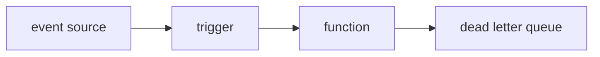

# 트리거와 이벤트

서버리스 함수는 스스로 실행되지 않습니다. 누군가가, 어떤 규칙으로, 어떤 입력을 들고 함수를 깨웁니다. 이 호출 의미를 놓치면 함수 본문이 아무리 깔끔해도 운영에서 중복 처리, 메시지 유실, 재시도 폭주가 생깁니다.

이 글은 Serverless 101 시리즈의 3번째 글입니다.

## 이 글에서 다룰 문제

- 함수는 누가, 언제, 어떤 방식으로 깨울까요?
- HTTP 요청, 큐 메시지, 스케줄 이벤트는 왜 서로 다르게 다뤄야 할까요?
- 재시도는 편의 기능이 아니라 왜 설계 전제가 될까요?
- DLQ와 멱등성은 왜 늘 함께 이야기될까요?

> 트리거는 이벤트를 함수 호출로 바꾸는 연결점이며, 호출 의미와 재시도 규칙은 트리거 종류에 따라 달라집니다.

## 왜 이 주제가 중요한가

서버리스 입문자는 함수 코드에 먼저 시선이 갑니다. 하지만 운영에서는 코드보다 호출 방식이 더 큰 문제를 만들 때가 많습니다. 같은 함수라도 HTTP로 동기 호출될 때와 큐 메시지로 비동기 호출될 때 실패의 의미, 사용자 영향, 재시도 규칙이 전부 달라집니다.

특히 비동기 호출은 로컬 테스트에서 문제를 감추기 쉽습니다. 한 번만 실행해 보면 멀쩡해 보이기 때문입니다. 그러나 실제 운영에서는 네트워크 지연, 플랫폼 재시도, 메시지 배치 처리, 순서 뒤바뀜이 동시에 일어납니다. 그래서 트리거를 이해하려면 호출 진입점만 볼 것이 아니라, 같은 입력이 다시 들어와도 안전하게 처리되는 구조까지 함께 봐야 합니다.

## 한눈에 보는 구조



이 그림은 역할 분리를 잘 보여 줍니다. 이벤트 소스는 신호를 만들고, 트리거는 그 신호를 함수 호출로 바꾸며, 함수가 반복 실패하면 메시지는 DLQ 같은 격리 경로로 이동합니다. 문제 해결도 이 세 지점을 분리해서 봐야 빨라집니다.

## 핵심 용어 먼저 정리하기

| 용어 | 뜻 | 실무에서 왜 중요한가 |
| --- | --- | --- |
| 트리거 | 이벤트를 함수 호출로 연결하는 장치 | 호출 의미와 재시도 규칙이 여기서 정해집니다 |
| 이벤트 소스 | HTTP, 큐, 스토리지, 스케줄 같은 신호 발생 지점 | 입력 구조가 이벤트 종류마다 달라집니다 |
| 호출 유형 | 동기, 비동기, 스트림 방식의 실행 | 실패를 누가 보고 누가 재시도하는지 달라집니다 |
| 데드 레터 큐 | 반복 실패 메시지를 격리하는 큐 | 실패를 숨기지 않고 관찰할 수 있습니다 |
| 멱등성 | 같은 입력이 여러 번 와도 결과가 같게 만드는 성질 | 재시도를 안전하게 만드는 핵심입니다 |

실무에서 가장 안전한 기본 가정은 대부분의 비동기 트리거를 at-least-once로 보는 것입니다. 즉, 같은 이벤트가 한 번 더 올 수 있다고 전제하는 편이 좋습니다.

## 직접 실행해 보기 전에 알아둘 차이

**기존 방식**에서는 크론 스크립트와 수동 재시도, 수동 로그 확인이 흔했습니다.

**서버리스 방식**에서는 스케줄 트리거, 자동 재시도, DLQ를 조합해 실패 경로를 구조적으로 분리합니다.

이 차이는 운영 품질을 크게 바꿉니다. 실패한 메시지를 다시 처리할 수 있는 통로가 생기고, 일시 실패와 영구 실패를 구분할 수 있으며, 재시도 전략 일부를 코드 바깥 정책으로 옮길 수 있기 때문입니다.

## HTTP, 큐, 스케줄 이벤트를 코드로 보기

### 1단계 — HTTP 이벤트

```python
def http_handler(event, context):
    body = event.get("body", "")
    return {"statusCode": 200, "body": f"echo:{body}"}
```

HTTP 트리거는 요청 하나에 응답 하나를 돌려주는 모델입니다. 실패는 즉시 사용자에게 드러나고, 지연 시간에 민감합니다.

### 2단계 — 큐 이벤트

```python
def queue_handler(event, context):
    for rec in event["records"]:
        process(rec["body"])

def process(msg):
    print("got", msg)
```

큐 기반 이벤트는 보통 `records`처럼 배치 형태로 들어옵니다. 이 순간부터 함수는 요청 처리기보다 메시지 소비자에 가깝게 동작합니다.

### 3단계 — 스케줄 이벤트

```python
import datetime as dt

def cron_handler(event, context):
    now = dt.datetime.utcnow().isoformat()
    return {"ran_at": now}
```

스케줄 트리거는 단순해 보이지만 겹침 문제가 자주 생깁니다. 이전 실행이 끝나기 전에 다음 주기가 오면 같은 작업이 동시에 실행될 수 있기 때문입니다.

### 4단계 — 멱등 키 적용

```python
seen = set()

def idempotent(handler):
    def wrap(event, ctx):
        key = event.get("id")
        if key in seen:
            return {"skipped": True}
        seen.add(key)
        return handler(event, ctx)
    return wrap
```

이 코드는 개념 설명용입니다. 실제 시스템에서는 메모리 집합 대신 외부 저장소에 키를 남겨야 합니다. 중요한 점은 같은 입력이 다시 들어왔을 때 이미 처리한 일인지 판별할 수 있어야 한다는 사실입니다.

### 5단계 — 무엇을 DLQ로 보낼지 결정하기

```python
def safe(handler, dlq):
    def wrap(event, ctx):
        try:
            return handler(event, ctx)
        except Exception as e:
            dlq.append({"event": event, "error": str(e)})
            raise
    return wrap
```

DLQ는 실패를 숨기는 장치가 아니라 실패를 보이게 하는 장치입니다. 재시도로 해결되지 않는 메시지를 격리해 두어야 원인 분석과 재처리가 가능합니다.

## 이 코드에서 먼저 봐야 할 점

- `records`는 한 건이 아니라 배치일 수 있습니다.
- 멱등 키는 재시도 안전망입니다.
- DLQ는 디버깅의 출발점입니다.

트리거를 이해할 때는 성공 경로보다 실패 경로를 먼저 떠올리는 편이 좋습니다. 메시지가 두 번 오면 어떤 일이 생기는지, 순서가 뒤집히면 어떤 상태 오염이 생기는지, 반복 실패 메시지를 어디서 다시 볼 수 있는지가 핵심입니다.

## 실무에서 자주 헷갈리는 지점

### 재시도는 정말 그렇게 흔할까

매우 흔합니다. 네트워크 오류, 일시적인 다운스트림 실패, 플랫폼 내부 재시도만으로도 같은 메시지는 여러 번 들어올 수 있습니다.

### 순서 보장은 기본일까

대부분의 이벤트 시스템은 그렇지 않습니다. 순서가 중요하다면 FIFO 같은 별도 보장 모델을 의도적으로 선택해야 합니다.

### 결제나 재고 차감도 그냥 함수 하나로 처리해도 될까

가능은 하지만 멱등성과 상태 기록 없이 처리하면 매우 위험합니다. 같은 이벤트가 다시 들어왔을 때 중복 부과나 중복 차감이 생길 수 있기 때문입니다.

## 자주 하는 실수 다섯 가지

1. 재시도가 없을 것이라고 가정합니다.
2. 메시지 순서가 항상 보장된다고 믿습니다.
3. 멱등성 없이 결제 같은 작업을 처리합니다.
4. DLQ를 설정하지 않고 운영을 시작합니다.
5. 스케줄 주기를 지나치게 짧게 잡아 실행 겹침을 만듭니다.

이 실수들은 모두 요청-응답 중심 사고를 그대로 비동기 시스템에 가져올 때 생깁니다. 이벤트 기반 시스템은 한 번 호출되면 끝나는 세계가 아니라, 다시 오고 늦게 오고 순서가 바뀔 수 있는 세계입니다.

## 실무에서는 이렇게 생각합니다

- 대부분의 트리거는 at-least-once를 기본 가정으로 둡니다.
- 멱등성은 안정성뿐 아니라 비용 보호 장치이기도 합니다.
- DLQ가 없으면 운영자는 문제를 관찰할 창을 잃습니다.
- 순서가 중요하면 그 요구사항을 플랫폼 수준에서 분명히 드러내야 합니다.
- 스케줄 작업은 실행 겹침 방지 전략까지 함께 설계해야 합니다.

## 체크리스트

- [ ] 멱등성을 보장했는가
- [ ] DLQ를 설정했는가
- [ ] 재시도 횟수와 정책을 명시했는가
- [ ] 순서 보장 요구사항을 문서화했는가

## 정리

트리거와 이벤트를 이해하면 함수 호출을 더 이상 단순한 진입점으로 보지 않게 됩니다. 호출 방식은 곧 실패 방식이고, 실패 방식은 곧 재시도와 중복 처리 설계로 이어집니다. 그래서 멱등성, DLQ, 순서 보장은 모두 트리거 의미에서 출발합니다.

다음 글에서는 콜드 스타트의 원인과 완화 방법을 살펴보겠습니다.

<!-- toc:begin -->
- [서버리스란 무엇인가?](./01-what-is-serverless.md)
- [함수형 서비스(FaaS)란 무엇인가?](./02-function-as-a-service.md)
- **트리거와 이벤트 (현재 글)**
- 콜드 스타트 (예정)
- 스케일링 (예정)
- 상태 관리 (예정)
- 큐와 이벤트 기반 아키텍처 (예정)
- 관측성 (예정)
- 비용 (예정)
- 서버리스 앱 설계 (예정)
<!-- toc:end -->

## 참고 자료

- [Lambda 이벤트 소스 매핑](https://docs.aws.amazon.com/lambda/latest/dg/invocation-eventsourcemapping.html)
- [SQS 데드 레터 큐](https://docs.aws.amazon.com/AWSSimpleQueueService/latest/SQSDeveloperGuide/sqs-dead-letter-queues.html)
- [EventBridge 스케줄](https://docs.aws.amazon.com/eventbridge/latest/userguide/eb-scheduled-rule-pattern.html)
- [멱등성 패턴](https://docs.aws.amazon.com/prescriptive-guidance/latest/cloud-design-patterns/idempotency.html)

Tags: Serverless, Trigger, Event, EventDriven, Cloud
