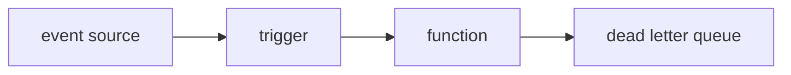

# Trigger와 Event

> Serverless 101 시리즈 (3/10)


## 이 글에서 다룰 문제

*트리거* 의 *동작* 을 모르면 *중복 처리, 메시지 유실, 무한 재시도* 가 *실서비스* 에서 터집니다.

## 전체 흐름


## Before/After

**Before**: *cron* + *스크립트* + *수동 재시도*.

**After**: *스케줄 트리거* + *DLQ* + *자동 재시도*.

## HTTP / Queue / Schedule

### 1단계 — HTTP 이벤트

```python
def http_handler(event, context):
    body = event.get("body", "")
    return {"statusCode": 200, "body": f"echo:{body}"}
```

### 2단계 — Queue 이벤트

```python
def queue_handler(event, context):
    for rec in event["records"]:
        process(rec["body"])

def process(msg):
    print("got", msg)
```

### 3단계 — Schedule 이벤트

```python
import datetime as dt

def cron_handler(event, context):
    now = dt.datetime.utcnow().isoformat()
    return {"ran_at": now}
```

### 4단계 — 멱등 키 적용

```python
seen = set()

def idempotent(handler):
    def wrap(event, ctx):
        key = event.get("id")
        if key in seen:
            return {"skipped": True}
        seen.add(key)
        return handler(event, ctx)
    return wrap
```

### 5단계 — DLQ로 보낼지 판단

```python
def safe(handler, dlq):
    def wrap(event, ctx):
        try:
            return handler(event, ctx)
        except Exception as e:
            dlq.append({"event": event, "error": str(e)})
            raise
    return wrap
```

## 이 코드에서 주목할 점

- *records* 는 *배치* 일 수 있다.
- *멱등 키* 는 *재시도* 안전망.
- *DLQ* 는 *디버깅* 의 출발점.

## 자주 하는 실수 5가지

1. ***재시도* 를 *예외 없음* 으로 가정.**
2. ***순서* 가 *보장* 된다고 가정.**
3. ***멱등성* 없이 *결제* 같은 작업 수행.**
4. ***DLQ* 미설정.**
5. ***스케줄* 을 *틱 단위* 로 너무 짧게.**

## 실무에서는 이렇게 쓰입니다

*업로드 → 썸네일 생성, 결제 이벤트 → 메일 발송, 큐 → 배치 적재* 같은 *비동기 흐름* 에 자주 쓰입니다.

## 체크리스트

- [ ] *멱등성* 보장.
- [ ] *DLQ* 설정.
- [ ] *재시도 횟수* 명시.
- [ ] *순서* 요구사항 명시.

## 정리 및 다음 단계

다음 글은 *Cold Start* 의 원인과 완화법을 다룹니다.

<!-- toc:begin -->
- [Serverless란 무엇인가?](./01-what-is-serverless.md)
- [Function as a Service](./02-function-as-a-service.md)
- **Trigger와 Event (현재 글)**
- Cold Start (예정)
- Scaling (예정)
- State 관리 (예정)
- Queue와 Event-driven Architecture (예정)
- Observability (예정)
- Cost (예정)
- Serverless 앱 설계 (예정)
<!-- toc:end -->

## 참고 자료

- [Lambda 이벤트 소스](https://docs.aws.amazon.com/lambda/latest/dg/invocation-eventsourcemapping.html)
- [SQS DLQ](https://docs.aws.amazon.com/AWSSimpleQueueService/latest/SQSDeveloperGuide/sqs-dead-letter-queues.html)
- [EventBridge 스케줄](https://docs.aws.amazon.com/eventbridge/latest/userguide/eb-scheduled-rule-pattern.html)
- [Idempotency 패턴](https://docs.aws.amazon.com/prescriptive-guidance/latest/cloud-design-patterns/idempotency.html)

Tags: Serverless, Trigger, Event, EventDriven, Cloud
