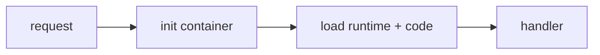

# Cold Start

> Serverless 101 시리즈 (4/10)

<!-- a-grade-intro:begin -->

**핵심 질문**: *함수* 는 왜 *처음 호출* 이 느릴까요?

> *컨테이너* 가 *처음* 만들어지고 *런타임* 과 *코드* 가 *적재* 되는 *시간* 이 *Cold Start* 입니다.

<!-- a-grade-intro:end -->

## 이 글에서 배울 것

- *Cold Start* 의 정의
- *원인* 분해
- *측정* 방법
- *완화 전략*
- 언제 *수용* 할지

## 왜 중요한가

*p99* 가 *콜드 스타트* 로 *튀면* *SLO* 가 *깨집니다*. *완화* 와 *수용* 의 균형이 필요합니다.

## 개념 한눈에 보기



## 핵심 용어 정리

- **cold start**: *최초 실행* 의 *초기화 지연*.
- **warm**: *재사용* 되는 *컨테이너*.
- **provisioned concurrency**: *미리 데워둔* 인스턴스.
- **init code**: *handler 외부* 코드.
- **package size**: *적재 시간* 에 비례.

## Before/After

**Before**: *피크* 마다 *p99 5초* 스파이크.

**After**: *프로비저닝* + *경량 패키지* 로 *p99 안정*.

## 실습: 측정과 완화

### 1단계 — 초기화 시간 측정

```python
import time

t0 = time.perf_counter()
# heavy import here

INIT_MS = (time.perf_counter() - t0) * 1000

def handler(event, context):
    return {"init_ms": INIT_MS}
```

### 2단계 — 패키지 크기 줄이기

```python
def lean_requirements(reqs):
    return [r for r in reqs if r not in {"pandas", "numpy"} or r in {"required"}]
```

### 3단계 — 글로벌 캐시

```python
_client = None

def get_client():
    global _client
    if _client is None:
        _client = build_client()
    return _client

def build_client():
    return {"ready": True}
```

### 4단계 — 프로비저닝 (의사 코드)

```python
"""
provisioned_concurrency:
  function: web
  min: 5
"""
```

### 5단계 — p50/p95/p99 추적

```python
def percentile(values, p):
    s = sorted(values)
    return s[int(len(s) * p) - 1]
```

## 이 코드에서 주목할 점

- *handler 외부* 는 *콜드 시 한 번만* 실행.
- *글로벌 클라이언트* 재사용은 *워밍 핵심*.
- *프로비저닝* 은 *비용* 과 교환.

## 자주 하는 실수 5가지

1. ***평균* 만 보고 *p99* 무시.**
2. ***handler 안* 에서 *클라이언트* 매번 생성.**
3. ***대형 의존성* 무방비 도입.**
4. ***프로비저닝* 을 *기본* 으로.**
5. ***언어 선택* 의 *콜드 비용* 무시.**

## 실무에서는 이렇게 쓰입니다

*결제, 로그인* 같은 *지연 민감* 경로에 *프로비저닝* 을 쓰고, *내부 잡* 에는 *수용* 합니다.

## 시니어 엔지니어는 이렇게 생각합니다

- *콜드* 는 *없애려* 하기보다 *관리*.
- *p99* 가 *진실*.
- *경량 의존성* 이 *최고의 무기*.
- *프로비저닝* 은 *마지막 카드*.
- *언어 선택* 은 *콜드* 에 영향.

## 체크리스트

- [ ] *p99* 추적.
- [ ] *글로벌 캐시* 사용.
- [ ] *패키지 크기* 모니터링.
- [ ] *프로비저닝* 비용 검토.

## 연습 문제

1. *cold* 와 *warm* 의 차이 한 줄로.
2. *프로비저닝* 의 *대가* 한 줄로.
3. *handler 외부 코드* 의 의미 한 줄로.

## 정리 및 다음 단계

다음 글은 *Scaling* 에서 *동시성 모델* 을 다룹니다.

<!-- toc:begin -->
- [Serverless란 무엇인가?](./01-what-is-serverless.md)
- [Function as a Service](./02-function-as-a-service.md)
- [Trigger와 Event](./03-trigger-and-event.md)
- **Cold Start (현재 글)**
- Scaling (예정)
- State 관리 (예정)
- Queue와 Event-driven Architecture (예정)
- Observability (예정)
- Cost (예정)
- Serverless 앱 설계 (예정)
<!-- toc:end -->

## 참고 자료

- [Lambda 콜드 스타트](https://docs.aws.amazon.com/lambda/latest/dg/lambda-runtime-environment.html)
- [Provisioned Concurrency](https://docs.aws.amazon.com/lambda/latest/dg/provisioned-concurrency.html)
- [패키지 최적화](https://docs.aws.amazon.com/lambda/latest/dg/best-practices.html)
- [SnapStart](https://docs.aws.amazon.com/lambda/latest/dg/snapstart.html)

Tags: Serverless, ColdStart, Performance, Latency, Cloud
