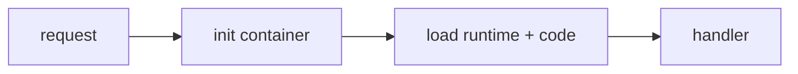

# Cold Start

> Serverless 101 시리즈 (4/10)


## 이 글에서 다룰 문제

p99가 콜드 스타트 때문에 튀면 SLO가 깨집니다. 완화와 수용 사이의 균형이 필요합니다.

## 전체 흐름


## Before/After

**Before**: 피크마다 p99 5초 스파이크가 생깁니다.

**After**: 프로비저닝과 경량 패키지로 p99를 안정시킵니다.

## 측정과 완화

### 1단계 — 초기화 시간 측정

```python
import time

t0 = time.perf_counter()
# 여기서 무거운 import가 일어납니다

INIT_MS = (time.perf_counter() - t0) * 1000

def handler(event, context):
    return {"init_ms": INIT_MS}
```

### 2단계 — 패키지 크기 줄이기

```python
def lean_requirements(reqs):
    return [r for r in reqs if r not in {"pandas", "numpy"} or r in {"required"}]
```

### 3단계 — 글로벌 캐시

```python
_client = None

def get_client():
    global _client
    if _client is None:
        _client = build_client()
    return _client

def build_client():
    return {"ready": True}
```

### 4단계 — 프로비저닝 (의사 코드)

```python
"""
provisioned_concurrency:
  function: web
  min: 5
"""
```

### 5단계 — p50/p95/p99 추적

```python
def percentile(values, p):
    s = sorted(values)
    return s[int(len(s) * p) - 1]
```

## 이 코드에서 주목할 점

- handler 바깥 코드는 콜드 시작 때 한 번만 실행됩니다.
- 글로벌 클라이언트 재사용은 워밍의 핵심입니다.
- 프로비저닝은 비용과 맞바꾸는 선택입니다.

## 자주 하는 실수 5가지

1. 평균만 보고 p99를 무시하기
2. handler 안에서 클라이언트를 매번 생성하기
3. 대형 의존성을 무방비로 도입하기
4. 프로비저닝을 기본값처럼 쓰기
5. 언어 선택의 콜드 스타트 비용을 무시하기

## 실무에서는 이렇게 쓰입니다

결제나 로그인처럼 지연에 민감한 경로에는 프로비저닝을 쓰고, 내부 잡은 지연을 수용하기도 합니다.

## 체크리스트

- [ ] p99를 추적하는가
- [ ] 글로벌 캐시를 사용하는가
- [ ] 패키지 크기를 모니터링하는가
- [ ] 프로비저닝 비용을 검토했는가

## 정리 및 다음 단계

다음 글은 Scaling에서 동시성 모델을 다룹니다.

<!-- toc:begin -->
- [Serverless란 무엇인가?](./01-what-is-serverless.md)
- [Function as a Service](./02-function-as-a-service.md)
- [Trigger와 Event](./03-trigger-and-event.md)
- **Cold Start (현재 글)**
- Scaling (예정)
- State 관리 (예정)
- Queue와 Event-driven Architecture (예정)
- Observability (예정)
- Cost (예정)
- Serverless 앱 설계 (예정)
<!-- toc:end -->

## 참고 자료

- [Lambda 콜드 스타트](https://docs.aws.amazon.com/lambda/latest/dg/lambda-runtime-environment.html)
- [Provisioned Concurrency](https://docs.aws.amazon.com/lambda/latest/dg/provisioned-concurrency.html)
- [패키지 최적화](https://docs.aws.amazon.com/lambda/latest/dg/best-practices.html)
- [SnapStart](https://docs.aws.amazon.com/lambda/latest/dg/snapstart.html)

Tags: Serverless, ColdStart, Performance, Latency, Cloud
