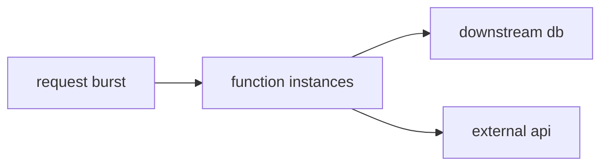

# 스케일링

서버리스는 자주 “자동으로 무한 확장된다”는 말로 소개됩니다. 처음에는 맞는 말처럼 들리지만, 실무에서는 이 문장이 가장 위험한 오해가 되기도 합니다. 함수는 빠르게 늘어나도 데이터베이스와 외부 API, 연결 풀은 유한하기 때문입니다.

이 글은 Serverless 101 시리즈의 5번째 글입니다.

## 이 글에서 다룰 문제

- 서버리스의 동시성 모델은 어떻게 이해해야 할까요?
- 버스트와 지속 트래픽은 왜 다르게 봐야 할까요?
- 예약 동시성은 무엇을 보호하기 위한 장치일까요?
- 백프레셔와 큐 버퍼링은 왜 스케일링의 일부일까요?

> 서버리스는 기본적으로 수평 확장에 강하지만, 동시성 한도와 다운스트림 보호 전략 없이는 스케일 자체가 장애 원인이 됩니다.

## 왜 이 주제가 중요한가

서버리스의 강점은 확장 속도입니다. 트래픽이 몰리면 함수 인스턴스를 빠르게 늘릴 수 있습니다. 문제는 시스템 전체가 그 속도를 감당하지 못할 수 있다는 점입니다. 함수가 열 배로 늘었는데 데이터베이스 연결 수는 그대로라면, 자동 확장은 성능 개선이 아니라 장애 가속기가 됩니다.

그래서 스케일링은 “얼마나 많이 늘릴 수 있는가”보다 “어디까지 늘리는 것이 안전한가”를 묻는 주제입니다. 서버리스에서 수평 확장의 비용은 종종 함수 자체가 아니라 다운스트림이 지불합니다. 이 점을 모르면 트래픽이 올라갈수록 시스템이 더 불안정해지는 역설을 만나게 됩니다.

## 한눈에 보는 구조



이 그림에서 중요한 것은 함수 뒤쪽입니다. 스케일링은 함수 인스턴스를 늘리는 일로 끝나지 않습니다. 늘어난 인스턴스가 데이터베이스와 외부 API, 큐 소비 속도에 어떤 압력을 주는지까지 함께 읽어야 합니다.

## 핵심 용어 먼저 정리하기

| 용어 | 뜻 | 운영에 주는 의미 |
| --- | --- | --- |
| 동시성 | 동시에 실행 중인 함수 인스턴스 수 | 현재 시스템이 받는 병렬 압력의 크기입니다 |
| 버스트 한도 | 짧은 구간에서 급격히 늘어날 수 있는 상한 | 초기 급증을 어디까지 흡수할지 결정합니다 |
| 예약 동시성 | 특정 함수에 고정 배정한 동시성 예산 | 중요한 함수 보호와 다운스트림 보호에 씁니다 |
| 스로틀링 | 한도를 넘는 호출을 지연 또는 거절하는 동작 | 시스템 전체를 보호하기 위한 안전장치입니다 |
| 백프레셔 | 다운스트림이 감당 가능한 속도로만 흐르게 만드는 기법 | 재시도 폭주와 연결 고갈을 막아 줍니다 |

이 다섯 가지는 모두 스케일링을 제어 가능한 시스템 동작으로 바꾸는 언어입니다. 자동 확장을 믿는 것만으로는 충분하지 않습니다.

## 무엇이 달라졌는지 먼저 보기

**문제가 있는 상태**에서는 짧은 시간에 많은 호출이 몰리면서 데이터베이스 연결이 고갈되고, 외부 API 제한도 동시에 맞게 됩니다.

**개선된 상태**에서는 예약 동시성과 큐 버퍼링을 함께 사용해 앞단의 충격을 흡수하고, 뒤쪽 시스템에는 감당 가능한 속도로만 일을 넘깁니다.

즉, 좋은 스케일링은 무한히 늘리는 기술이 아니라, 감당 가능한 속도로 흘려보내는 기술입니다.

## 스케일링과 보호 전략을 코드로 보기

### 1단계 — 동시성 추정

```python
def concurrency(rps, duration_s):
    return rps * duration_s
```

동시성은 직관보다 계산으로 보는 편이 좋습니다. 초당 요청 수와 평균 실행 시간을 곱하면 현재 몇 개의 인스턴스가 동시에 살아 있어야 하는지 대략 감이 옵니다.

### 2단계 — 버스트 시뮬레이션

```python
import concurrent.futures as cf

def burst(call, n):
    with cf.ThreadPoolExecutor(max_workers=n) as ex:
        list(ex.map(lambda i: call(i), range(n)))
```

버스트는 지속 트래픽과 다릅니다. 짧은 순간에 갑자기 몰리는 요청이므로, 초기 확장 속도와 다운스트림 연결 한도가 더 중요해집니다.

### 3단계 — 예약 동시성 구상

```python
"""
reserved_concurrency:
  function: web
  value: 50
"""
```

예약 동시성은 속도를 높이기 위한 기능이 아니라 보호 장치에 가깝습니다. 특정 함수가 지나치게 자원을 먹어 다른 함수를 굶기거나 데이터베이스를 마비시키지 않도록 경계를 세워 줍니다.

### 4단계 — 큐 버퍼링

```python
def enqueue(queue, msg):
    queue.append(msg)

def drain(queue, handler, batch=10):
    chunk, queue[:] = queue[:batch], queue[batch:]
    for m in chunk:
        handler(m, None)
```

큐는 스케일링의 적이 아니라 동반자입니다. 앞단의 스파이크를 시간으로 펼쳐 주기 때문에, 뒤쪽 시스템이 감당 가능한 속도로만 처리하게 만들 수 있습니다.

### 5단계 — 백오프 적용

```python
def backoff(attempt):
    return min(2 ** attempt, 30)
```

백오프는 재시도 폭주를 막는 가장 기본적인 장치입니다. 실패 직후 즉시 재시도를 반복하면 원래의 장애보다 더 큰 부하를 스스로 만들어 낼 수 있습니다.

## 이 코드에서 먼저 봐야 할 점

- 예약 동시성은 다운스트림 보호 장치입니다.
- 큐는 순간적인 충격을 흡수하는 버퍼입니다.
- 백오프는 재시도를 안전하게 만듭니다.

서버리스 스케일링은 함수 수를 늘리는 기술이라기보다 흐름을 제어하는 기술에 가깝습니다. 특히 데이터베이스와 외부 API가 병목인 시스템에서는 더 그렇습니다.

## 실무에서 자주 헷갈리는 지점

### 자동 확장이 있으니 데이터베이스도 괜찮지 않을까

그렇지 않습니다. 함수는 빠르게 늘어나지만 데이터베이스 연결 수와 쿼리 처리량은 그만큼 즉시 늘지 않습니다.

### 버스트와 지속 트래픽은 왜 따로 봐야 할까

짧은 피크는 큐와 버스트 한도로 버틸 수 있지만, 지속 트래픽은 근본적인 처리량 설계 문제로 이어집니다. 둘은 대응 방식이 다릅니다.

### 예약 동시성은 느리게 만드는 기능일까

겉으로는 한도를 두는 기능처럼 보이지만, 실제 목적은 중요한 경로와 다운스트림 시스템을 보호하는 것입니다. 제한이 아니라 방어선에 가깝습니다.

## 자주 하는 실수 다섯 가지

1. 데이터베이스 연결 풀을 무방비로 둡니다.
2. 버스트를 지속 트래픽처럼 해석합니다.
3. 외부 API의 호출 한도를 무시합니다.
4. 예약 동시성을 쓰지 않아 다른 함수가 기아 상태에 빠지게 둡니다.
5. 백오프 없이 즉시 재시도합니다.

이 실수들은 대부분 자동 확장을 자동 안정성과 같은 뜻으로 오해할 때 생깁니다. 서버리스는 빠르게 늘어나지만, 보호 전략이 없다면 그 빠름은 오히려 문제를 더 빨리 드러내는 방식으로 작동합니다.

## 실무에서는 이렇게 생각합니다

- 수평 확장의 비용은 종종 다운스트림이 지불합니다.
- 백프레셔는 선택 기능이 아니라 기본 패턴입니다.
- 동시성 한도는 예산처럼 관리합니다.
- 큐는 시간을 벌어 주는 설계 도구입니다.
- 같은 계정 안의 다른 함수가 굶지 않는지도 함께 봐야 합니다.

## 체크리스트

- [ ] 데이터베이스 보호 전략을 세웠는가
- [ ] 예약 동시성이나 한도 정책을 검토했는가
- [ ] 백오프를 적용했는가
- [ ] 외부 API의 호출 한도를 파악했는가

## 정리

서버리스 스케일링의 본질은 무한 확장이 아니라 통제된 확장입니다. 함수는 빠르게 늘릴 수 있지만, 시스템 전체를 안전하게 유지하려면 동시성 한도, 큐, 백프레셔, 다운스트림 보호가 함께 있어야 합니다. 이 감각이 있어야 다음 주제인 상태 관리도 더 현실적으로 읽힙니다.

다음 글에서는 서버리스 환경에서 상태를 어떻게 다뤄야 하는지 살펴보겠습니다.

<!-- toc:begin -->
- [서버리스란 무엇인가?](./01-what-is-serverless.md)
- [함수형 서비스(FaaS)란 무엇인가?](./02-function-as-a-service.md)
- [트리거와 이벤트](./03-trigger-and-event.md)
- [콜드 스타트](./04-cold-start.md)
- **스케일링 (현재 글)**
- 상태 관리 (예정)
- 큐와 이벤트 기반 아키텍처 (예정)
- 관측성 (예정)
- 비용 (예정)
- 서버리스 앱 설계 (예정)
<!-- toc:end -->

## 참고 자료

- [Lambda 동시성](https://docs.aws.amazon.com/lambda/latest/dg/lambda-concurrency.html)
- [Reserved/Provisioned concurrency](https://docs.aws.amazon.com/lambda/latest/dg/configuration-concurrency.html)
- [SQS 버퍼링 패턴](https://docs.aws.amazon.com/AWSSimpleQueueService/latest/SQSDeveloperGuide/welcome.html)
- [Lambda 스로틀링과 스케일링](https://docs.aws.amazon.com/lambda/latest/dg/invocation-scaling.html)

Tags: Serverless, Scaling, Concurrency, Throttling, Cloud
