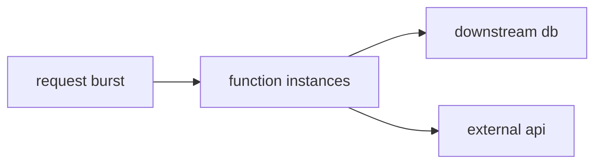

# Scaling

> Serverless 101 시리즈 (5/10)


## 이 글에서 다룰 문제

무한 확장처럼 보여도 DB와 외부 API는 유한합니다. 스케일 자체가 장애를 만들 수도 있습니다.

## 전체 흐름


## Before/After

**Before**: 대량 호출로 DB 커넥션이 폭주합니다.

**After**: 예약 동시성과 큐 버퍼링으로 흐름을 제어합니다.

## 스케일과 보호

### 1단계 — 동시성 추정

```python
def concurrency(rps, duration_s):
    return rps * duration_s
```

### 2단계 — 버스트 시뮬레이션

```python
import concurrent.futures as cf

def burst(call, n):
    with cf.ThreadPoolExecutor(max_workers=n) as ex:
        list(ex.map(lambda i: call(i), range(n)))
```

### 3단계 — 예약 동시성 (의사 코드)

```python
"""
reserved_concurrency:
  function: web
  value: 50
"""
```

### 4단계 — 큐 버퍼링

```python
def enqueue(queue, msg):
    queue.append(msg)

def drain(queue, handler, batch=10):
    chunk, queue[:] = queue[:batch], queue[batch:]
    for m in chunk:
        handler(m, None)
```

### 5단계 — 백프레셔

```python
def backoff(attempt):
    return min(2 ** attempt, 30)
```

## 이 코드에서 주목할 점

- 예약 동시성은 DB를 보호하는 장치입니다.
- 큐는 트래픽 충격을 흡수합니다.
- 백오프는 재시도 폭주를 막습니다.

## 자주 하는 실수 5가지

1. DB 커넥션 풀을 무방비로 두기
2. 버스트를 지속 트래픽처럼 가정하기
3. 외부 API의 레이트 리밋을 무시하기
4. 예약 동시성을 잡지 않아 경쟁 함수가 기아 상태에 빠지게 두기
5. 백오프 없이 즉시 재시도하기

## 실무에서는 이렇게 쓰입니다

큐가 스파이크를 먼저 받고, 함수는 예약 동시성으로 DB를 보호하면서 처리합니다.

## 체크리스트

- [ ] DB 보호 전략을 세웠는가
- [ ] 예약 동시성을 검토했는가
- [ ] 백오프를 적용했는가
- [ ] 외부 API 한도를 알고 있는가

## 정리 및 다음 단계

다음 글은 State 관리를 다룹니다.

<!-- toc:begin -->
- [Serverless란 무엇인가?](./01-what-is-serverless.md)
- [Function as a Service](./02-function-as-a-service.md)
- [Trigger와 Event](./03-trigger-and-event.md)
- [Cold Start](./04-cold-start.md)
- **Scaling (현재 글)**
- State 관리 (예정)
- Queue와 Event-driven Architecture (예정)
- Observability (예정)
- Cost (예정)
- Serverless 앱 설계 (예정)
<!-- toc:end -->

## 참고 자료

- [Lambda 동시성](https://docs.aws.amazon.com/lambda/latest/dg/lambda-concurrency.html)
- [Reserved/Provisioned 동시성](https://docs.aws.amazon.com/lambda/latest/dg/configuration-concurrency.html)
- [SQS 버퍼링 패턴](https://docs.aws.amazon.com/AWSSimpleQueueService/latest/SQSDeveloperGuide/welcome.html)
- [Throttling 가이드](https://docs.aws.amazon.com/lambda/latest/dg/invocation-scaling.html)

Tags: Serverless, Scaling, Concurrency, Throttling, Cloud
