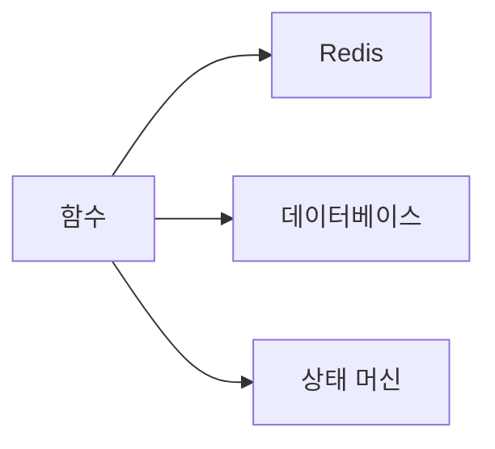

# State 관리

## 이 글에서 다룰 문제

- Stateless 함수가 상태가 있는 비즈니스를 어떻게 처리할 수 있을까요?
- 세션, 캐시, 워크플로 진행 상태는 어디에 두어야 할까요?
- 멱등 토큰과 TTL은 왜 상태 관리 이야기에서 빠지지 않을까요?
- 복잡한 흐름을 함수 하나에 몰아넣으면 왜 곤란할까요?

> Serverless 101 시리즈 (6/10)

Serverless를 배우다 보면 곧바로 이런 질문이 나옵니다. “함수는 상태를 들고 있지 말라는데, 로그인 세션이나 주문 진행 상태는 어디에 두라는 거지?” 바로 이 지점에서 Serverless 사고방식이 분명해집니다. 함수는 계산을 수행하는 짧은 실행 단위이고, 상태는 별도 저장소에 남겨야 합니다.

이 원칙은 단순한 권장사항이 아닙니다. 함수 인스턴스는 언제든 사라질 수 있고, 다음 호출이 같은 인스턴스에 들어온다는 보장도 없습니다. 메모리나 로컬 파일에 의존한 상태는 운이 좋을 때만 동작합니다. 운영에서는 결국 사라지거나 어긋납니다.

이 글에서는 Serverless에서 상태를 어디에 두고, 어떤 기준으로 저장소를 고르며, 멱등 토큰과 워크플로 상태를 어떻게 결합하는지 살펴보겠습니다. 핵심은 함수 안에서 상태를 붙잡지 않는 대신, 상태의 위치와 수명을 더 명확하게 설계하는 것입니다.

## 이 글에서 배울 것

- Stateless가 실제로 뜻하는 바
- 세션과 캐시를 외부 저장소에 두는 이유
- 데이터 저장소와 워크플로 상태를 나눠 보는 방법
- 멱등 토큰, TTL, 상태 머신을 함께 설계하는 감각

## 왜 중요한가

State 관리가 흔들리면 Serverless 앱은 초반에는 멀쩡해 보여도 운영에서 쉽게 무너집니다. 같은 사용자의 다음 요청이 다른 인스턴스로 들어오는데 이전 상태가 메모리에만 남아 있다면 세션이 끊깁니다. 재시도가 들어왔는데 처리 여부를 기록하지 않았다면 같은 작업이 두 번 실행됩니다. 만료 전략 없이 캐시를 쌓아 두면 비용과 데이터 정합성이 함께 흔들립니다.

즉, Serverless에서 상태 문제는 성능 최적화 주제가 아니라 구조 문제입니다. 상태를 어디에 둘지 정하는 순간 아키텍처가 거의 절반 결정됩니다.

## 한눈에 보는 흐름



> 함수는 Stateless하게 유지하고, 상태는 외부 저장소와 상태 머신에 둡니다.

이 그림이 보여 주는 메시지는 단순합니다. 함수는 상태를 소유하지 않고 상태를 읽고 갱신하는 클라이언트 역할을 합니다. 세션성 데이터는 캐시로, 영속 데이터는 데이터베이스로, 여러 단계를 거치는 흐름은 상태 머신으로 분리하면 책임이 선명해집니다.

## 핵심 용어

- **Stateless**: 함수 인스턴스가 다음 호출까지 믿을 만한 상태를 들고 있지 않다는 뜻입니다.
- **세션 저장소**: Redis, DynamoDB 같은 외부 저장소입니다.
- **워크플로 상태**: 여러 단계의 진행 상태를 나타내는 오케스트레이션 정보입니다.
- **멱등 토큰**: 재시도를 안전하게 만드는 키입니다.
- **TTL**: 상태의 만료 시간을 정하는 값입니다.

Stateless는 상태가 전혀 없다는 뜻이 아닙니다. 상태를 함수 프로세스 안에 두지 않는다는 뜻입니다. 이 차이를 이해하면 “상태가 있으니 Serverless와 안 맞는다”가 아니라 “상태를 외부화하면 Serverless와 함께 갈 수 있다”로 생각이 바뀝니다.

## Before / After

**Before**: 글로벌 변수에 캐시를 두고 운 좋게 같은 인스턴스가 재사용되길 기대합니다.

**After**: Redis와 TTL, 멱등 키를 조합해 인스턴스 생명주기와 무관하게 상태를 보관합니다.

전자는 로컬 테스트에서는 잘 보일 수 있지만 스케일링 순간에 무너집니다. 후자는 구현이 조금 더 번거롭지만, 인스턴스 교체와 재시도를 전제로 둔 구조라서 운영에서 훨씬 안정적입니다.

## 실습: 외부 상태로 옮기기

### 1단계 — 키-값 캐시 추상화

```python
class Cache:
    def __init__(self):
        self.store = {}
    def get(self, k):
        return self.store.get(k)
    def set(self, k, v, ttl=60):
        self.store[k] = (v, ttl)
```

예제 구현은 메모리 딕셔너리를 쓰지만, 의도는 인터페이스를 보여 주는 데 있습니다. 실제 시스템에서는 이 자리에 Redis 같은 외부 저장소가 들어갑니다. 중요한 점은 함수가 상태 저장 방식을 직접 품지 않고 추상화된 저장소를 통해 접근한다는 점입니다.

### 2단계 — 세션 핸들러

```python
def with_session(handler, cache):
    def wrap(event, ctx):
        sid = event.get("session")
        state = cache.get(sid) or {}
        result = handler(event, ctx, state)
        cache.set(sid, state)
        return result
    return wrap
```

이 패턴은 요청 처리 코드와 상태 읽기·쓰기 코드를 분리합니다. 세션 상태는 호출 전 읽고 처리 후 다시 저장합니다. 이렇게 하면 어떤 인스턴스가 요청을 받든 같은 세션 저장소를 기준으로 일관된 동작을 기대할 수 있습니다.

### 3단계 — 멱등 토큰

```python
def use_token(cache, token):
    if cache.get(token):
        return False
    cache.set(token, "done", ttl=3600)
    return True
```

멱등 토큰은 상태 관리의 일부입니다. 많은 팀이 재시도 안전성을 별도 주제로 생각하지만, 실제로는 이 입력을 이미 처리했는가라는 상태를 짧게 저장하는 문제와 같습니다. 그래서 토큰 저장소와 TTL 정책은 함께 설계해야 합니다.

### 4단계 — 워크플로 상태 (의사 코드)

```python
"""
states:
  Validate -> Charge -> Notify
on Failure: -> Refund
"""
```

여기서 중요한 포인트는 복잡한 비즈니스 흐름을 함수 내부 분기문으로만 표현하지 않는 것입니다. 단계가 늘어날수록 워크플로 자체를 상태 머신으로 보는 편이 훨씬 읽기 쉽고 복구 전략도 분명해집니다.

### 5단계 — 데이터 모델 분리

```python
def model(record):
    return {"id": record["id"], "status": record.get("status", "new")}
```

상태 저장소를 외부화하면 데이터 모델도 더 중요해집니다. 어떤 필드를 영속 상태로 볼지, 어떤 값이 중간 상태인지, 언제 만료되는지를 코드보다 먼저 정의해야 하기 때문입니다.

## 이 코드에서 주목할 점

- 세션은 외부 저장소에 둡니다.
- 멱등 토큰으로 재시도를 안전하게 만듭니다.
- 워크플로는 상태 머신으로 표현할수록 다루기 쉬워집니다.

결국 함수는 상태를 가진 객체가 아니라 상태를 읽고 갱신하는 작업자에 가깝습니다. 이 관점을 받아들이면 함수 내부는 오히려 단순해지고, 시스템 전체는 더 예측 가능해집니다.

## 자주 하는 실수 5가지

1. 글로벌 변수 캐시에 의존하기
2. 함수 호출마다 DB 연결을 새로 열기
3. TTL 없이 상태를 무한히 쌓아 두기
4. 멱등 토큰을 두지 않기
5. 복잡한 흐름을 함수 하나에 몰아넣기

특히 TTL을 빼먹는 실수는 늦게 드러나서 더 위험합니다. 초반에는 잘 돌아가지만 시간이 지나면 캐시가 부풀고, 오래된 토큰이 정리되지 않고, 어떤 데이터가 살아 있어야 하는지 기준이 흐려집니다. 상태에는 항상 수명 정책이 따라야 합니다.

## 실무에서는 이렇게 쓰입니다

세션은 Redis 같은 빠른 저장소에 두고, 영속 데이터는 DynamoDB나 RDS 같은 데이터베이스에 저장하며, 여러 단계를 거치는 복잡한 흐름은 Step Functions 같은 오케스트레이션 도구로 분리하는 구성이 흔합니다. 핵심은 모든 상태를 하나의 저장소에 억지로 몰아넣지 않는 것입니다.

예를 들어 주문 처리 시스템이라면 사용자 장바구니나 짧은 중간 상태는 캐시가 맞고, 주문 원장은 데이터베이스가 맞으며, 결제-재고-알림처럼 단계가 있는 흐름은 워크플로 엔진이 더 잘 맞습니다. 저장소 선택은 곧 책임 분리입니다.

## 실무에서는 이렇게 생각합니다

- Stateless는 제약이면서 동시에 자유입니다.
- 상태를 어디에 두는지가 아키텍처의 중심입니다.
- TTL은 비용과 정합성을 함께 지키는 장치입니다.
- 워크플로는 코드 뭉치가 아니라 상태 머신으로 보는 편이 낫습니다.
- 데이터 모델은 시간이 지나며 바뀐다는 전제를 두어야 합니다.

## 체크리스트

- [ ] 세션을 외부 저장소로 분리했는가
- [ ] DB 연결 재사용 전략을 정했는가
- [ ] TTL을 명시했는가
- [ ] 복잡한 워크플로를 함수 밖으로 분리했는가

## 연습 문제

1. Stateless의 의미를 한 줄로 적어 보세요.
2. 멱등 토큰이 하는 일을 한 줄로 설명해 보세요.
3. 워크플로 상태 머신이 필요한 이유를 한 줄로 정리해 보세요.

## 정리 및 다음 단계

Serverless에서 상태를 다루는 핵심은 상태를 없애는 것이 아니라 위치를 명확히 하는 일입니다. 함수는 짧게 실행되고 사라질 수 있으므로, 세션과 데이터와 워크플로 상태를 각각 맞는 저장소로 분리해야 합니다. 멱등 토큰과 TTL은 그 분리를 안전하게 유지하는 기본 장치입니다.

다음 글에서는 Queue와 Event-driven Architecture를 통해 비동기 흐름을 어떻게 구성하는지 이어서 살펴보겠습니다.

<!-- toc:begin -->
- [Serverless란 무엇인가?](./01-what-is-serverless.md)
- [Function as a Service](./02-function-as-a-service.md)
- [Trigger와 Event](./03-trigger-and-event.md)
- [Cold Start](./04-cold-start.md)
- [Scaling](./05-scaling.md)
- **State 관리 (현재 글)**
- Queue와 Event-driven Architecture (예정)
- Observability (예정)
- Cost (예정)
- Serverless 앱 설계 (예정)
<!-- toc:end -->

## 참고 자료

- [DynamoDB 단일 테이블 설계](https://docs.aws.amazon.com/amazondynamodb/latest/developerguide/bp-modeling-nosql-B.html)
- [ElastiCache 개요](https://docs.aws.amazon.com/AmazonElastiCache/latest/red-ug/WhatIs.html)
- [Step Functions](https://docs.aws.amazon.com/step-functions/latest/dg/welcome.html)
- [Idempotency 패턴](https://docs.aws.amazon.com/prescriptive-guidance/latest/cloud-design-patterns/idempotency.html)

Tags: Serverless, State, Database, Cache, Cloud
