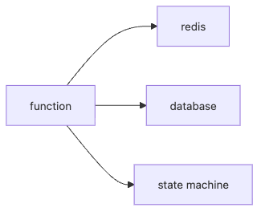

# 상태 관리

서버리스 함수를 배우다 보면 곧바로 이런 질문이 나옵니다. “함수는 무상태여야 한다는데, 로그인 세션이나 주문 상태는 어디에 두라는 뜻일까?” 이 질문에 제대로 답하지 못하면 서버리스는 늘 불편한 제약처럼만 보입니다.

이 글은 Serverless 101 시리즈의 6번째 글입니다.

## 이 글에서 다룰 문제

- 무상태 함수가 상태 있는 비즈니스를 어떻게 처리할까요?
- 세션, 캐시, 데이터 저장소, 워크플로 상태는 어디에 둬야 할까요?
- TTL과 멱등 토큰은 왜 상태 관리의 핵심일까요?
- 복잡한 흐름을 함수 하나에 몰아넣으면 왜 운영이 어려워질까요?

> 함수는 무상태로 유지하고, 상태는 외부 저장소와 상태 머신에 둬야 서버리스가 안정적으로 동작합니다.

## 왜 이 주제가 중요한가

서버리스 함수는 언제든 사라질 수 있습니다. 같은 사용자의 다음 요청이 같은 인스턴스로 다시 들어온다는 보장도 없습니다. 그래서 메모리나 로컬 파일에 붙잡아 둔 상태는 운이 좋을 때만 동작합니다. 스케일링이나 재시작이 일어나는 순간 곧바로 무너집니다.

상태 관리는 성능 최적화 문제가 아니라 구조 문제입니다. 세션을 어디에 둘지, 처리 완료 사실을 어디에 기록할지, 여러 단계를 거치는 흐름을 코드 안에 둘지 밖으로 뺄지 결정하는 순간 아키텍처의 절반이 결정됩니다. 서버리스에서 안정적인 시스템을 만들려면 함수보다 상태의 위치를 먼저 설계해야 합니다.

## 한눈에 보는 구조



*함수는 일을 처리하고, 실제 상태는 캐시·데이터베이스·워크플로 엔진에 남기는 구조입니다.*
이 그림이 보여 주는 메시지는 단순합니다. 함수는 상태를 소유하는 주체가 아니라 상태를 읽고 갱신하는 작업자입니다. 짧은 세션성 데이터는 캐시로, 영속 데이터는 데이터베이스로, 여러 단계의 진행 상태는 워크플로 엔진이나 상태 머신으로 분리하면 책임이 선명해집니다.

## 핵심 용어 먼저 정리하기

| 용어 | 뜻 | 운영에 주는 의미 |
| --- | --- | --- |
| 무상태 | 함수 인스턴스가 신뢰할 만한 상태를 들고 있지 않음 | 다음 호출이 어느 인스턴스로 갈지 몰라도 안전해야 합니다 |
| 세션 저장소 | Redis, DynamoDB 같은 외부 저장소 | 사용자별 상태를 함수 밖에 둡니다 |
| 워크플로 상태 | 여러 단계의 진행 상태를 표현하는 오케스트레이션 정보 | 복잡한 흐름을 함수 본문에서 분리합니다 |
| 멱등 토큰 | 이미 처리한 입력인지 판별하는 키 | 재시도를 안전하게 만듭니다 |
| TTL | 상태의 만료 시간 | 비용과 정합성을 함께 관리합니다 |

무상태는 상태가 전혀 없다는 뜻이 아닙니다. 상태를 함수 프로세스 안에 두지 않는다는 뜻입니다. 이 차이를 이해하면 서버리스가 제약이 아니라 분리 원칙으로 읽히기 시작합니다.

## 무엇이 달라지는지 먼저 보기

**문제가 있는 상태**에서는 전역 변수 캐시에 기대고, 같은 인스턴스가 다시 쓰이길 바라는 식으로 구현합니다.

**개선된 상태**에서는 외부 캐시와 데이터베이스, TTL, 멱등 토큰을 조합해 인스턴스 생명주기와 무관하게 상태를 유지합니다.

두 방식의 차이는 로컬 테스트보다 운영에서 더 크게 드러납니다. 전자는 우연히 동작하고, 후자는 의도적으로 동작합니다.

## 외부 상태로 옮기는 흐름을 코드로 보기

### 1단계 — 키-값 캐시 추상화

```python
class Cache:
    def __init__(self):
        self.store = {}
    def get(self, k):
        return self.store.get(k)
    def set(self, k, v, ttl=60):
        self.store[k] = (v, ttl)
```

예제는 메모리 딕셔너리를 쓰지만, 실제 시스템에서는 이 자리에 Redis 같은 외부 저장소가 들어갑니다. 중요한 점은 함수가 저장 구현을 직접 품지 않고, 추상화된 저장소를 통해 상태를 읽고 쓴다는 사실입니다.

### 2단계 — 세션 핸들러

```python
def with_session(handler, cache):
    def wrap(event, ctx):
        sid = event.get("session")
        state = cache.get(sid) or {}
        result = handler(event, ctx, state)
        cache.set(sid, state)
        return result
    return wrap
```

세션 상태를 함수 호출 전후에 외부 저장소에서 읽고 쓰는 패턴입니다. 어떤 인스턴스가 요청을 받든 동일한 세션 상태를 기준으로 동작할 수 있습니다.

### 3단계 — 멱등 토큰

```python
def use_token(cache, token):
    if cache.get(token):
        return False
    cache.set(token, "done", ttl=3600)
    return True
```

멱등성은 별도 주제가 아니라 상태 관리의 일부입니다. 이미 처리한 요청인지 기록하는 짧은 상태가 필요하기 때문입니다. 그래서 토큰 저장소와 만료 정책은 함께 설계해야 합니다.

### 4단계 — 워크플로 상태 표현

```python
"""
states:
  Validate -> Charge -> Notify
on Failure: -> Refund
"""
```

복잡한 흐름을 함수 내부 분기문만으로 계속 키워 가면 읽기도 어렵고 복구 경로도 흐려집니다. 단계가 많아질수록 상태 머신이나 워크플로 엔진으로 빼는 편이 더 분명합니다.

### 5단계 — 데이터 모델 분리

```python
def model(record):
    return {"id": record["id"], "status": record.get("status", "new")}
```

상태를 외부화하면 데이터 모델이 더 중요해집니다. 어떤 필드를 영속 상태로 볼지, 어떤 값이 중간 상태인지, 무엇이 만료 대상인지 미리 정의해야 하기 때문입니다.

## 이 코드에서 먼저 봐야 할 점

- 세션은 외부 저장소에 둬야 합니다.
- 멱등 토큰은 재시도 안전성을 만들어 줍니다.
- 복잡한 워크플로는 상태 머신으로 분리할수록 읽기 쉬워집니다.

함수는 상태를 가진 객체가 아니라 상태를 읽고 갱신하는 짧은 작업자에 가깝습니다. 이 관점을 받아들이면 함수 내부는 단순해지고 시스템 전체는 더 예측 가능해집니다.

## 실무에서 자주 헷갈리는 지점

### 전역 변수 캐시는 완전히 쓸모없을까

재사용 가능한 인메모리 캐시로 도움을 줄 수는 있습니다. 하지만 그것만 믿고 비즈니스 상태를 맡기면 인스턴스 교체 순간에 바로 문제가 드러납니다.

### 모든 상태를 데이터베이스 하나에 몰아넣으면 되지 않을까

가능은 하지만 비효율적일 때가 많습니다. 세션, 영속 데이터, 워크플로 상태는 접근 패턴과 수명, 일관성 요구가 서로 다릅니다.

### TTL은 캐시에만 필요한가

아닙니다. 멱등 토큰이나 임시 처리 상태에도 TTL이 중요합니다. 수명 정책이 없으면 비용과 정합성 문제가 함께 커집니다.

## 자주 하는 실수 다섯 가지

1. 전역 변수 캐시에만 의존합니다.
2. 함수 호출마다 데이터베이스 연결을 새로 엽니다.
3. TTL 없이 상태를 무한히 쌓아 둡니다.
4. 멱등 토큰을 두지 않습니다.
5. 복잡한 흐름을 함수 하나에 몰아넣습니다.

특히 TTL을 빼먹는 실수는 늦게 드러나서 더 위험합니다. 초반에는 잘 돌아가지만 시간이 지나면 오래된 상태와 토큰이 쌓여 비용, 정합성, 운영 가시성 모두가 나빠집니다.

## 실무에서는 이렇게 생각합니다

- 무상태는 제약이면서 동시에 자유입니다.
- 상태를 어디에 두는지가 곧 아키텍처입니다.
- TTL은 비용과 정합성을 함께 지키는 장치입니다.
- 워크플로는 코드 덩어리가 아니라 상태 머신으로 보는 편이 낫습니다.
- 데이터 모델은 시간이 지나며 바뀐다는 전제를 둬야 합니다.

## 체크리스트

- [ ] 세션을 외부 저장소로 분리했는가
- [ ] 데이터베이스 연결 재사용 전략을 정했는가
- [ ] TTL 정책을 명시했는가
- [ ] 복잡한 워크플로를 함수 밖으로 분리했는가

## 정리

서버리스에서 상태를 다루는 핵심은 상태를 없애는 것이 아니라 위치를 분명히 하는 일입니다. 함수는 짧게 실행되고 언제든 사라질 수 있으므로, 세션과 영속 데이터, 워크플로 상태를 각각 맞는 저장소로 분리해야 합니다. 멱등 토큰과 TTL은 그 분리를 안전하게 유지하는 기본 장치입니다.

다음 글에서는 큐와 이벤트 기반 아키텍처를 통해 비동기 흐름을 어떻게 설계하는지 살펴보겠습니다.

<!-- toc:begin -->
- [서버리스란 무엇인가?](./01-what-is-serverless.md)
- [함수형 서비스(FaaS)란 무엇인가?](./02-function-as-a-service.md)
- [트리거와 이벤트](./03-trigger-and-event.md)
- [콜드 스타트](./04-cold-start.md)
- [스케일링](./05-scaling.md)
- **상태 관리 (현재 글)**
- 큐와 이벤트 기반 아키텍처 (예정)
- 관측성 (예정)
- 비용 (예정)
- 서버리스 앱 설계 (예정)
<!-- toc:end -->

## 참고 자료

### 공식 문서

- [DynamoDB 단일 테이블 설계](https://docs.aws.amazon.com/amazondynamodb/latest/developerguide/bp-modeling-nosql-B.html)
- [ElastiCache 개요](https://docs.aws.amazon.com/AmazonElastiCache/latest/red-ug/WhatIs.html)
- [Step Functions](https://docs.aws.amazon.com/step-functions/latest/dg/welcome.html)

### 패턴과 코드

- [멱등성 패턴](https://docs.aws.amazon.com/prescriptive-guidance/latest/cloud-design-patterns/idempotency.html)
- [AWS Powertools for Lambda Python (GitHub)](https://github.com/aws-powertools/powertools-lambda-python)

Tags: Serverless, State, Database, Cache, Cloud
