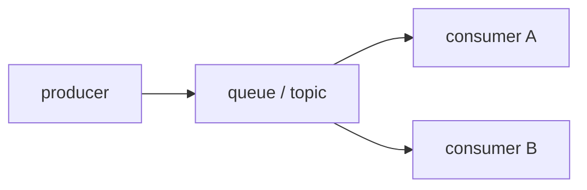

# 큐와 이벤트 기반 아키텍처

서비스가 늘어나면 가장 먼저 무거워지는 것은 코드가 아니라 연결 방식입니다. A 서비스가 B를 직접 부르고, B가 다시 C를 부르는 동기 호출 사슬은 평소에는 단순해 보여도 한 지점이 느려지거나 실패하는 순간 전체를 함께 흔듭니다.

이 글은 Serverless 101 시리즈의 7번째 글입니다.

## 이 글에서 다룰 문제

- 직접 호출 없이 서비스를 연결하려면 무엇이 필요할까요?
- 큐와 토픽은 어떤 점이 다를까요?
- 팬아웃은 언제 유리하고 언제 조심해야 할까요?
- FIFO, 재시도, DLQ는 왜 함께 설계해야 할까요?

> 큐와 이벤트 버스는 생산자와 소비자를 시간과 책임 양쪽에서 분리해 주는 연결 장치입니다.

## 왜 이 주제가 중요한가

동기 호출 체인은 한 노드의 문제를 전체 문제로 키우기 쉽습니다. 주문 API가 결제, 메일, 통계 시스템을 순서대로 직접 부른다면, 메일 서비스 하나만 느려져도 주문 응답 전체가 늦어질 수 있습니다. 비동기 메시징은 이 결합을 느슨하게 풀어 줍니다.

서버리스 환경에서는 이 장점이 더 크게 드러납니다. 함수는 짧고 빠르게 확장되지만, 모든 후속 작업을 한 번의 요청 안에서 끝내려고 하면 지연 시간과 실패 범위가 함께 커집니다. 큐와 이벤트 버스는 이 문제를 시간으로 분리하고 책임으로 분리합니다. 그래서 큐는 단순한 버퍼가 아니라 설계 경계입니다.

## 한눈에 보는 구조



이 그림이 보여 주는 핵심은 생산자와 소비자가 서로의 내부를 몰라도 된다는 점입니다. 생산자는 이벤트를 발행하고, 소비자는 자신의 책임에 맞게 그것을 처리합니다. 이 분리가 있어야 서비스 간 결합도가 낮아지고, 각 단계의 실패를 개별적으로 다룰 수 있습니다.

## 핵심 용어 먼저 정리하기

| 용어 | 뜻 | 실무에서 왜 중요한가 |
| --- | --- | --- |
| 큐 | 하나의 메시지를 하나의 소비자 그룹이 처리하는 구조 | 작업 분산과 버퍼링에 적합합니다 |
| 토픽 | 하나의 이벤트를 여러 소비자가 구독하는 구조 | 팬아웃과 도메인 분리에 적합합니다 |
| 팬아웃 | 하나의 이벤트를 여러 구독자에게 퍼뜨리는 방식 | 후속 작업을 독립적으로 분리할 수 있습니다 |
| FIFO | 순서를 보존하는 전달 모델 | 순서가 중요한 비즈니스에만 선택적으로 씁니다 |
| 데드 레터 큐 | 반복 실패 메시지를 격리하는 큐 | 실패를 추적하고 재처리하기 쉽게 만듭니다 |

여기서 가장 중요한 판단은 “정말 순서가 필요한가”입니다. 모든 메시징에 순서를 강하게 요구하면 확장성과 단순성을 스스로 잃기 쉽습니다.

## 무엇이 달라지는지 먼저 보기

**기존 방식**에서는 주문 API 하나가 결제, 메일, 통계까지 동기 체인으로 직접 호출합니다.

**개선된 방식**에서는 주문 이벤트를 토픽에 발행하고, 각 소비자가 자신에게 필요한 후속 작업만 독립적으로 처리합니다.

이 구조가 주는 가장 큰 이점은 한 단계의 실패가 전체 흐름을 즉시 멈추게 하지 않는다는 점입니다. 동시에 각 소비자는 자기 속도와 재시도 정책을 따로 가질 수 있습니다.

## 작은 메시징 모델로 감각 잡기

### 1단계 — 인메모리 큐

```python
from collections import deque
queue = deque()
def publish(msg): queue.append(msg)
def consume(): return queue.popleft() if queue else None
```

큐의 가장 기본적인 역할은 생산 속도와 소비 속도 사이의 차이를 흡수하는 것입니다. 생산자가 빠르더라도 소비자는 자기 속도로 처리할 수 있습니다.

### 2단계 — 팬아웃

```python
subs = []
def subscribe(fn): subs.append(fn)
def emit(event):
    for fn in subs:
        fn(event)
```

팬아웃은 하나의 이벤트에서 여러 후속 작업을 독립적으로 분기하도록 만듭니다. 결제, 메일, 분석을 서로 묶지 않고 따로 발전시키기 쉬워집니다.

### 3단계 — 소비자 함수

```python
def billing(event): print("bill", event)
def mail(event): print("mail", event)
```

소비자 함수는 자신이 맡은 책임만 알면 됩니다. 생산자의 내부 구현이나 다른 소비자의 처리 방식까지 알 필요가 없습니다.

### 4단계 — 재시도와 DLQ

```python
def retry(handler, dlq, attempts=3):
    def wrap(event):
        for i in range(attempts):
            try:
                return handler(event)
            except Exception:
                if i == attempts - 1:
                    dlq.append(event)
                    raise
    return wrap
```

메시징 시스템에서 실패는 사라지지 않습니다. 다만 재시도 경로와 최종 격리 경로를 분리해 둘 수 있을 뿐입니다. DLQ는 이 마지막 방어선입니다.

### 5단계 — FIFO 순서 키

```python
def fifo_key(order):
    return order["customer_id"]
```

순서가 필요하다면 “무엇의 순서인가”를 먼저 정해야 합니다. 고객 단위인지 주문 단위인지 정의하지 않으면 FIFO는 오히려 과도한 제약이 됩니다.

## 이 코드에서 먼저 봐야 할 점

- 팬아웃은 결합도를 낮춥니다.
- FIFO 키는 순서 보장 단위를 정의합니다.
- DLQ는 실패를 운영자가 볼 수 있게 만듭니다.

이벤트 기반 아키텍처의 강점은 모든 일을 비동기로 돌리는 데 있지 않습니다. 독립적으로 변하고 독립적으로 실패해야 하는 책임을 분리하는 데 있습니다.

## 실무에서 자주 헷갈리는 지점

### 큐와 토픽은 둘 다 메시지를 보내는 것 아닌가

비슷해 보여도 목적이 다릅니다. 큐는 일을 나눠 처리하게 만들고, 토픽은 하나의 사실을 여러 소비자에게 알리는 데 더 적합합니다.

### 순서는 늘 중요하지 않을까

많은 경우 그렇지 않습니다. 순서를 정말 요구하는 비즈니스 경계에만 제한적으로 적용하는 편이 더 좋습니다.

### 팬아웃만 하면 구조가 자동으로 좋아질까

아닙니다. 멱등성, 이벤트 스키마 관리, 실패 격리 없이 팬아웃만 늘리면 복잡도만 커질 수 있습니다.

## 자주 하는 실수 다섯 가지

1. 모든 곳에서 순서 보장이 필요하다고 가정합니다.
2. 경쟁 소비자 모델을 이해하지 못한 채 설계합니다.
3. 멱등성 없이 팬아웃을 도입합니다.
4. DLQ를 설정하지 않습니다.
5. 메시지 크기 한도를 무시합니다.

이 실수들은 대부분 메시징을 단순 전송 수단으로만 볼 때 생깁니다. 실제로는 시스템 경계를 바꾸는 아키텍처 도구이므로, 실패와 재처리까지 함께 설계해야 합니다.

## 실무에서는 이렇게 생각합니다

- 이벤트 스키마는 사실상 공개 API입니다.
- 팬아웃은 기술 경계뿐 아니라 팀 경계 분리에도 도움이 됩니다.
- FIFO는 강력하지만 비싼 제약입니다.
- DLQ는 알람과 함께 묶어야 운영 의미가 생깁니다.
- 호환성을 깨지 않으면서 이벤트를 진화시키는 전략이 필요합니다.

## 체크리스트

- [ ] 이벤트 스키마를 문서화했는가
- [ ] DLQ와 알람을 함께 준비했는가
- [ ] 멱등성을 점검했는가
- [ ] FIFO가 정말 필요한지 판단했는가

## 정리

큐와 이벤트 기반 아키텍처의 핵심은 직접 호출을 줄이는 데만 있지 않습니다. 생산자와 소비자의 시간 축을 분리하고, 책임을 분리하고, 실패를 격리하는 데 있습니다. 이 감각이 있어야 관측성과 비용도 서비스 단위가 아니라 흐름 단위로 읽을 수 있습니다.

다음 글에서는 서버리스 환경에서 관측성을 어떻게 설계해야 하는지 살펴보겠습니다.

<!-- toc:begin -->
- [서버리스란 무엇인가?](./01-what-is-serverless.md)
- [함수형 서비스(FaaS)란 무엇인가?](./02-function-as-a-service.md)
- [트리거와 이벤트](./03-trigger-and-event.md)
- [콜드 스타트](./04-cold-start.md)
- [스케일링](./05-scaling.md)
- [상태 관리](./06-state-management.md)
- **큐와 이벤트 기반 아키텍처 (현재 글)**
- 관측성 (예정)
- 비용 (예정)
- 서버리스 앱 설계 (예정)
<!-- toc:end -->

## 참고 자료

- [SQS](https://docs.aws.amazon.com/AWSSimpleQueueService/latest/SQSDeveloperGuide/welcome.html)
- [SNS](https://docs.aws.amazon.com/sns/latest/dg/welcome.html)
- [EventBridge](https://docs.aws.amazon.com/eventbridge/latest/userguide/eb-what-is.html)
- [이벤트 기반 아키텍처 - Martin Fowler](https://martinfowler.com/articles/201701-event-driven.html)

Tags: Serverless, Queue, EventDriven, PubSub, Cloud
