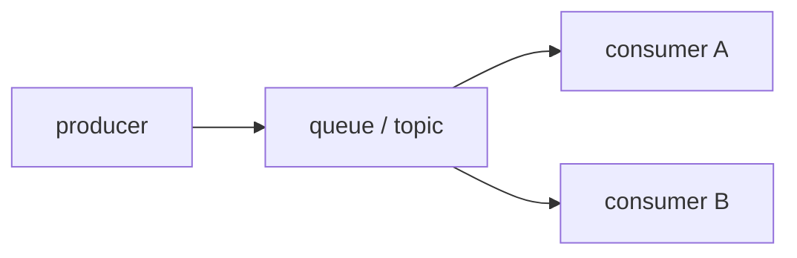

# Queue와 Event-driven Architecture

> Serverless 101 시리즈 (7/10)


## 이 글에서 다룰 문제

동기 호출 체인은 한 곳의 장애가 전체를 무너뜨릴 수 있습니다. 비동기 메시지는 복원력을 높여 줍니다.

## 전체 흐름


## Before/After

**Before**: 주문 API에서 결제, 메일, 통계까지 동기 체인으로 이어집니다.

**After**: 주문 이벤트를 토픽에 발행하고, 각 함수가 독립적으로 처리합니다.

## 간단 메시징

### 1단계 — 인메모리 큐

```python
from collections import deque
queue = deque()
def publish(msg): queue.append(msg)
def consume(): return queue.popleft() if queue else None
```

### 2단계 — fan-out

```python
subs = []
def subscribe(fn): subs.append(fn)
def emit(event):
    for fn in subs:
        fn(event)
```

### 3단계 — 소비자 함수

```python
def billing(event): print("bill", event)
def mail(event): print("mail", event)
```

### 4단계 — 재시도와 DLQ

```python
def retry(handler, dlq, attempts=3):
    def wrap(event):
        for i in range(attempts):
            try:
                return handler(event)
            except Exception:
                if i == attempts - 1:
                    dlq.append(event)
                    raise
    return wrap
```

### 5단계 — FIFO 순서 키

```python
def fifo_key(order):
    return order["customer_id"]
```

## 이 코드에서 주목할 점

- fan-out으로 결합도를 낮출 수 있습니다.
- FIFO 키가 순서 보장 단위를 결정합니다.
- DLQ가 문제를 밖으로 드러냅니다.

## 자주 하는 실수 5가지

1. 순서가 모든 곳에서 필요하다고 가정하기
2. 경쟁 소비자 동작을 이해하지 못한 채 설계하기
3. 멱등성 없이 fan-out을 도입하기
4. DLQ를 설정하지 않기
5. 메시지 크기 한도를 무시하기

## 실무에서는 이렇게 쓰입니다

주문, 결제, 통계 같은 팀별 도메인을 이벤트 버스로 느슨하게 연결합니다.

## 체크리스트

- [ ] 이벤트 스키마를 문서화했는가
- [ ] DLQ와 알람을 준비했는가
- [ ] 멱등성을 점검했는가
- [ ] FIFO가 정말 필요한지 판단했는가

## 정리 및 다음 단계

다음 글은 Observability입니다.

<!-- toc:begin -->
- [Serverless란 무엇인가?](./01-what-is-serverless.md)
- [Function as a Service](./02-function-as-a-service.md)
- [Trigger와 Event](./03-trigger-and-event.md)
- [Cold Start](./04-cold-start.md)
- [Scaling](./05-scaling.md)
- [State 관리](./06-state-management.md)
- **Queue와 Event-driven Architecture (현재 글)**
- Observability (예정)
- Cost (예정)
- Serverless 앱 설계 (예정)
<!-- toc:end -->

## 참고 자료

- [SQS](https://docs.aws.amazon.com/AWSSimpleQueueService/latest/SQSDeveloperGuide/welcome.html)
- [SNS](https://docs.aws.amazon.com/sns/latest/dg/welcome.html)
- [EventBridge](https://docs.aws.amazon.com/eventbridge/latest/userguide/eb-what-is.html)
- [Event-driven architecture](https://martinfowler.com/articles/201701-event-driven.html)

Tags: Serverless, Queue, EventDriven, PubSub, Cloud
