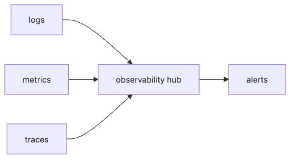

# 관측성

서버리스 시스템은 짧고 분산되어 있습니다. 한 요청이 하나의 함수에서 끝나지 않고 여러 함수, 큐, 데이터 저장소를 거칠 수 있습니다. 그래서 문제를 볼 때 로그만 보거나 메트릭만 봐서는 자주 길을 잃습니다.

이 글은 Serverless 101 시리즈의 8번째 글입니다.

## 이 글에서 다룰 문제

- 함수가 왜 느렸는지, 어디서 느렸는지 어떻게 알 수 있을까요?
- 로그, 지표, 분산 추적은 각각 어떤 역할을 맡을까요?
- 상관관계 ID는 왜 거의 필수일까요?
- 관측 데이터도 비용을 만든다는 사실을 어떻게 다뤄야 할까요?

> 서버리스 관측성은 로그, 지표, 분산 추적 세 신호가 함께 연결될 때 비로소 디버깅 가능한 상태가 됩니다.

## 왜 이 주제가 중요한가

전통적인 긴 프로세스에서는 한 서버 안에서 로그를 따라가면 어느 정도 감이 왔습니다. 서버리스에서는 그렇지 않습니다. 함수는 짧게 끝나고, 같은 요청이 여러 실행 환경을 거치며, 일부는 비동기로 이어집니다. 신호를 연결해 두지 않으면 “느리다”, “가끔 실패한다” 같은 현상만 남고 원인 경로는 사라집니다.

관측성은 장애 대응 도구이기도 하지만 설계 도구이기도 합니다. 어느 필드를 로그에 남길지, 어떤 메트릭을 집계할지, 어디서 스팬을 열고 닫을지 결정하는 순간 시스템의 운영 가능성이 크게 달라집니다. 서버리스에서는 특히 이 준비를 나중으로 미루기 어렵습니다.

## 한눈에 보는 구조



*로그, 지표, 추적 정보가 한 조사 흐름으로 만나야 분산된 함수를 끝까지 따라갈 수 있습니다.*
이 그림이 말하는 핵심은 세 신호를 따로 모으는 것이 목적이 아니라, 서로 연결된 상태로 보는 것이 목적이라는 점입니다. 그래야 특정 요청의 실패를 로그로 보고, 동일 시점의 지표 변화와 함께 읽고, 전체 경로를 추적으로 확인할 수 있습니다.

## 핵심 용어 먼저 정리하기

| 용어 | 뜻 | 실무에서 왜 중요한가 |
| --- | --- | --- |
| 구조화 로그 | 기계가 읽기 쉬운 형식의 로그 | 검색, 집계, 필터링이 쉬워집니다 |
| 지표 | 숫자로 표현한 운영 신호 | 추세와 임계값 감시에 적합합니다 |
| 추적 | 요청이 거친 경로를 보여 주는 신호 | 분산 호출 경로를 한 번에 볼 수 있습니다 |
| 상관관계 ID | 요청을 식별하는 공통 키 | 여러 함수 로그를 같은 요청으로 묶습니다 |
| 샘플링 | 관측 비용과 해상도를 조절하는 기법 | 추적 비용 폭증을 막아 줍니다 |

세 신호 중 하나만으로는 부족합니다. 로그는 세부 원인을 잘 보여 주지만 전체 추세를 보기 어렵고, 지표는 추세를 잘 보여 주지만 개별 요청 맥락이 부족합니다. 추적은 경로를 보여 주지만 이벤트 내용을 충분히 담지 않습니다.

## 무엇이 달라지는지 먼저 보기

**문제가 있는 상태**에서는 평문 로그만 남기고, 필요할 때마다 문자열 검색으로 원인을 추적합니다.

**개선된 상태**에서는 상관관계 ID와 분산 추적을 함께 써서 하나의 요청이 거친 전체 흐름을 빠르게 복원합니다.

이 차이는 장애 대응 시간에서 극적으로 드러납니다. 같은 정보가 있어도 연결 방식이 다르면 원인을 찾는 속도가 크게 달라집니다.

## 관측성의 기본을 코드로 보기

### 1단계 — 구조화 로그

```python
import json, time

def log(level, msg, **fields):
    print(json.dumps({"t": time.time(), "level": level, "msg": msg, **fields}))
```

평문 로그는 읽기엔 편할 수 있지만, 집계와 검색이 어려워집니다. 구조화 로그는 필드 단위로 필터링하고 대시보드에 연결하기 쉽습니다.

### 2단계 — 상관관계 ID 전파

```python
def with_corr(handler):
    def wrap(event, ctx):
        cid = event.get("correlation_id", "unknown")
        log("info", "start", cid=cid)
        return handler(event, ctx)
    return wrap
```

상관관계 ID는 로그 몇 줄을 예쁘게 남기기 위한 장식이 아닙니다. 여러 함수와 비동기 경계를 건너는 요청을 한 덩어리로 복원하기 위한 생명선입니다.

### 3단계 — 지표 카운트

```python
metrics = {}
def incr(name, n=1):
    metrics[name] = metrics.get(name, 0) + n
```

에러 수, 호출 수, 지연 시간 분포는 로그를 읽어 합산하는 대신 지표로 바로 집계하는 편이 훨씬 낫습니다. 알람도 이 숫자들 위에서 설계할 수 있습니다.

### 4단계 — 추적 스팬

```python
import contextlib, time

@contextlib.contextmanager
def span(name):
    t0 = time.perf_counter()
    yield
    log("info", "span", name=name, ms=(time.perf_counter() - t0) * 1000)
```

스팬은 어느 단계가 오래 걸렸는지 보여 줍니다. 함수 내부에서도 외부 API 호출, 데이터베이스 접근, 큐 발행처럼 주요 경계를 스팬으로 나누면 병목이 더 잘 보입니다.

### 5단계 — 콜드 여부 기록

```python
COLD = True

def handler(event, ctx):
    global COLD
    log("info", "invoke", cold=COLD)
    COLD = False
```

## 검증 흐름: 한 요청을 끝까지 복원할 수 있어야 합니다

관측성을 붙였다고 해서 바로 운영 가능한 상태가 되지는 않습니다. 실제로는 한 요청을 골라 끝까지 따라갈 수 있는지 확인해야 합니다.

```text
request_id=8d6...
correlation_id=ord-2026-05-12-001
cold=true
duration_ms=842
downstream=db
```

**Expected output:** 같은 상관관계 ID로 엣지 함수, 큐 소비자, 다운스트림 호출 로그를 한 번에 묶어 볼 수 있어야 합니다.

아래 네 질문에 빨리 답할 수 없다면 아직 계측이 약합니다.

- 가장 먼저 실패한 요청은 무엇인가
- 지연 원인이 콜드 스타트인가, 다운스트림 지연인가
- 어느 함수가 몇 번 재시도했는가
- 알람이 실제 행동 가능한 신호를 가리키는가

관측성의 품질은 로그 양이 아니라 이 질문들에 답하는 속도로 드러납니다.

콜드 여부를 같이 기록하면 p99 지연이 초기화 비용인지, 실제 비즈니스 처리 지연인지 더 쉽게 구분할 수 있습니다.

## 이 코드에서 먼저 봐야 할 점

- 구조화 로그는 집계 가능한 로그를 만듭니다.
- 상관관계 ID는 모든 함수가 이어서 전파해야 합니다.
- 콜드 여부 기록은 지연 시간 분석의 핵심 단서입니다.

관측성은 로그를 많이 남기는 일이 아닙니다. 나중에 문제를 재구성할 수 있도록 최소한의 신호를 일관되게 남기는 일입니다.

## 실무에서 자주 헷갈리는 지점

### 로그만 잘 남기면 충분할까

아닙니다. 로그는 개별 사건을 잘 보여 주지만, 전체 추세와 경보는 지표가 더 잘 보여 줍니다. 경로 복원은 추적이 더 잘합니다.

### 모든 요청을 100퍼센트 추적해야 할까

비용과 저장량을 생각하면 항상 그렇지 않습니다. 샘플링 전략이 필요합니다. 특히 고트래픽 시스템일수록 더 그렇습니다.

### 알람은 많을수록 좋을까

실제 행동으로 이어지지 않는 알람은 오히려 관측성을 망칩니다. 알람은 많기보다 정확해야 합니다.

## 자주 하는 실수 다섯 가지

1. 평문 로그만 사용합니다.
2. 민감 정보를 그대로 로그에 남깁니다.
3. 로그만 보고 지표를 무시합니다.
4. 샘플링 없이 추적 비용을 폭증시킵니다.
5. 실행 가능한 기준 없는 알람을 너무 많이 만듭니다.

이 실수들은 대부분 관측성을 기록 기능 정도로 볼 때 생깁니다. 실제로는 운영 비용과 연결된 설계 체계이므로, 신호의 품질과 비용을 함께 관리해야 합니다.

## 실무에서는 이렇게 생각합니다

- 관측성은 설계 단계에서부터 준비합니다.
- 상관관계는 분산 시스템의 생명선입니다.
- 관측 비용도 함께 관찰해야 합니다.
- 알람은 실제 행동으로 이어져야 의미가 있습니다.
- 샘플링은 해상도와 비용의 균형입니다.

## 체크리스트

- [ ] 구조화 로그를 남기는가
- [ ] 상관관계 ID를 전파하는가
- [ ] 지표와 추적을 함께 수집하는가
- [ ] 알람이 실제 대응 절차와 연결되는가

## 정리

서버리스 관측성의 핵심은 신호를 많이 모으는 것이 아니라 서로 연결된 신호를 남기는 데 있습니다. 로그는 사건을, 지표는 추세를, 추적은 경로를 보여 줍니다. 이 세 가지가 함께 있어야 짧고 분산된 함수들의 세계를 운영 가능한 시스템으로 바꿀 수 있습니다.

다음 글에서는 서버리스 비용을 어떻게 읽고 설계에 반영해야 하는지 살펴보겠습니다.

<!-- toc:begin -->
- [서버리스란 무엇인가?](./01-what-is-serverless.md)
- [함수형 서비스(FaaS)란 무엇인가?](./02-function-as-a-service.md)
- [트리거와 이벤트](./03-trigger-and-event.md)
- [콜드 스타트](./04-cold-start.md)
- [스케일링](./05-scaling.md)
- [상태 관리](./06-state-management.md)
- [큐와 이벤트 기반 아키텍처](./07-queue-and-event-driven.md)
- **관측성 (현재 글)**
- 비용 (예정)
- 서버리스 앱 설계 (예정)
<!-- toc:end -->

## 참고 자료

### 공식 문서

- [OpenTelemetry 문서](https://opentelemetry.io/docs/)
- [AWS X-Ray 개발자 가이드](https://docs.aws.amazon.com/xray/latest/devguide/aws-xray.html)
- [CloudWatch Logs Insights](https://docs.aws.amazon.com/AmazonCloudWatch/latest/logs/AnalyzingLogData.html)

### 패턴과 코드

- [서버리스 분산 추적](https://aws.amazon.com/blogs/compute/instrumenting-distributed-systems-for-operational-visibility/)
- [AWS Powertools for Lambda Python (GitHub)](https://github.com/aws-powertools/powertools-lambda-python)

Tags: Serverless, Observability, Logging, Tracing, Metrics
