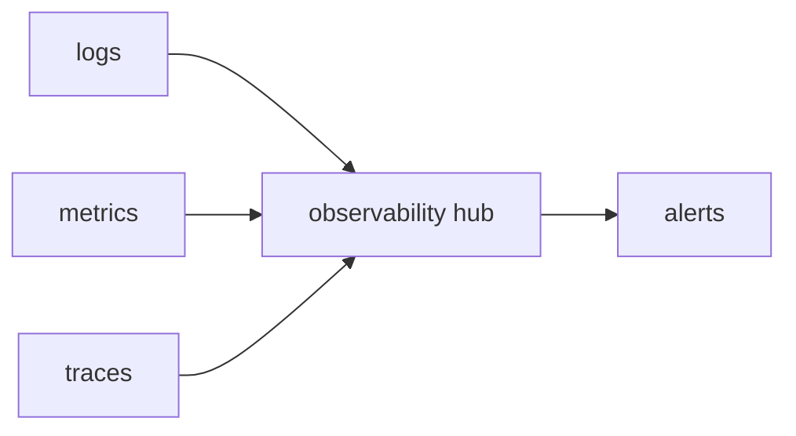

# Observability

> Serverless 101 시리즈 (8/10)


## 이 글에서 다룰 문제

함수는 짧고 분산되어 있어 한 곳만 봐서는 원인을 알기 어렵습니다. 서로 연결되는 신호가 필요합니다.

## 전체 흐름


## Before/After

**Before**: grep으로 plain log만 뒤집니다.

**After**: correlation id와 trace로 5분 안에 원인에 도달합니다.

## 관측성 기초

### 1단계 — 구조화 로그

```python
import json, time

def log(level, msg, **fields):
    print(json.dumps({"t": time.time(), "level": level, "msg": msg, **fields}))
```

### 2단계 — correlation id 전파

```python
def with_corr(handler):
    def wrap(event, ctx):
        cid = event.get("correlation_id", "unknown")
        log("info", "start", cid=cid)
        return handler(event, ctx)
    return wrap
```

### 3단계 — 메트릭 카운트

```python
metrics = {}
def incr(name, n=1):
    metrics[name] = metrics.get(name, 0) + n
```

### 4단계 — 트레이스 스팬 (의사 코드)

```python
import contextlib, time

@contextlib.contextmanager
def span(name):
    t0 = time.perf_counter()
    yield
    log("info", "span", name=name, ms=(time.perf_counter() - t0) * 1000)
```

### 5단계 — 콜드 식별

```python
COLD = True

def handler(event, ctx):
    global COLD
    log("info", "invoke", cold=COLD)
    COLD = False
```

## 이 코드에서 주목할 점

- 구조화 로그가 집계의 출발점입니다.
- correlation id는 모든 함수가 이어서 전파해야 합니다.
- 콜드 플래그는 p99 분석의 핵심입니다.

## 자주 하는 실수 5가지

1. plain text 로그만 남기기
2. 민감 정보를 그대로 로깅하기
3. 로그만 보고 지표를 무시하기
4. 샘플링 없이 trace 비용을 폭증시키기
5. 알람을 지나치게 많이 설정하기

## 실무에서는 이렇게 쓰입니다

OpenTelemetry 같은 표준으로 로그, 지표, 트레이스를 하나의 백엔드에 모아 한 화면에서 봅니다.

## 체크리스트

- [ ] 구조화 로그를 남기는가
- [ ] correlation id를 전파하는가
- [ ] 지표와 트레이스를 함께 수집하는가
- [ ] 알람이 실제 행동으로 이어지는가

## 정리 및 다음 단계

다음 글은 Cost입니다.

<!-- toc:begin -->
- [Serverless란 무엇인가?](./01-what-is-serverless.md)
- [Function as a Service](./02-function-as-a-service.md)
- [Trigger와 Event](./03-trigger-and-event.md)
- [Cold Start](./04-cold-start.md)
- [Scaling](./05-scaling.md)
- [State 관리](./06-state-management.md)
- [Queue와 Event-driven Architecture](./07-queue-and-event-driven.md)
- **Observability (현재 글)**
- Cost (예정)
- Serverless 앱 설계 (예정)
<!-- toc:end -->

## 참고 자료

- [OpenTelemetry](https://opentelemetry.io/docs/)
- [AWS X-Ray](https://docs.aws.amazon.com/xray/latest/devguide/aws-xray.html)
- [CloudWatch Logs Insights](https://docs.aws.amazon.com/AmazonCloudWatch/latest/logs/AnalyzingLogData.html)
- [Distributed Tracing in Serverless](https://aws.amazon.com/blogs/compute/instrumenting-distributed-systems-for-operational-visibility/)

Tags: Serverless, Observability, Logging, Tracing, Metrics
