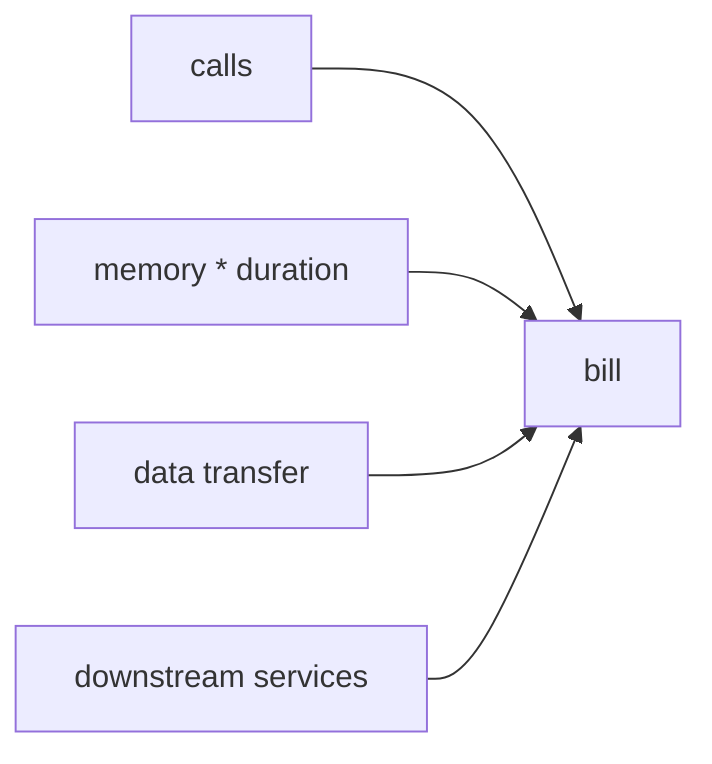

# Cost

> Serverless 101 시리즈 (9/10)


## 이 글에서 다룰 문제

Serverless라고 항상 싼 것은 아닙니다. 워크로드에 따라 EC2보다 비쌀 수도 있습니다.

## 전체 흐름


## Before/After

**Before**: 호출당 가격만 계산합니다.

**After**: 총소유비용 기준으로 대안을 비교합니다.

## 비용 모델링

### 1단계 — 호출 비용

```python
def calls_cost(n, unit_price=0.0000002):
    return n * unit_price
```

### 2단계 — GB-seconds

```python
def gb_seconds(memory_mb, duration_ms, n):
    return (memory_mb / 1024) * (duration_ms / 1000) * n
```

### 3단계 — 데이터 전송

```python
def egress_cost(gb, price_per_gb=0.09):
    return gb * price_per_gb
```

### 4단계 — 시나리오 비교

```python
def total(n, mem_mb, dur_ms, gb_out):
    return (
        calls_cost(n)
        + gb_seconds(mem_mb, dur_ms, n) * 0.0000166667
        + egress_cost(gb_out)
    )
```

### 5단계 — 메모리 튜닝 비교

```python
sizes = [128, 256, 512, 1024]
for s in sizes:
    print(s, total(1_000_000, s, 200, 5))
```

## 이 코드에서 주목할 점

- 메모리 크기가 CPU와 비용을 함께 결정합니다.
- 데이터 전송은 자주 놓치는 숨은 비용입니다.
- 비교는 시나리오 단위로 해야 합니다.

## 자주 하는 실수 5가지

1. 호출 단가만 보고 총비용을 추정하기
2. 메모리를 최소값으로만 고정하기
3. egress 비용을 무시하기
4. DB와 Queue 비용을 빼먹기
5. 프로비저닝을 비용 인식 없이 사용하기

## 실무에서는 이렇게 쓰입니다

FinOps 팀이 호출당 마진을 제품 결정에 다시 반영합니다.

## 체크리스트

- [ ] 총비용 모델을 만들었는가
- [ ] 메모리 튜닝을 검토했는가
- [ ] egress를 측정하는가
- [ ] FinOps 대시보드를 보고 있는가

## 정리 및 다음 단계

마지막 글은 Serverless 앱 설계입니다.

<!-- toc:begin -->
- [Serverless란 무엇인가?](./01-what-is-serverless.md)
- [Function as a Service](./02-function-as-a-service.md)
- [Trigger와 Event](./03-trigger-and-event.md)
- [Cold Start](./04-cold-start.md)
- [Scaling](./05-scaling.md)
- [State 관리](./06-state-management.md)
- [Queue와 Event-driven Architecture](./07-queue-and-event-driven.md)
- [Observability](./08-observability.md)
- **Cost (현재 글)**
- Serverless 앱 설계 (예정)
<!-- toc:end -->

## 참고 자료

- [Lambda 가격](https://aws.amazon.com/lambda/pricing/)
- [Cloud Functions 가격](https://cloud.google.com/functions/pricing)
- [Azure Functions 가격](https://azure.microsoft.com/pricing/details/functions/)
- [FinOps Foundation](https://www.finops.org/)

Tags: Serverless, Cost, FinOps, Pricing, Cloud
